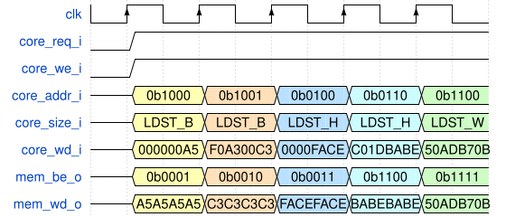
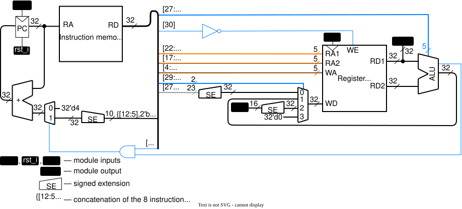

# Список исправлений


**25.07.2026**: В _листинг II.10-1_ (стр. 179-181) были внесены изменения:

1. Адреса программного стека и стека прерываний изменены с `3FFC` и `1FFC` на `1F0` и `F0` соответственно.
   Младшая часть адресов изменена с `C` на `0` поскольку верхушка стека должна быть выровнена по границе в 16 байт (таково требование соглашения о вызовах).
   Старшая часть адреса была уменьшена с `3F` до `01` и с `1F` до `00`, чтобы оба стека уместились в исходную память данных, чей размер изначально был задан в `memory_pkg` репозитория на значении в 512 байт.
2. Поскольку адреса `1F0` и `F0` умещаются в 12 бит, загрузка этих адресов теперь умещается в одну инструкцию, а не две. Благодаря этому, инструкции `li`, расположенные по адресам `0x00` и `0x18` разворачиваются в одну инструкцию `addi`. Из-за этого изменились адреса всех инструкций в листинге.
3. В листинге была допущена ошибка: верхушка указателя на стек была записана в регистр `x2`, однако в последствии в качестве верхушки стека использовался регистр `x5`. Теперь листинг использует корректный регистр `x2`.
4. В начале обработчика перехвата `trap_handler` между инструкциями с адресами `0x44` и `0x48` была пропущена инструкция поднятия верхушки стека на 16 байт вверх `addi x2, x2, -16`. Аналогично, была пропущена инструкция опускания верхушки стека на 16 байт вниз `addi x2, x2, 16` в конце обработчика `done` между инструкциями с адресами `0x90` и `0x94` соответственно.

<details>
  <summary> Исправленная версия листинга </summary>

```asm
_start:
# Инициализируем начальные значения регистров
00: li x2, 0x00001F0        # устанавливаем указатель на верхушку стека
04: li x3, 0x00000000       # устанавливаем указатель на глобальные данные

08: la x5, trap_handler     # псевдоинструкция la аналогично li загружает число,
                            # только в случае la — это число является адресом
                            # указанного места (адресом обработчика перехвата)

0C: csrw mtvec, x5          # устанавливаем вектор прерывания

10: li x5, 0x000000F0       # готовим адрес верхушки стека прерывания

14: csrw mscratch, x5       # загружаем указатель на верхушку стека прерывания

18: li x5, -1               # подготавливаем маску, разрешающую все источники
                            # прерывания

1C: csrw mie, x5            # загружаем маску в регистр маски

20: li x5, 1                # начальное значение глобальной переменной
24: sw x5, 0(x3)            # загружаем переменную в память

28: li x6, 0                # начальное значение, чтобы в симуляции не было xxx
2C: li x7, 0                # начальное значение, чтобы в симуляции не было xxx

# Вызов ecall исключительно из хулиганских соображений, поскольку в данной
# микроархитектурной реализации это приведет к появлению illegal_instr и
# последующей обработке исключения
30: ecall

# Вызов функции main
main:
34: beq x0, x0, main        # бесконечный цикл, аналогичный while (1);

# ОБРАБОТЧИК ПЕРЕХВАТА
# Без стороннего вмешательства процессор никогда не перейдёт к инструкциям ниже,
# однако в случае перехвата в программный счетчик будет загружен адрес первой
# нижележащей инструкции.

# Сохраняем используемые регистры на стек
trap_handler:
38: csrrw x2, mscratch, x2  # меняем местами mscratch и x2
3C: addi x2, x2, -16        # поднимаем верхушку стека на 16 байт вверх
                            # (указатель на стек всегда должен быть выровнен
                            # по границе в 16 байт)
40: sw x6, 0(x2)            # сохраняем x6 на стек mscratch
44: sw x7, 4(x2)            # сохраняем x7 на стек mscratch

# Проверяем произошло ли прерывание
48: csrr x6, mcause         # x6 = mcause
4C: li x7, 0x80000010       # загружаем в x7 код того, что произошло прерывание
50:                         # данная псевдоинструкция будет разбита на две
                            # инструкции: lui и addi
54: bne x6, x7, exc_handler # если коды не совпадают, переходим к проверке
                            # на исключение
# Обработчик прерывания
58: lw x7, 0(x3)            # загружаем переменную из памяти
5C: addi x7, x7, 3          # прибавляем к значению 3
60: sw x7, 0(x3)            # возвращаем переменную в память
64: j done                  # идем возвращать регистры и на выход

exc_handler:                # Проверяем произошло ли исключение
68: li x7, 0x0000002        # загружаем в x7 код того, что произошло исключение
6C: bne x6, x7, done        # если это не оно, то выходим

# Обработчик исключения
70: csrr x6, mepc           # Узнаём значение PC (адреса инструкции,
                            # вызвавшей исключение)
74: lw x7, 0x0(x6)          # Загружаем эту инструкцию в регистр x7.
                            # В текущей микроархитектурной реализации это
                            # невозможно, т.к. память инструкций отделена от
                            # памяти данных и не участвует в выполнении
                            # операций load / store.
                            # Другой способ узнать об инструкции, приведшей
                            # к исключению — добавить поддержку статусного
                            # регистра mtval, в который при исключении
                            # может быть записана текущая инструкция.
                            # Теоретически мы могли бы после этого
                            # сделать что-то, в зависимости от этой инструкции.
                            # Например, если это операция умножения — вызвать
                            # подпрограмму умножения.

78: addi x6, x6, 4          # Увеличиваем значение PC на 4, чтобы после
                            # возврата не попасть на инструкцию, вызвавшую
                            # исключение.
7C: csrw mepc, x6           # Записываем обновленное значение PC в регистр mepc
80: j done                  # идем восстанавливать регистры со стека и на выход

# Возвращаем регистры на места и выходим
done:
84: lw x6, 0(x2)            # возвращаем x6 со стека
88: lw x7, 4(x2)            # возвращаем x7 со стека
8C: addi x2, x2, 16         # опускаем верхушку стека обратно на 16 байт вниз
90: csrrw x2, mscratch, x2  # меняем обратно местами x2 и mscratch
94: mret                    # возвращаем управление программе (pc = mepc)
                            # что означает возврат в бесконечный цикл
```

</details>

<br>

**30.12.2025**: В Финальном обзоре ЛР№4 (стр. 111) указан неверный тип константы для инструкций переходов: 23-битная `const`, в то время как на самом деле используется 8-битная `offset`.

<details>
  <summary> Исправленная версия абзаца </summary>

```diff
1. 10 вычислительных инструкций 0 0 01 alu_op RA1 RA2 xxxx xxxx WA
2. Инструкция загрузки константы 0 0 00 const WA
3. Инструкция загрузки из внешних устройств 0 0 10 xxx xxxx xxxx xxxx xxxx xxxx WA
---4. Безусловный переход 1 x xx xxx xxxx xxxx xxxx const xxxxx
---5. 6 инструкций условного перехода 0 1 xx alu_op RA1 RA2 const xxxxx
+++4. Безусловный переход 1 x xx xxx xxxx xxxx xxxx offset xxxxx
+++5. 6 инструкций условного перехода 0 1 xx alu_op RA1 RA2 offset xxxxx
```
</details>

<br>

**28.10.2025**: В ЛР№3 (стр. 90) указано неверное количество блоков, необходимое для реализации 1&nbsp;KiB памяти.

<details>
  <summary> Исправленная версия абзаца </summary>

Таким образом, преимущество распределенной памяти относительно регистровой заключается в лучшей утилизации ресурсов: одним трёхвходовым LUT можно описать до 8 бит распределенной памяти, в то время как одним D-триггером можно описать только один бит регистровой памяти. Предположим, что в ПЛИС размещены логические блоки, структура которых изображена на _рис. 2_ и нам необходимо реализовать 1&nbsp;KiB памяти. Мы можем реализовать распределенную память, используя <ins>512</ins> логических блоков (в каждом блоке два трёхвходовых LUT), либо регистровую память, используя <ins>8192</ins> логических блока.

</details>

<br>

**27.10.2025**: Исправлено отображение инверсии выхода Q̅ в _рисунках I.2-13_ и _I.3-6_.

<details>
  <summary> Исправленная версия рисунка </summary>


</details>

<br>

**27.10.2025**: Исправлена опечатка в описании функционального поведения ведомой защёлки в составе D-триггера на стр. 41:

```diff
- пока сигнал `clk = 0`
+ пока сигнал `clk = 1`
```

<details>
  <summary> Исправленная версия предложения </summary>

Несмотря на то, что ведомая защёлка "прозрачна" всё то время, пока сигнал `clk = 1`, данные в ней остаются стабильными, поскольку выход ведущей защёлки больше не может измениться.

</details>

<br>

**22.05.2025**: Исправлено несоответствие в названиях модулей в ЛР10-12.

- `irq_controller` следует читать как `interrupt_controller`;
- `processor_unit` следует читать как `processor_system`.

В рисунке II.12-3 добавлена разрядность сигнала `irq_ret_o` (должна быть 16 бит).

<details>
<summary> Обновлённый рисунок </summary>



_Рисунок II.12-3. Структурная схема блока приоритетных прерываний._

</details>

<br>

**13.05.2025**: Исправлен рисунок II.8-3 — исправлена опечатка в названии нижнего сигнала (`mem_wd_i` → `mem_wd_o`).

<details>
<summary> Обновлённый рисунок </summary>



Рисунок II.8-3. Временна́я диаграмма запросов на запись со стороны ядра и сигнала mem_wd_o.

</details>


## Ошибки, исправленные во втором издании

**25.08.2025**: Обнаружена ошибка в примере формирования управляющих сигналов декодером инструкций на стр. 133. При инструкции `sw`, декодер должен выставить на сигнале `b_sel_o` значение `3'd3`, а не `3'd1`.

<details>
  <summary> Исправленная версия абзаца </summary>

  > Пример: для выполнения инструкции записи 32-бит данных из регистрового файла во внешнюю память (инструкции `sw`), дешифратор должен направить в АЛУ два операнда (базовый адрес и смещение) вместе с кодом операции АЛУ (сложения) для вычисления адреса записи. Базовый адрес берется из регистрового файла, а смещение является непосредственным операндом инструкции S-типа. Таким образом для вычисления адреса записи декодер должен выставить следующие значения на выходах:
  >
  > - `a_sel_o = 2'd0`,
  > - `b_sel_o = 3'd3`,
  > - `alu_op_o= ALU_ADD`.

</details>

<br>

**11.07.2025**: Обнаружена ошибка вёрстки в примере использования битовых сдвигов на стр. 79. Операции по установке, очистке и чтению N-го бита выглядят следующим образом:

```C++
X =  X |  (1 << N);       // Установка N-го бита
X =  X & ~(1 << N);       // Очистка N-го бита
Y = (X &  (1 << N)) != 0; // Чтение N-го бита
```

<br>

**11.07.2025**: Исправлена опечатка в предпоследнем абзаце стр. 227 (в конце первого предложения должен был быть написан **LMA**):

```diff
- задав какой-нибудь заведомо большой VMA для секции данных
+ задав какой-нибудь заведомо большой LMA для секции данных
```

<details>
<summary> Исправленная версия абзаца </summary>

> Таким образом, мы можем сделать общие VMA (процессор, обращаясь к секциям инструкций и данных будет использовать пересекающееся адресное пространство), а конфликт размещения секций компоновщиком разрешить, задав какой-нибудь заведомо большой LMA для секции данных. В последствии, мы просто проигнорируем этот адрес, проинициализировав память данных начиная с нуля.

</details>

<br>

**16.06.2025**: Исправлена ошибка в _листинге II.14-2_.

Предпоследнюю инструкцию (`lw a0, 40(a0)`) следует читать как `lw a0, 24(a0)`.

<br>

**29.03.2025**: Исправлен рисунок II.4-4 — убрана логика безусловного перехода, т.к. она должна была появиться только в следующем параграфе.

<details>
<summary> Обновлённый рисунок </summary>



Рисунок II.4-4. Реализация условного перехода.

</details>
