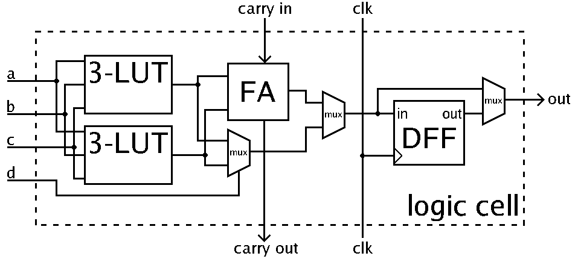

# Что такое ПЛИС и как она работает

- [Что такое ПЛИС и как она работает](#что-такое-плис-и-как-она-работает)
  - [История появления ПЛИС](#история-появления-плис)
  - [Цифровые схемы и логические вентили](#цифровые-схемы-и-логические-вентили)
    - [Цифровые схемы](#цифровые-схемы)
    - [Логические вентили](#логические-вентили)
    - [Мультиплексоры](#мультиплексоры)
    - [Программируемая память](#программируемая-память)
  - [Таблицы подстановки (Look-Up Tables, LUTs)](#таблицы-подстановки-look-up-tables-luts)
  - [D-триггеры](#d-триггеры)
  - [Арифметика](#арифметика)
  - [Логическая ячейка](#логическая-ячейка)
  - [Сеть межсоединений](#сеть-межсоединений)
  - [Выводы](#выводы)
  - [Источники](#источники)

> Разделы "Цифровые схемы и логические вентили" и "Таблицы подстановки" во многом используют материалы статьи "[How Does an FPGA Work?[1]](https://learn.sparkfun.com/tutorials/how-does-an-fpga-work/all)" за авторством `Alchitry, Ell C`, распространяемой по лицензии [CC BY-SA 4.0](https://creativecommons.org/licenses/by-sa/4.0/).

## История появления ПЛИС

До появления интегральных схем электронные схемы собирались из отдельных элементов, как модель, собранная из кубиков Lego. В случае, если при сборке электронной схемы была допущена ошибка, вы могли исправить её ручной корректировкой соединения элементов подобно исправлению ошибки, допущенной при сборке модели Lego.

В дальнейшем произошла миниатюризация базовых элементов — транзисторов, из которых состоят электронные схемы, и появилась возможность реализовать соединения между ними непосредственно на кристалле, что привело к появлению интегральных схем — электронных схем, выполненных на полупроводниковой подложке и заключенных в неразборный корпус.

В большинстве случаев, исправить ошибку, допущенную при разработке и изготовлении интегральной схемы, невозможно. С учетом того, что изготовление прототипа интегральной схемы является долгим и затратным мероприятием (от десятков тысяч до миллионов долларов в зависимости от технологии (или технологического процесса) , по которой изготавливается схема и занимаемой площади), возникла необходимость в гибком, быстром и дешевом в способе проверки схемы до изготовления её прототипа. Так появились **программируемые логические интегральные схемы** (**ПЛИС**). В связи с повсеместным использованием англоязычной литературы, имеет смысл дать и англоязычное название этого класса устройств: **programmable logic devices** (**PLD**).

ПЛИС содержит некоторое конечное множество базовых блоков (примитивов), блоки межсоединений примитивов и блоки ввода-вывода. Подав определенный набор воздействий на ПЛИС (**запрограммировав** её), можно настроить примитивы, их межсоединения между собой и блоками ввода-вывода, чтобы получить определенную цифровую схему. Удобство ПЛИС заключается в том, что в случае обнаружения ошибки на прототипе, исполненном в ПЛИС, вы можете исправить свою цифровую схему, и повторно запрограммировать ПЛИС.

Кроме того, эффективно использовать ПЛИС не как средство дешевого прототипирования, но и как средство реализации конечного продукта в случае малого тиража (дешевле купить и запрограммировать готовую партию ПЛИС, чем изготовить партию собственных микросхем).

Стоит оговориться, что в данной книге под термином ПЛИС будет подразумеваться конкретный тип программируемых схем: **FPGA** (**field-programmable gate array**, **программируемая пользователем вентильная матрица**, **ППВМ**).

Давайте разберемся что же это за устройство и как оно работает изнутри, но перед этим необходимо провести ликбез по цифровым схемам и логическим вентилям.

## Цифровые схемы и логические вентили

### Цифровые схемы

В электронике, словом "цифровая" описывают схемы, которые абстрагируются от непрерывных (аналоговых) значений напряжений, вместо этого используется только два дискретных значения: `0` и `1`. На данном уровне абстракции нас не интересуют конкретные значения напряжений и пороги этих значений, что позволяет нам разрабатывать схему в идеальном мире, где у напряжения может быть всего два значения: `0` и `1`. А обеспечением этих условий будут заниматься базовые блоки, из которых мы будем строить цифровые схемы.

Эти базовые блоки называются **логическими вентилями**.

### Логические вентили

Существует множество логических вентилей, но чаще всего используется четыре из них: **И**, **ИЛИ**, **Исключающее ИЛИ**, **НЕ**. Каждый из этих элементов принимает на вход **цифровое значение** (см. [**цифровая схема**](#цифровые-схемы)), выполняет определенную **логическую функцию** над входами и подает на выход результат этой функции в виде **цифрового значения**.

Логические вентили на _рис. 1-4_ иллюстрируются условными графическими обозначениями (**УГО**), взятыми из двух стандартов: **ANSI** и **ГОСТ**. Ввиду повсеместного использования в литературе первого варианта, в дальнейшем в книге будет использован он.

Логический вентиль **И** принимает два входа и выдает на выход значение `1` только в том случае, если оба входа равны `1`. Если хотя бы один из входов `0`, то на выходе будет `0`. На схемах логический вентиль **И** отображается следующим образом:

_Рисунок 1. УГО логического вентиля **И**._

Логический вентиль **ИЛИ** принимает два входа и выдает на выход значение `1` в случае, если хотя бы один из входов равен `1`. Если оба входа равны `0`, то на выходе будет `0`. На схемах логический вентиль **ИЛИ** отображается следующим образом:

_Рисунок 2. УГО логического вентиля **ИЛИ**._

Логический вентиль **Исключающее ИЛИ** принимает два входа и выдает на выход значение `1` в случае, если значения входов не равны между собой (один из них равен `1`, а другой `0`). Если значения входов равны между собой (оба равны `0` или оба равны `1`), то на выходе будет `0`. На схемах логический вентиль **Исключающее ИЛИ** отображается следующим образом:

_Рисунок 3. УГО логического вентиля **Исключающее ИЛИ**._

Логический вентиль **НЕ** — самый простой. Он принимает один вход и подает на выход его инверсию. Если на вход пришло значение `0`, то на выходе будет `1`, если на вход пришло значение `1`, то на выходе будет `0`. Он обозначается на схемах следующим образом:

_Рисунок 4. УГО логического вентиля **НЕ**._

Так же существуют вариации базовых вентилей, такие как **И-НЕ**, **ИЛИ-НЕ**, **Исключающее ИЛИ-НЕ**, отличающиеся от исходных тем, что результат операции инвертирован относительно результата аналогичной операции без **-НЕ**.

Логические вентили строятся из **транзисторов**. **Транзистор** — это элемент, который может пропускать/блокировать ток в зависимости от поданного напряжения на его управляющий вход.

Особенностью современных интегральных схем является то, что они строятся на основе комплементарной (взаимодополняющей) пары транзисторов **P** и **N**-типа (**Комплементарная Металл-Оксид-Полупроводниковая**, **КМОП** логика). Для данного типа транзисторов оказалось эффективнее реализовать операции **И-НЕ** и **ИЛИ-НЕ**.

С точки зрения построения цифровых схем МОП-транзистор (**P** и **N**-типа) можно воспринимать как выключатель, который замыкает или размыкает связь между двумя выводами. Разница между **P** и **N** типом заключается в состоянии, в котором транзистор "открыт" (вход и выход замкнуты) или "закрыт" (связь разорвана). _Рис. 5_ иллюстрирует данное различие.

Вход и выход, между которыми образуется связь называются "**сток**" (**drain**, **d**) и "**исток**" (**source**, **s**), а управляющий вход — "**затвор**" (**gate**, **g**). Обратите внимание, что логический вентиль (**logic gate**) и затвор транзистора (просто **gate**) — это разные сущности!

_Рисунок 5. МОП-транзисторы P и N типа._

На _рис. 6_ показан способ построения логических вентилей **И-НЕ**, **ИЛИ-НЕ** по **КМОП** технологии. Рассмотрим принцип работы вентиля **И-НЕ**.

Подача значения `1` на вход **А** или **B** "открывает" соответствующий n-канальный транзистор (обозначен на _рис. 6_ синим цветом), и закрывает соответствующий (комплементарный) p-канальный транзистор (обозначен красным цветом). Подача на оба входа `1` закрывает оба p-канальных транзистора (верхняя часть схемы разомкнута, что для значения на выходе означает что ее будто бы и нет) и открывает оба n-канальных транзистора. В результате чего выход замыкается на "землю" (черный треугольник внизу схемы) что эквивалентно `0` в контексте цифровых значений.

В случае, если хотя бы на одном из входов **А** или **B** будет значение `0`, откроется один из параллельно соединенных p-канальных транзисторов (в то время как соединение с "землей" будет разорвано) и выход будет подключен к питанию (две перпендикулярные линии вверху схемы), что эквивалентно `1` в контексте цифровых значений.

Как вы видите, напряжение на выход подается от **источников постоянного питания** или **земли**, а не от входов вентиля, именно этим и обеспечивается постоянное обновление напряжения и устойчивость **цифровых схем** к помехам.

_Рисунок 6. Схема логических вентилей **И-НЕ**, **ИЛИ-НЕ**, построенных на КМОП транзисторах._

Как правило, при необходимости инвертировать вход или выход логического элемента на схеме, на нем рисуют кружок вместо добавления логического вентиля **НЕ** в том виде, котором он изображён на _рис. 4_. К примеру, логический элемент **И-НЕ** обозначают в виде, представленном на _рис. 6_.

При желании, из логического элемента **И-НЕ** можно легко получить логический элемент **И** (как и элемент **ИЛИ** из **ИЛИ-НЕ**). Для этого необходимо поставить на выходе **И-НЕ** инвертор, собираемый из двух МОП-транзисторов по схеме, представленной на _рис. 7_.

_Рисунок 7. Схема логического вентиля **НЕ**, построенного на КМОП транзисторах._

КМОП логика далеко не единственный способ построения цифровых элементов, ранее достаточно широко применялись другие варианты построения схем, например только на одном типе транзисторов. Однако наиболее эффективным оказалось использование именно комплементарных пар, и на сегодня такой подход для цифровых схем является доминирующим.

Используя одни лишь описанные выше логические вентили можно построить **любую(!)** цифровую схему.

Однако, при описании цифровых схем, некоторые цифровые блоки используются настолько часто, что для них ввели отдельные обозначения (**сумматоры**, **умножители**, **мультиплексоры** т.п.), используемые при описании более сложных схем. Мы рассмотрим один из фундаментальных строительных блоков в ПЛИС — **мультиплексор**.

### Мультиплексоры

Мультиплексор — это устройство, которое в зависимости от значения **управляющего сигнала** подает на выход значение одного из входных сигналов.

Схематически, мультиплексор обозначается следующим образом:

_Рисунок 8. Обозначение Мультиплексора._

Символ `/` на линии `sel` используется, чтобы показать, что этот сигнал шириной 6 бит.

Число входов мультиплексора может быть различным, но выход у него всегда один.

**Способ, которым кодируется значение управляющего сигнала может также различаться**. Простейшая цифровая схема мультиплексора получится, если использовать [**унитарное**](https://ru.wikipedia.org/wiki/Унитарный_код) (**one-hot**) кодирование. При таком кодировании, значение **многоразрядного** сигнала **всегда** содержит **ровно одну** `1`. Информация, которую несет закодированный таким образом сигнал содержится в положении этой `1` внутри многоразрядного сигнала.

Посмотрим, как можно реализовать мультиплексор с управляющим сигналом, использующим one-hot-кодирование, используя только логические вентили **И**, **ИЛИ**:

_Рисунок 9. Реализация мультиплексора, использующего one-hot кодирование._

Если мы выставим значение управляющего сигнала, равное `000010`, означающее что только **первый** бит этого сигнала (**счет ведется с нуля**) будет равен **единице** (`sel[1] = 1`), то увидим, что на один из входов каждого логического вентиля **И** будет подано значение `0`. Исключением будет логический вентиль **И** для входа `b`, на вход которого будет подано значение `1`. Это означает, что все логические вентили **И** (кроме первого, на который подается вход `b`) будут выдавать на выход `0` (см. [Логические вентили](#логические-вентили)) вне зависимости от того, что было подано на входы a,c,d,e и f. Единственным входом, который будет на что-то влиять окажется вход `b`. Когда он равен `1`, на выходе соответствующего логического вентиля **И** окажется значение `1`. Когда он равен `0` на выходе **И** окажется значение `0`. Иными словами, выход **И** будет повторять значение `b`.

_Рисунок 10. Реализация мультиплексора, использующего one-hot кодирование._

Логический вентиль **ИЛИ** на данной схеме имеет больше двух входов. Подобный вентиль может быть создан в виде каскада логических вентилей **ИЛИ**:

_Рисунок 11. Реализация многоходового логического **ИЛИ**._

**Многовходовой вентиль ИЛИ** ведет себя ровно так же, как двухвходовой: он выдает на выход значение `1` когда хотя бы один из входов равен `1`. В случае, если все входы равны `0`, на выход **ИЛИ** пойдет `0`.

Но для нашей схемы мультиплексора гарантируется, что каждый вход **ИЛИ** кроме одного будет равняться `0` (поскольку выход каждого **И** кроме одного будет равен `0`). Это означает, что выход **многовходового ИЛИ** будет зависеть только от **одного** входа (в случае, когда `sel = 000010` — от входа `b`).

_Рисунок 12. Реализация мультиплексора, использующего one-hot кодирование._

Меняя значение `sel`, мы можем управлять тем, какой из входов мультиплексора будет идти на его выход.

### Программируемая память

Из транзисторов можно построить не только логические элементы, но и элементы памяти. На рис. 13 представлена схема простейшей ячейки статической памяти, состоящей из транзистора и двух инверторов (т.е. суммарно состоящей из 5 транзисторов, поэтому она называется **5T** SRAM). Данная ячейка реализует 1 бит конфигурируемой памяти, являвшейся одним из основных компонентов самой первой ПЛИС.

_Рисунок 13. Конфигурируемая ячейка памяти ПЛИС Xilinx XC2064[[2, стр. 2-63](https://archive.org/details/programmablegate00xili/page/n93/mode/2up)]._

Данная память представляет собой **бистабильную ячейку** — петлю из двух инверторов, в которых "заперто" хранимое значение. Дважды инвертированный сигнал совпадает по значению с исходным, при этом проходя через каждый из инверторов, сигнал обновляет свое значение напряжения, что не позволяет ему угаснуть из-за сопротивления цепи.

Для того чтобы поместить в бистабильную ячейку новое значение, к ее входу подключается еще один транзистор, замыкающий или размыкающий ее с напряжением питания/земли.

## Таблицы подстановки (Look-Up Tables, LUTs)

Представьте мультиплексор с четырьмя входными сигналами, и двухбитным управляющим сигналом (обратите внимание, что в теперь это сигнал не использует one-hot-кодирование). Но теперь, вместо того чтобы выставлять входные сигналы во внешний мир, давайте подключим их к программируемой памяти. Это означает, что мы можем "запрограммировать" каждый из входов на какое-то константное значение. Поместим то, что у нас получилось в отдельный блок и вот, мы получили двухвходовую **Таблицу подстановки** (**Look-Up Tables**, далее **LUT**).

_Рисунок 14. Реализация таблицы подстановки (Look-Up Table, LUT)._

Эти два входа **LUT** являются битами управляющего сигнала мультиплексора, спрятанного внутри **LUT**. Программируя входы мультиплексора (точнее, программируя память, к которой подключены входы мультиплексора), мы можем реализовать на базе **LUT** **любую(!)** логическую функцию, принимающую два входа и возвращающую один выход.

Допустим мы хотим получить **логическое И**. Для этого, нам потребуется записать в память следующее содержимое:

|Адрес (In[1:0])| Значение |
|---------------|----------|
|       00      |     0    |
|       01      |     0    |
|       10      |     0    |
|       11      |     1    |

Это простейший пример — обычно **LUT**-ы имеют больше входов, что позволяет им реализовывать более сложную логику.

## D-триггеры

Как вы уже поняли, используя неограниченное количество LUT-ов, вы можете построить цифровую схему, реализующую логическую функцию любой сложности. Однако цифровые схемы не ограничиваются реализацией одних только логических функций (цифровые схемы, реализующие логическую функцию, называются **комбинационными**, поскольку выход зависит только от комбинации входов). Например, так не построить цифровую схему, реализующую процессор. Для таких схем, нужны элементы памяти. Заметим, что речь идет не о программируемой памяти, задавая значения которой мы управляем тем, куда будут направлены сигналы, и какие логические функции будут реализовывать LUT-ы. Речь идет о ячейках памяти, которые будут использоваться логикой самой схемы.

Такой базовой ячейкой памяти является **D-триггер** (**D flip-flop**), из которых можно собрать другие ячейки памяти, например **регистры** (а из регистров можно собрать **память с произвольным доступом** (**random access memory**, **RAM**)), **сдвиговые регистры** и т.п.

**D-триггер** — это цифровой элемент, способный хранить один бит информации. В базовом варианте у этого элемента есть два входа и один выход. Один из входов подает значение, которое будет записано в **D-триггер**, второй вход управляет записью (обычно он называется `clk` или `clock` и подключается к тактирующему синхроимпульсу схемы). Когда управляющий сигнал меняет свое значение с `0` на `1` (либо с `1` на `0`, зависит от схемы), в **D-триггер** записывается значение сигнала данных. Обычно, описывая **D-триггер**, говорится, что он строится из двух **триггеров-защелок** (**D latch**), которые в свою очередь строятся из **RS-триггеров**, однако в конечном итоге, все эти элементы могут быть построены на базе логических вентилей **И**/**ИЛИ**, **НЕ**:

_Рисунок 15. Реализация D-триггера._

## Арифметика

Помимо описанных выше блоков (мультиплексоров и построенных на их основе LUT-ов и регистров) выделяется еще один тип блоков, настолько часто используемый в цифровых схемах, что его заранее размещают в ПЛИС в больших количествах: это арифметические блоки. Эти блоки используются при сложении, вычитании, сравнении чисел, реализации счётчиков. В разных ПЛИС могут быть предустановлены разные блоки: где-то это может быть однобитный сумматор, а где-то блок вычисления ускоренного переноса (`carry-chain`).

Все эти блоки могут быть реализованы через логические вентили, например так можно реализовать сумматор:

_Рисунок 16. Реализация полного однобитного сумматора._

## Логическая ячейка

И вот, мы подходим к внутреннему устройству ПЛИС. Мы уже узнали, что в ПЛИС есть матрица программируемых мультиплексоров, направляющих сигналы туда, куда нам нужно.

Вторым важным элементом является **логический блок** (обычно состоящих из **логических ячеек** или **логических элементов**, но для простоты мы отождествим все эти термины).

Логический блок содержит одну или несколько **LUT**, **арифметический блок**, и один или несколько **D-триггеров**, которые соединены между собой некоторым количеством мультиплексоров.
На _рис. 17_ представлена схема того, как может выглядеть **логический блок**:

_Рисунок 17. Схема логической ячейки[[2]](https://en.wikipedia.org/wiki/Field-programmable_gate_array)._

Всё достаточно просто. Логический блок представляет собой цепочку операций: `логическая функция, реализованная через LUT -> арифметическая операция -> Запись в D-триггер`. Каждый из мультиплексоров определяет то, будет ли пропущен какой-либо из этих этапов.
Таким образом, конфигурируя каждый логический блок, можно получить следующие вариации кусочка цифровой схемы:

1. Комбинационная схема (логическая функция, реализованная в LUT)
2. Арифметическая операция
3. Запись данных в D-триггер
4. Комбинационная схема, с записью результата в D-триггер
5. Арифметическая операция с записью результата в D-триггер
6. Комбинационная схема с последующей арифметической операцией
7. Комбинационная схема с последующей арифметической операцией и записью в D-триггер

А вот реальный пример использования логического блока в ПЛИС `xc7a100tcsg324-1` при реализации Арифметико-логического устройства (АЛУ), подключенного к периферии отладочной платы `Nexys-7`:

_Рисунок 18. Пример использования логической ячейки._

Здесь вы можете увидеть использование LUT-ов, арифметического блока (ускоренного расчета переноса), и одного из D-триггеров. D-триггеры, обозначенные серым цветом, не используются.

Располагая большим наборов таких логических блоков, и имея возможность межсоединять их нужным вам образом, вы получаете широчайшие возможности по реализации практически любой цифровой схемы (ограничением является только ёмкость ПЛИС, т.е. количество подобных логических блоков, входов выходов и т.п.).

Помимо логических блоков, в ПЛИС есть и другие примитивы: **Блочная память**, **блоки умножителей** и т.п.

## Сеть межсоединений

Для того, чтобы разобраться как управлять межсоединением логических блоков, рассмотрим рис. 19, входящий в [патент](https://patents.google.com/patent/US4870302A) на ПЛИС[[4](http://www.righto.com/2020/09/reverse-engineering-first-fpga-chip.html)].

_Рисунок 19. Содержимое ПЛИС в виде межсоединения логических блоков и блоков ввода-вывода._

Синим показано 9 логических блоков, желтым — 12 блоков ввода-вывода. Все эти блоки окружены **сетью межсоединений** (interconnect net), представляющей собой матрицу из горизонтальных и вертикальных соединительных линий — межсоединений общего назначения (general purpose interconnect)[[2, 2-66](https://archive.org/details/programmablegate00xili/page/n97/mode/2up)].

Косыми чертами в местах пересечения линий обозначены **программируемые точки межсоединений** (**programmable interconnect points**, **PIP**s), представляющие собой транзисторы, затвор которых подключен к программируемой памяти.

Управляя значением в подключенной к затвору транзистора памяти, можно управлять тем, что из себя будет представлять транзистор в данной точке: разрыв, или цепь. А значит, можно удалять "лишние" участки сети, оставляя только используемые логические блоки, соединенные между собой.

## Выводы

Обобщим сказанное:

1. Используя такие элементы, как **транзисторы**, можно собирать **логические вентили**: элементы **И**, **ИЛИ**, **НЕ** и т.п.
2. Используя **логические вентили**, можно создавать схемы, реализующие как **логические функции** (**комбинационные схемы**), так и сложную логику с памятью (**последовательностные схемы**).
3. Из логических вентилей среди прочего строится и такая важная комбинационная схема, как **мультиплексор**: цифровой блок, в зависимости от управляющего сигнала подающий на выход один из входных сигналов.
4. Кроме того, подключив вход бистабильной ячейки (представляющую собой петлю из двух инверторов) к транзистору, можно получить 1 бит **конфигурируемой памяти**.
5. Подключив входные сигналы мультиплексора к программируемой памяти, можно получить **Таблицу подстановок** (**Look-Up Table**, **LUT**), которая может реализовывать простейшие логические функции. LUT-ы позволяют заменить логические вентили И/ИЛИ/НЕ, и удобны тем, что их можно динамически изменять, логические вентили в свою очередь исполняются на заводе и уже не могут быть изменены после создания.
6. Из логических вентилей так же можно собрать базовую ячейку памяти: **D-триггер**, и такую часто используемую комбинационную схему как **полный однобитный сумматор** (или любой другой часто используемый арифметический блок).
7. Объединив LUT, арифметический блок и D-триггер получается структура в ПЛИС, которая называется **логический блок**.
8. Логический блок (а также другие **примитивы**, такие как **блочная память** или **умножители**) — это множество блоков, которые заранее физически размещаются в кристалле ПЛИС, их количество строго определено конкретной ПЛИС и не может быть изменено.
9. Подключая такой бит конфигурируемой памяти к транзисторам, расположенных в узлах **сети межсоединений**, можно управлять тем, где в этой сети будут разрывы, а значит можно оставить только маршрут, по которому сигнал пойдет туда, куда нам нужно (**трассировать сигнал**).
10. **Конфигурируя примитивы** и **трассируя сигнал** между ними (см. п.4), можно получить **практически любую цифровую схему** (с учетом ограничения ёмкости ПЛИС).

## Источники

1. Alchitry, Ell C / [How Does an FPGA Work?](https://learn.sparkfun.com/tutorials/how-does-an-fpga-work/all)
2. Xilinx / [The Programmable Gate Array Data Book](https://archive.org/details/programmablegate00xili)
3. Wikipedia / [Field-programmable gate array](https://en.wikipedia.org/wiki/Field-programmable_gate_array)
4. Ken Shirriff / [Reverse-engineering the first FPGA chip, the XC2064](http://www.righto.com/2020/09/reverse-engineering-first-fpga-chip.html)
