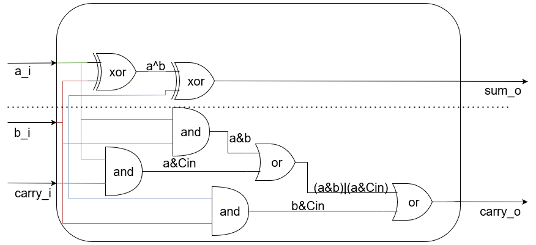

# Что такое ПЛИС и как она работает

- [Что такое ПЛИС и как она работает](#что-такое-плис-и-как-она-работает)
  - [История появления ПЛИС](#история-появления-плис)
  - [Цифровые схемы и логические вентили](#цифровые-схемы-и-логические-вентили)
    - [Цифровые схемы](#цифровые-схемы)
    - [Логические вентили](#логические-вентили)
    - [Мультиплексоры](#мультиплексоры)
  - [Таблицы подстановки (Look-Up Tables, LUTs)](#таблицы-подстановки-look-up-tables-luts)
  - [D-триггеры](#d-триггеры)
  - [Арифметика](#арифметика)
  - [Логическая ячейка](#логическая-ячейка)
  - [Выводы](#выводы)

## История появления ПЛИС

До появления интегральных схем, электронные схемы собирались из отдельных элементов, как модель, собранная из кубиков Lego. В случае, если при сборке электронной схемы была допущена ошибка, вы могли исправить её ручной корректировкой соединения элементов подобно исправлению ошибки, допущенной при сборке модели Lego.  
С улучшением технологических процессов произошла миниатюризация базовых элементов, из которых состоят электронные схемы, что привело к появлению интегральных схем — электронных схем, выполненных на полупроводниковой подложке и заключенных в неразборный корпус.  
В большинстве случаев, исправить ошибку, допущенную при разработке и изготовлении интегральной схемы становится невозможным. С учетом того, что изготовление прототипа интегральной схемы является затратным мероприятием (от десятков тысяч до миллионов долларов в зависимости от тех процесса и площади изготавливаемого кристалла), возникла необходимость в способе проверки прототипа схемы до изготовления её прототипа. Так появились **программируемые логические интегральные схемы** (**ПЛИС**).  
ПЛИС содержит некое конечное множество базовых блоков (примитивов), программируемые блоки межсоединений примитивов и блоки ввода-вывода. Подав определенный набор воздействий на ПЛИС (**запрограммировав** её), можно настроить примитивы, их межсоединения между собой и блоками ввода-вывода, чтобы получить определенную цифровую схему. Удобство ПЛИС заключается в том, что в случае обнаружения ошибки на прототипе, исполненном в ПЛИС, вы можете исправить свою цифровую схему, и повторно запрограммировать ПЛИС.  
Кроме того, эффективно использовать ПЛИС не как средство дешевого прототипирования, но и как средство реализации конечного продукта в случае малого тиража (дешевле купить и запрограммировать готовую партию ПЛИС, чем изготовить партию собственных микросхем).

Стоит оговориться, что обычно под термином ПЛИС подразумевается конкретный тип программируемых схем: **FPGA** (**field-programmable gate array**, **программируемая пользователем вентильная матрица**) здесь и далее термин **ПЛИС** будет использоваться как синоним **FPGA**.

Давайте разберемся что же это за устройство и как оно работает изнутри, но перед этим необходимо провести ликбез по цифровым схемам и логическим вентилям.

## Цифровые схемы и логические вентили

### Цифровые схемы

В электронике, словом "цифровая" описывают схемы, которые абстрагируются от непрерывных (аналоговых) значений напряжений, вместо этого используется только два дискретных значения: `0` и `1`. На текущем уровне абстракции нас не интересуют конкретные значения напряжений и пороги этих значений. К примеру, ПЛИС часто используются значения `1.2` В в качестве `1` и `0 В` в качестве `0`. Если реальным значением сигнала будет напряжение `0.8 В`, что достаточно близко к `1.2 В`, оно всё ещё будет считаться `1`.  
Цифровые схемы разрабатываются таким образом, чтобы устанавливать крайние значения напряжений (сигнал, имеющий значение напряжения `0.8 В`, пройдя через очередной логический вентиль будет иметь значение напряжения около `1.2 В`), что делает их крайне устойчивыми к шумам и влиянию внешнего мира.  
Таким образом, концепция "цифровой схемы" позволяет нам уйти от всего этого сложного поведения на уровне напряжений, давая нам возможность разрабатывать схему в идеальном мире, где у напряжения может быть всего два значения: `0` и `1`. А обеспечением этих условий будут заниматься базовые блоки, из которых мы будем строить цифровые схемы.

Эти базовые блоки называются **логическими вентилями**.

### Логические вентили

Существует множество логических вентилей, но чаще всего используется четыре из них: **И**, **ИЛИ**, **Исключающее ИЛИ**, **НЕ**. Каждый из этих элементов принимает на вход **цифровое значение** (см. [**цифровая схема**](#цифровые-схемы)), выполняет определенную **логическую функцию** над входами и подает на выход результат этой функции в виде **цифрового значения**.

Логический вентиль **И** принимает два входа и выдает на выход значение `1` только в том случае, если оба входа равны `1`. Если хотя бы один из входов `0`, то на выходе будет `0`. На схемах, логический вентиль **И** отображается следующим образом:

Логический вентиль **ИЛИ** принимает два входа и выдает на выход значение `1` в случае, если хотя бы один из входов равен `1`. Если оба входа равны `0`, то на выходе будет `0`. На схемах, логический вентиль **ИЛИ** отображается следующим образом:

Логический вентиль **Исключающее ИЛИ** принимает два входа и выдает на выход значение `1` в случае, если значения входов не равны между собой (один из них равен `1`, а другой `0`). Если значения входов равны между собой (оба равны `0` или оба равны `1`), то на выходе будет `1`. На схемах, логический вентиль **Исключающее ИЛИ** отображается следующим образом:

Логический вентиль **НЕ** является самым простым вентилем. Он принимает один вход и подает на выход его инверсию. Если на вход пришло значение `0`, то на выходе будет `1`, если на вход пришло значение `1`, то на выходе будет `0`. На схемах, логический вентиль **НЕ** отображается следующим образом:

Так же существуют вариации базовых вентилей, такие как **И-НЕ**, **ИЛИ-НЕ**, **Исключающее ИЛИ-НЕ**, отличающиеся от исходных тем, что их выходы инвертируются.

Логические вентили строятся из **транзисторов**. **Транзистор** — это полупроводниковый элемент, может пропускать/блокировать ток в зависимости от поданного напряжения на его управляющий вход.

На приведенном ниже рисунке показан способ построения логического вентиля **И** на базе двух транзисторов. Подача значения `1` на вход **А** или **B** "открывает" соответствующий транзистор. Если оба транзистора открыты, на выход идет **напряжение питания** (`1` в контексте **цифровых значений**). В случае, если хотя бы на одном входе **А** или **B** будет значение `0`, соответствующий транзистор будет закрыт (можно считать что он превратится в разрыв цепи). В этом случае выход будет подключен к **земле** (`0` в контексте цифровых значений). Как вы видите, напряжение на выход подается от **источников постоянного питания** или **земли**, а не от входов вентиля, именно этим и обеспечивается постоянное обновление напряжения и устойчивость **цифровых схем** к помехам.

Теперь, имея базовое представление о транзисторах и логических вентилях, мы можем построить из них что-то полезное. Используя одни лишь описанные выше логические вентили можно построить **любую(!)** цифровую схему.

Однако, при описаний цифровых схем, некоторые цифровые блоки используются настолько часто, что для них ввели отдельные символы (**сумматоры**, **умножители**, **мультиплексоры**), используемые при описании более сложных схем. Мы рассмотрим один из фундаментальных строительных блоков в ПЛИС — **мультиплексор**.

### Мультиплексоры

Мультиплексор — это устройство, которое в зависимости от значения **управляющего сигнала** подает на выход значение одного из входных сигналов.

Схематически, мультиплексор обозначается следующим образом:

Символ `/` на линии `sel` используется, чтобы показать что этот сигнал шириной 6 бит.

Число входов мультиплексора может быть различным, но выход у него всегда один.

**Способ, которым кодируется значение управляющего сигнала может также различаться**. Простейшая цифровая схема мультиплексора получится, если использовать `one-hot`-кодирование. При таком кодировании, значение **многоразрядного** сигнала **всегда** содержит **ровно одну** `1`. Информация, которую несет закодированный таким образом сигнал содержится в положении этой `1` внутри многоразрядного сигнала.

Посмотрим, как можно реализовать мультиплексор с управляющим сигналом, использующим `one-hot`-кодирование, используя только логические вентили **И**, **ИЛИ**:

Если мы выставим значение управляющего сигнала, равное `000010`, означающее что только **первый** бит этого сигнала (**счет ведется с нуля**) будет равен **единице** (`sel[1] = 1`), то увидим, что на один из входов каждого логического вентиля **И** будет подано значение `0`. Исключением будет логический вентиль **И** для входа `b`, на вход которого будет подано значение `1`. Это означает, что все логические вентили **И** (кроме первого, на который подается вход `b`) будут выдавать на выход `0` (см. [Логические вентили](#логические-вентили)) вне зависимости от того, что было подано на входы a,c,d,e и f. Единственным входом, который будет на что-то влиять окажется вход `b`. Когда он равен `1`, на выходе соответствующего логического вентиля **И** окажется значение `1`. Когда он равен `0` на выходе **И** окажется значение `0`. Иными словами, выход **И** будет повторять значение `b`.

Логический вентиль **ИЛИ** на данной схеме имеет больше двух входов. Подобный вентиль может быть создан в виде каскада логических вентилей **ИЛИ**:

**Многовходовой вентиль ИЛИ** ведет себя ровно так же, как двухвходовой: он выдает на выход значение `1` когда хотя бы один из входов равен `1`. В случае, если все входы равны `0`, на выход **ИЛИ** пойдет `0`.

Но для нашей схемы мультиплексора гарантируется, что каждый вход **ИЛИ** кроме одного будет равняться `0` (поскольку выход каждого **И** кроме одного будет равен `0`). Это означает, что выход **многовходового ИЛИ** будет зависеть только от **одного** входа (в случае, когда `sel =  000010` — от входа `b`).

Меняя значение `sel`, мы можем управлять тем, какой из входов мультиплексора будет управлять его выходом.

Теперь, попробуйте представить огромную матрицу мультиплексоров, у которых можно "запрограммировать" управляющий сигнал `sel` (под "запрограммировать" подразумевается "выставить то значение, которое нам нужно"). Это позволит направлять сигналы вашей цифровой схемы туда, куда вам будет нужно. Именно так ПЛИС и управляет тем, куда именно приходят сигналы.

Разумеется, **маршрутизация миллионов сигналов** — дело запутанное, но по своей сути **это всего лишь куча мультиплексоров, у которых управляющий сигнал `sel` подключен к программируемой памяти**.

## Таблицы подстановки (Look-Up Tables, LUTs)

Итак, у нас есть способ динамически менять маршрут сигналов и приводить их туда, куда нам нужно. Теперь необходимо понять, как генерировать произвольную логику. И для этого мы снова воспользуемся мультиплексорами, в частности их производными, которые называются **Таблицы подстановки** или **Look-Up Tables** (**LUTs**).

Представьте мультиплексор с четырьмя входными сигналами, и двухбитным управляющим сигналом (обратите внимание, что в теперь это сигнал не использует `one-hot`-кодирование). Но теперь, вместо того, чтобы выставлять входные сигналы во внешний мир, давайте подключим их к программируемой памяти. Это означает, что мы можем "запрограммировать" каждый из входов на какое-то константное значение. Поместим то что у нас получилось в отдельный блок и вот, мы получили двухвходовую **Таблицу подстановки** (далее **LUT**).

Эти два входа **LUT** являются битами управляющего сигнала мультиплексора, спрятанного внутри **LUT**. Программируя входы мультиплексора (точнее, программируя память, к которой подключены входы мультиплексора), мы можем получить из **LUT** **любую(!)** логическую функцию, принимающую два входа и возвращающую один выход.

Допустим мы хотим получить **логическое И**. Для этого, нам потребуется записать в память следующее содержимое:

|Адрес (In[1:0])| Значение |
|---------------|----------|
|       00      |     0    |
|       01      |     0    |
|       10      |     0    |
|       11      |     1    |

Это простейший пример — обычно **LUT**-ы имеют больше входов, что позволяет им реализовывать более сложную логику.

## D-триггеры

Как вы уже поняли, используя неограниченное количество LUT-ов, вы можете построить цифровую схему, реализующую логическую функцию любой сложности. Однако цифровые схемы не ограничиваются реализацией одних только логических функций (цифровые схемы, реализующие логическую функцию называются **комбинационными**, поскольку выход зависит только от комбинации входов). Например, так не построить цифровую схему, реализующую процессор. Для таких схем, нужны элементы памяти. Заметим, что речь идет не о программируемой памяти, задавая значения которой мы управляем тем, куда будут направлены сигналы, и какие логические функции будут реализовывать LUT-ы. Речь идет о ячейках памяти, которые будут использоваться логикой самой схемы.  
Такой базовой ячейкой памяти является **D-триггер**, из которых можно собрать другие ячейки памяти, например **регистры** (а из регистров можно собрать **память с произвольным доступом** (**random access memory**, **RAM**)), **сдвиговые регистры** и т.п.

**D-триггер** — это цифровой элемент, способный хранить один бит информации. В базовом варианте у этого элемента есть два входа и один выход. Один из входов подает значение, которое будет записано в **D-триггер**, второй вход управляет записью (обычно он называется `clk` или `clock` и подключается к тактирующему синхроимпульсу схемы). Когда управляющий сигнал меняет свое значение с `0` на `1` (либо с `1` на `0`, зависит от схемы), в **D-триггер** записывается значение сигнала данных. Обычно, описывая **D-триггер**, говорится, что он строится из двух защелок, которые в свою очередь строятся из **RS-триггеров**, однако в конечном итоге, все эти элементы строятся на базе логических вентилей **И**/**ИЛИ**, **НЕ**:

## Арифметика

Помимо прочего, описанных выше блоков (мультиплексоров и построенных на их основе LUT-ов и регистров) выделяется еще один тип блоков, настолько часто используемый в цифровых схемах, что его заранее размещают в ПЛИС в больших количествах: это арифметические блоки. Эти блоки используются при сложении, вычитании, сравнении чисел, реализации счётчиков. В разных ПЛИС могут быть предустановлены разные блоки: где-то это может быть однобитный сумматор, а где-то блок вычисления ускоренного переноса (`carry-chain`).

Все эти блоки могут быть реализованы через логические вентили, например так можно реализовать сумматор:

## Логическая ячейка

И вот, мы подходим к внутреннему устройству ПЛИС. Мы уже узнали, что в ПЛИС есть матрица программируемых мультиплексоров, направляющих сигналы туда, куда нам нужно.  
Вторым важным элементом является **логический блок** (обычно состоящих из **логических ячеек**, но для простоты мы отождествим эти два термина).

Логический блок содержит одну или несколько **LUT**, **арифметический блок**, и один или несколько **D-триггеров**, которые соединены между собой некоторым количеством мультиплексоров.
Ниже представлена схема того, как может выглядеть **логический блок**:

Может показаться запутанным, но все достаточно просто. Логический блок представляет собой цепочку операций: `логическая функция, реализованная через LUT -> арифметическая операция -> Запись в D-триггер`. Каждый из мультиплексоров определяет то, будет ли пропущен какой-либо из этих этапов.
Таким образом, конфигурируя каждый логический блок, можно получить следующие вариации кусочка цифровой схемы:

1. Комбинационная схема (логическая функция, реализованная в LUT)
2. Арифметическая операция
3. Запись данных в D-триггер
4. Комбинационная схема, с записью результата в D-триггер
5. Арифметическая операция с записью результата в D-триггер
6. Комбинационная схема с последующей арифметической операцией
7. Комбинационная схема с последующей арифметической операцией и записью в D-триггер

А вот реальный пример использования логического блока в ПЛИС `xc7a100tcsg324-1` при реализации Арифметико-логического устройства (АЛУ), подключенного к периферии отладочной платы `Nexys-7`:

Здесь вы можете увидеть использование LUT-ов, блока расчета ускоренного переноса, и одного из D-триггеров. D-триггеры, обозначенные серым цветом, не используются.

Располагая большим наборов таких логических блоков, и имея возможность межсоединять их нужным вам образом, вы получаете широчайшие возможности по реализации практически любой цифровой схемы (ограничением является только ёмкость ПЛИС, т.е. количество подобных логических блоков, входов выходов и т.п.).

Помимо логических блоков, в ПЛИС есть и другие примитивы: **Блочная память**, **блоки умножителей** и т.п.

## Выводы

Обобщим сказанное:

1. Используя такие полупроводниковые элементы, как **транзисторы**, можно собирать **логические вентили**: элементы **И**, **ИЛИ**, **НЕ** и т.п.
2. Используя **логические вентили**, можно создавать схемы, реализующие как **логические функции** (**комбинационные схемы**), так и сложную логику с памятью (**синхронные схемы**).
3. Из логических вентилей среди прочего строится и такая важная комбинационная схема, как **мультиплексор**: цифровой блок, в зависимости от управляющего сигнала подающий на выход один из входных сигналов.
4. Подключив управляющий сигнал мультиплексора к **программируемой памяти** можно управлять тем, какие сигналы пойдут на выход и направлять их в нужную часть схемы (**маршрутизировать сигналы**).
5. Подключив входные сигналы мультиплексора к программируемой памяти, можно получить **Таблицу подстановок** (**Look-Up Table**, **LUT**), которая может реализовывать простейшие логические функции. LUT-ы позволяют заменить логические вентили И/ИЛИ/НЕ, и удобны тем, что их можно динамически изменять, логические вентили в свою очередь исполняются на заводе и уже не могут быть изменены после создания.
6. Из логических вентилей так же можно собрать базовую ячейку памяти: **D-триггер**, и такую часто используемую комбинационную схему как **полный однобитный сумматор** (или любой другой часто используемый арифметический блок).
7. Объединив LUT, арифметический блок и D-триггер получается структура в ПЛИС, которая называется **логический блок**.
8. Логический блок (а так же другие **примитивы**, такие как **блочная память** или **умножители**) — это множество блоков, которые заранее физически размещаются в кристалле ПЛИС, их количество строго определено конкретной ПЛИС и не может быть изменено.
9. **Конфигурируя примитивы** и **маршрутизируя сигнал** между ними (см. п.4), можно получить **практически любую цифровую схему** (с учетом ограничения ёмкости ПЛИС).
