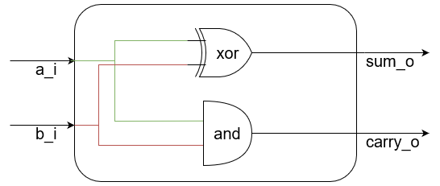

# Что такое язык описания аппаратуры (HDL)

На заре появления цифровой электроники, цифровые схемы в виде диаграммы на бумаге были маленькими, а их реализация в виде физической аппаратуры — большой. В процессе развития электроники (и её преобразования в микроэлектронику) цифровые схемы на бумаге становились всё больше, а относительный размер их реализации в виде физических микросхем — всё меньше. На рисунке ниже, вы можете увидеть диаграмму цифровой схемы устройства intel 4004, выпущенного в 1971 году.


Данная микросхема состоит из 2300 транзисторов.  
За прошедшие полсотни лет сложность цифровых схем выросла коллосально. Современные процессоры для настольных компьютеров состоят из десятков миллиардов транзисторов. Диаграмма выше при печати в оригинальном размере займет прямоугольник размером 115х140см с площадью около 1.6м<sup>2</sup> . Предполагая, что площадь печати имеет прямопропорциональную зависимость от количества транзисторов, получим что печать диаграммы современных процессоров потребует площадь в 16млн. м<sup>2</sup>, что эквивалентно квадрату со стороной в 4км.


Как вы можете догадаться в какой-то момент между 1971-ым и 2022-ым годами инженеры перестали разрабатывать цифровые схемы, рисуя их на бумаге.  
Разумеется, разрабатывая устройство, не обязательно вырисовывать на схеме каждый транзистор — можно управлять сложностью, переходя с одного уровня абстракции на другой. Например начинать разработку схемы с соединения функциональных блоков, а затем рисовать схему для каждого отдельного блока.  
К примеру, схему intel 4004 можно представить в следующем виде:


Однако несмотря на это, даже отдельные блоки порой бывают довольно сложны. Возьмем блок аппаратного шифрования по алгоритму AES на рисунке ниже:


Заметьте, что даже этот блок не является атомарным. Каждая операция Исключающего ИЛИ, умножения, мультиплексирования сигнала и таблицы подстановки — это отдельные блоки, функционал которых еще надо реализовать.
В какой-то момент, инженеры поняли что проще описать цифровую схему в тексовом представлении, нежели в графическом.  
Как можно описать цифровую схему текстом? Рассмотрим цифровую схему полусумматора:



Это **устройство** (_полусумматор_) имеет два **входа**: _a_ и _b_, а так же два **выхода**: _S_ и _P_.
Выход _S_ является **результатом** логической операции **Исключающее ИЛИ** от операндов _a_ и _b_.
Выход _P_ является **результатом** логической операции **И** от операндов _a_ и _b_.

Текст выше и является тем описанием, по которому можно воссоздать эту цифровую схему. Если стандартизировать описание схемы, то в нем можно будет оставить только слова, выделенные жирным и курсивом. Пример того, как можно было бы описать эту схему по стандарту IEEE 1364-2005 (язык описания аппаратуры (Hardware Description Language — HDL) Verilog):

``` Verilog
module half_sum(    // устройство полусумматор cо
  input   a,        // входом a,
  input   b,        // входом b,
  output  S,        // выходом S и
  output  P         // выходом P.
);

assign S = a ^ b;   // Где выход S является результатом Исключающего ИЛИ от a и b,
assign P = a & b;   // а выход P является результатом логического И от a и b.

endmodule
```

На первый взгляд кажется, что такое описание даже больше, чем записанное естественным языком, однако так кажется только из-за переноса строк и некоторой избыточности в описании входов и выходов, которая была добавлена для повышения читаемости. То же самое описание можно было записать и в виде:

``` Verilog
module half_sum(input a, b, output S, P);
  assign S = a ^ b;
  assign P = a & b;
endmodule
```

Обратите внимание, что код на языке Verilog описывает устройство целиком, одномоментно. Это описание схемы выше, а не построчное выполнение программы.  
Может показаться, что описывать устройство текстом сложнее, чем рисовать схему, тем более, что сперва мы **уже нарисовали схему**, а затем её описали. Однако, с практикой описание схемы в текстовом виде становится намного проще и не требует диаграммы. Для описания достаточно только спецификации: формальной записи того, что должно делать устройство, по которой разрабатывается алгоритм, который затем претворяется в описание на HDL.

Занятный факт: ранее было высказано предположение о том, что инженеры перестали разрабатывать устройства, рисуя цифровые схемы в промежуток времени между 1971-ым и 2022-ым годами. Так вот, первая конференция, посвященная языкам описания аппаратуры состоялась в 1973-ем году. Таким образом, Intel 4004 можно считать одним из последних цифровых устройств, разработанных без использования языков описания аппаратуры.
