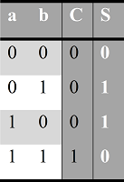
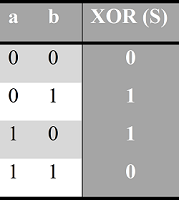
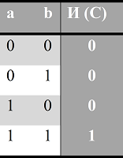
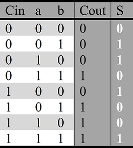
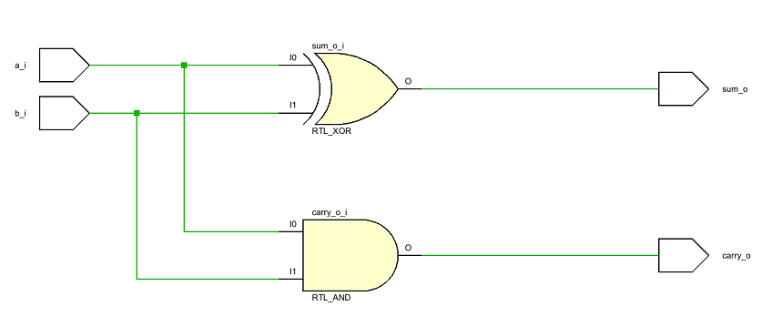
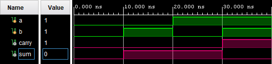
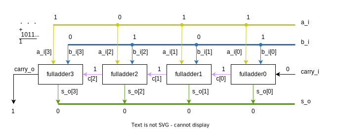
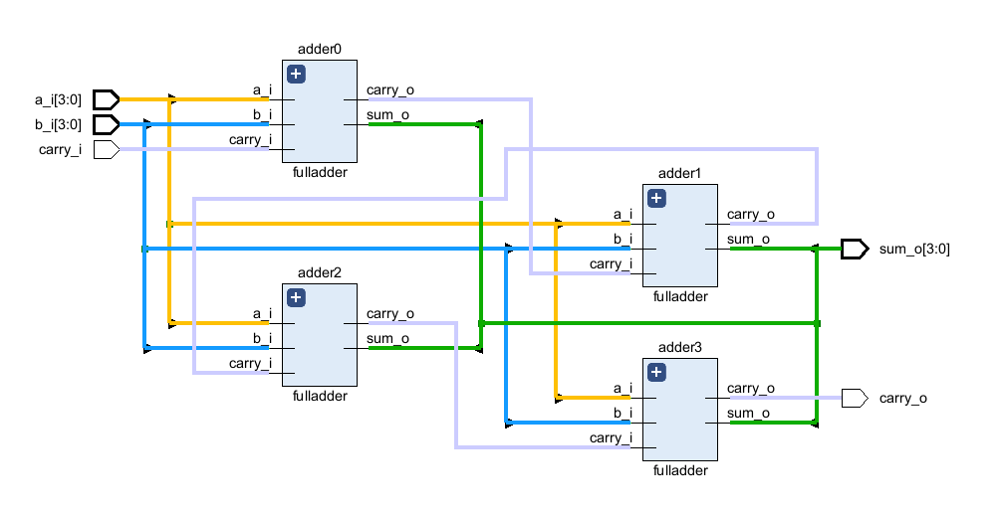

# Lab 1 "Adder"

## Goal

Get familiar with the Vivado EDA tool and learn how to implement basic circuit modules using SystemVerilog language constructs.

## Preparation Materials

[Describing modules in SystemVerilog](../../Basic%20Verilog%20structures/Modules.md).

## Workflow

1. Study the 1-bit adder;
2. Reproduce the example of implementing and verifying a half adder.
3. Implement and verify a full 1-bit adder
4. Study the 4-bit adder;
5. Implement and verify a full 4-bit adder;
6. Implement and verify a full 32-bit adder.

## Theory

The outcome of this lab will be a device capable of adding two numbers. But before learning how to build such a device, it is necessary to get comfortable with the addition process itself.

Let's start with an example and add a pair of numbers in column format, say 42 and 79:


```text
2 + 9             = 11 ➨ write 1, carry 1
4 + 7 + carry 1   = 12 ➨ write 2, carry 1
0 + 0 + carry 1   = 1
```

Total: 121.

Now let's do the same thing in binary. For example, with the numbers 3 and 5. Three in binary is 011. Five is 101.


Since binary has only two digits — 0 and 1 — a single bit cannot exceed 1. When adding 1 and 1, you get 2, which does not fit in one bit, so we write 0 and carry 1. This is again a carry. Since binary digits are called bits, the carry is called a carry bit.

### Full 1-bit Adder

A full 1-bit adder is a digital device that adds two 1-bit numbers and accounts for an incoming carry bit. It has three inputs — two operands and a carry-in — and two outputs: a 1-bit sum result and a carry-out.

What is the carry-in? Let's recall the second step of adding 42 and 79:

```text
4 + 7 + carry 1   = 12 ➨ write 2, carry 1
```

**+ carry 1** — this is the addition of the carry bit propagated from the previous step.

The carry-in is the bit propagated from the previous stage of binary addition. With this signal, we can add multi-bit binary numbers by chaining multiple 1-bit adders: the carry-out of the lower-order adder is fed into the carry-in of the higher-order adder.

### Single-bit Addition Implementation

Can single-bit binary addition be described using logical operations? Let's look at the truth table for this operation:



_Truth table for single-bit addition._

`S` is the least significant bit of the 2-bit sum result, written in the sum column below operands `a` and `b`. `C` (_carry_) is the most significant bit of the sum, written to the left when a carry occurs. As we can see, a carry occurs only when both numbers are simultaneously equal to one. In this case, `S` becomes `0` and the result is written as `10`, which equals `2` in binary. Additionally, `S` equals `0` when both operands are simultaneously zero. You may notice that `S` is zero when `a` and `b` are equal, and non-zero otherwise. This property belongs to the **Exclusive OR** (**XOR**) logical operation, which is why another name for this operation is "sum modulo 2".



_Truth table for the Exclusive OR (XOR) operation._

The carry bit is even simpler — it is described by the **logical AND** operation:



_Truth table for the AND operation._

_Fig. 1_ shows the digital circuit connecting inputs and outputs through logic gates that match the expected behavior.


_Figure 1. Digital circuit of a device that adds two operands with carry preservation (half adder)._

However, the description of a full 1-bit adder states that it has three inputs, while our truth tables and the circuit above only have two (the circuit in _Fig. 1_ implements a so-called "half adder"). In fact, at every step of column addition we always add three numbers: the digit of the top number, the digit of the bottom number, and one in case of a carry from the previous column (if there was no carry from the previous digit, adding zero was implicitly omitted).

Therefore, the truth table becomes slightly more complex:



_Truth table for a full 1-bit adder._

Since we now have both a carry-in and a carry-out, suffixes "in" and "out" are added to distinguish them.

How do we express S in this case? For example, as the sum modulo 2 of the three operands: `a ⊕ b ⊕ Cin`. Let's verify this against the truth table. Sum modulo 2 is an associative operation [`(a⊕b)⊕c = a⊕(b⊕c)`], meaning the order of addition does not affect the result. Assume Cin is zero. Sum modulo 2 with zero gives the second operand (`a⊕0=a`), so `(a⊕b)⊕0 = a⊕b`. This corresponds to the upper half of the truth table for signal S when Cin is zero.
Assume Cin is one. Sum modulo 2 with one gives the negation of the second operand (`a⊕1=!a`), so `(a⊕b)⊕1=!(a⊕b)`. This corresponds to the lower half of the truth table when Cin is one.

For the carry-out, things are simpler. It equals one when at least two of the three operands equal one, meaning we need to compare all pairs of operands and if any such pair is found, it equals one. This can be written as:

`Cout = (a&b) | (a&Cin) | (b&Cin)`, where `&` is logical AND, `|` is logical OR.

The digital circuit with this described behavior looks as follows:


_Figure 2. Digital circuit of a full 1-bit adder._

## Practice

Let's implement the half adder circuit (_Fig. 1_) as a module described in SystemVerilog.

The `half_adder` module has two input signals and two output signals. Inputs `a_i` and `b_i` feed into two logic elements: Exclusive OR and AND, whose outputs are connected to module outputs `sum_o` and `carry_o` respectively.

```Verilog
module half_adder(
  input  logic    a_i,     // Input signals
  input  logic    b_i,

  output logic    sum_o,   // Output signals
  output logic    carry_o
);

assign sum_o = a_i ^ b_i;
assign carry_o = a_i & b_i;

endmodule
```

_Listing 1. SystemVerilog code for the half_adder module._

From this code, the EDA tool can implement the circuit shown in Figure 3.



_Figure 3. Digital circuit of the half_adder module generated by the Vivado EDA tool._

The circuit resembles _Fig. 1_, but how do we verify that this circuit is error-free and behaves as expected?

To do this, we need to simulate the circuit. During simulation, test stimuli are applied to the inputs. Each change in input signals causes a cascading change in the states of internal nets, which in turn causes changes in the output signal values.

The test stimuli applied to the circuit are generated by the verification environment. The verification environment (hereafter referred to as a "**testbench**") is a special non-synthesizable module that has no input or output signals. It does not need them because it generates all its internal signals itself, and this module does not pass anything to the outside world — it only tests the design under test (DUT) internally.

Inside the testbench, constructs from the non-synthesizable subset of SystemVerilog can be used, in particular the `initial` procedural block, in which statements execute sequentially, making this block somewhat similar to a test program. Since changes in internal nets occur with some delay relative to input signal changes, it is possible to insert pauses between statements during simulation. This is done using the special `#` symbol followed by the amount of simulation time to skip before the next statement.

Before writing the verification environment, it is necessary to draft a plan for how the device will be verified (a verification plan). Given the extreme simplicity of the device, the plan consists of a single statement:

> Since the device has no internal state that could affect the result, and the total number of all possible input stimulus combinations equals four, we can verify its operation by exhausting all possible combinations of its input signals.

```Verilog
module testbench();                // <- Has neither inputs nor outputs!
  logic a, b, carry, sum;

  half_adder DUT(                  // <- Connect the design under test
    .a_i    (a    ),
    .b_i    (b    ),
    .carry_o(carry),
    .sum_o  (sum  )
);

  initial begin
    a = 1'b0; b = 1'b0;            // <- Apply test stimuli to the module
    #10ns;                         //    inputs
    a = 1'b0; b = 1'b1;
    #10ns;                         // <- Pause for ten nanoseconds before
    a = 1'b1; b = 1'b0;            //    the next input signal change
    #10ns;
    a = 1'b1; b = 1'b1;
  end
endmodule
```

_Listing 2. SystemVerilog code for the half_adder testbench._



_Figure 4. Timing diagram simulating the operation of the circuit from Fig. 3._

In this lab, you will implement the full 1-bit adder circuit (_Fig. 2_). The half adder module whose code is shown in _Listing 1_ is not used in this lab (it was provided as an example only).

### Full 4-bit Adder

So far, we have implemented column addition for only one digit. Now we want to implement the full column addition operation. How? By doing exactly what column addition does: first add the least significant bit, obtain the carry for the next bit, add the next, and so on.

Let's look at how this appears as a circuit (for simplicity, the internal logic of the 1-bit adder is hidden, but remember that each rectangle is the same circuit from Fig. 2).



_Figure 5. 4-bit adder circuit._

The purple lines in the circuit show the wires connecting the carry-out of one adder stage to the carry-in of the next stage.

How do we implement a module composed of a chain of other modules? We already did half of this when we wrote the testbench for the 1-bit half adder in _Listing 2_ — we created a module inside another module and connected wires to it. Now we need to do the same thing, just with a slightly larger number of modules.

Describing a 4-bit adder reduces to describing the interconnection of four instances of a 1-bit adder. More details on how to instantiate modules are covered in the chapter [Describing modules in SystemVerilog](../../Basic%20Verilog%20structures/Modules.md#Module-hierarchy), which you studied before this lab.



_Figure 6. 4-bit adder circuit generated by the Vivado EDA tool._

Despite how complex the circuit looks, if you look closely, you can see lines running from buses A, B, and S to each of the adders, with the carry bit propagating from one adder to the next. To transfer the carry bits from one adder to the next, auxiliary wires need to be created; these can be grouped into a single [vector](../../Basic%20Verilog%20structures/Modules.md#Vectors) (see signals c[0]–c[2] in _Fig. 5_).

## Assignment

Describe a full 1-bit adder whose circuit is shown in _[Fig. 2](../../.pic/Labs/lab_01_adder/fig_02.drawio.svg)_. The module prototype is as follows:

```Verilog
module fulladder(
  input  logic a_i,
  input  logic b_i,
  input  logic carry_i,
  output logic sum_o,
  output logic carry_o
);
```

Next, implement a full 32-bit adder with the following prototype:

```verilog
module fulladder32(
    input  logic [31:0] a_i,
    input  logic [31:0] b_i,
    input  logic        carry_i,
    output logic [31:0] sum_o,
    output logic        carry_o
);
```

Manually connecting 32 identical modules is tedious and error-prone, so it is recommended to first build a 4-bit adder and then combine four 4-bit adders into a 32-bit one.

If you choose to build a 4-bit adder, the module must follow this prototype:

```Verilog
module fulladder4(
  input  logic [3:0] a_i,
  input  logic [3:0] b_i,
  input  logic       carry_i,
  output logic [3:0] sum_o,
  output logic       carry_o
);
```

Alternatively, you can create an array of 1-bit adders.

Creating a module array is similar to instantiating a single module, except that a range defining the number of modules in the array is specified after the instance name. Signal connections to a module array work as follows:

- if the width of the connected signal matches the port width of the module in the array, that signal is connected to every module in the array;
- if the width of the connected signal is `N` times the port width of the array module (where `N` is the number of modules in the array), the corresponding bit range of the signal is connected to each module (the lower bit range is connected to the module with the smaller index in the array);
- if the width of the connected signal does not match either of the above cases, a synthesis error occurs, because the EDA tool cannot determine how to connect the signal to each module in the array.

_Listing 3_ shows an example of how to create a module array.

```Verilog
module example1(
  input  logic [3:0] a,
  input  logic       b,
  output logic       c,
  output logic       d
);

  assign c = |a ^ b;
  assign d = &a;

endmodule

module example2(
  input  logic [31:0] A,
  input  logic        B,
  output logic [ 8:0] C
);

example1 instance_array[7:0]( // Creates an array of 8 example1 modules
  .a(A),                      // Since the width of signal A is 8 times greater
                              // than the width of port a, each module in the array
                              // is connected to its own bit range of signal A
                              // (instance_array[0] is connected to A[3:0],
                              // instance_array[7] is connected to A[31:28]).

  .b(B),                      // Since the width of signal B matches the width
                              // of port b, signal B is connected as-is to
                              // all modules in the array.

  .c(C[7:0]),                 // Since the width of signal C does not equal
                              // either the port width of c or eight times
                              // that width, we must select a bit range that
                              // satisfies one of the requirements.

  .d(C[8])                    // Same as the previous case.
);
endmodule
```

_Listing 3. Example of creating a module array._

Implementing the adder array will be complicated by the need to propagate the carry-out of each stage to the carry-in of the next. To do this, it is recommended to create two 32-bit vectors:

- a vector of carry-in bits;
- a vector of carry-out bits.

Then use continuous assignment to connect the bits of the carry-out vector to the corresponding bits of the carry-in vector. In addition, you will need to connect the module-level carry-in and carry-out to the least significant and most significant bits of the corresponding vectors.

Once the carry bit vectors are ready, creating the module array will be straightforward.

### Step-by-Step Instructions

1. Create a project following the [Vivado project creation guide](../../Vivado%20Basics/01.%20New%20project.md).
2. Describe the `fulladder` module whose circuit is shown in _[Fig. 2](../../.pic/Labs/lab_01_adder/fig_02.drawio.svg)_.
   1. The module must be described with the same name and ports as specified in the assignment.
3. Verify the module using the verification environment provided in the file [`lab_01.tb_fulladder.sv`](lab_01.tb_fulladder.sv). Check the waveform signals to confirm that the module operates correctly. If incorrect behavior is observed on the sum or carry-out signals, you must [find](../../Vivado%20Basics/05.%20Bug%20hunting.md) the cause and fix it.
4. Describe the `fulladder4` module whose circuit is shown in _Figs. 5 and 6_, using [module hierarchy](../../Basic%20Verilog%20structures/Modules.md#Module-hierarchy) to perform bit-by-bit addition of two 4-bit numbers and a carry-in. Some inputs and outputs of the module will need to be described as [vectors](../../Basic%20Verilog%20structures/Modules.md#Vectors).
   1. The module must be described with the same name and ports as specified in the assignment.
   2. Note that the carry-in must be fed to the adder that processes bit 0, and the carry-out must be connected to the carry-out of the adder processing bit 3. Intermediate carry bits are passed using auxiliary wires that you must create yourself.
5. Verify the module using the verification environment provided in the file [`lab_01.tb_fulladder4.sv`](lab_01.tb_fulladder4.sv). Check the waveform signals to confirm that the module operates correctly. If incorrect behavior is observed on the sum or carry-out signals, you must [find](../../Vivado%20Basics/05.%20Bug%20hunting.md) the cause and fix it.
   1. Before launching simulation, make sure the correct top-level module is selected in `Simulation Sources`.
6. Describe the `fulladder32` module to perform bit-by-bit addition of two 32-bit numbers and a carry-in. It can be implemented by chaining eight 4-bit adders, or by connecting 32 1-bit adders (either manually or by creating a module array).
   1. The module must be described with the same name and ports as specified in the assignment.
   2. Note that the carry-in must be fed to the adder that processes bit 0, and the carry-out must be connected to the carry-out of the adder processing bit 31.
7. Verify the module using the verification environment provided in the file [`lab_01.tb_fulladder32.sv`](lab_01.tb_fulladder32.sv). If error messages appear in the TCL console, you must [find](../../Vivado%20Basics/05.%20Bug%20hunting.md) and fix them.
   1. Before launching simulation, make sure the correct top-level module is selected in `Simulation Sources`.
8. [Verify](./board%20files) the operation of your digital circuit on the FPGA.
