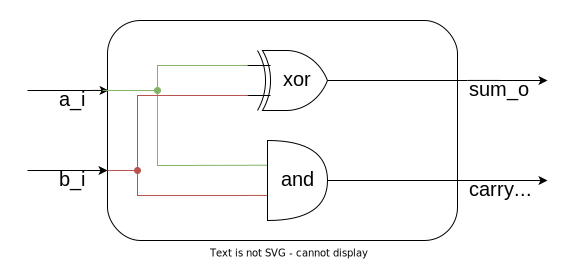
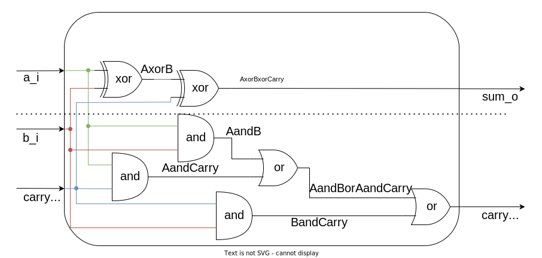

# Лабораторная работа №1 "Сумматор"

## Цель

Познакомиться с САПР Vivado и научиться реализовывать в нём простейшие схемотехнические модули с помощью конструкций языка SystemVerilog.

## Материал для подготовки к лабораторной работе

[Описание модулей на языке SystemVerilog](../../Basic%20Verilog%20structures/Modules.md).

## Ход работы

1. Изучение 1-битного сумматора;
2. Воспроизведение примера по реализации и проверке полусумматора.
3. Реализация и проверка полного 1-битного сумматора
4. Изучение 4-битного сумматора;
5. Реализация и проверка полного 4-битного сумматора;
6. Реализация и проверка полного 32-битного сумматора.

## Теория

Итогом лабораторной работы будет создание устройства, способного складывать два числа. Но перед тем, как учиться создавать подобное устройство, необходимо немного освоиться в самом процессе складывания чисел.

Давайте начнём с примера и сложим в столбик произвольную пару чисел, например 42 и 79:


```text
2 + 9             = 11 ➨ 1 пишем, 1 "в уме"
4 + 7 + "1 в уме" = 12 ➨ 2 пишем, 1 "в уме"
0 + 0 + "1 в уме" = 1
```

Итого, 121.

Назовём то, что мы звали "1 в уме", переносом разряда.

Теперь попробуем сделать то же самое, только в двоичной системе исчисления. К примеру, над числами 3 и 5. Три в двоичной системе записывается как 011. Пять записывается как 101.


Поскольку в двоичной системе всего две цифры: 0 и 1, один разряд не может превысить 1. Складывая числа 1 и 1, вы получаете 2, что не умещается в один разряд, поэтому мы пишем 0 и держим 1 "в уме". Это снова перенос разряда. Поскольку в двоичной арифметике разряд называют битом, перенос разряда можно назвать переносом бита, а сам разряд, который перенесли — битом переноса.

### Полный 1-битный сумматор

Полный 1-битный сумматор — это цифровое устройство, которое выполняет сложение двух 1-битных чисел и учитывает входной бит переноса. Это устройство имеет три входа: два слагаемых и входной бит переноса, а также два выхода: 1-битный результат суммы и выходной бит переноса.

Что такое входной бит переноса? Давайте вспомним второй этап сложения чисел 42 и 79:

```text
4 + 7 + "1 в уме" = 12 ➨ 2 пишем, 1 "в уме"
```

**+ "1 в уме"** — это прибавление разряда, перенесённого с предыдущего этапа сложения.

Входной бит переноса — это бит, перенесённый с предыдущего этапа сложения двоичных чисел. Имея этот сигнал, мы можем складывать многоразрядные двоичные числа путём последовательного соединения нескольких 1-битных сумматоров: выходной бит переноса сумматора младшего разряда передастся на входной бит переноса сумматора старшего разряда.

### Реализация одноразрядного сложения

Можно ли как-то описать сложение двух одноразрядных двоичных чисел с помощью логических операций? Давайте посмотрим на таблицу истинности подобной операции:


_Таблица истинности одноразрядного сложения._

`S` — это младший разряд 2-битного результата суммы, записываемый в столбце сложения под слагаемыми `a` и `b`. `C` (_carry_, перенос) — это старший разряд суммы, записываемый левее, если произошёл перенос разряда. Как мы видим, перенос разряда происходит только в случае, когда оба числа одновременно равны единице. При этом значение `S` обращается в `0`, и результат записывается как `10`, что в двоичной системе означает `2`. Кроме того, значение `S` равно `0` и в случае, когда оба операнда одновременно равны нулю. Вы можете заметить, что `S` равно нулю в тех случаях, когда `а` и `b` равны, и не равно нулю в противоположном случае. Подобным свойством обладает логическая операция **Исключающее ИЛИ** (**eXclusive OR**, **XOR**):


_Таблица истинности операции Исключающее ИЛИ (XOR)._

Для бита переноса всё ещё проще — он описывается операцией **логическое И**:


_Таблица истинности операции И._

Давайте нарисуем цифровую схему, связывающую входные и выходные сигналы с помощью логических элементов, соответствующих ожидаемому поведению:



_Рисунок 1. Цифровая схема устройства, складывающего два операнда с сохранением переноса (полусумматора)._

Однако, в описании полного 1-битного сумматора сказано, что у него есть три входа, а в наших таблицах истинности и на схеме выше их только два (схема, представленная на _рис. 1_, реализует так называемый "полусумматор"). На самом деле, на каждом этапе сложения в столбик мы всегда складывали три числа: цифру верхнего числа, цифру нижнего числа, и единицу в случае переноса разряда из предыдущего столбца (если с предыдущего разряда не было переноса, прибавление нуля неявно опускалось).

Таким образом, таблица истинности немного усложняется:


_Таблица истинности сигналов полного 1-битного сумматора._

Поскольку теперь у нас есть и входной и выходной биты переноса, для их различия добавлены суффиксы "in" и "out".

Как в таком случае описать S? Например, как `а ^ b ^ Cіn`, где `^` — операция исключающего ИЛИ. Давайте сравним такую операцию с таблицей истинности. Сперва вспомним, что Исключающее ИЛИ — ассоциативная операция [`(a^b)^c = a^(b^с)`], т.е. нам не важен порядок вычисления. Предположим, что Cin равен нулю. Исключающее ИЛИ с нулем дает второй операнд (`a^0=a`), значит `(a^b)^0 = a^b`. Это соответствует верхней половине таблицы истинности для сигнала S, когда Cin равен нулю.

Предположим, что Cin равен единице. Исключающее ИЛИ с единицей дает нам отрицание второго операнда (`a^1=!a`), значит `(a^b)^1=!(a^b)`. Это соответствует нижней половине таблицы истинности, когда Cin равен единице.

Для выходного бита переноса всё гораздо проще. Он равен единице, когда хотя бы два из трех операндов равны единице, это значит, что необходимо попарно сравнить все операнды, и если найдется хоть одна такая пара, он равен единице. Это утверждение можно записать следующим образом:

`Cоut = (a&b) | (а&Cіn) | (b&Cіn)`, где `&` — логическое И, `|` — логическое ИЛИ.

Цифровая схема устройства с описанным поведением выглядит следующим образом:



_Рисунок 2. Цифровая схема полного 1-битного сумматора._

## Практика

Реализуем схему полусумматора (_рис. 1_) в виде модуля, описанного на языке SystemVerilog.

Модуль `half_adder` имеет два входных сигнала и два выходных. Входы `a_i` и `b_i` идут на два логических элемента: Исключающее ИЛИ и И, выходы которых подключены к выходам модуля `sum_o` и `carry_o` соответственно.


```Verilog
module half_adder(
  input  logic    a_i,     // Входные сигналы
  input  logic    b_i,

  output logic    sum_o,   // Выходные сигналы
  output logic    carry_o
);

assign sum_o = a_i ^ b_i;
assign carry_o = a_i & b_i;

endmodule
```

_Листинг 1. SystemVerilog-код модуля half_adder._

По данному коду, САПР может реализовать следующую схему:


_Рисунок 3. Цифровая схема модуля half_adder, сгенерированная САПР Vivado._

Схема похожа на _рис. 1_, но как проверить, что эта схема не содержит ошибок и делает именно то, что от неё ожидается?

Для этого необходимо провести моделирование этой схемы. Во время моделирования на входы подаются тестовые воздействия. Каждое изменение входных сигналов приводит к каскадному изменению состояний внутренних цепей, что в свою очередь приводит к изменению значений на выходных сигналах схемы.

Подаваемые на схему входные воздействия формируются верификационным окружением. Верификационное окружение (в дальнейшем будет использован термин "**тестбенч**") — это особый несинтезируемый модуль, который не имеет входных или выходных сигналов. Ему не нужны входные сигналы, поскольку он сам является генератором всех своих внутренних сигналов, и ему не нужны выходные сигналы, поскольку этот модуль ничего не вычисляет, только подаёт входные воздействия на проверяемый модуль.

Внутри тестбенча можно использовать конструкции из несинтезируемого подмножества языка SystemVerilog, в частности программный блок `initial`, в котором команды выполняются последовательно, что делает этот блок чем-то отдаленно похожим на проверяющую программу. Поскольку изменение внутренних цепей происходит с некоторой задержкой относительно изменений входных сигналов, при моделировании есть возможность делать паузы между командами. Это делается с помощью специального символа #, за которым указывается количество времени симуляции, которое нужно пропустить перед следующей командой.

Перед тем как писать верификационное окружение, необходимо составить план того, как будет проводиться проверка устройства (составить верификационный план). Ввиду предельной простоты устройства, план будет состоять из одного предложения:

> Поскольку устройство не имеет внутреннего состояния, которое могло бы повлиять на результат, а число всех его возможных входных наборов воздействий равно четырём, мы можем проверить его работу, перебрав все возможные комбинации его входных сигналов.

```Verilog
module testbench();                // <- Не имеет ни входов, ни выходов!
  logic a, b, carry, sum;

  half_adder DUT(                  // <- Подключаем проверяемый модуль
    .a_i    (a),
    .b_i    (b),
    .carry_o(p),
    .sum_o  (s)
);

  initial begin
    a = 1'b0; b = 1'b0;            // <- Подаём на входы модуля тестовые
    #10;                           //    воздействия
    a = 1'b0; b = 1'b1;
    #10;                           // <- Делаем паузу в десять отсчётов
    a = 1'b1; b = 1'b0;            //    времени симуляции перед очередным
    #10;                           //    изменением входных сигналов
    a = 1'b1; b = 1'b1;
  end
endmodule
```

_Листинг 2. SystemVerilog-код тестбенча для модуля example._


_Рисунок 4. Временная диаграмма, моделирующая работу схемы с рис. 3._

В данной лабораторной работе вам предстоит реализовать схему полного 1-битного сумматора (_рис. 2_). Модуль полусумматора, код которого представлен в _листинге 1_ не используется в лабораторной работе (он был дан только в качестве примера).

### Полный 4-битный сумматор

До этого мы реализовали только сложение одного столбца в столбик, теперь мы хотим реализовать всю операцию сложения в столбик. Как это сделать? Сделать ровно то, что делается при сложении в столбик: сначала сложить младший столбец, получить бит переноса для следующего столбца, сложить следующий и т.д.

Давайте посмотрим, как это будет выглядеть на схеме (для простоты, внутренняя логика 1-битного сумматора скрыта, но вы должны помнить, что каждый прямоугольник — это та же самая схема с рис. 2).


_Рисунок 5. Схема 4-битного сумматора._

Фиолетовой линией на схеме показаны провода, соединяющие выходной бит переноса сумматора предыдущего разряда с входным битом переноса сумматора следующего разряда.

Как же реализовать модуль, состоящий из цепочки других модулей? Половину этой задачи мы уже сделали, когда писали тестбенч к 1-битному полусумматору в _Листинге 2_ — мы создавали модуль внутри другого модуля и подключали к нему провода. Теперь надо сделать то же самое, только с чуть большим числом модулей.

Для того, чтобы описать 4-битный сумматор, необходимо подключить четыре 1-битных подобно тому, как было описано в [`документе`](../../Basic%20Verilog%20structures/Modules.md#иерархия-модулей), который вы изучали перед лабораторной работой.


_Рисунок 6. Схема 4-битного сумматора, сгенерированная САПР Vivado._

Несмотря на запутанность схемы, если присмотреться, вы увидите, как от шин A, B и S отходят линии к каждому из сумматоров, а бит переноса передаётся от предыдущего сумматора к следующему.

## Задание

Опишите полный 1-битный сумматор, схема которого представлена на _[Рис. 2](../../.pic/Labs/lab_01_adder/fig_02.drawio.svg)_. Прототип модуля следующий:

```Verilog
module fulladder(
  input  logic a_i,
  input  logic b_i,
  input  logic carry_i,
  output logic sum_o,
  output logic carry_o
);
```

Далее, вам необходимо реализовать полный 32-битный сумматор со следующим прототипом:

```verilog
module fulladder32(
    input  logic [31:0] a_i,
    input  logic [31:0] b_i,
    input  logic        carry_i,
    output logic [31:0] sum_o,
    output logic        carry_o
);
```

Соединять вручную 32 однотипных модуля чревато усталостью и ошибками, поэтому можно сначала создать 4-битный сумматор, а затем из набора 4-битных сумматоров сделать 32-битный.

Если вы решите делать 4-битный сумматор, то модуль должен быть описан в соответствии со следующим прототипом:

```Verilog
module fulladder4(
  input  logic [3:0] a_i,
  input  logic [3:0] b_i,
  input  logic       carry_i,
  output logic [3:0] sum_o,
  output logic       carry_o
);
```

либо же можно создать массив 1-битных сумматоров.

Создание массива модулей схоже с созданием одного модуля за исключением того, что после имени сущности модуля указывается диапазон, определяющий количество модулей в массиве. При этом подключение сигналов к массиву модулей осуществляется следующим образом:

- если разрядность подключаемого сигнала совпадает с разрядностью порта модуля из массива, этот сигнал подключается к каждому из модулей в массиве;
- если разрядность подключаемого сигнала превосходит разрядность порта модуля из массива в `N` раз (где `N` — количество модулей в массиве), к модулю подключается соответствующий диапазон бит подключаемого сигнала (диапазон младших бит будет подключён к модулю с меньшим индексом в массиве).
- если разрядность подключаемого сигнала не подходит ни под один из описанных выше пунктов, происходит ошибка синтеза схемы, поскольку в этом случае САПР не способен понять каким образом подключать данный сигнал к каждому модулю из массива.

Далее идёт пример того, как можно создать массив модулей:

```Verilog
module example1(
  input  logic [3:0] a,
  input  logic       b,
  output logic       c,
  output logic       d
);

  assign c = |a ^ b;
  assign d = &a;

endmodule

module example2(
  input  logic [31:0] A,
  input  logic        B,
  output logic [ 8:0] C
);

example1 instance_array[7:0]( // Создается массив из 8 модулей example1
  .a(A),                      // Поскольку разрядность сигнала A в 8 раз больше
                              // разрядности входа a, к каждому модулю в массиве
                              // будет подключен свой диапазон бит сигнала A
                              // (к instance_array[0] будет подключен диапазон
                              // A[3:0], к instance_array[7] будет подключен
                              // диапазон A[31:28]).

  .b(B),                      // Поскольку разрядность сигнала B совпадает с
                              // разрядностью входа b, сигнал B будет подключен
                              // как есть ко всем модулям в массиве.

  .c(C[7:0]),                 // Поскольку разрядность сигнала C не равна
                              // ни разрядности входа c, ни его увосьмиренной
                              // разрядности, мы должны выбрать такой диапазон
                              // бит, который будет удовлетворять одному из
                              // этих требований.

  .d(C[8])                    // Аналогично предыдущему.
);
endmodule
```

_Листинг 3. Пример создания массива модулей._

### Порядок выполнения задания

1. Создайте проект, согласно [руководству по созданию проекта в Vivado](../../Vivado%20Basics/Vivado%20trainer.md)
2. Опишите модуль `fulladder`, схема которого представлена на _[Рис. 2](../../.pic/Labs/lab_01_adder/fig_02.drawio.svg)_.
   1. Модуль необходимо описать с таким же именем и портам, как указано в задании.
3. [Проверьте](../../Vivado%20Basics/Run%20Simulation.md) модуль с помощью верификационного окружения, представленного в файле [`lab_01.tb_fulladder.sv`](lab_01.tb_fulladder.sv). Убедитесь по сигналам временной диаграммы, что модуль работает корректно. В случае обнаружения некорректного поведения сигналов суммы и выходного бита переноса, вам необходимо [найти](../../Vivado%20Basics/Debug%20manual.md) причину этого поведения, и устранить её.
4. Опишите модуль `fulladder4`, схема которого представлена на _Рис. 5 и 6_, используя [`иерархию модулей`](../../Basic%20Verilog%20structures/Modules.md#%D0%B8%D0%B5%D1%80%D0%B0%D1%80%D1%85%D0%B8%D1%8F-%D0%BC%D0%BE%D0%B4%D1%83%D0%BB%D0%B5%D0%B9), чтобы в нем выполнялось поразрядное сложение двух 4-битных чисел и входного бита переноса. Некоторые входы и выходы модуля будет необходимо описать в виде [`векторов`](../../Basic%20Verilog%20structures/Modules.md#векторы).
   1. Модуль необходимо описать с таким же именем и портам, как указано в задании.
   2. Обратите внимание, что входной бит переноса должен подаваться на сумматор, выполняющий сложение нулевого разряда, выходной бит переноса соединяется с выходным битом переноса сумматора, выполняющего сложение 4-го разряда.
5. Проверьте модуль с помощью верификационного окружения, представленного в файле [`lab_01.tb_fulladder4.sv`](lab_01.tb_fulladder4.sv). Убедитесь по сигналам временной диаграммы, что модуль работает корректно. В случае обнаружения некорректного поведения сигналов суммы и выходного бита переноса, вам необходимо [найти](../../Vivado%20Basics/Debug%20manual.md) причину этого поведения, и устранить её.
   1. Перед запуском моделирования, убедитесь, что у вас выбран корректный модуль верхнего уровня в `Simulation Sources`.
6. Опишите модуль `fulladder32` так, чтобы в нем выполнялось поразрядное сложение двух 32-битных чисел и входного бита переноса. Его можно реализовать через последовательное соединение восьми 4-битных сумматоров, либо же можно соединить 32 1-битных сумматора (как вручную, так и с помощью создания массива модулей).
   1. Модуль необходимо описать с таким же именем и портам, как указано в задании.
   2. Обратите внимание, что входной бит переноса должен подаваться на сумматор, выполняющий сложение нулевого разряда, выходной бит переноса соединяется с выходным битом переноса сумматора, выполняющего сложение 31-го разряда.
7. Проверьте модуль с помощью верификационного окружения, представленного в файле [`lab_01.tb_fulladder32.sv`](lab_01.tb_fulladder32.sv). В случае, если в TCL-консоли появились сообщения об ошибках, вам необходимо [найти](../../Vivado%20Basics/Debug%20manual.md) и исправить их.
   1. Перед запуском моделирования, убедитесь, что у вас выбран корректный модуль верхнего уровня в `Simulation Sources`.
8. Проверьте работоспособность вашей цифровой схемы в ПЛИС.
