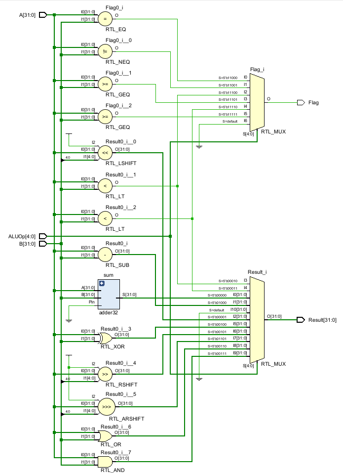

# Lab 2. Arithmetic Logic Unit

Since the primary purpose of a processor is to process digital data, one of its core components is the arithmetic logic unit (ALU). The ALU performs arithmetic and bitwise logical operations on input data.

## Goal

Using multiplexer description skills, describe an arithmetic logic unit (ALU) module in SystemVerilog.

## Preparation Materials

In addition to the [materials](../../Basic%20Verilog%20structures/) covered in the previous lab, you are encouraged to review:

- how to describe a [multiplexer](../../Basic%20Verilog%20structures/Multiplexors.md) in SystemVerilog.

## Workflow

1. Study the structure and operating principle of an ALU (see [#theory](#theory))
2. Study the SystemVerilog language constructs for implementing an ALU (see [#tools](#Tools))
3. Read the assignment carefully (see [#assignment](#Assignment))
4. Describe the ALU module and verify it using the provided verification environment.
5. Test the ALU on the FPGA.

## Theory

An **arithmetic logic unit** (**ALU**) is a processor block that performs arithmetic and bitwise logical operations. The difference between arithmetic and logical operations is that logical operations have no carry bit — logical operations are performed between 1-bit numbers and produce a 1-bit result, whereas in the ALU (within the scope of this lab) they operate simultaneously on 32 pairs of 1-bit numbers. In logical operations, the result of individual bits are entirely independent of one another.

In addition to the operation result, the ALU can generate special flag signals that indicate whether a given condition holds. For example, it can output `1` if one operand is less than another, or if an addition resulted in overflow.

An ALU is typically a combinational circuit (i.e., it has no memory elements). Its inputs receive data (operands) and control (operation code) signals, and its output produces the result of the specified operation. An ALU can also be implemented as sequential logic, but this is the exception rather than the rule.


_Figure 1. Block diagram symbol of an ALU [1, p. 247]._

Fig. 1 shows the ALU block diagram symbol used in the book "Digital Design and Computer Architecture: RISC-V Edition" by Harris & Harris. Inputs `A` and `B` receive N-bit operands. The 2-bit `ALUControl` input carries the operation code. For example, supplying `10` causes output `Y` to produce the bitwise AND of operands `A` and `B`. Supplying `00` produces the addition result. This is just an example — the bit widths and codes may vary depending on the number of operations and the architecture.

There are several approaches to implementing an ALU, differing in their internal organization. In these labs we use the widely adopted operation-multiplexing approach: multiple functional units (each performing a specific operation such as addition, bitwise OR, etc.) are connected to a multiplexer, which forwards the result of the selected unit to the ALU outputs.

Let us examine this approach using the same ALU from the Harris & Harris book. In Fig. 2, the left side shows the internal organization of this ALU; the right side shows the operation code table. At the output of the circuit (bottom) is a 4-input multiplexer controlled by the 2-bit `ALUControl` signal. The multiplexer inputs are connected to the outputs of `N` AND gates (bitwise AND of N-bit operands), `N` OR gates, and the output of an N-bit adder — connected twice, allowing the adder result to be selected for two different operation codes.


_Figure 2. ALU block diagram [1, p. 247]._

Input `A` connects directly to the inputs of all functional units. Input `B` does as well — except for the adder connection. The second operand input of the adder receives the result of multiplexing `B` and `~B`. The control signal for this multiplexer is the least significant bit of `ALUControl`. Furthermore, that same least significant bit (LSB) is supplied to the adder as its carry-in. This means that when `ALUControl[0] = 0`, the sum `A + B + 0` is computed, and when `ALUControl[0] = 1`, the sum `A + ~B + 1` is computed — which (due to the properties of [two's complement](https://en.wikipedia.org/wiki/Two%27s_complement)) is equivalent to `A – B`.

The advantage of this ALU organization is its ease of modification, flexibility in assigning operation codes, code readability, and scalability. Operations can easily be added or removed. Consider how you would update this circuit if you needed to extend its functionality with XOR (exclusive OR) and SGE (greater-than-or-equal) operations.

## Tools

As mentioned above, an ALU can be implemented by [multiplexing](../../Basic%20Verilog%20structures/Multiplexors.md) the results of several functional units.

When describing each combination of the control signal, you can directly assign the required logical expression to the multiplexer output (for example, the result of a bitwise OR can be expressed directly as `a | b`, though some cases require more complex expressions due to implementation specifics discussed in the assignment).

### Parameters

Parameters are very useful in practice. They add flexibility to a module by replacing ["magic"](https://en.wikipedia.org/wiki/Magic_number_(programming)#Numeric_literal) constants in module descriptions with meaningful symbolic names. Parameters are loosely similar to `#define` macros in C, but they are not the same thing. Defines are special text macros that are automatically substituted at the preprocessor stage (as if you had manually replaced every occurrence in your source files). For example, defines can expand into entire code fragments, not just single values. Defines also have global scope (once declared, the macro is available throughout all subsequent code). A parameter, by contrast, can only hold a value of a specific type (you cannot store a code fragment in a parameter), and its scope is limited to the module in which it is declared.

Suppose your device must turn on a toaster when it receives the signal `32'haf3c5bd0`. A reader unfamiliar with the design would be puzzled by that number. However, hiding it behind a parameter named `TOASTER_EN` immediately communicates that it is the toaster enable code. Furthermore, if the same constant is used in multiple places, defining it as a parameter means you only need to change it in one location for the change to propagate everywhere.

Parameters can also influence the structure of a module. For example, when describing an adder, you can parameterize its bit width and use that parameter throughout the module description (e.g., as the range of a module array). This lets you instantiate adders of different widths simply by supplying a different parameter value at instantiation time.

A parameter can be declared in a module in two ways:

- in the module prototype;
- in the module body.

In the first case, a `#` symbol is placed after the module name, followed by the keyword `parameter` in parentheses. Next comes the parameter type (default is a signed 32-bit integer), then the name, and optionally a default value.

Example:

```Verilog
module overflow #(parameter WIDTH = 32)(
  input  logic [WIDTH-1 : 0]  a, b,
  output logic                overflow
);

  logic [WIDTH : 0] sum;

  assign sum = a + b;
  assign overflow = sum[WIDTH];

endmodule
```

_Listing 1. Example of declaring a parameter in the module prototype._

If the parameter does not affect port widths, it can be declared in the module body:

```Verilog
module toaster(
  input  logic [31:0] command,
  output logic        power
)

  parameter TOASTER_EN = 32'haf3c5bd0;
  assign power = command == TOASTER_EN;

endmodule
```

_Listing 2. Example of declaring a parameter in the module body._

For the ALU, it is convenient to use parameters to denote operation codes. First, this avoids errors in the `case` statement; second, it makes it easy to change control codes when reusing the ALU in other projects.

Compare _listings 3 and 4_ yourself:

```Verilog
//parameter ADD = 5'b00000;
//parameter SUB = 5'b01000;

//...

always_comb
  case(ALUOp)
  //...
  5'b00011: //...   // completely unclear
  5'b11000: //...   // unacceptable
```

_Listing 3. Example of a module description using "magic" numbers._

```Verilog
parameter ADD = 5'b00000;
parameter SUB = 5'b01000;

//...

always_comb
  case(ALUOp)
  //...
  ADD: //...   // very clear
  SUB: //...   // concise and clean
```

_Listing 4. Example of a module description using parameters._

Using parameters looks far more professional, serious, and readable. As a side note: in SystemVerilog you can group parameters into a **package** and then import it into a module, allowing you to reuse parameters without redeclaring them in each module.

This is done as follows.

First, create a SystemVerilog file that contains the package (for example, the file might contain):

```Verilog
package riscv_params_pkg;
  parameter ISA_WIDTH   = 32;
  parameter ANOTHER_EX  = 15;
endpackage
```

Then, inside the module that needs parameters from this package, import them. You can import each parameter individually or import all of them at once:

```Verilog
module riscv_processor
//import riscv_params_pkg::*;
import riscv_params_pkg::ISA_WIDTH;   // If you need to import
(
  //...Ports
);

import riscv_params_pkg::ANOTHER_EX;  // all parameters in the package, these two lines
                                      // can be replaced by the commented-out line above:

endmodule
```

### Bit Shifts

The ALU implemented in this lab uses bit shift operations. A **bit shift** is an operation in which all bits of a number are moved by a specified number of positions. Shifting a number by _N_ bits is equivalent to performing _N_ single-bit shifts. RISC-V uses two types of shifts: **logical** and **arithmetic**.

In a **logical shift**, bits are moved left or right and the vacated positions are filled with zeros. Bits that are shifted beyond the bit-width of the number are discarded. For example, a logical left shift of the binary number _1<ins>0011010</ins>_ by one bit yields _<ins>0011010</ins>0_. Note that the leading one was pushed out and lost.


_Figure 3. Illustration of a binary number transformation under a logical shift._

In an **arithmetic shift**, vacated bit positions are filled in a way that preserves the sign of the number. In two's complement, the sign is determined by the most significant bit, therefore:

- in an **arithmetic right shift**, vacated positions are filled with the value of the original MSB. This preserves the sign. For example, an arithmetic right shift by two bits of _<ins>100110</ins>10_ yields _11<ins>100110</ins>_;
- an **arithmetic left shift** is equivalent to a logical left shift, since filling the lower bits with zeros does not affect the sign of the number.


_Figure 4. Illustration of a binary number transformation under an arithmetic shift._

Bit shifts have an important arithmetic meaning — they correspond to multiplication or division of a number by a power of two:

- a left shift by _N_ bits is equivalent to multiplication by _2<sup>N</sup>_,
- a right shift by _N_ bits is equivalent to integer division by _2<sup>N</sup>_.

You may be familiar with this principle from the decimal system: multiplying a number by 10 simply appends a zero on the right. The same applies to division: dropping the last digit of <ins>4</ins>2 gives 4, which is integer division by 10. In binary, appending (or removing) a zero on the right is equivalent to multiplying (or dividing) by 2.

Arithmetic shift is important because it preserves this property for signed numbers represented in two's complement. A logical right shift changes both the sign and the magnitude of a negative number in two's complement, so it cannot be used for dividing signed numbers.

Multiplication and division are very "expensive" operations both in terms of circuit area (when implemented in hardware) and computation time. As a result, using shifts as a substitute for multiplication is widespread. For example, writing `var * 8` in C++ code will almost certainly be compiled to a left shift by 3.

Another application of shifts is setting and clearing bits in control registers. Since processors typically cannot access individual bits of wide registers — their values are read and written as a whole — bit manipulation is achieved using shifts:

```C++
X =  X |  (1 << N);       // Set the N-th bit
X =  X & ~(1 << N);       // Clear the N-th bit
Y = (X &  (1 << N)) != 0; // Read the N-th bit
```

#### Shift Implementation Notes

> [!IMPORTANT]
> According to the RISC-V specification, **ALL** shift operations use only the 5 least significant bits of operand B [2, pp. 26–27].

Consider why: shifting a 32-bit number by more than 31 positions makes no sense — the result is simply all zeros (or all ones). That is, shifting by any value greater than 31 always produces the same result. Encoding 31 requires at least 5 bits, hence this requirement. It is mandatory: the upper bits will be used for other purposes later, and ignoring this will cause your future processor to behave incorrectly.

## Assignment

Implement an ALU in SystemVerilog according to the following prototype:

```Verilog

module alu (
  input  logic [31:0]  a_i,
  input  logic [31:0]  b_i,
  input  logic [4:0]   alu_op_i,
  output logic         flag_o,
  output logic [31:0]  result_o
);

  import alu_opcodes_pkg::*;    // import of parameters containing
                                // operation codes for the ALU

endmodule
```

The standard integer instruction set of RISC-V requires 16 distinct operations. While 4 bits would suffice to encode 16 operations, this lab uses a 5-bit code, which is related to the instruction encoding scheme. The MSB of the operation code indicates whether the operation is a computational operation or a comparison.

For readability, the instruction list is split into two tables.

The first table lists the operations that compute the value of the `result_o` signal. **If the ALU receives any operation code not listed in this table, the `result_o` signal must be zero.**

| Operation | ={cmp, mod, opcode} | Expression              | Action                                                |
|-----------|---------------------|-------------------------|-------------------------------------------------------|
|    ADD    |       0 0 000       | result_o = a_i +   b_i  | Addition                                              |
|    SUB    |       0 1 000       | result_o = a_i –   b_i  | Subtraction                                           |
|    SLL    |       0 0 001       | result_o = a_i <<  b_i  | Left shift                                            |
|   SLTS    |       0 0 010       | result_o = a_i <   b_i  | **Signed** comparison                                 |
|   SLTU    |       0 0 011       | result_o = a_i <   b_i  | **Unsigned** comparison                               |
|    XOR    |       0 0 100       | result_o = a_i ^   b_i  | Bitwise exclusive **OR**                              |
|    SRL    |       0 0 101       | result_o = a_i >>  b_i  | Right shift                                           |
|    SRA    |       0 1 101       | result_o = a_i >>> b_i  | Arithmetic right shift (`a_i` operand is signed)      |
|    OR     |       0 0 110       | result_o = a_i \|  b_i  | Bitwise logical **OR**                                |
|    AND    |       0 0 111       | result_o = a_i &   b_i  | Bitwise logical **AND**                               |

_Table 1. List of computational operations._

The second table lists the operations that compute the value of the `flag_o` signal. **If the ALU receives any operation code not listed in this table, the `flag_o` signal must be zero.**

| Operation | ={cmp, mod, opcode} | Expression             | Action                               |
|-----------|---------------------|------------------------|--------------------------------------|
|    EQ     |       1 1 000       | flag_o = (a_i == b_i)  | Set flag if operands are **equal**   |
|    NE     |       1 1 001       | flag_o = (a_i != b_i)  | Set flag if operands are **unequal** |
|    LTS    |       1 1 100       | flag_o =  a_i <  b_i   | **Signed** comparison **<**          |
|    GES    |       1 1 101       | flag_o =  a_i ≥  b_i   | **Signed** comparison **≥**          |
|    LTU    |       1 1 110       | flag_o =  a_i <  b_i   | **Unsigned** comparison **<**        |
|    GEU    |       1 1 111       | flag_o =  a_i ≥  b_i   | **Unsigned** comparison **≥**        |

_Table 2. List of comparison operations._

**The expressions in these two tables are provided as examples. Not all of them can simply be transcribed — some must be supplemented. To prevent copy-pasting, the expressions contain unsupported characters.**

Despite the separation into computational operations and comparison operations, _Table 1_ (computational operations) includes two operations — `SLTS` and `SLTU` — that perform comparisons. This gives us two similar pairs of instructions:

- `LTS`
- `LTU`
- `SLTS`
- `SLTU`

The first pair computes a "branch" result. The operation result is placed on the `flag_o` output and used directly for branching.

The second pair is used to obtain a "computational" result. That is, the comparison result is placed on the `result_o` output in the same way as the result of the `ADD` operation, and is used in further computations — avoiding a conditional branch.

For example, suppose we need to iterate over an array of one million elements and check that all of them are non-negative. This is tracked by the variable `num_of_err`, whose value should equal the count of elements less than zero. The variable can be computed in two ways:

1. In each loop iteration, perform a branch: in one case increment the variable, in the other do not (use the "branch" operation `LTS` for branching).
2. In each loop iteration, add the result of the "computational" operation `SLTS` to the current value of the variable.

Branch operations have a strong (negative) impact on the performance of a pipelined processor. In the first case we get one million branch operations; in the second — none! Of course, `num_of_err` will likely be compared to zero at some point, causing a branch, but during the computation of that variable's value the branch can be avoided entirely.

The difference between `SLTS` and `SLTU` (or `LTS` and `LTU`) lies in how we interpret the operands: as signed numbers (operations `SLTS` and `LTS`) or as unsigned (operations `SLTU` and `LTU`).

Suppose we compare two binary numbers: `1011` and `0100`. Interpreted as unsigned, these are `11` and `4`, giving `11 > 4`. Interpreted as signed, they are `-5` and `4`, giving `-5 < 4`.

As we can see, the result of the same operation on the same binary numbers can depend on how those numbers are interpreted. For most ALU operations this does not matter — for example, addition works identically in both cases due to the properties of two's complement, and bitwise operations work on individual bits. However, for arithmetic right shift it does matter — **the operand A in an arithmetic shift must be interpreted as signed**.

By default, SystemVerilog interprets all signals as unsigned. To change this behavior, use the `$signed` construct.

The `$signed` construct tells the synthesis tool to interpret the value passed as an operand as a signed number.

```Verilog
assign Result = $signed(A) / 10;
```

In this example, signal `Result` is assigned the result of dividing the **signed** number `A` by `10`.

Since not all possible combinations of the ALU control signal are used, **when describing the logic with `case`, do not forget to include a `default` branch**. If the ALU is described as intended, the result will look something like _Fig. 5_ — though it may differ depending on your description.



_Figure 5. Example circuit implementing the ALU._

Note that the adder in _Fig. 5_ differs from all other blocks. To make the 32-bit adder designed in Lab 1 worthwhile, and to reinforce module instantiation skills, you are expected to use it when implementing the ALU.

The other blocks are recognized by Vivado from the arithmetic or logical expressions in the ALU description and will be synthesized using the FPGA primitives that best satisfy the project's timing and physical constraints (see "FPGA Design Flow"). The adder, however, will be implemented exactly as described, because instead of using the abstract `+` operator, the ALU description instantiates a specific module implementing a specific circuit. This adder implementation is not efficient — neither in terms of timing characteristics nor in terms of FPGA resource utilization. But as mentioned in Lab 1, the goal of this implementation is to illustrate the simplicity of the design reasoning behind the adder.

### Assignment Steps

1. Add the file [`alu_opcodes_pkg.sv`](alu_opcodes_pkg.sv) to the project's `Design Sources`. This file contains the declaration of the `alu_opcodes_pkg` package, which defines all ALU operation codes.
   1. Since this file contains no module declarations, it will not appear in the `Hierarchy` tab of the Vivado `Sources` window (the exception is when the project contains no modules at all). The added file can be found in the `Libraries` and `Compile Order` tabs.
   2. Note that the ALU operation code parameter names declared in the added package have the prefix `ALU_`, which was not present in _Tables 1 and 2_.
   3. If you have added the package to the project and imported it in the ALU module but Vivado reports an error saying the used parameters are undeclared, first try fixing all other syntax errors and saving the file. If that does not help, go to the `Compile Order` tab, right-click on `alu_opcodes_pkg.sv`, and select `Move to Top`. This tells Vivado to always compile this file first. This is a last-resort option and should only be used as a final measure. When the project has no issues, Vivado is always able to determine the correct compilation order on its own. The fact that you need to change this order indicates there are problems in the project preventing Vivado from determining the correct order automatically.
2. Describe the `alu` module with the same name and ports as specified in the [assignment](#Assignment).
   1. Since you have two output signals that depend on `alu_op_i`, you will need to describe two separate [multiplexers](../../Basic%20Verilog%20structures/Multiplexors.md) (best described using two separate `case` blocks). Use `default` to cover the remaining combinations of `alu_op_i`.
   2. Pay attention to the bit widths of your signals.
   3. When implementing the ALU, follow the operations table rather than the reference schematic at the end of the assignment. Note that in one half of the operations `flag_o` must be zero, and in the other half `result_o` must be zero (i.e., at all times, one or the other signal must be zero). This is why it is most convenient to describe the ALU using two separate `case` blocks.
   4. You do not need to copy operation codes from the table as `case` values. Instead, use the symbolic names from the parameters imported from the `alu_opcodes_pkg` package.
   5. When describing the addition operation, you **must** use your 32-bit adder from Lab 1. For subtraction, you do not need to use the adder — you may use the `-` operator.
      1. When connecting the adder, supply `1'b0` to the carry-in input. If the carry-in is left undriven, the sum result will be undefined (since one of the addends is undefined).
      2. The carry-out can be left unconnected, as it will not be used.
   6. When implementing shift operations, follow the [shift implementation notes](#Shift-Implementation-Notes).
3. Verify the module using the verification environment provided in the file [`lab_02.tb_alu.sv`](lab_02.tb_alu.sv). If error messages appear in the TCL console, [find](../../Vivado%20Basics/05.%20Bug%20hunting.md) and fix them.
   1. Before running the simulation, make sure the correct top-level module is selected in `Simulation Sources`.
4. [Verify](./board%20files) that your digital circuit works correctly on the FPGA.

## References

1. D.M. Harris, S.L. Harris / Digital Design and Computer Architecture. RISC-V Edition, 2021;
2. [The RISC-V Instruction Set Manual Volume I: Unprivileged ISA, Document Version 20240411, Editors Andrew Waterman and Krste Asanović, RISC-V Foundation, April 2024](https://github.com/riscv/riscv-isa-manual/releases/download/20240411/unpriv-isa-asciidoc.pdf).
