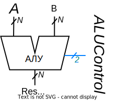

# Лабораторная работа №2. Арифметико-логическое устройство

Так как основной задачей процессора является обработка цифровых данных, одним из его основных блоков является арифметико-логическое устройство (АЛУ). Задача АЛУ производить над входными данным арифметические и поразрядно логические операции.

## Цель

Используя навыки по описанию мультиплексоров, описать блок арифметико-логического устройства (АЛУ) на языке SystemVerilog.

## Материалы для подготовки к лабораторной работе

В дополнение к [материалам](../../Basic%20Verilog%20structures/), изученным в ходе предыдущей лабораторной работы, вам рекомендуется ознакомиться с:

- способами описания [мультиплексора](../../Basic%20Verilog%20structures/Multiplexors.md) на языке SystemVerilog.

## Общий ход выполнения работы

1. Изучить устройство и принцип работы АЛУ (раздел [#теория](#теория))
2. Изучить языковые конструкции SystemVerilog для реализации АЛУ (раздел [#инструменты](#инструменты))
3. Внимательно ознакомиться с заданием (раздел [#задание](#задание))
4. Описать модуль АЛУ, проверить его предоставленным верификационным окружением.
5. Проверить работу АЛУ в ПЛИС.

## Теория

**Арифметико-логическое устройство** (**АЛУ**, Arithmetic Logic Unit – ALU) – это блок процессора, выполняющий арифметические и поразрядно логические операции. Разница между арифметическими и логическими операциями в отсутствии у последних бита переноса, так как логические операции происходят между 1-битными числами и дают 1-битный результат, а в случае АЛУ (в рамках данной лабораторной работы) одновременно между 32-мя 1-битными парами чисел. В логических операциях результаты значений отдельных битов друг с другом никак не связаны.

Также, кроме результата операций, АЛУ формирует флаги, которые показывают выполняется ли заданное условие. Например, выведет `1`, если один операнд меньше другого.

Обычно АЛУ представляет собой комбинационную схему (то есть не имеет элементов памяти), на входы которой поступают информационные (операнды) и управляющие (код операции) сигналы, в ответ на что на выходе появляется результат заданной операции. АЛУ бывает не комбинационной схемой, но это скорее исключение.



_Рисунок 1. Структурное обозначение элемента АЛУ[[1, стр. 305]](https://reader.lanbook.com/book/97336?lms=57991a6f83ced8530d7f0759ce4b95b7)._

На рис. 1 изображен пример АЛУ, используемый в книге "Цифровая схемотехника и архитектура компьютера" Харрис и Харрис. На входы `A` и `B` поступают операнды с разрядностью _N_. На 3-битный вход `F` подается код операции. Например, если туда подать `000`, то на выходе `Y` появится результат операции _логическое И_ между битами операндов `A` и `B`. Если на `F` подать `010`, то на выходе появится результат сложения. Это лишь пример, разрядность и коды могут отличаться в зависимости от количества выполняемых операций и архитектуры.

Существует несколько подходов к реализации АЛУ, отличающиеся внутренней организацией. В лабораторных работах применяется повсеместно используемый подход мультиплексирования операций, то есть подключения нескольких операционных устройств (которые выполняют какие-то операции, например сложения, логического ИЛИ и т.п.) к мультиплексору, который будет передавать результат нужного операционного устройства на выходы АЛУ.

Рассмотрим данный подход на примере все того же АЛУ MIPS из книги Харрисов. На рис. 2, в левой его части, изображена внутренняя организация этого АЛУ, справа – таблица соответствия кодов операциям. На выходе схемы (внизу) стоит 4-входовой мультиплексор, управляемый двумя из трех битов `F`. К его входам подключены _N_ логических И (побитовое И _N_-битных операндов), _N_ логических ИЛИ, _N_-битный сумматор и Zero Extend – устройство, дополняющее слева нулями 1-битное число до N-битного.


_Рисунок 2. Структурная схема АЛУ MIPS[[1, стр. 305]](https://reader.lanbook.com/book/97336?lms=57991a6f83ced8530d7f0759ce4b95b7)._

К одному из входов этих операционных устройств подключен без изменений вход `A`, а ко второму подключен выход двухвходового мультиплексора, управляемого оставшимся битом _F_. То есть `F[2]` определяет, что будет вторым операндом: `B` или `~B`. Вдобавок `F[2]` подается на входной перенос сумматора, то есть, когда `F[2] == 1` на выходе сумматора появляется результат операции `A + ~B + 1`, что (с учетом [дополнительного кода](https://ru.wikipedia.org/wiki/Дополнительный_код)) эквивалентно `A – B`.

Посмотрим, что произойдет, если на вход `F` такого АЛУ подать `111`. Будет выполняться операция `SLT`(сокращение от `Set Less Then`) – выдать `1`, если `A` меньше `B`, в противном случае — выдать `0`. Биты `F[1:0]` переключат мультиплексор на выход блока Zero Extend. На вход Zero Extend поступает старший бит выхода сумматора, этот бит отвечает за знак результата. Так как `F[2] == 1`, сумматор вычисляет `A + ~B + 1`, то есть `A – B`. Если `A < B`, то результат вычитания будет отрицательный, а старший бит `Y[N-1] == 1`. Если `A` не меньше `B`, то разность будет неотрицательна, а `Y[N-1] == 0`, как и требуется от этой операции.

Сравнение двух чисел несколько сложнее чем просто проверка старшего бита разности и зависит от того, сравниваем ли мы знаковые числа или беззнаковые. Если знаковые — то произошло ли переполнение. Для простоты схемы, принято, что схема реализует операцию SLT для знаковых пар чисел, разность которых не вызывает переполнения [[2, 307]](https://reader.lanbook.com/book/241166?lms=1b8d65a957786d4b32b8201bd30e97f3).


_Рисунок 3. Пример исполнения операции АЛУ._

Преимущество такой организации АЛУ в его простой модификации, настройке под нужные коды операций, читаемости кода и масштабируемости. Можно легко добавить или убрать требуемые операции. Подумайте, как бы вы обновили данную схему, если бы от вас потребовалось расширить её функционал операциями XOR (Исключающее ИЛИ) и (SGE операция "больше либо равно")?

## Инструменты

Как было сказано выше, АЛУ можно реализовать, [мультиплексируя](../../Basic%20Verilog%20structures/Multiplexors.md) результаты нескольких операционных устройств.

При описании очередной комбинации управляющего сигнала, выходу мультиплексора можно сразу присваивать необходимое логическое выражение (например результат побитового ИЛИ можно подать на выход сразу в виде выражения: `a | b`, однако в некоторых случаях выражения будут сложнее из-за различных особенностей реализации, о которых будет рассказано в задании).

### Параметры

Очень удобным на практике оказывается использование параметров. Параметры добавляют модулю гибкости, позволяя убрать ["магические"](https://ru.wikipedia.org/wiki/Магическое_число_(программирование)#Плохая_практика_программирования) константы из описания модулей, подставляя вместо них выразительное символьное имя. Параметры отдаленно схожи с макросами `#define` в языке Си, однако стоит понимать, что это не одно и то же. Дефайны представляют собой специальные текстовые макросы, которые автоматически заменяются на этапе препроцессора (как если бы вы прошлись по всем файлам своего кода и вручную заменили бы макросы на их значения). Например, с помощью дефайнов можно писать целые куски кода, а не просто одно какое-то число. При этом у дефайнов глобальная область видимости (объявив их в одном месте, этот макрос будет доступен во всем последующем коде). Параметр в свою очередь может хранить только значение какого-то конкретного типа (т.е. в параметр нельзя поместить фрагмент кода) а область видимости параметра ограничена тем модулем, где он был объявлен.

Допустим, ваше устройство должно включить тостер, если на вход ему придет сигнал `32'haf3c5bd0`. Человек, не знакомый с устройством, при прочтении этого кода будет недоумевать, что это за число и почему используется именно оно. Однако, скрыв его за параметром `TOASTER_EN`, читающий поймет, что это код включения тостера. Кроме того, если некоторая константа должна использоваться в нескольких местах кода, то определив её через в виде параметра, можно будет менять её в одном месте, и она тут же поменяется везде.

Параметры позволяют влиять на структуру модуля. К примеру, описывая сумматор, можно параметризовать его разрядность и использовать этот параметр при описании модуля (например, в качестве диапазона массива модулей). В этом случае вы сможете создавать множество сумматоров различных разрядностей, подставляя при создании нужное вам значение параметра.

Параметр может быть объявлен в модуле двумя способами:

- в прототипе модуля;
- в теле описания модуля.

В первом случае для указания параметра после имени модуля ставится символ `#`, за которым в круглых скобках пишется ключевое слово `parameter` затем указывается тип параметра (по умолчанию знаковое 32-битное число), после чего указывается имя и (опционально) значение по умолчанию.

Пример:

```Verilog
module overflow #(parameter WIDTH = 32)(
  input  logic [WIDTH-1 : 0]  a, b,
  output logic                overflow
);

logic [WIDTH : 0] sum;

assign sum = a + b;
assign overflow = sum[WIDTH];

endmodule
```

_Листинг 1. Пример описания параметра в прототипе модуля._

В случае, если параметр не влияет на разрядность портов, его можно объявить в теле модуля:

```Verilog
module toaster(
  input  logic [31:0] command,
  output logic        power
)

parameter TOASTER_EN = 32'haf3c5bd0;
assign power = command == TOASTER_EN;

endmodule
```

_Листинг 2. Пример описания параметра в теле модуля._

В случае АЛУ будет удобно использовать параметры для обозначения кодов команд. Во-первых, для того чтобы в `case` не допустить ошибок, а во-вторых – чтобы можно было легко менять управляющие коды для повторного использования АЛУ в других проектах.

Сравните сами _листинги 3 и 4_:

```Verilog
//parameter SLT = 5'b00011;
//parameter BEQ = 5'b11000;

//...

always_comb
  case(ALUOp)
  //...
  5'b00011: //...   // вообще же ничего не понятно
  5'b11000: //...   // никуда не годится
```

_Листинг 3. Пример описания модуля, использующего "магические" числа._

```Verilog
parameter SLT = 5'b00011;
parameter BEQ = 5'b11000;

//...

always_comb
  case(ALUOp)
  //...
  SLT: //...   // очень понятно
  BEQ: //...   // так лаконично и красиво
```

_Листинг 4. Пример описания модуля, использующего параметры._

С параметрами смотрится гораздо взрослее, серьёзнее и понятнее. Кстати, сразу на заметку: в SystemVerilog можно объединять группу параметров в **пакет** (package), а затем импортировать его внутрь модуля, позволяя переиспользовать параметры без повторного их прописывания для других модулей.

Делается это следующим образом.

Сперва создается SystemVerilog-файл, который будет содержать пакет (к примеру, содержимое файла может быть таким):

```Verilog
package riscv_params_pkg;
  parameter ISA_WIDTH   = 32;
  parameter ANOTHER_EX  = 15;
endpackage
```

Далее, внутри модуля, которому нужны параметры из этого пакета, необходимо сделать соответствующий импорт этих параметров. Это можно сделать либо для каждого параметра отдельно, либо импортировать все параметры сразу:

```Verilog
module riscv_processor
//import riscv_params_pkg::*;
import riscv_params_pkg::ISA_WIDTH;   // Если необходимо импортировать
(
  //...Порты
);

import riscv_params_pkg::ANOTHER_EX;  // все параметры в пакете, эти две строчки
                                      // могут быть заменены закомментированной
                                      // выше строкой:

endmodule
```

---

При реализации АЛУ, вам также потребуется использовать [операции сдвига](https://ru.wikipedia.org/wiki/Битовый_сдвиг), к которым относятся:

- `<<` —  логический сдвиг влево
- `>>` —  логический сдвиг вправо
- `>>>` —  арифметический сдвиг вправо

<br><br><br><br><br>

---

### Особенности реализации сдвига

**Для ВСЕХ операций сдвига вы должны брать только 5 младших бит операнда B.**

Сами посмотрите: пятью битами можно описать 32 комбинации [0-31], а у операнда А будет использоваться ровно 32 бита. **Это обязательное требование**, поскольку старшие биты в дальнейшем будут использоваться по другому назначению и, если вы упустите это, ваш будущий процессор станет работать неправильно.

---

<br><br><br><br><br>

## Задание

Необходимо на языке SystemVerilog реализовать АЛУ в соответствии со следующим прототипом:

```Verilog

module alu (
  input  logic [31:0]  a_i,
  input  logic [31:0]  b_i,
  input  logic [4:0]   alu_op_i,
  output logic         flag_o,
  output logic [31:0]  result_o
);

import alu_opcodes_pkg::*;      // импорт параметров, содержащих
                                // коды операций для АЛУ

endmodule
```

Для стандартного набора целочисленных операций архитектуры RISC-V требуется выполнять 16 различных операций. Для кодирования 16 операций было бы достаточно 4 бит, но в лабораторной работе предлагается использовать 5-битный код, что связано с особенностями кодирования инструкций. Старший бит кода операции указывает на то, является ли операция вычислительной или это операция сравнения.

Для удобства чтения, список инструкций разбит на две таблицы.

В первой таблице перечислены операции, вычисляющие значение сигнала `result_o`. **При любом коде операции `alu_op_i` не входящим в эту таблицу, сигнал `result_o` должен быть равен нулю**.

|alu_op_i|={cmp, add/sub, alu_op_i}|result_o                                   |Операция                                               |
|--------|-------------------------|-------------------------------------------|-------------------------------------------------------|
|  ADD   |         0 0 000         |result_o = a_i +   b_i                     | Сложение                                              |
|  SUB   |         0 1 000         |result_o = a_i –   b_i                     | Вычитание                                             |
|  SLL   |         0 0 001         |result_o = a_i <<  b_i                     | Сдвиг влево                                           |
|  SLTS  |         0 0 010         |result_o = a_i <   b_i (знаковое сравнение)| Знаковое сравнение                                    |
|  SLTU  |         0 0 011         |result_o = a_i <   b_i                     | Беззнаковое сравнение                                 |
|  XOR   |         0 0 100         |result_o = a_i ^   b_i                     | Побитовое исключающее **ИЛИ**                         |
|  SRL   |         0 0 101         |result_o = a_i >>  b_i                     | Сдвиг вправо                                          |
|  SRA   |         0 1 101         |result_o = a_i >>> b_i                     | Арифметический сдвиг вправо (операнд `a_i` — знаковый)|
|  OR    |         0 0 110         |result_o = a_i \|  b_i                     | Побитовое логическое **ИЛИ**                          |
|  AND   |         0 0 111         |result_o = a_i &   b_i                     | Побитовое логическое **И**                            |

_Таблица 1. Список вычислительных операций._

Во второй таблице перечислены операции, вычисляющие значение сигнала `flag_o`. **При любом коде операции `alu_op_i` не входящим в эту таблицу, сигнал `flag_o` должен быть равен нулю**.

|alu_op_i|={cmp, add/sub, alu_op_i}| flag_o                                   | Операция                          |
|--------|-------------------------|------------------------------------------|-----------------------------------|
|  EQ    |          1 1 000        | flag_o = (a_i == b_i)                    | Выставить флаг, если **равны**    |
|  NE    |          1 1 001        | flag_o = (a_i != b_i)                    | Выставить флаг, если **не равны** |
|  LTS   |          1 1 100        | flag_o =  a_i <  b_i (знаковое сравнение)| Знаковое сравнение **<**          |
|  GES   |          1 1 101        | flag_o =  a_i ≥  b_i (знаковое сравнение)| Знаковое сравнение **≥**          |
|  LTU   |          1 1 110        | flag_o =  a_i <  b_i                     | Беззнаковое сравнение **<**       |
|  GEU   |          1 1 111        | flag_o =  a_i ≥  b_i                     | Беззнаковое сравнение **≥**       |

_Таблица 2. Список операций сравнения._

**Выражения в этих двух таблицах приведены для примера. Не все из них можно просто переписать — часть этих выражений надо дополнить. Чтобы вы не копировали выражения, в них вставлены неподдерживаемые символы.**

Несмотря на разделение на вычислительные операции, и операции сравнения, в _Таблице 1_ (вычислительных операция) оказалось две операции `SLTS` и `SLTU`, которые выполняют сравнения. В итоге у нас есть две похожие пары инструкций:

- `LTS`
- `LTU`
- `SLTS`
- `SLTU`

Первая пара инструкций вычисляет "ветвительный" результат. Результат операции будет подан на выходной сигнал `flag_o` и использован непосредственно при ветвлении.

Вторые две инструкции используются для получения "вычислительного" результата. Т.е. результат сравнения будет подан на выходной сигнал `result_o` так же, как подается результат операции `ADD`, и будет использован в неких вычислениях, избегая при этом условного перехода.

К примеру, нам необходимо пройтись по массиву из миллиона элементов и убедиться, что все они были неотрицательны. Об этом будет сигнализировать переменная `num_of_err`, значение которой должно быть равно числу элементов массива, меньших нуля. Вычислить значение этой переменной можно двумя способами:

1. В каждой итерации цикла сделать ветвление: в одном случае инкрементировать переменную, в другом случае — нет (для ветвления использовать "ветвительную" операцию `LTS`).
2. В каждой итерации цикла складывать текущее значение переменной с результатом "вычислительной" операции `SLTS`.

Операции ветвления очень сильно влияют (в худшую сторону) на производительность конвейерного процессора. В первом случае мы получим миллион операций ветвления, во втором — ни одной! Разумеется, потом переменную `num_of_err` скорее всего сравнят с нулем что приведет к ветвлению, но при вычислении значения этой переменной ветвления можно будет избежать.

Различие между `SLTS` и `SLTU` (или `LTS` и `LTU`) заключается в том, как мы интерпретируем операнды: как знаковые числа (операции `STLS` и `LTS`) или как беззнаковые (операции `SLTU` и `LTU`).

Предположим, мы сравниваем два двоичных числа: `1011` и `0100`. Если интерпретировать эти числа как беззнаковые, то это `11` и `4`, результат: `11 > 4`. Однако если интерпретировать эти числа как знаковые, то теперь это числа `-5` и `4` и в этом случае `-5 < 4`.

Как мы видим, результат одной и той же операции над одними и теми же двоичными числами может зависеть от того, каким образом мы интерпретируем эти двоичные числа. Для большинства операций в АЛУ это не важно: например, сложение будет работать одинаково в обоих случаях, благодаря свойствам дополнительного кода, а побитовые операции работают с отдельными битами двоичного числа. А вот для операции арифметического сдвига это важно — **операнд А в арифметическом сдвиге должен интерпретироваться как знаковый**.

По умолчанию SystemVerilog интерпретирует все сигналы как беззнаковые, если мы хотим изменить это поведение, необходимо воспользоваться конструкцией `$signed`.

Конструкция `$signed` говорит САПР интерпретировать число, переданное в качестве операнда, как знаковое.

```Verilog
assign Result = $signed(A) >>> B[4:0];
```

В этом примере некоторому сигналу `Result` присваивают результат сдвига знакового числа `A` на значение количества бит получаемых из младших 5 бит сигнала `B`.

Так как используются не все возможные комбинации управляющего сигнала АЛУ, то **при описании через `case` не забывайте использовать `default`**. Если описать АЛУ как задумано, то получится что-то похожее на _рис. 4_. Но не обязательно, зависит от вашего описания.


_Рисунок 4. Пример схемы, реализующей АЛУ._

### Порядок выполнения задания

1. Добавьте в `Design Sources` проекта файл [`alu_opcodes_pkg.sv`](alu_opcodes_pkg.sv). Этот файл содержит объявление пакета `alu_opcodes_pkg`, в котором прописаны все опкоды АЛУ.
2. Опишите модуль `alu` с таким же именем и портами, как указано в [задании](#задание).
   1. Поскольку у вас два выходных сигнала, зависящих от сигнала `alu_op_i`, вам потребуется описать два разных [мультиплексора](../../Basic%20Verilog%20structures/Multiplexors.md) (их лучше всего описывать через два отдельных блока `case`). При описании, используйте `default` на оставшиеся комбинации сигнала `alu_op_i`.
   2. Следите за разрядностью ваших сигналов.
   3. Для реализации АЛУ, руководствуйтесь таблицей с операциями, а не схемой в конце задания, которая приведена в качестве референса. Обратите внимание, в одной половине операций `flag_o` должен быть равен нулю, в другой `result_o` (т.е. всегда либо один, либо другой сигнал должен быть равен нулю). Именно поэтому удобней всего будет описывать АЛУ в двух разных блоках `case`.
   4. Вам не нужно переписывать опкоды из таблицы в качестве вариантов для блока `case`. Вместо этого используйте символьные имена с помощью параметров, импортированных из пакета `alu_opcodes_pkg`.
   5. При операции сложения вы **должны** использовать ваш 32-битный сумматор из первой лабораторной (описывая вычитание сумматор использовать не надо, можно использовать `-`).
      1. При подключении сумматора, на входной бит переноса необходимо подать значение `1'b0`. Если не подать значение на входной бит переноса, результат суммы будет не определен (т.к. не определено одно из слагаемых).
      2. Выходной бит переноса при подключении сумматора можно не указывать, т.к. он использоваться не будет.
   6. При реализации операций сдвига, руководствуйтесь [особенностями реализации сдвигов](#особенности-реализации-сдвига).
3. Проверьте модуль с помощью верификационного окружения, представленного в файле [`lab_02.tb_alu.sv`](lab_02.tb_alu.sv). В случае, если в TCL-консоли появились сообщения об ошибках, вам необходимо [найти](../../Vivado%20Basics/Debug%20manual.md) и исправить их.
   1. Перед запуском моделирования, убедитесь, что у вас выбран корректный модуль верхнего уровня в `Simulation Sources`.
4. Проверьте работоспособность вашей цифровой схемы в ПЛИС.

## Список использованной литературы

1. [Д.М. Харрис, С.Л. Харрис / Цифровая схемотехника и архитектура компьютера / пер. с англ. Imagination Technologies / М.: ДМК Пресс, 2018](https://e.lanbook.com/book/97336).
2. [Д.М. Харрис, С.Л. Харрис / Цифровая схемотехника и архитектура компьютера: RISC-V / пер. с англ. В. С. Яценков, А. Ю. Романов; под. ред. А. Ю. Романова  / М.: ДМК Пресс, 2021](https://e.lanbook.com/book/241166).
