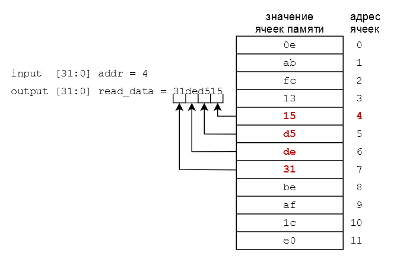

# Лабораторная работа 3 "Регистровый файл и внешняя память"

Процессор — это программно-управляемое устройство выполняющее обработку информации и управление этим процессом. Очевидно, программа, которая управляет процессором, должна где-то храниться. Данные, с которыми процессор работает, тоже должны быть в доступном месте. Нужна память!

## Цель

Описать на языке SystemVerilog элементы памяти для будущего процессора:

- память команд (Instruction Memory);
- память данных (Data Memory);
- регистровый файл (Register File).

## Допуск к лабораторной работе

Для успешного выполнения лабораторной работы, вам необходимо освоить:

- приведенные способы описания [мультиплексоров](../../Basic%20Verilog%20structures/Multiplexors.md)
- способы описания [регистров](../../Basic%20Verilog%20structures/Registers.md)
- [конкатенацию](../../Basic%20Verilog%20structures/Concatenation.md).

## Ход работы

1. Изучить способы организации памяти (раздел [#теория про память](#теория-про-память)).
2. Изучить конструкции SystemVerilog для реализации запоминающих элементов (раздел [#инструменты](#инструменты-для-реализации-памяти)).
3. В проекте с прошлой лабораторной реализовать модули: Instruction Memory, Data Memory и Register File ([#задание](#задание-по-реализации-памяти)).
4. Проверить с помощью тестового окружения корректность их работы.
5. Проверить работу регистрового файла в ПЛИС.

## Теория про память

Память — это устройство для упорядоченного хранения и выдачи информации. Различные запоминающие устройства отличаются способом и организацией хранения данных. Базовыми характеристиками памяти являются:

- V — объем (количество бит данных, которые единовременно может хранить память);
- a — разрядность адреса (ширина шины адреса, определяет адресное пространство — количество адресов отдельных ячеек памяти);
- d — разрядность хранимых данных (разрядность ячейки памяти, как правило совпадает с разрядностью входных/выходных данных).

В общем случае `V = 2^a * d`.

Для объема памяти в 1 KiB ([кибибайт](https://ru.wikipedia.org/wiki/%D0%9A%D0%B8%D0%B1%D0%B8%D0%B1%D0%B0%D0%B9%D1%82), 1024 байта или 8192 бита) разрядность адреса может быть, например, 10 бит (что покрывает 2^10 = 1024 адреса), тогда разрядность хранимых данных должна быть 8 бит. 1024 * 8 = 8192, то есть 1 кибибайт. Если разрядность адреса, например, 8 бит (что покрывает 2^8 = 256 адресов), то разрядность данных `d = V / 2^a` это 8192 / 256 = 32 бита.

Однако, может быть такое, что не все ячейки памяти реально реализованы на кристалле микросхемы, то есть некоторые адреса существуют, но по ним не имеет смысла обращаться, а объем памяти, соответственно, не равен `V ≠ 2^a * d` — он меньше. Подобные случаи будут рассмотрены отдельно.

Память можно разделить на категории: ПЗУ (постоянное запоминающее устройство) и ОЗУ (оперативное запоминающее устройство). Из ПЗУ можно только считывать информацию, которая попадает в ПЗУ до начала использования памяти и не может изменяться в процессе работы. Из ОЗУ можно считывать и записывать информацию. В самом простом случае ПЗУ имеет один вход адреса `addr` и один выход считываемых данных `read_data`. На вход `addr` подается адрес требуемой ячейки памяти, на выходе `read_data` появляются данные, которые хранятся по этому адресу.

Для ОЗУ требуется больше сигналов. Кроме входного `addr` и выходного `read_data` добавляются: входные данные для записи `write_data`, сигнал синхронизации `clk`, который определяет момент записи данных и сигнал разрешения на запись `write_enable`, который контролирует нужно ли записывать данные или только считывать. Для того, чтобы записать информацию в такую память необходимо:

- выставить адрес `addr` в который планируется запись данных,
- выставить сами данные для записи на вход `write_data`,
- установить сигнал `write_enable` в состояние разрешения записи (как правило это 1) и
- дождаться нужного фронта `clk` — в этот момент данные будут записаны по указанному адресу. При этом, на выходе `read_data` будут старые данные, хранящиеся по адресу `addr`. На одном такте происходит одновременное считывание информации и запись новой.

Так же возможна реализация, в которой вход `read_data` и выход `write_data` объединены в единый вход/выход `data`. В этом случае операции чтения и записи разделены во времени и используют для этого один единый порт ввода-вывода (`inout`, двунаправленный порт) `data`.


*Рисунок 1. Примеры блоков ПЗУ и ОЗУ*

Кроме того, различают память с **синхронным** и **асинхронным** чтением. В первом случае, перед выходным сигналом шины данных ставится дополнительный регистр, в который по тактовому синхроимпульсу записываются запрашиваемые данные. Такой способ может очень сильно сократить **критический путь** цифровой схемы, но требует дополнительный такт на доступ в память. В свою очередь, асинхронное чтение позволяет получить данные не дожидаясь очередного синхроимпульса, но такой способ увеличивает критический путь.

Еще одной характеристикой памяти является количество доступных портов. Количество портов определяет к скольким ячейкам памяти можно обратиться одновременно. Проще говоря, сколько входов адреса существует. Все примеры памяти рассмотренные выше являются **однопортовыми**, то есть у них один порт. Например, если у памяти 2 входа адреса `addr1` и `addr2` — это **двухпортовая память**. При этом не важно, можно ли по этим адресам только читать/писать или выполнять обе операции.

Регистровый файл, который будет реализован в рамках данной работы, является **трехпортовым**, и имеет 2 порта на чтение и 1 порт на запись.

С точки зрения аппаратной реализации память в ПЛИС может быть **блочной**, **распределенной** или **регистровой**. **Блочная память** — это аппаратный блок памяти, который можно сконфигурировать под свои нужды. **Распределенная** и **регистровая** память (в отличие от блочной) реализуется на **конфигурируемых логических блоках** (см. [как работает ПЛИС](../../Introduction/How%20FPGA%20works.md)). Такая память привязана к расположению конфигурируемых логических блоков ПЛИС и как бы равномерно распределена по всему кристаллу. Вместо реализации логики конфигурируемые логические блоки используются для нужд памяти. Чтобы понять почему это возможно, рассмотрим структуру логического блока:


*Рисунок 2. Структурная схема логического блока в ПЛИС*

В логическом блоке есть **таблицы подстановки**(Look Up Table, LUT), которые представляют собой не что иное как память, которая переконфигурируется под нужды хранения, а не реализацию логики. Таким образом, трехвходовой LUT может выступать в роли восьмиразрядной памяти.

Однако LUT будет сложно приспособить под многопортовую память: посмотрим на схему еще раз: три входа LUT формируют адрес одной из восьми ячеек. Это означает, что среди этих восьми ячеек нельзя обратиться к двум из них одновременно.

Для реализации многопортовой памяти небольшого размера лучше воспользоваться расположенным в логическом блоке D-триггере (**DFF** на *рис. 2*). Не смотря на то, что D-триггер позволяет воспроизвести только 1 разряд элемента памяти, он не ограничивает реализацию по портам.

Таким образом, плюс распределенной памяти относительно регистровой заключается в лучшей утилизации ресурсов: на восемь разрядов памяти у нас уйдет один трехвходовой LUT, в то время как для восьми разрядов регистровой памяти у нас уйдет 8 D-триггеров.

Минусом является ограниченность в реализации многопортовой памяти.

Сравним блочную память с распределенной/регистровой: поскольку большой объем памяти съест много логических блоков при реализации распределенной/регистровой памяти, такую память лучше делать в виде блочной.

В то же время, к плюсам распределенной/регистровой памяти можно отнести возможность синтезировать память с асинхронным портом на чтение, чем мы и воспользуемся при реализации однотактного процессора (если бы порт чтения памяти был синхронным, нам потребовалось ждать один такт, чтобы получить инструкцию из памяти инструкций или данные из регистрового файла, что затруднило бы реализацию однотактного процессора, где каждая инструкция должна выполняться ровно за один такт).

Обычно синтезатор сам понимает, какой вид памяти подходит под описанную схему на языке SystemVerilog.

В случае, если под описанную схему подходит несколько видов памяти, есть возможность выбрать конкретную вручную, причем способы могут различаться от производителя к производителю, поэтому за подробностями лучше обращаться к документации. Например у Xilinx за это отвечает [следующий раздел](https://docs.xilinx.com/r/en-US/ug901-vivado-synthesis/RAM-HDL-Coding-Techniques) документации по синтезу.

## Инструменты для реализации памяти

### Описание памяти на языке SystemVerilog

Память на языке SystemVerilog объявляется [подобно регистрам](../../Basic%20Verilog%20structures/Registers.md), используя ключевое слово `logic`. Но, кроме разрядности (разрядности ячеек памяти, в данном случае) после имени регистра (памяти, в данном случае) указывается количество создаваемых ячеек либо в виде натурального числа, либо в виде диапазона адресов этих ячеек.:

```SystemVerilog
logic [19:0] memory1 [16];    // memory1 и memory2 являются полностью
logic [19:0] memory2 [0:15];  // идентичными памятями.

logic [19:0] memory3 [15:0];  // memory3 будет такой же памятью, что и
                              // предыдущие, но на временной диаграмме
                              // Vivado при ее отображении сперва будут
                              // идти ячейки, начинающиеся со старших
                              // адресов (что в рамках данного курса
                              // лабораторных работ будет скорее минусом).


logic [19:0] memory3 [1:16];  // А вот memory3 хоть и совпадает по
                              // размеру с предыдущими реализациями,
                              // но отличается по адресному пространству
                              // обращение по нулевому адресу выдаст
                              // недетерминированный результат. Это не
                              // значит что память будет плохой или
                              // дефектной, просто надо учитывать эту её
                              // особенность.
```

В приведенном листинге `logic [19:0] memory1 [16];` создается память с шестнадцатью (от 0-го до 15-го адреса) 20-битными ячейками памяти. В таком случае говорят, что ширина памяти 20 бит, а глубина 16. Для адресации такой памяти потребуется адрес с разрядностью ceil(log2(16)) = 4 бита (`ceil` — операция округления вверх). Это однопортовая память.

Для обращения к конкретной ячейке памяти используются квадратные скобки с указанием нужного адреса `memory[addr]`. Грубо говоря, то, что указывается в квадратных скобках будет подключено ко входу адреса памяти `memory`.

Реализация асинхронного подключения к выходу памяти осуществляется оператором `assign`. А, если требуется создать память с синхронным чтением, то присваивание выходу требуется описать внутри блока`always_ff`.

Так как запись в память является синхронным событием, то описывается она в конструкции `always_ff`. При этом, как и при описании регистра, можно реализовать управляющий сигнал разрешения на запись через блок вида `if(write_enable)`.

```SystemVerilog
module mem16_20 (                     // создать блок с именем mem16_20
  input  logic         clk,           // вход синхронизации
  input  logic [3:0]   addr,          // адресный вход
  input  logic [19:0]  write_data,    // вход данных для записи
  input  logic         write_enable,  // сигнал разрешения на запись
  output logic [19:0]  async_read_data// асинхронный выход считанных данных
  output logic [19:0]  sync_read_data // синхронный выход считанных данных
);

  logic [19:0] memory [0:15];          // создать память с 16-ю
                                    // 20-битными ячейками

  // асинхронное чтение
  assign read_data = memory[addr];  // подключить к выходу async_read_data
                                    // ячейку памяти по адресу addr
                                    // (асинхронное чтение)

  // синхронное чтение
  always_ff @(posedge clk) begin     // поставить перед выходом sync_read_data
    sync_read_data <= memory[addr]; // регистр, в который каждый такт будут
  end                               // записываться считываемые данные

  // запись
  always_ff @(posedge clk) begin   // каждый раз по фронту clk
    if(write_enable) begin          // если сигнал write_enable == 1, то
      memory[addr] <= write_data;   // в ячейку по адресу addr будут записаны
                                    // данные сигнала write_data
    end
  end
endmodule
```

В случае реализации ПЗУ нет необходимости в описании входов для записи. В таком случае описание памяти занимает всего пару строк. Чтобы инициализировать такую память (то есть поместить в нее начальные значения, чтобы было что из нее читать), требуемое содержимое нужно добавить к прошивке, вместе с которой данные попадут в ПЛИС. Для этого в проект добавляется текстовый файл с содержимым памяти (более подробно об этом в [`Как добавить файл с содержимым памяти в проект`](../../Vivado%20Basics/How%20to%20add%20a%20mem-file.md)). Для того, чтобы отметить данный файл в качестве инициализирующего память, необходимо использовать одну из двух системных функций: `$readmemh` и `$readmemb`. `$readmemh` используется для файлов, описывающих содержимое памяти 16-ричными цифрами, в то время как `$readmemb` используется для файлов, описывающих содержимое памяти двоичными цифрами. Любую из этих системных функций необходимо поместить внутрь блока `initial`. У этих системных функций есть два обязательных аргумента:

- имя инициализирующего файла
- имя инициализируемой памяти

и два опциональных:

- стартовый адрес, начиная с которого память будет проинициализирована данным файлом (по-умолчанию равен нулю)
- конечный адрес, на котором инициализация закончится (даже если в файле были ещё какие-то данные).

Пример полного вызова одной из этих системных функций выглядит так:

`$readmemb("<data file name>",<memory name>,<start address>,<end address>);`

Однако на деле обычно используются только обязательные аргументы:

`$readmemb("<data file name>",<memory name>);`

Пример описанной выше памяти:

```SystemVerilog
module rom16_8 (
  input  logic [3:0]   addr1,       // первый 4-битный адресный вход
  input  logic [3:0]   addr2,       // второй 4-битный адресный вход
  output logic [7:0]   read_data1,  // первый 8-битный выход считанных данных
  output logic [7:0]   read_data2   // второй 8-битный выход считанных данных
);

  logic [7:0] ROM [0:15];           // создать память с 16-ю 8-битными ячейками

  initial begin
    $readmemh("mem.txt", ROM);      // поместить в память RAM содержимое
  end                               // файла mem.txt


  assign read_data1 = R0M[addr1];   // реализация первого порта на чтение
  assign read_data2 = R0M[addr2]    // реализация второго порта на чтение

endmodule
```

Содержимое файла `mem.txt`, к примеру может быть таким (каждая строка соответствует значению отдельной ячейки памяти, начиная со стартового адреса):

```hex
  FA
  E6
  0D
  15
  A7
```

## Задание по реализации памяти

Необходимо описать на языке SystemVerilog следующие три вида памяти:

### 1. Память инструкций

У данной памяти будет два порта:

- 32-битный вход адреса
- 32-битный выход данных (асинхронное чтение)

```SystemVerilog
mоdulе instr_mеm(
  inрut  logic [31:0] addr_i,
  оutрut logic [31:0] rеаd_dаtа_o
);

```

Из [теории про память](#теория-про-память) вы могли догадаться, что такой модуль описывает память ёмкостью `4 GiB`. Однако в реальности, наша память будет куда меньше (в ПЛИС попросту не хватит ресурсов на реализацию памяти подобного объёма). На практике, внутри данного модуля вы должны будете реализовать память с 1024-мя 32-битными ячейками.

При этом по спецификации процессор RISC-V использует память с побайтовой адресацией. Байтовая адресация означает, что процессор способен обращаться к отдельным байтам в памяти (за каждым байтом памяти закреплен свой индивидуальный адрес).

Однако, если у памяти будут 32-рязрядные ячейки, доступ к конкретному байту будет осложнен, ведь каждая ячейка — это 4 байта. Как получить данные третьего байта памяти? Если обратиться к третьей ячейке в массиве — придут данные 12-15-ых байт байт (поскольку каждая ячейка содержит по 4 байта). Чтобы получить данные третьего байта, необходимо разделить пришедший адрес на 4 (отбросив остаток от деления). `3 / 4 = 0` — и действительно, если обратиться к нулевой ячейке памяти — будут получены данные 3-го, 2-го, 1-го и 0-го байт. То что помимо значения третьего байта есть еще данные других байт нас в данный момент не интересует, важна только сама возможность указать адрес конкретного байта.

Деление на `2<sup>n</sup>` можно осуществить отбросив `n` младших бит числа. Таким образом на выход память инструкций должна выдавать данные, расположенные по адресу addr_i[31:2];

Обращение в память по адресам, превышающим `4095` должно выдавать значение `32'd0`. Почему именно `4095`? `4095 / 4 = 1023` — индекс последней ячейки памяти.

Как реализовать подобный функционал? Разумеется, с помощью [мультиплексора](../../Basic%20Verilog%20structures/Multiplexors.md).

В данном случае, вы можете либо воспользоваться конструкцией `if-else` в блоке `always_comb`, либо **тернарным условным оператором** во время реализации **непрерывного присваивания**. В любом из случаев, вам нужно будет реализовать условие того, что пришедшее значение на шине адреса попадает в диапазон допустимых адресов. Если это так, вернуть склейку данных из памяти, начинающихся с этого адреса, в противном случае — вернуть 0.

### 2. Память данных

У данной памяти будет 8 портов:

- вход тактового синхроимпульса
- вход запроса на работу с памятью
- вход сигнала разрешения записи
- 32-битный вход адреса
- 32-битный вход данных записи
- 32-битный выход данных синхронного чтения

```SystemVerilog
mоdulе data_mеm(
  inрut  logic        clk_i,
  input  logic        mem_req_i,
  inрut  logic        write_enable_i,
  inрut  logic [31:0] addr_i,
  inрut  logic [31:0] write_data_i,
  оutрut logic [31:0] rеаd_dаtа_o
);

```

Как и память инструкций, память данных будет состоять из 32-разрядных ячеек (только теперь их будет 4096), и при обращении к этим ячейкам будет необходимо делить адрес на 4.

Однако в отличие от памяти инструкций, в память данных добавлено два управляющих сигнала (`mem_req_i`и `write_enable_i`). Сигнал `mem_req_i` является сигналом запроса на работу с памятью. Без этого сигнала память не должна выполнять операции чтения/записи (вне зависимости от сигнала `write_enable`, определяющего происходит сейчас запись или чтение). Как сделать так, чтобы не происходило чтение без запроса? Например возвращать на шину чтения специальное "магическое число".

- В случае `mem_req_i == 0` или `write_enable_i == 1` (т.е. когда не выполняется операция чтения), на выходе `read_data_o` должно оказаться значение `32'hfa11_1eaf` (поскольку `1` схожа с латинским символом `l`, это выражение можно прочесть как `fall_leaf`).
- В случае, если `mem_req_i == 1` и значение `addr_i` **попадает** в диапазон `[0:16383]` (4096*4-1), на выходе `read_data_o` должно оказаться значение ячейки по адресу в 4 раза меньше пришедшего.
- В случае, если `mem_req_i == 1` и значение `addr_i` **не попадает** в диапазон `[0:16383]`, на выходе `read_data_o` должно оказаться магическое число `32'hdead_beef`.

Зачем нужны эти магические числа `32'hfa11_1eaf` и `32'hdead_beef`? У этих чисел легко узнаваемая сигнатура, позволяющая обратить на них внимание. В случае, если при чтении из памяти в регистровый файл попадут эти значения, увидев их вы сможете почувствовать что "что-то не то", и проверить: а было ли в памяти по указанному адресу действительно такое значение (в отличие от значения `32'h0000_0000`, которое не вызовет у вас никаких вопросов). Вероятность того, что такие числа возникнут в естественном ходе работы программы достаточно мала, а значит скорее всего если вы встретите эти числа — это сигнал того, что что-то в вашем процессоре работает неправильно (например, произошло обращение за пределы памяти, или неправильно формируется сигнал `mem_req_i`).

Если `mem_req_i == 1` и `write_enable_i == 1` происходит запрос на запись в память. В этом случае, необходимо по положительному фронту `clk_i` записать в значение `write_data_i` в ячейку по адресу в 4 раза меньшему `addr_i`. Во всех других случаях (любой из сигналов `mem_req_i`, `write_enable_i` равен нулю), запись в память не производится.

Поскольку мы описываем память с синхронным чтением, было бы неплохо, чтобы в результате мы получили блочную память (см. [теорию про память](#теория-про-память)). Однако блочная память — это заранее созданный аппаратный блок памяти, в котором нет места придуманным нами магическим числам, поэтому описывая порт на чтение, сперва лучше описать регистр, в который по запросу на работу с памятью всегда будет записываться значение из соответствующей ячейки. А уже после можно описать выход `rеаd_dаtа_o` перед которым будет стоять мультиплексор с тремя входами: константами `32'hfa11_1eaf`, `32'hdead_beaf` и значением с выхода описанного вами регистра:



### 3. Регистровый файл

У данного модуля будет 8 портов:

- вход тактового синхроимпульса
- вход сигнала разрешения записи
- 5-битный вход первого адреса чтения
- 5-битный вход второго адреса чтения
- 5-битный вход адреса записи
- 32-битный вход данных записи
- 32-битный выход данных асинхронного чтения по первому адресу
- 32-битный выход данных асинхронного чтения по второму адресу

```SystemVerilog
mоdulе rf_r𝚒sсv(
  inрut  logic        сlk_i,
  inрut  logic        write_enable_i,

  inрut  logic [ 4:0] write_addr_i,
  inрut  logic [ 4:0] read_addr1_i,
  inрut  logic [ 4:0] read_addr2_i,

  inрut  logic [31:0] write_data_i,
  оutрut logic [31:0] read_data1_o,
  оutрut logic [31:0] read_data2_o
);

```

На языке SystemVerilog необходимо реализовать модуль регистрового файла (`rf_r𝚒sсv`) для процессора с архитектурой RISC-V, представляющего собой трехпортовую ОЗУ с двумя портами на чтение и одним портом на запись и состоящей из 32-х 32-битных регистров с именем `rf_mem`.

При этом по адресу `0` должно всегда считываться значение `0` вне зависимости от того, какое значение в этой ячейке памяти, и есть ли она вообще. Такая особенность обусловлена тем, что при выполнении операций очень часто используется ноль (сравнение с нулем, инициализация переменных нулевым значением, копирование значения одного регистра в другой посредством сложения с нулем и записи результата и т.п.).

Как и в случае реализации [памяти инструкций](#1-память-инструкций), вы можете решить эту задачу с помощью мультиплексора, управляющим сигналом которого является сигнал сравнения адреса на чтение с нулем.

Либо же можно проинициализировать нулевую ячейку памяти нулем с запретом записи в неё каких-либо значений. В этом случае в ячейке всегда будет ноль, а значит и считываться с нулевого адреса будет только он.

## Порядок выполнения работы

1. Внимательно ознакомьтесь с заданием. В случае возникновения вопросов, проконсультируйтесь с преподавателем.
2. Реализуйте память инструкций. Для этого:
   1. В `Design Sources` проекта с предыдущих лаб, создайте `SystemVerilog`-файл `instr_mem.sv`.
   2. Опишите в нем модуль памяти инструкций с таким же именем и портами, как указано в задании.
      1. Сперва необходимо создать память (массив регистров). Как это сделать, сказано в разделе [описание памяти на языке SystemVerilog](#описание-памяти-на-языке-systemverilog). Разрядность ячеек памяти должна быть 32 бита, количество ячеек — 1024.
      2. Добавить в проект [`файл с содержимым памяти инструкций`](program.txt)([`как добавить файл, инициализирующий память`](../../Vivado%20Basics/How%20to%20add%20a%20mem-file.md)). Данный файл будет использоваться при вызове системной функции `$readmemh` в описании памяти инструкций.
      3. К созданной памяти необходимо подключить выход модуля `read_data_o`. При подключении должен быть использован вход модуля `addr_i`, значение которого должно быть уменьшено в 4 раза (побайтовая адресация).
      4. При подключении выхода `read_data_o` помните, что чтение по адресам, превышающим `4095` должно возвращать `0`.
   3. После описания памяти инструкций, её необходимо проверить с помощью тестового окружения.
      1. Тестовое окружение находится [`здесь`](tb_instr_mem.sv).
      2. Для запуска симуляции воспользуйтесь [`этой инструкцией`](../../Vivado%20Basics/Run%20Simulation.md).
      3. Перед запуском симуляции убедитесь, что в качестве top-level модуля выбран корректный (`tb_instr_mem`).
      4. **Во время симуляции, вы должны прожать "Run All" и убедиться, что в логе есть сообщение о завершении теста!**
3. Реализуйте память данных. Для этого:
   1. В `Design Sources` проекта создайте `SystemVerilog`-файл `data_mem.sv`.
   2. Опишите в нем модуль памяти данных с таким же именем и портами, как указано в задании.
      1. Описание модуля будет схожим с описанием модуля памяти инструкций, однако порт чтения в этот раз будет **синхронным** (запись в него будет происходить в блоке `always_ff`). Кроме того необходимо будет описать логику записи данных в память.
      2. Запись в ячейки памяти описывается подобно записи данных в [регистры](../../Basic%20Verilog%20structures/Registers.md), только при этом, происходит доступ к конкретной ячейке памяти с помощью входа `addr_i` (как осуществляется доступ к ячейкам памяти сказано в разделе [описание памяти на языке SystemVerilog](#описание-памяти-на-языке-systemverilog)).
      3. Необходимо помнить, что запись будет вестись в ячейку с индексом в 4 раза меньшим пришедшего адреса.
      4. Обратите внимание что работа с памятью должна осуществляться только когда сигнал `mem_req_i == 1`, в противном случае запись не должна производиться, а на шину `read_data_o` должно возвращаться магическое число `32'hfall_leaf`.
      5. Как и в памяти инструкций, при чтении по адресам вне допустимого диапазона (только в этот раз старше адреса `16383`), на шине `read_data_o` должно выставляться значение `32'hdead_beaf`.
   3. После описания памяти данных, её необходимо проверить с помощью тестового окружения.
      1. Тестовое окружение находится [`здесь`](tb_data_mem.sv).
      2. Для запуска симуляции воспользуйтесь [`этой инструкцией`](../../Vivado%20Basics/Run%20Simulation.md).
      3. Перед запуском симуляции убедитесь, что в качестве top-level модуля выбран корректный (`tb_data_mem`).
      4. **Во время симуляции, вы должны прожать "Run All" и убедиться, что в логе есть сообщение о завершении теста!**
4. Реализуйте регистровый файл. Для этого:
   1. В `Design Sources` проекта создайте `SystemVerilog`-файл `rf_riscv.sv`.
   2. Опишите в нем модуль регистрового файла с таким же именем и портами, как указано в задании.
      1. Обратите внимание, что имя памяти (не название модуля, а имя объекта памяти внутри модуля) должно быть `rf_mem`. Такое имя необходимо для корректной работы верификационного окружения.
      2. В отличии от памяти инструкций и данных, ячейки памяти регистрового файла должны быть 32-битными (а на 8-битными). Это означает, что реализация портов чтения и записи будет проще.
      3. Не забывайте, что у вас 2 порта на чтение и 1 порт на запись, при этом каждый порт не зависит от остальных (в модуле 3 независимых входа адреса).
      4. Чтение из нулевого регистра (чтение по адресу 0) всегда должно возвращать нулевое значение. Этого можно добиться двумя путями:
         1. Путем добавления мультиплексора перед выходным сигналом чтения (мультиплексор будет определять, пойдут ли на выход данные из ячейки регистрового файла, либо в случае если адрес равен нулю, на выход пойдет константа ноль).
         2. Путем инициализации нулевого регистра нулевым значением и запретом записи в этот регистр (при записи и проверки write_enable добавить дополнительную проверку на адрес).
         3. Каким образом будет реализована эта особенность регистрового файла не важно, выберите сами.
   3. После описания регистрового файла, его необходимо проверить с помощью [`тестового окружения`](../../Basic%20Verilog%20structures/Testbench.md).
      1. Тестовое окружение находится [`здесь`](tb_rf_riscv.sv).
      2. Для запуска симуляции воспользуйтесь [`этой инструкцией`](../../Vivado%20Basics/Run%20Simulation.md).
      3. Перед запуском симуляции убедитесь, что в качестве top-level модуля выбран корректный (`tb_rf_riscv`).
      4. **Во время симуляции, вы должны прожать "Run All" и убедиться, что в логе есть сообщение о завершении теста!**
5. Добавьте в проект модуль верхнего уровня ([nexys_rf_riscv.sv](board%20files/nexys_rf_riscv.v)), соединяющий регистровый файл с периферией в ПЛИС. Описание модуля находится [здесь](board%20files)
6. Подключите к проекту файл ограничений ([nexys_a7_100t.xdc](board%20files/nexys_a7_100t.xdc)), если тот еще не был подключен, либо замените его содержимое данными из файла к этой лабораторной работе.
7. Проверьте работу регистрового файла в ПЛИС.
