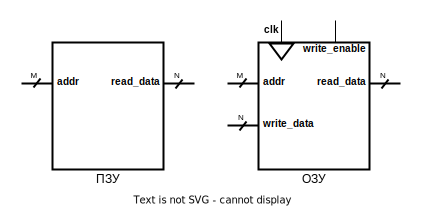

# Лабораторная работа №3 "Регистровый файл и память инструкций"

Процессор — это программно-управляемое устройство, выполняющее обработку информации и управление этим процессом. Очевидно, программа, которая управляет процессором, должна где-то храниться. Данные, с которыми процессор работает, тоже должны быть в доступном месте. Нужна память!

## Цель

Описать на языке SystemVerilog элементы памяти для будущего процессора:

- память инструкций;
- регистровый файл.

## Материалы для подготовки к лабораторной работе

В дополнение к [материалам](../../Basic%20Verilog%20structures/), изученным в ходе предыдущих работ, вам рекомендуется ознакомиться с:

- способами описания [регистров](../../Basic%20Verilog%20structures/Registers.md) на языке SystemVerilog.

## Ход работы

1. Изучить способы организации памяти (раздел [#теория про память](#Теория-про-память)).
2. Изучить конструкции SystemVerilog для реализации запоминающих элементов (раздел [#инструменты](#Инструменты-для-реализации-памяти)).
3. Реализовать модули памяти инструкции и регистрового файла.
4. Проверить с помощью верификационного окружения корректность их работы.
5. Проверить работу регистрового файла в ПЛИС.

## Теория про память

Память — это устройство для упорядоченного хранения и выдачи информации. Различные запоминающие устройства отличаются способом и организацией хранения данных. Базовыми характеристиками памяти являются:

- V — объём (количество бит данных, которые единовременно может хранить память);
- a — разрядность адреса (ширина шины адреса, определяет адресное пространство — количество адресов отдельных ячеек памяти);
- d — разрядность хранимых данных (разрядность ячейки памяти, как правило совпадает с разрядностью входных/выходных данных).

В общем случае `V = 2^a * d`.

Для объема памяти в 1&nbsp;KiB ([кибибайт](https://ru.wikipedia.org/wiki/%D0%9A%D0%B8%D0%B1%D0%B8%D0%B1%D0%B0%D0%B9%D1%82), 1024 байта или 8192 бита) разрядность адреса может быть, например, 10 бит (что покрывает 2<sup>10</sup> = 1024 адреса), тогда разрядность хранимых данных должна быть 8 бит. 1024 * 8 = 8192, то есть 1 кибибайт. Если разрядность адреса составляет 8 бит (что покрывает 2<sup>8</sup> = 256 адресов), то разрядность данных `d = V / 2^a` это 8192 / 256 = 32 бита.

Однако, может быть такое, что не все ячейки памяти реализованы на кристалле микросхемы, то есть некоторые адреса существуют, но по ним не имеет смысла обращаться, а объем памяти, соответственно, не равен `V ≠ 2^a * d` — он меньше.

Память можно разделить на две основные категории: ПЗУ (постоянное запоминающее устройство) и ОЗУ (оперативное запоминающее устройство). ПЗУ предназначено для хранения информации, которая записывается на этапе производства или в процессе программирования (ППЗУ) и используется преимущественно для чтения. В зависимости от типа, ПЗУ доступна или только операция чтения ([PROM](https://ru.wikipedia.org/wiki/PROM)), или также многократная запись (для [EPROM](https://ru.wikipedia.org/wiki/EPROM), [EEPROM](https://ru.wikipedia.org/wiki/EEPROM) и [Flash](https://ru.wikipedia.org/wiki/Флеш-память)). ОЗУ позволяет считывать и записывать информацию в процессе работы устройства, обеспечивая доступ к временным данным, необходимым для текущей работы системы.

Для ОЗУ требуется больше сигналов. Кроме входного `addr` и выходного `read_data` добавляются: входные данные для записи `write_data`, сигнал синхронизации `clk`, который определяет момент записи данных и сигнал разрешения на запись `write_enable`, который контролирует нужно ли записывать данные или только считывать. Для того, чтобы записать информацию в такую память необходимо:

- выставить адрес `addr`, в который планируется запись данных,
- выставить сами данные для записи на вход `write_data`,
- установить сигнал `write_enable` в состояние разрешения записи (как правило, это 1) и
- дождаться нужного (положительного, либо отрицательного) фронта `clk` — в этот момент данные будут записаны по указанному адресу.

Также возможна реализация, в которой вход `write_data` и выход `read_data` объединены в единый вход/выход `data`. В этом случае операции чтения и записи разделены во времени и используют для этого один единый порт ввода-вывода (`inout`, двунаправленный порт) `data`.



_Рисунок 1. Примеры блоков ПЗУ и ОЗУ._

Кроме того, различают память с **синхронным** и **асинхронным** чтением. В первом случае, перед выходным сигналом шины данных ставится дополнительный регистр, в который по тактовому синхроимпульсу записываются запрашиваемые данные. Такой способ может значительно сократить **критический путь** цифровой схемы, но требует дополнительный такт на доступ в память. В свою очередь, асинхронное чтение позволяет получить данные, не дожидаясь очередного синхроимпульса, но такой способ увеличивает критический путь.

Еще одной характеристикой памяти является количество доступных портов чтения или записи (не путайте с портами модуля, которые являются любыми его входными/выходными сигналами). Количество портов определяет, к скольким ячейкам памяти можно обратиться одновременно. Проще говоря, сколько входов адреса существует. Все примеры памяти рассмотренные выше являются **однопортовыми**, то есть у них один порт. Например, если у памяти 2 входа адреса `addr1` и `addr2` — это **двухпортовая память**. При этом не важно, можно ли по этим адресам только читать/писать или выполнять обе операции.

Регистровый файл, который будет реализован в рамках данной работы, является **трехпортовым**, и имеет 2 порта на чтение и 1 порт на запись.

С точки зрения аппаратной реализации память в ПЛИС может быть **блочной**, **распределенной** или **регистровой**. **Блочная память** — это заранее размещённый аппаратный блок памяти, который можно сконфигурировать под свои нужды. **Распределенная** и **регистровая** память (в отличие от блочной) реализуется на **конфигурируемых логических блоках** (см. [как работает ПЛИС](../../Introduction/How%20FPGA%20works.md)). Такая память привязана к расположению конфигурируемых логических блоков ПЛИС и как бы равномерно распределена по всему кристаллу. Вместо реализации логики конфигурируемые логические блоки используются для нужд памяти. Чтобы понять почему это возможно, рассмотрим структуру логического блока:


_Рисунок 2. Структурная схема логического блока в ПЛИС[[1]](https://en.wikipedia.org/wiki/Field-programmable_gate_array)._

В логическом блоке есть **таблицы подстановки** (Look Up Table, LUT), которые представляют собой не что иное как память, которую можно сконфигурировать под нужды хранения, а не реализацию логики. Таким образом, трехвходовой LUT может выступать в роли 8-битной памяти.

Однако LUT будет сложно приспособить под многопортовую память: посмотрим на схему еще раз: три входа LUT формируют адрес одной из восьми ячеек. Это означает, что среди этих восьми ячеек нельзя обратиться к двум из них одновременно.

Для реализации многопортовой памяти небольшого размера лучше воспользоваться расположенным в логическом блоке D-триггером (**DFF** на _рис. 2_). Несмотря на то, что D-триггер позволяет воспроизвести только 1 разряд элемента памяти, он не ограничивает реализацию по портам.

Таким образом, преимущество распределенной памяти относительно регистровой заключается в лучшей утилизации ресурсов: одним трёхвходовым LUT можно описать до 8 бит распределенной памяти, в то время как одним D-триггером можно описать только один бит регистровой памяти. Предположим, что в ПЛИС размещены логические блоки, структура которых изображена на _рис. 2_ и нам необходимо реализовать 1&nbsp;KiB памяти. Мы можем реализовать распределенную память, используя 512 логических блоков (в каждом блоке два трёхвходовых LUT), либо регистровую память, используя 8192 логических блока.

Недостатком является ограниченность в реализации многопортовой памяти.

Сравним блочную память с распределенной/регистровой: поскольку большой объем памяти "съест" много логических блоков при реализации распределенной/регистровой памяти, такую память лучше делать в виде блочной.

В то же время, к преимуществам распределенной/регистровой памяти относится возможность синтезировать память с асинхронным портом на чтение, чем мы и воспользуемся при реализации однотактного процессора (если бы порт чтения памяти был синхронным, нам потребовалось ждать один такт, чтобы получить инструкцию из памяти инструкций или данные из регистрового файла, что затруднило бы реализацию однотактного процессора, где каждая инструкция должна выполняться ровно за один такт).

Обычно синтезатор сам понимает, какой вид памяти подходит под описанную схему на языке SystemVerilog.

В случае если под описанную схему подходит несколько видов памяти, есть возможность выбрать конкретный вид вручную, причем способы могут различаться у разных производителей, поэтому за подробностями лучше обращаться к документации. Например у Xilinx за это отвечает [следующий раздел](https://docs.xilinx.com/r/en-US/ug901-vivado-synthesis/RAM-HDL-Coding-Techniques) документации по синтезу.

## Инструменты для реализации памяти

### Описание памяти на языке SystemVerilog

Память на языке SystemVerilog объявляется [подобно регистрам](../../Basic%20Verilog%20structures/Registers.md), используя ключевое слово `logic`. Но, кроме разрядности (разрядности ячеек памяти, в данном случае) после имени регистра (памяти, в данном случае) указывается количество создаваемых ячеек либо в виде натурального числа, либо в виде диапазона адресов этих ячеек:

```Verilog
logic [19:0] memory1 [16];    // memory1 и memory2 являются полностью
logic [19:0] memory2 [0:15];  // идентичными памятями.

logic [19:0] memory3 [15:0];  // memory3 будет такой же памятью, что и
                              // предыдущие, но на временной диаграмме
                              // Vivado при её отображении сперва будут
                              // идти ячейки, начинающиеся со старших
                              // адресов (что в рамках данного курса
                              // лабораторных работ будет скорее минусом).


logic [19:0] memory3 [1:16];  // А вот memory3 хоть и совпадает по
                              // размеру с предыдущими реализациями,
                              // но отличается по адресному пространству
                              // обращение по нулевому адресу выдаст
                              // недетерминированный результат. Это не
                              // значит, что память будет плохой или
                              // дефектной, просто надо учитывать эту её
                              // особенность.
```

_Листинг 1. Пример создания массива ячеек._

В первой строке _листинга 1_ создаётся память с шестнадцатью (от 0-го до 15-го адреса) 20-битными ячейками памяти. В таком случае говорят, что ширина памяти 20 бит, а глубина 16. Для адресации такой памяти потребуется адрес с разрядностью ceil(log2(16)) = 4 бита (`ceil` — операция округления вверх).

Для обращения к конкретной ячейке памяти используются квадратные скобки с указанием нужного адреса: `memory[addr]` (см. _листинг 2_). Грубо говоря, то, что указывается в квадратных скобках, будет подключено ко входу адреса памяти `memory`.

Как уже говорилось, чтение из памяти может быть сделано двумя способами: синхронно и асинхронно.

Синхронное чтение подразумевает ожидание следующего тактового синхроимпульса для выдачи данных после получения адреса. Иными словами, данные будут установлены на выходе не в тот же такт, когда был выставлен адрес на вход памяти данных, а на следующий. Несмотря на то, что в таком случае на каждой операции чтения "теряется" один такт, память с синхронным чтением имеет значительно меньший критический путь, чем положительно сказывается на временных характеристиках итоговой схемы.

Память с асинхронным чтением выдает данные в том же такте, что и получает адрес (т.е. во время операций чтения ведёт себя как комбинационная схема). Несмотря на то, что такой подход кажется быстрее, память с асинхронным чтением обладает длинным критическим путем, причем чем большего объема будет память, тем длиннее будет критический путь.

Реализация асинхронного подключения к выходу памяти осуществляется оператором `assign`. А, если требуется создать память с синхронным чтением, то присваивание выходу требуется описать внутри блока`always_ff`.

Так как запись в память является синхронным событием, то описывается она в конструкции `always_ff`. При этом, как и при описании регистра, можно реализовать управляющий сигнал разрешения на запись через блок вида `if(write_enable)`.

```Verilog
module mem16_20 (                     // создать блок с именем mem16_20
  input  logic        clk,            // вход синхронизации
  input  logic [3:0]  addr,           // адресный вход
  input  logic [19:0] write_data,     // вход данных для записи
  input  logic        write_enable,   // сигнал разрешения на запись
  output logic [19:0] async_read_data,// асинхронный выход считанных данных
  output logic [19:0] sync_read_data  // синхронный выход считанных данных
);

  logic [19:0] memory [0:15];         // создать память с 16-ю
                                      // 20-битными ячейками

  // асинхронное чтение
  assign async_read_data = memory[addr];  // подключить к выходу async_read_data
                                          // ячейку памяти по адресу addr
                                          // (асинхронное чтение)

  // синхронное чтение
  always_ff @(posedge clk) begin     // поставить перед выходом sync_read_data
    sync_read_data <= memory[addr];  // регистр, в который каждый такт будут
  end                                // записываться считываемые данные

  // запись
  always_ff @(posedge clk) begin    // каждый раз по фронту clk
    if(write_enable) begin          // если сигнал write_enable == 1, то
      memory[addr] <= write_data;   // в ячейку по адресу addr будут записаны
                                    // данные сигнала write_data
    end
  end
endmodule
```

_Листинг 2. Пример описания портов памяти._

В случае реализации ПЗУ нет необходимости в описании входов для записи, поэтому описание памяти занимает всего пару строк. Чтобы проинициализировать такую память (то есть поместить в неё начальные значения, которые можно было бы считать), требуемое содержимое нужно добавить к прошивке, вместе с которой данные попадут в ПЛИС. Для этого в проект добавляется текстовый файл формата `.mem` с содержимым памяти. Для того, чтобы отметить данный файл в качестве инициализирующего память, можно использовать системную функцию `$readmemh`.

У данной функции есть два обязательных аргумента:

- имя инициализирующего файла
- имя инициализируемой памяти

и два опциональных:

- стартовый адрес, начиная с которого память будет проинициализирована данным файлом (по умолчанию равен нулю)
- конечный адрес, на котором инициализация закончится (даже если в файле были ещё какие-то данные).

Пример полного вызова выглядит так:

```Verilog
$readmemh("<data file name>",<memory name>,<start address>,<end address>);
```

Однако на деле обычно используются только обязательные аргументы:

```Verilog
$readmemh("<data file name>",<memory name>);
```

Пример описанной выше памяти приводится в _листинге 3_.

```Verilog
module rom16_8 (
  input  logic [3:0]   addr1,       // первый 4-битный адресный вход
  input  logic [3:0]   addr2,       // второй 4-битный адресный вход
  output logic [7:0]   read_data1,  // первый 8-битный выход считанных данных
  output logic [7:0]   read_data2   // второй 8-битный выход считанных данных
);

  logic [7:0] ROM [0:15];           // создать память с 16-ю 8-битными ячейками

  initial begin
    $readmemh("rom_data.mem", ROM); // поместить в память ROM содержимое
  end                               // файла rom_data.mem


  assign read_data1 = ROM[addr1];   // реализация первого порта на чтение
  assign read_data2 = ROM[addr2];   // реализация второго порта на чтение

endmodule
```

_Листинг 3. Пример использования инициализирующей функции $readmemh._

Содержимое файла `rom_data.mem`, к примеру, может быть таким (каждая строка соответствует значению отдельной ячейки памяти, начиная со стартового адреса):

```hex
  FA
  E6
  0D
  15
  A7
```

> [!IMPORTANT]
> Для того, чтобы при сборке модуля не было проблем с путями, по которым будет искаться данный файл, обычно его необходимо добавить в проект. В случае Vivado, чтобы тот распознал этот файл как инициализирующий память, необходимо чтобы у этого файла было расширение `.mem`.

## Задание по реализации памяти

Необходимо описать на языке SystemVerilog два вида памяти:

1. память инструкций;
2. регистровый файл.

### 1. Память инструкций

У данного модуля будет один входной и один выходной сигнал:

- 32-битный вход адреса
- 32-битный выход данных (асинхронное чтение)

```Verilog
module instr_mem(
  input  logic [31:0] read_addr_i,
  output logic [31:0] read_data_o
);
```

Несмотря на разрядность адреса, на практике, внутри данного модуля вы должны будете реализовать память с 512-ю 32-битными ячейками (в ПЛИС попросту не хватит ресурсов для реализации памяти с 2<sup>32</sup> ячеек). Таким образом, реально будет использоваться только 9 бит адреса.

При этом по спецификации процессор RISC-V использует память с побайтовой адресацией [[2](https://github.com/riscv/riscv-isa-manual/releases/download/20240411/unpriv-isa-asciidoc.pdf), стр. 15]. Байтовая адресация означает, что процессор способен обращаться к отдельным байтам в памяти (за каждым байтом памяти закреплен свой индивидуальный адрес).

Однако, если у памяти будут 32-битные ячейки, доступ к конкретному байту будет осложнен, ведь каждая ячейка — это 4 байта. Как получить данные третьего байта памяти? Если обратиться к третьей ячейке в массиве — придут данные 12-15-ых байт (поскольку каждая ячейка содержит по 4 байта). Чтобы получить данные третьего байта, необходимо **разделить значение пришедшего адреса на 4** (отбросив остаток от деления). `3 / 4 = 0` — и действительно, если обратиться к нулевой ячейке памяти — будут получены данные 3-го, 2-го, 1-го и 0-го байт. То, что помимо значения третьего байта есть еще данные других байт нас в данный момент не интересует, важна только сама возможность указать адрес конкретного байта.


_Рисунок 3. Связь адреса байта и индекса слова в массиве ячеек памяти._

Деление на 2<sup>n</sup> можно осуществить, отбросив `n` младших бит числа. Учитывая то, что для адресации 512 ячеек памяти мы будем использовать 9 бит адреса, память инструкций должна выдавать на выход данные, расположенные по адресу `addr_i[10:2]`.

Несмотря на зафиксированный заданием размер памяти инструкций в 512 32-битных ячейки, на практике удобно параметризовать это значение, чтобы в ситуациях, когда требуется меньше или больше памяти можно было получить обновленный модуль, не переписывая код во множестве мест. Подобное новшество вы сможете оценить на практике, получив возможность существенно сокращать время синтеза процессора, уменьшая размер памяти до необходимого минимума путем изменения значения одного лишь параметра.

Для этого можно, например, создать параметр: `INSTR_MEM_SIZE_BYTES`, показывающий размер памяти инструкций в байтах. Однако, поскольку у данной памяти 32-битные ячейки, нам было бы удобно иметь и параметр `INSTR_MEM_SIZE_WORDS`, который говорит сколько в памяти 32-битных ячеек.
При этом `INSTR_MEM_SIZE_WORDS = INSTR_MEM_SIZE_BYTES / 4` (т.е. в 32-битном слове 4 байта).

В случае подобной параметризации, необходимо иметь возможность подстраивать количество используемых бит адреса. Для 512 ячеек памяти мы использовали 9 бит адреса, для 1024 ячеек нам потребуется уже 10 бит. Нетрудно заметить, что нам нужно такое число бит данных, возведя в степень которого `2`, мы получим размер нашей памяти (либо число, превышающее этот размер в случае, если размер памяти не является степенью двойки). Иными словами, нам нужен логарифм по основанию 2 от размера памяти, с округлением до целого вверх. И неудивительно, что в SystemVerilog есть специальная функция, которая позволяет считать подобные числа. Эта функция называется `$clog2` (`с` означает "ceil" — операцию округления вверх).

Поскольку реализация памяти состоит буквально из нескольких строчек, но при этом использование параметров может вызвать некоторые затруднения, код памяти инструкций предоставляется в готовом виде:

```Verilog
module instr_mem
import memory_pkg::INSTR_MEM_SIZE_BYTES;
import memory_pkg::INSTR_MEM_SIZE_WORDS;
(
  input  logic [31:0] read_addr_i,
  output logic [31:0] read_data_o
);

  logic [31:0] ROM [INSTR_MEM_SIZE_WORDS];  // создать память с
                                            // <INSTR_MEM_SIZE_WORDS>
                                            // 32-битных ячеек

  initial begin
    $readmemh("program.mem", ROM);          // поместить в память ROM содержимое
  end                                       // файла program.mem

  // Реализация асинхронного порта на чтение, где на выход идёт ячейка памяти
  // инструкций, расположенная по адресу read_addr_i, в котором отброшены два
  // младших бита, а также биты, двоичный вес которых превышает размер памяти
  // данных в байтах.
  // Два младших бита отброшены, чтобы обеспечить выровненный доступ к памяти,
  // в то время как старшие биты отброшены, чтобы не дать обращаться в память
  // по адресам несуществующих ячеек (вместо этого будут выданы данные ячеек,
  // расположенных по младшим адресам).
  assign read_data_o = ROM[read_addr_i[$clog2(INSTR_MEM_SIZE_BYTES)-1:2]];

endmodule
```

_Листинг 4. SystemVerilog-описание памяти инструкций._

### 2. Регистровый файл

Необходимо описать на языке SystemVerilog модуль регистрового файла для процессора с архитектурой RISC-V, представляющего собой трехпортовое ОЗУ с двумя портами на чтение и одним портом на запись и состоящей из 32-х 32-битных регистров, объединенных в массив с именем `rf_mem`.

У данного модуля будет восемь входных/выходных сигналов:

- вход тактового синхроимпульса;
- вход сигнала разрешения записи;
- 5-битный вход первого адреса чтения;
- 5-битный вход второго адреса чтения;
- 5-битный вход адреса записи;
- 32-битный вход данных записи;
- 32-битный выход данных асинхронного чтения по первому адресу;
- 32-битный выход данных асинхронного чтения по второму адресу.

```Verilog
module register_file(
  input  logic        clk_i,
  input  logic        write_enable_i,

  input  logic [ 4:0] write_addr_i,
  input  logic [ 4:0] read_addr1_i,
  input  logic [ 4:0] read_addr2_i,

  input  logic [31:0] write_data_i,
  output logic [31:0] read_data1_o,
  output logic [31:0] read_data2_o
);

```

По адресу `0` должно всегда считываться значение `0` вне зависимости от того, какое значение в этой ячейке памяти, и есть ли она вообще. Такая особенность обусловлена тем, что при выполнении операций очень часто используется ноль (сравнение с нулём, инициализация переменных нулевым значением, копирование значения одного регистра в другой посредством сложения с нулём и записи результата и т.п.). Эту особенность регистрового файла можно реализовать несколькими способами:

- с помощью мультиплексора, управляющим сигналом которого является результат сравнения адреса на чтение с нулём;
- либо же можно проинициализировать нулевую ячейку памяти нулём с запретом записи в неё каких-либо значений. В этом случае в ячейке всегда будет ноль, а значит и считываться с нулевого адреса будет только он.

Инициализация ячейки памяти может быть осуществлена (только при проектировании под ПЛИС) с помощью присваивания в блоке `initial`.

## Порядок выполнения работы

1. Добавьте в проект файл [`memory_pkg.sv`](memory_pkg.sv). Этот файл содержит объявление пакета `memory_pkg`, в котором прописаны размеры памяти инструкций и памяти данных (реализуется позднее).
2. Реализуйте память инструкций посредством описания, представленного в _листинге 4_.
3. Опишите регистровый файл с таким же именем и портами, как указано в задании.
   1. Обратите внимание, что имя памяти (не название модуля, а имя массива регистров внутри модуля) должно быть `rf_mem`. Такое имя необходимо для корректной работы верификационного окружения.
   2. Как и у памяти инструкций, порты чтения регистрового файла должны быть **асинхронными**.
   3. Не забывайте, что у вас 2 порта на чтение и 1 порт на запись, при этом каждый порт не зависит от остальных (в модуле 3 независимых входа адреса).
   4. Чтение из нулевого регистра (чтение по адресу 0) всегда должно возвращать нулевое значение. Этого можно добиться двумя путями:
      1. Путем добавления мультиплексора перед выходным сигналом чтения (мультиплексор будет определять, пойдут ли на выход данные из ячейки регистрового файла, либо, в случае если адрес равен нулю, на выход пойдет константа ноль).
      2. Путем инициализации нулевого регистра нулевым значением и запретом записи в этот регистр (в логике порта на запись помимо проверки `write_enable` добавить дополнительную проверку на адрес).
      3. Каким образом будет реализована эта особенность регистрового файла не важно, выберите сами.
4. Проверьте модуль с помощью верификационного окружения, представленного в файле [`lab_03.tb_register_file.sv`](lab_03.tb_register_file.sv). В случае, если в TCL-консоли появились сообщения об ошибках, вам необходимо [найти](../../Vivado%20Basics/05.%20Bug%20hunting.md) и исправить их.
   1. Перед запуском моделирования убедитесь, что у вас выбран корректный модуль верхнего уровня в `Simulation Sources`.
5. Проверьте работоспособность вашей цифровой схемы в ПЛИС.

## Источники

1. [Field-programmable gate array](https://en.wikipedia.org/wiki/Field-programmable_gate_array)
2. [The RISC-V Instruction Set Manual Volume I: Unprivileged ISA, Document Version 20240411, Editors Andrew Waterman and Krste Asanović, RISC-V Foundation, April 2024](https://github.com/riscv/riscv-isa-manual/releases/download/20240411/unpriv-isa-asciidoc.pdf)
