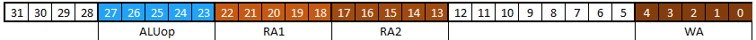
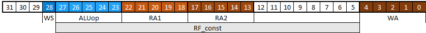
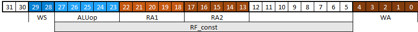
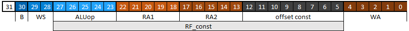
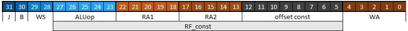

# Лабораторная работа №4 "Простейшее программируемое устройство"

В этой лабораторной работе, на основе ранее разработанных блоков памяти и АЛУ, вы соберете простой учебный процессор с архитектурой `CYBERcobra 3000 Pro 2.1`. Это нужно для более глубокого понимания принципов работы программно-управляемых устройств, чтобы проще было понять архитектуру RISC-V в будущем.

## Материалы для подготовки к лабораторной работе

В дополнение к [материалам](../../Basic%20Verilog%20structures/), изученным в ходе предыдущих работ, вам рекомендуется ознакомиться с:

- Оператором конкатенации ([Concatenation.md](../../Basic%20Verilog%20structures/Concatenation.md)).

## Цель

Реализовать простейшее программируемое устройство с архитектурой `CYBERcobra 3000 Pro 2.1`

## Ход работы

1. Изучить принцип работы процессоров (соответствующий раздел [#теории](#теория-про-программируемое-устройство))
2. Познакомиться с архитектурой и микроархитектурой `CYBERcobra 3000 Pro 2.1` (раздел про эту [#архитектуру](#архитектура-cybercobra-3000-pro-21-и-её-микроархитектура))
3. Изучить необходимые для описания процессора конструкции SystemVerilog (раздел [#инструменты](#инструменты-для-реализации-процессора))
4. Реализовать процессор с архитектурой `CYBERcobra 3000 Pro 2.1` ([#задание по разработке аппаратуры](#задание-по-реализации-процессора))
5. Проверить работу процессора в ПЛИС.

Доп. задание, выполняемое дома:

6. Написать программу для процессора и на модели убедиться в корректности её выполнения ([Индивидуальное задание](Индивидуальное%20задание)).

## Теория про программируемое устройство

В обобщенном виде, процессор включает в себя память, АЛУ, устройство управления и интерфейсную логику для организации ввода/вывода. Также, в процессоре есть специальный регистр `PC` (**Program Counter** – счётчик команд), который хранит в себе число – адрес ячейки памяти, где хранится инструкция, которую нужно выполнить. Инструкция тоже представляет собой число, в котором закодировано `что нужно сделать` и `с чем это нужно сделать`.

Алгоритм работы процессора следующий:

1. из памяти считывается инструкция по адресу `PC`;
2. устройство управления декодирует полученную инструкцию (то есть определяет какую операцию нужно сделать, где взять операнды и куда разместить результат);
3. декодировав инструкцию, устройство управления выдает всем блокам процессора (АЛУ, регистровый файл, мультиплексоры) соответствующие управляющие сигналы, тем самым выполняя эту инструкцию;
4. изменяется значение `PC`;
5. цикл повторяется с `п.1`.

Любая инструкция приводит к изменению состояния памяти. В случае процессора с архитектурой `CYBERcobra 3000 Pro 2.1` есть два класса инструкций: одни изменяют содержимое регистрового файла — это инструкции записи. Другие изменяют значение `PC` — это инструкции перехода. В первом случае используются вычислительные инструкции и инструкции загрузки данных из других источников. Во втором случае используются инструкции перехода.

Если процессор обрабатывает вычислительную инструкцию, то `PC` перейдет к следующей по порядку инструкции. В ЛР№3 мы реализовали память инструкций с [побайтовой адресацией](../03.%20Register%20file%20and%20memory/README.md#1-память-инструкций). Это означает, что каждый байт памяти имеет свой собственный адрес. Поскольку длина инструкции составляет `4 байта`, для перехода к следующей инструкции `PC` должен быть увеличен на `4` (`PC = PC + 4`). При этом, регистровый файл сохранит результат некоторой операции на АЛУ или данные с порта входных данных.

Если же обрабатывается инструкция перехода, то возможно два варианта. В случае безусловного или успешного условного перехода, значение `PC` увеличится на значение константы, закодированной внутри инструкции `PC = PC + const*4` (иными словами, `const` говорит о том, через сколько инструкций перепрыгнет `PC`, `const` может быть и отрицательной). В случае же неуспешного условного перехода `PC`, как и после вычислительных команд, просто перейдет к следующей инструкции, то есть `PC = PC + 4`.

> Строго говоря `PC` меняется при выполнении любой инструкции (кроме случая `const = 0`, то есть перехода инструкции на саму себя `PC = PC + 0*4`). Разница в том, на какое значение `PC` изменится. В вычислительных инструкциях это всегда адрес следующей инструкции, программа не управляет `PC`, он "сам знает", что ему делать. В инструкциях перехода программа и контекст определяют, что произойдет с `PC`.

## Архитектура CYBERcobra 3000 Pro 2.1 и её микроархитектура


В качестве первого разрабатываемого программируемого устройства предлагается использовать архитектуру специального назначения `CYBERcobra 3000 Pro 2.1`, которая была разработана в **МИЭТ**. Главным достоинством данной архитектуры является простота её понимания и реализации. Главным её минусом является неоптимальность ввиду неэффективной реализации кодирования инструкций, что приводит к наличию неиспользуемых битов в программах. Но это неважно, так как основная цель разработки процессора с архитектурой `CYBERcobra 3000 Pro 2.1` — это более глубокое понимание принципов работы программируемых устройств, которое поможет при разработке более сложного процессора с архитектурой **RISC-V**.

Простота архитектуры `CYBERcobra 3000 Pro 2.1` проявляется, в том числе, за счёт отсутствия памяти данных. Это значит, что данные c которыми работает программа могут храниться только в регистровом файле. Также в таком процессоре почти полностью отсутствует устройство управления (формально оно существует, но состоит только из проводов и пары логических вентилей).

Архитектурой предусмотрена поддержка 19 инструкций (5 типов команд):

Первые два типа содержат 16 инструкций, которые выполняются на АЛУ:

- 10 вычислительных
- 6 операций сравнения для условного перехода

Кроме того, есть инструкции:

- безусловного перехода
- загрузки константы
- загрузки данных с внешнего устройства.

К классу инструкций записи, то есть тех, которые меняют значение регистрового файла, можно отнести: 10 вычислительных, загрузки константы и загрузки данных с внешнего устройства. К классу инструкций перехода: 6 операций сравнения для условного перехода и безусловный переход.

### Последовательное считывание инструкций

Будем рассматривать архитектуру (функциональные возможности процессора) и микроархитектуру (реализацию процессора) одновременно, прослеживая рассуждения их разработчика.

Для начала реализуем базовый функционал, подключив счётчик команд `PC` к памяти инструкций `instr_mem` и сумматору, прибавляющему 4 к `PC`. Выход сумматора подключим ко входу `PC`.

Каждый раз, когда будет происходить тактовый импульс (переключение `clk_i` из 0 в 1), значение `PC` будет увеличиваться на `4`, тем самым указывая на следующую инструкцию. Последовательное считывание программы из памяти готово.

Так как операции будут выполняться только над данными в регистровом файле, то его можно сразу подключить к АЛУ, соединив порты чтения `read_data1_o` и `read_data2_o` со входами операндов АЛУ, а результат операции АЛУ подключив к порту на запись `write_data_i`. Полученный результат изображен на _рис. 0_.

> Для того, чтобы номера таблиц и рисунков лучше соотносились друг с другом и сопутствующим текстом, первая схема разрабатываемой микроархитектуры будет обозначена как _Рисунок 0_. Все последующие схемы будут совпадать по нумерации с таблицами, обозначающими способ кодирования реализуемого типа инструкций.


_Рисунок 0. Размещение на схеме основных блоков._

Для компактности схемы, названия портов регистрового файла сокращены (`RA1` обозначает `read_addr1_i` и т.п.).

### Кодирование вычислительных инструкций

Чтобы добавить поддержку каких-либо инструкций, необходимо договориться **как** они будут кодироваться (эта часть относится к вопросам архитектуры). Вычислительные инструкции требуют следующую информацию:

1. по каким адресам регистрового файла лежат операнды?
2. по какому адресу будет сохранен результат?
3. какая операция должна быть выполнена?

Для этого в инструкции были выбраны следующие поля: 5 бит (`[27:23]`) для кодирования операции на АЛУ, два раза по 5 бит для кодирования адресов операндов в регистровом файле (`[22:18]` и `[17:13]`) и 5 бит для кодирования адреса результата (`[4:0]`). _Таблица 1_ демонстрирует деление 32-битной инструкции на поля `alu_op`, `RA1`, `RA2` и `WA`.



_Таблица 1. Кодирование вычислительных инструкций в архитектуре CYBERcobra 3000 Pro v2.1._

``` C
  reg_file[WA] ← reg_file[RA1] {alu_op} reg_file[RA2]
```

Запись выше является некоторой формализацией выполняемой функции, которая как бы отвечает на вопрос "а что, собственно, будет сделано?". В регистр по адресу WA (`reg_file[WA]`) будет записан (`←`) результат операции alu_op (`{alu_op}`) между регистрами по адресам RA1 (`reg_file[RA1]`) и RA2 (`reg_file[RA1]`).

### Реализация вычислительных инструкций

Чтобы процессор правильно реагировал на эти инструкции, требуется подключить ко входам адреса регистрового файла и управляющему входу АЛУ соответствующие биты выхода `read_data_o` памяти инструкции (**Instruction Memory**). В таком случае, когда `PC` будет указывать на ячейку памяти, в которой лежит, например, следующая 32-битная инструкция:

```text
0000 00111  00100 01000 00000000 11100
    |alu_op| RA1 | RA2 |        | WA
```

будет выполнена операция `reg_file[28] = reg_file[4] | reg_file[8]`, потому что `alu_op = 00111`, что соответствует операции **логического ИЛИ** (см ЛР№2), `WA = 11100`, то есть запись произойдёт в 28-ой регистр, `RA1 = 00100` и `RA2 = 01000` — это значит что данные для АЛУ будут браться из 4-го и 8-го регистров соответственно.

_Рис. 1_ иллюстрирует фрагмент микроархитектуры, поддерживающий вычислительные операции на АЛУ. Поскольку другие инструкции пока что не поддерживаются, то вход `WE` регистрового файла просто равен `1` (это временно).


_Рисунок 1. Подключение АЛУ и регистрового файла для реализации вычислительных инструкций._

### Реализация загрузки константы в регистровый файл

Информация как-то должна попадать в регистровый файл, для этого добавим инструкцию загрузки константы по адресу `WA`. Чтобы аппаратура могла различать, когда ей нужно выполнять операцию на АЛУ, а когда загружать константу, назначим один бит инструкции определяющим "что именно будет записано в регистровый файл": результат с АЛУ или константа из инструкции. За это будет отвечать 28-ой бит инструкции `WS` (**Write Source**). Если `WS == 1`, значит выполняется вычислительная инструкция, а если `WS == 0`, значит нужно загрузить константу в регистровый файл.

Сама константа имеет разрядность **23 бита** ([27:5] биты инструкции) и должна быть **знакорасширена** до 32-х бит, то есть к 23-битной константе нужно приклеить слева 9 раз 23-ий знаковый бит константы (см. [оператор конкатенации](../../Basic%20Verilog%20structures/Concatenation.md)).

Пример: если [27:5] биты инструкции равны:

```text
10100000111100101110111
```

то после знакорасширения константа примет вид:

```text
11111111110100000111100101110111
```

(если бы старший бит был равен нулю, то константа заполнилась бы слева нулями, а не единицами).

Нет ничего страшного в том, что биты константы попадают на те же поля, что и `alu_op`, `RA1` и `RA2` — когда выполняется инструкция загрузки константы не важно, что будет выдавать АЛУ в этот момент (ведь благодаря мультиплексору на вход регистрового файла приходит константа). А значит не важно и что приходит в этот момент на АЛУ в качестве операндов и кода операции. _Таблица 2_ демонстрирует деление 32-битной инструкции на поля `alu_op`, `RA1`, `RA2`, `WA`, `WS` и `rf_const`, **с перекрытием полей**.



_Таблица 2. Добавление кодирования источника записи и 23-битной константы._

``` C
  reg_file[WA] ← rf_const
```

На _рис. 2_ приводится фрагмент микроархитектуры, поддерживающий вычислительные операции на АЛУ и загрузку констант из инструкции в регистровый файл.

Так как вход записи уже занят результатом операции АЛУ, его потребуется мультиплексировать со значением константы из инструкции, которая предварительно **знакорасширяется** в блоке `SE`. На входе `WD` регистрового файла появляется мультиплексор, управляемый 28-м битом инструкции, который и определяет, что будет записано: константа или результат вычисления на АЛУ.

Например, в такой реализации следующая 32-битная инструкция поместит константу `-1` в регистр по адресу `5`:

```text
000  0 11111111111111111111111 00101
   |WS|        RF_const       | WA  |
```


_Рисунок 2. Добавление константы из инструкции в качестве источников записи в регистровый файл._

### Реализация загрузки в регистровый файл данных с внешних устройств

Чтобы процессор мог взаимодействовать с внешним миром добавим возможность загрузки данных с внешних устройств в регистр по адресу `WA`. Появляется третий тип инструкции, который определяет третий источник ввода для регистрового файла. Одного бита `WS` для выбора одного из трех источников будет недостаточно, поэтому расширим это поле до 2 бит. Теперь, когда `WS == 0` будет загружаться константа, когда `WS == 1` – будет загружаться результат вычисления АЛУ, а при `WS == 2` будут загружаться данные с внешних устройств. Остальные поля в данной инструкции не используются.



_Таблица 3. Кодирование в инструкции большего числа источников записи._

``` C
  reg_file[WA] ← sw_i
```

На _рис. 3_ приводится фрагмент микроархитектуры, поддерживающий вычислительные операции на АЛУ, загрузку констант из инструкции в регистровый файл и загрузку данных с внешних устройств.

По аналогии с загрузкой констант увеличиваем входной мультиплексор до 4 входов и подключаем к нему управляющие сигналы – `[29:28]` биты инструкции. Последний вход используется, чтобы разрешить неопределённость на выходе при `WS == 3`(`default`-вход, см. [мультиплексор](../../Basic%20Verilog%20structures/Multiplexors.md)).

Выход OUT подключается к первому порту на чтение регистрового файла. Значение на выходе OUT будет определяться содержимым ячейки памяти по адресу `RA1`.


_Рисунок 3. Подключение к схеме источников ввода и вывода._

### Реализация условного перехода

С реализованным набором инструкций полученное устройство нельзя назвать процессором – пока что это продвинутый калькулятор. Добавим поддержку инструкции условного перехода, при выполнении которой программа будет перепрыгивать через заданное количество команд. Чтобы аппаратура отличала эту инструкцию от других будем использовать 30-ый бит `B` (`branch`). Если `B == 1`, значит это инструкция условного перехода и, если условие перехода выполняется, к `PC` надо прибавить константу. Если `B == 0`, значит это какая-то другая инструкция и к `PC` надо прибавить 4.



_Таблица 4.Кодирование условного перехода._

Для вычисления результата условного перехода, нам необходимо выполнить операцию на АЛУ и посмотреть на сигнал `flag`. Если он равен 1, переход выполняется, в противном случае — не выполняется. А значит, нам нужны операнды `A`, `B`, и `alu_op`. Кроме того, нам необходимо указать насколько мы сместимся относительно текущего значения `PC` (константу смещения, `offset`). Для передачи этой константы лучше всего подойдут незадействованные биты инструкции `[12:5]`.

Обратим внимание на то, что `PC` 32-битный и должен быть всегда кратен четырем (`PC` не может указывать кроме как в начало инструкции, а каждая инструкция длиной в 32 бита). Кратные четырем двоичные числа всегда будут иметь в конце два нуля (так же, как и кратные ста десятичные числа). Поэтому для более эффективного использования бит константы смещения, эти два нуля будут неявно подразумеваться при её описании. При этом, перед увеличением программного счётчика на значение константы смещения, эти два нуля нужно будет к ней приклеить справа. Кроме того, чтобы разрядность константы совпадала с разрядностью `PC`, необходимо знакорасширить её до 32 бит.

Предположим, мы хотим переместиться на две инструкции вперед. Это означает, что программный счётчик должен будет увеличиться на 8 ([2 инструкции] * [4 байта — размер одной инструкции в памяти]). Умножение на 4 константы смещения произойдет путем добавления к ней двух нулей справа, поэтому в поле `offset` мы просто записываем число инструкций, на которые мы переместим программный счётчик (на две): `0b00000010`.

Данный Си-подобный псевдокод (далее мы назовем его псевдоассемблером) демонстрирует кодирование инструкций с новым полем `B`:

``` C
  if (reg_file[RA1] {alu_op} reg_file[RA2])
    PC ← PC + const * 4
  else
    PC ← PC + 4
```

Так как второй вход сумматора счётчика команд занят числом 4, то для реализации условного перехода этот вход надо мультиплексировать с константой. Мультиплексор при этом управляется 30-ым битом `B`, который и определяет, что будет прибавляться к `PC`.

Сигнальные линии, которые управляют АЛУ и подают на его входы операнды уже существуют. Поэтому на схему необходимо добавить только логику управления мультиплексором на входе сумматора счётчика команд так. Эта логика работает следующим образом:

1. если сейчас инструкция условного перехода
2. и если условие перехода выполнилось,

то к `PC` прибавляется знакорасширенная константа, умноженная на 4. В противном случае, к `PC` прибавляется 4.

Так как теперь не любая инструкция приводит к записи в регистровый файл, появляется необходимость управлять входом `WE` так, чтобы при операциях условного перехода запись в регистровый файл не производилась. Это можно сделать, подав на WE значение `!B` (запись происходит, если сейчас **не операция условного перехода**).


_Рисунок 4. Реализация условного перехода._

### Реализация безусловного перехода

Осталось добавить поддержку инструкции безусловного перехода, для идентификации которой используется оставшийся 31-ый бит `J`(jump). Если бит `J == 1`, то это безусловный переход, и мы прибавляем к `PC` знакорасширенную константу смещения, умноженную на 4 (как это делали и в условном переходе).



_Таблица 5. Кодирование безусловного перехода._

``` C
  PC ← PC + const*4
```

Для реализации безусловного перехода, нам необходимо добавить дополнительную логику управления мультиплексором перед сумматором. Итоговая логика его работы звучит так:

1. Если сейчас инструкция безусловного перехода
2. ИЛИ если сейчас инструкция условного перехода
3. И если условие перехода выполнилось

Кроме того, при безусловном переходе в регистровый файл так же ничего не пишется. А значит, необходимо обновить логику работы сигнала разрешения записи `WE`, который будет равен 0 если сейчас инструкция условного или безусловного перехода.

На _рис. 5_ приводится итоговый вариант микроархитектуры процессора `CYBERcobra 3000 Pro 2.1`.


_Рисунок 5. Реализация безусловного перехода._

### Финальный обзор

Итого, архитектура `CYBERcobra 3000 Pro 2.1` поддерживает 5 типов инструкций, которые кодируются следующим образом (иксами помечены биты, которые не задействованы в данной инструкции):

1. 10 вычислительных инструкций `0 0 01 alu_op RA1 RA2 xxxx xxxx WA`
2. Инструкция загрузки константы `0 0 00 const WA`
3. Инструкция загрузки из внешних устройств `0 0 10 xxx xxxx xxxx xxxx xxxx xxxx WA`
4. Безусловный переход `1 x xx xxx xxxx xxxx xxxx const xxxxx`
5. 6 инструкций условного перехода `0 1 xx alu_op RA1 RA2 const x xxxx`

При кодировании инструкций используются следующие поля:

- J – однобитный сигнал, указывающий на выполнение безусловного перехода;
- B – однобитный сигнал, указывающий на выполнение условного перехода;
- WS – двухбитный сигнал, указывающий источник данных для записи в регистровый файл:
  - 0 – константа из инструкции;
  - 1 – результат с АЛУ;
  - 2 – внешние данные;
  - 3 – не используется;
- alu_op – 5-битный сигнал кода операции АЛУ (в соответствии с таблицей из лабораторной по АЛУ);
- RA1 и RA2 – 5-битные адреса операндов из регистрового файла;
- offset – 8-битная константа для условного / безусловного перехода;
- const  — 23-битная константа для загрузки в регистровый файл;
- WA – 5-битный адрес регистра, в который будет записан результат.

Напишем простую программу для этого процессора, которая циклично увеличивает значение первого регистра на 1 до тех пор, пока его значение не превысит число, введенное на переключателях. Сначала напишем программу на псевдоассемблере (используя предложенную мнемонику):

``` C
  reg_file[1] ← -1                        // загрузить константу -1 в регистр 1
  reg_file[2] ← sw_i                      // загрузить значение с входа sw_i в регистр 2
  reg_file[3] ←  1                        // загрузить константу 1 в регистр 3

  reg_file[1] ← reg_file[1] + reg_file[3] // сложить регистр 1 с регистром 3 и
                                          // поместить результат в регистр 1

  if (reg_file[1] < reg_file[2])          // если значение в регистре 1 меньше
                                          // значения в регистре 2,
    PC ← PC + (-1)                        // возврат на 1 инструкцию назад

  out_o = reg_file[1], PC ← PC + 0        // бесконечное повторение этой инструкции
                                          // с выводом на out_o значения в регистре 1
```

Теперь в соответствии с кодировкой инструкций переведем программу в машинные коды:

```text
  0 0 00   11111111111111111111111  00001
  0 0 10   00000000000000000000000  00010
  0 0 00   00000000000000000000001  00011
  0 0 01 00000 00001 00011 00000000 00001
  0 1 00 11110 00001 00010 11111111 00000
  1 0 00 00000 00001 00000 00000000 00000
```

Полученную программу можно помещать в память программ и выполнять на процессоре.

## Инструменты для реализации процессора

Так как все модули процессора написаны, основная часть кода описания процессора будет связана с подключением этих модулей друг к другу. Подробнее о подключении модулей сказано в [Modules.md](../../Basic%20Verilog%20structures/Modules.md).

Для реализации блоков знакорасширения с умножением на 4 подходит использование оператора конкатенации ([Concatenation.md](../../Basic%20Verilog%20structures/Concatenation.md)).

## Задание по реализации процессора

Разработать процессор `CYBERcobra` (см. [_рис. 5_](../../.pic/Labs/lab_04_cybercobra/ppd_5.drawio.svg)), объединив ранее разработанные модули:

- Память инструкций (проинициализированную в двоичном формате файлом [`program.mem`](program.mem))
- Регистровый файл
- Арифметико-логическое устройство
- 32-битный сумматор

Кроме того, необходимо описать регистр счётчика команд и логику его работы, в соответствии с ранее представленной микроархитектурой.

```Verilog
module CYBERcobra (
  input  logic         clk_i,
  input  logic         rst_i,
  input  logic [15:0]  sw_i,
  output logic [31:0]  out_o
);

endmodule
```

## Порядок выполнения задания

1. Добавьте в `Design Sources` проекта файл [program.mem](program.mem).
2. Опишите модуль `CYBERcobra` с таким же именем и портами, как указано в задании (обратите внимание на регистр имени модуля).
   1. В первую очередь, необходимо создать счётчик команд и все вспомогательные провода. При создании, **следите за разрядностью**.
   2. Затем, необходимо создать экземпляры модулей: памяти инструкции, АЛУ, регистрового файла и сумматора. При подключении сигналов сумматора, надо **обязательно** надо подать нулевое значение на входной бит переноса. Выходной бит переноса подключать не обязательно. Объекту памяти инструкций нужно дать имя `imem`.
   3. После этого, необходимо описать оставшуюся логику:
      1. Программного счётчика. Счётчик должен сбрасываться, когда сигнал _rst_i == 1_.
      2. Сигнала управления мультиплексором, выбирающим слагаемое для программного счётчика
      3. Сигнала разрешения записи в регистровый файл
      4. Мультиплексор, выбирающий слагаемое для программного счётчика
      5. Мультиплексор, выбирающий источник записи в регистровый файл.
3. Проверьте модуль с помощью верификационного окружения, представленного в файле [`lab_04.tb_cybercobra.sv`](lab_04.tb_cybercobra.sv).
   1. Перед запуском моделирования, убедитесь, что у вас выбран корректный модуль верхнего уровня в `Simulation Sources`.
   2. В этот раз, в конце не будет сообщения о том, работает ли ваше устройство или в нем есть ошибки. Вам необходимо самостоятельно проверить работу модуля, перенеся его внутренние сигналы на временную диаграмму, и [изучив](../../Vivado%20Basics/05.%20Bug%20hunting.md) их поведение.
   3. По сути, проверка сводится к потактовому изучению временной диаграммы, во время которого вам нужно циклично ответить на следующие вопросы (после чего необходимо сравнить предсказанный ответ со значением сигналов на временной диаграмме):
      1. Какое сейчас значение программного счётчика?
      2. Какое должно быть значение у ячейки памяти инструкций с адресом, соответствующим значению программного счётчика. Какой инструкции соответствует значение этой ячейки памяти?
      3. Как должно обновиться содержимое регистрового файла в результате выполнения этой инструкции: должно ли записаться какое-либо значение? Если да, то какое и по какому адресу?
      4. Как должен измениться программный счётчик после выполнения этой инструкции?
4. Проверьте работоспособность вашей цифровой схемы в ПЛИС.

---

После выполнения задания по реализации процессора, необходимо также выполнить [индивидуальное задание](Индивидуальное%20задание) по написанию двоичной программы под созданный вами процессор.

---

Дерзайте!
