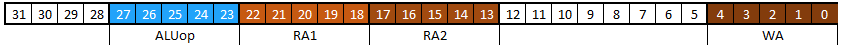
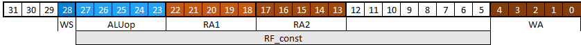
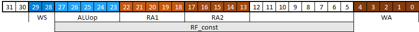
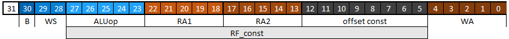
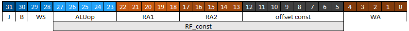

# Lab 4. Primitive Programmable Device

In this lab, using the previously developed memory blocks and ALU, you will build a simple educational processor with the `CYBERcobra 3000 Pro 2.1` architecture. This is needed for a deeper understanding of the principles of how program-controlled devices work, so that understanding the RISC-V architecture in the future will be easier.

## Preparation Materials

In addition to the [materials](../../Basic%20Verilog%20structures/) studied in previous labs, you are recommended to review:

- The concatenation operator ([Concatenation.md](../../Basic%20Verilog%20structures/Concatenation.md)).

## Goal

Implement a primitive programmable device.

## Workflow

1. Study the operating principles of processors (see the corresponding [#theory](#Theory-on-programmable-devices) section)
2. Learn about the architecture and microarchitecture of `CYBERcobra 3000 Pro 2.1` (see the [#architecture](#CYBERcobra-3000-Pro-21-Architecture-and-Microarchitecture) section)
3. Study the SystemVerilog constructs required to describe the processor (see the [#tools](#Tools-for-Processor-Implementation) section)
4. Implement the processor with the `CYBERcobra 3000 Pro 2.1` architecture ([#hardware design task](#Processor-Implementation-Task))
5. Verify the processor operation on the FPGA.

Additional task (to be completed at home):

6. Write a program for the processor and verify its correct execution in simulation ([Individual Assignment](Индивидуальное%20задание)).

## Theory on Programmable Devices

In general terms, a processor includes memory, an ALU, a control unit, and interface logic for organizing input/output. A processor also has a special register `PC` (**Program Counter**), which holds a number — the address of the memory cell containing the instruction to be executed. An instruction is also a number that encodes `what needs to be done` and `what it needs to be done with`.

The processor operates according to the following algorithm:

1. an instruction is fetched from memory at address `PC`;
2. the control unit decodes the received instruction (i.e., determines what operation needs to be performed, where to get the operands, and where to place the result);
3. having decoded the instruction, the control unit issues corresponding control signals to all processor blocks (ALU, register file, multiplexers), thereby executing the instruction;
4. the value of `PC` is updated;
5. the cycle repeats from step 1.

Every instruction leads to a change in the memory state. In the case of the processor considered in this lab, there are two classes of instructions: those that modify the register file — these are write instructions. Others change the value of `PC` — these are branch instructions (conditional and unconditional). The first class includes computational instructions and instructions for loading data from other sources. The second class includes branch instructions.

If the processor is executing a computational instruction, `PC` advances to the next instruction in sequence. In Lab 3, we implemented an instruction memory with [byte addressing](../03.%20Register%20file%20and%20memory/#1-Память-инструкций). This means each byte of memory has its own address. Since an instruction is `4 bytes` long, `PC` must be incremented by `4` to advance to the next instruction (`PC = PC + 4`). In this case, the register file saves the result of some ALU operation or data from the input data port.

If a branch instruction is being executed, there are two possible outcomes. In the case of an unconditional or successful conditional branch, `PC` is incremented by the value of the constant encoded within the instruction: `PC = PC + const*4` (in other words, `const` specifies how many instructions `PC` will jump over; `const` can also be negative). In the case of an unsuccessful conditional branch, `PC`, as with computational instructions, simply advances to the next instruction: `PC = PC + 4`.

> Strictly speaking, `PC` changes on every instruction (except when `const = 0`, meaning a self-loop `PC = PC + 0*4`). The difference lies in what value `PC` changes to. For computational instructions, it is always the address of the next instruction — the program does not control `PC`, it "knows on its own" what to do. For branch instructions, the program and context determine what happens to `PC`.

## CYBERcobra 3000 Pro 2.1 Architecture and Microarchitecture


As the first programmable device to be developed, the special-purpose architecture `CYBERcobra 3000 Pro 2.1` (hereinafter "CYBERcobra"), developed at **MIET**, is proposed. The main advantage of this architecture is the simplicity of understanding and implementing it. Its main drawback is inefficiency due to a suboptimal instruction encoding scheme, which results in unused bits in programs. However, this is not important, since the primary goal of developing a processor with the `CYBERcobra` architecture is to gain a deeper understanding of the principles of programmable devices, which will help when developing a more complex processor with the **RISC-V** architecture.

The simplicity of the `CYBERcobra` architecture is partly due to the absence of a data memory. This means that data the program works with can only be stored in the register file. The control unit is also nearly absent in such a processor (formally it exists, but consists only of wires and a couple of logic gates).

The architecture supports 19 instructions (5 instruction types):

The first two types contain 16 instructions executed on the ALU:

- 10 computational
- 6 comparison operations for conditional branching

In addition, there are instructions for:

- unconditional branch
- loading a constant
- loading data from an external device.

The write instruction class (those that modify the register file) includes: 10 computational instructions, load constant, and load data from external device. The branch instruction class includes: 6 comparison operations for conditional branching and unconditional branch.

### Sequential Instruction Fetch

We will consider the architecture (the functional capabilities of the processor) and the microarchitecture (the implementation of the processor) simultaneously, following the reasoning of their designer.

First, let us implement the basic functionality by connecting the program counter `PC` to the instruction memory `instr_mem` and to an adder that adds 4 to `PC`. The output of the adder is connected to the input of `PC`.

Each time a clock edge occurs (transition of `clk_i` from 0 to 1), the value of `PC` increments by `4`, thereby pointing to the next instruction. Sequential program fetch from memory is now complete.

Since operations will only be performed on data in the register file, it can be immediately connected to the ALU by wiring the read ports `read_data1_o` and `read_data2_o` to the ALU operand inputs, and connecting the ALU operation result to the write port `write_data_i`. The resulting schematic is shown in _Fig. 0_.

> To make figure and table numbering correspond better to each other and to the accompanying text, the first schematic of the microarchitecture under development is labeled _Figure 0_. All subsequent schematics will share numbering with the tables that describe the encoding of the corresponding instruction type.


_Figure 0. Placement of the main blocks on the schematic._

For compactness, register file port names are abbreviated (`RA1` stands for `read_addr1_i`, etc.).

### Computational Instruction Encoding

To add support for any instructions, it is necessary to agree on **how** they will be encoded (this part relates to architecture). Computational instructions require the following information:

1. at which register file addresses are the operands located?
2. at which address will the result be saved?
3. what operation needs to be performed?

For this purpose, the following fields are selected in the instruction: 5 bits (`[27:23]`) for encoding the ALU operation, two groups of 5 bits for encoding operand addresses in the register file (`[22:18]` and `[17:13]`), and 5 bits for encoding the result address (`[4:0]`). _Table 1_ shows the division of the 32-bit instruction into the fields `alu_op`, `RA1`, `RA2`, and `WA`.



_Table 1. Computational instruction encoding in the CYBERcobra architecture._

``` C
  reg_file[WA] ← reg_file[RA1] {alu_op} reg_file[RA2]
```

The expression above is a formalization of the function being performed, answering the question "what exactly will be done?". The result of the operation alu_op (`{alu_op}`) between the registers at addresses RA1 (`reg_file[RA1]`) and RA2 (`reg_file[RA2]`) will be written (`←`) into the register at address WA (`reg_file[WA]`).

### Implementing Computational Instructions

For the processor to respond correctly to these instructions, the corresponding bits of the instruction memory (`Instruction Memory`) `read_data_o` output must be connected to the register file address inputs and the ALU control input. Suppose the program counter points to a memory cell containing the following 32-bit instruction:

```text
0000|00111 |00100|01000|00000000|11100
    |alu_op| RA1 | RA2 |        | WA
```

In this case, the following operation will be performed:

```text
reg_file[28] = reg_file[4] | reg_file[8]
```

Here:

- `alu_op = 00111`, which corresponds to the **bitwise OR** operation (see Lab 2);
- `WA = 11100`, meaning the result will be written to register 28;
- `RA1 = 00100` and `RA2 = 01000` — this means the ALU operands will be taken from registers 4 and 8, respectively.

_Fig. 1_ illustrates the microarchitecture fragment supporting ALU computational operations. Since other instructions are not yet supported, the `WE` input of the register file is simply set to `1` (this is temporary).


_Figure 1. Connecting the ALU and register file to implement computational instructions._

### Implementing Constant Load into the Register File

The data being processed must somehow enter the register file, so let us add an instruction to load a constant at address `WA`. For the hardware to distinguish between executing an ALU operation and loading a constant, one bit of the instruction is designated to indicate "what exactly will be written to the register file": the result from the ALU or a constant from the instruction. Bit 28 of the instruction, `WS` (**Write Source**), handles this. If `WS == 1`, a computational instruction is being executed; if `WS == 0`, a constant must be loaded into the register file.

The constant itself has a width of **23 bits** (bits `[27:5]` of the instruction) and must be **sign-extended** to 32 bits, meaning the 23-bit sign bit must be replicated 9 times to the left (see the [concatenation operator](../../Basic%20Verilog%20structures/Concatenation.md)).

Example: if bits `[27:5]` of the instruction equal:

```text
10100000111100101110111
```

then after sign extension the constant becomes:

```text
11111111110100000111100101110111
```

(if the most significant bit were zero, the constant would be filled with zeros on the left instead of ones).

There is nothing wrong with the constant bits overlapping the same fields as `alu_op`, `RA1`, and `RA2` — when a constant load instruction is being executed, it does not matter what the ALU outputs at that moment (since the multiplexer routes the constant to the register file input). Therefore, it does not matter what arrives at the ALU as operands or operation code. _Table 2_ shows the division of the 32-bit instruction into the fields `alu_op`, `RA1`, `RA2`, `WA`, `WS`, and `rf_const`, **with overlapping fields**.



_Table 2. Adding write source encoding and a 23-bit constant._

``` C
  reg_file[WA] ← rf_const
```

_Fig. 2_ shows the microarchitecture fragment supporting ALU computational operations and loading constants from the instruction into the register file.

Since the write input is already occupied by the ALU operation result, it must be multiplexed with the constant value from the instruction, which is first **sign-extended** in the `SE` block. A multiplexer controlled by bit 28 of the instruction appears at the `WD` input of the register file and determines what will be written: the constant or the ALU result.

For example, in this implementation, the following 32-bit instruction places the constant `-1` into the register at address `5`:

```text
000  0 11111111111111111111111 00101
   |WS|        RF_const       | WA  |
```


_Figure 2. Adding a constant from the instruction as a write source for the register file._

### Implementing External Device Data Load into the Register File

To allow the processor to interact with the outside world, let us add the ability to load data from external devices into the register at address `WA`. A third instruction type appears, defining a third input source for the register file. A single `WS` bit is not enough to select among three sources, so the field is extended to 2 bits. Now, when `WS == 0`, a constant is loaded; when `WS == 1`, the ALU computation result is loaded; and when `WS == 2`, data from external devices is loaded. All other fields (except `WA`) are unused in this instruction.



_Table 3. Encoding a larger number of write sources in the instruction._

``` C
  reg_file[WA] ← sw_i
```

_Fig. 3_ shows the microarchitecture fragment supporting ALU computational operations, constant loads from the instruction into the register file, and data loads from external devices.

By analogy with constant loading, the input multiplexer is expanded to 4 inputs and connected to the control signals — bits `[29:28]` of the instruction. The last input is used to resolve the output ambiguity when `WS == 3` (the `default` input; see [multiplexer](../../Basic%20Verilog%20structures/Multiplexors.md)).

The `out_o` output of the module is connected to the first read port of the register file. The value at the `out_o` output is determined by the contents of the register file cell at address `RA1`.


_Figure 3. Connecting input and output sources to the schematic._

### Implementing Conditional Branch

With the current instruction set, the resulting device cannot be called a processor — at this point it is an advanced calculator. Let us add support for a conditional branch instruction, which causes the program to skip over a specified number of instructions. To distinguish this instruction from others, bit 30 `B` (`branch`) is used. If `B == 1`, this is a conditional branch instruction and, if the branch condition is met, the constant must be added to `PC`. If `B == 0`, this is some other instruction and 4 must be added to `PC`.



_Table 4. Conditional branch encoding._

To evaluate the result of a conditional branch, we need to perform an ALU operation and check the `flag` signal. If it equals 1, the branch is taken; otherwise it is not. This requires operands `A`, `B`, and `alu_op`. In addition, we need to specify by how much to offset relative to the current value of `PC` (the offset constant). Unused instruction bits `[12:5]` are best suited for passing this constant.

Note that `PC` is 32 bits wide and must always be a multiple of four (`PC` can only point to the start of an instruction, and each instruction is 32 bits long). Binary numbers that are multiples of four always end in two zeros (just as decimal numbers that are multiples of one hundred). Therefore, to make more efficient use of the offset constant bits, these two zeros are implicitly assumed in the encoding. Before adding the offset constant to the program counter, these two zeros must be appended to the right. Additionally, to match the bit width of `PC`, the constant must be sign-extended to 32 bits.

Suppose we want to jump forward by two instructions. This means the program counter must increase by 8 ([2 instructions] × [4 bytes — size of one instruction in memory]). Multiplying the offset constant by 4 happens by appending two zeros to the right, so in the `offset` field we simply write the number of instructions to jump (two): `0b00000010`.

The following C-like pseudocode (referred to hereafter as pseudo-assembly) demonstrates instruction encoding with the new `B` field:

``` C
  if (reg_file[RA1] {alu_op} reg_file[RA2])
    PC ← PC + const * 4
  else
    PC ← PC + 4
```

Since the second input of the program counter adder is already occupied by the value 4, this input must be multiplexed with the constant to implement a conditional branch. The multiplexer is controlled by bit 30 `B`, which determines what is added to `PC`.

The signal lines that control the ALU and supply its operands already exist. Therefore, only the control logic for the multiplexer at the program counter adder input needs to be added to the schematic. This logic operates as follows:

1. if the current instruction is a conditional branch
2. and if the branch condition is satisfied,

then the sign-extended constant multiplied by 4 is added to `PC`. Otherwise, 4 is added to `PC`.

Since not every instruction now leads to a write to the register file, the `WE` input must be controlled so that no write to the register file occurs during conditional branch operations. This can be done by driving `WE` with `!B` (a write occurs only when the current instruction is **not a conditional branch**).


_Figure 4. Implementing the conditional branch._

### Implementing Unconditional Branch

All that remains is to add support for the unconditional branch instruction, identified by the remaining bit 31 `J` (jump). If bit `J == 1`, this is an unconditional branch, and we add the sign-extended offset constant multiplied by 4 to `PC` (exactly as done for conditional branch).



_Table 5. Unconditional branch encoding._

``` C
  PC ← PC + const*4
```

To implement the unconditional branch, additional control logic for the multiplexer before the adder must be added. The final logic operates as follows:

1. if the current instruction is an unconditional branch, _or_
2. if the current instruction is a conditional branch _and_ the branch condition is satisfied,

then the sign-extended constant multiplied by 4 is added to `PC`. Otherwise, 4 is added to `PC`.

In addition, during an unconditional branch, nothing is written to the register file either. Therefore, the write-enable signal `WE` logic must be updated: `WE` equals 0 if the current instruction is a conditional or unconditional branch.

_Fig. 5_ shows the final microarchitecture of the `CYBERcobra` processor.


_Figure 5. Implementing the unconditional branch._

### Final Overview

In total, the `CYBERcobra` architecture supports 5 instruction types, encoded as follows (bits marked `x` are unused in the given instruction):

1. 10 computational instructions: `0 0 01 alu_op RA1 RA2 xxxx xxxx WA`
2. Load constant instruction: `0 0 00 const WA`
3. Load from external devices instruction: `0 0 10 xxx xxxx xxxx xxxx xxxx xxxx WA`
4. Unconditional branch: `1 x xx xxx xxxx xxxx xxxx offset xxxxx`
5. 6 conditional branch instructions: `0 1 xx alu_op RA1 RA2 offset xxxxx`

The following fields are used when encoding instructions:

- J — 1-bit signal indicating an unconditional branch;
- B — 1-bit signal indicating a conditional branch;
- WS — 2-bit signal indicating the data source for writing to the register file:
  - 0 — constant from the instruction;
  - 1 — result from the ALU;
  - 2 — external data;
  - 3 — unused;
- alu_op — 5-bit ALU operation code (as defined in the ALU lab table);
- RA1 and RA2 — 5-bit addresses of operands in the register file;
- offset — 8-bit constant for conditional/unconditional branch;
- const — 23-bit constant for loading into the register file;
- WA — 5-bit address of the register where the result will be written.

Let us write a simple program for this processor that cyclically increments the value of the first register by 1 until it exceeds the number entered on the switches. First, the program is written in pseudo-assembly (using the proposed mnemonics):

``` C
  reg_file[1] ← -1                        // load constant -1 into register 1
  reg_file[2] ← sw_i                      // load value from input sw_i into register 2
  reg_file[3] ←  1                        // load constant 1 into register 3

  reg_file[1] ← reg_file[1] + reg_file[3] // add register 1 and register 3 and
                                          // store the result in register 1

  if (reg_file[1] < reg_file[2])          // if the value in register 1 is less than
                                          // the value in register 2,
    PC ← PC + (-1)                        // go back 1 instruction

  out_o = reg_file[1], PC ← PC + 0        // infinite repetition of this instruction
                                          // with output of register 1 value on out_o
```
_Listing 1. Example program for CYBERcobra._


Now, according to the instruction encoding, the program is translated into machine codes:

```text
  0 0 00   11111111111111111111111  00001
  0 0 10   00000000000000000000000  00010
  0 0 00   00000000000000000000001  00011
  0 0 01 00000 00001 00011 00000000 00001
  0 1 00 11110 00001 00010 11111111 00000
  1 0 00 00000 00001 00000 00000000 00000
```
_Listing 2. Listing 1 represented in machine codes._

The resulting program can be placed in program memory and executed on the processor.

## Tools for Processor Implementation

Since all processor modules have been written, the main part of the processor description code will involve connecting these modules to each other. More details about module instantiation are given in [Modules.md](../../Basic%20Verilog%20structures/Modules.md).

The concatenation operator ([Concatenation.md](../../Basic%20Verilog%20structures/Concatenation.md)) is suitable for implementing sign-extension blocks with multiplication by 4.

## Assignment

Develop the `CYBERcobra` processor (see [_Fig. 5_](../../.pic/Labs/lab_04_cybercobra/ppd_5.drawio.svg)) by combining the previously developed modules:

- Instruction memory (initialized in binary format with the file [`program.mem`](program.mem))
- Register file
- Arithmetic Logic Unit
- 32-bit adder

In addition, the program counter register and its operating logic must be described in accordance with the microarchitecture presented above.

```Verilog
module CYBERcobra (
  input  logic         clk_i,
  input  logic         rst_i,
  input  logic [15:0]  sw_i,
  output logic [31:0]  out_o
);

endmodule
```

## Steps

1. Add the file [program.mem](program.mem), containing the program from Listing 1, to the `Design Sources` of the project.
2. Describe the `CYBERcobra` module with the same name and ports as specified in the task (pay attention to the case of the module name).
   1. First, create the program counter and all auxiliary wires. When doing so, **pay attention to bit widths**.
   2. Then, instantiate the modules: instruction memory, ALU, register file, and adder. When connecting the adder signals, you **must** drive the carry-in with zero. The carry-out does not need to be connected. The instruction memory instance must be named `imem`.
   3. After that, describe the remaining logic:
      1. Program counter. The counter must reset when _rst_i == 1_.
      2. Control signal for the multiplexer that selects the addend for the program counter.
      3. Write-enable signal for the register file.
      4. Multiplexer that selects the addend for the program counter.
      5. Multiplexer that selects the write source for the register file.
3. Verify the module using the testbench provided in the file [`lab_04.tb_cybercobra.sv`](lab_04.tb_cybercobra.sv).
   1. Before running the simulation, make sure the correct top-level module is selected in `Simulation Sources`.
   2. This time there will be no message at the end indicating whether the device works correctly or contains errors. You must verify the module operation independently by adding its internal signals to the waveform and [examining](../../Vivado%20Basics/05.%20Bug%20hunting.md) their behavior.
   3. Essentially, verification comes down to a cycle-by-cycle study of the waveform, during which you must repeatedly answer the following questions (and then compare the predicted answer with the signal values on the waveform):
      1. What is the current value of the program counter?
      2. Which instruction should be fetched at this program counter value?
      3. How should the register file contents be updated as a result of executing this instruction: should any value be written? If so, what value and at which address?
      4. How should the program counter change after executing this instruction?
4. Verify the operation of your digital circuit on the FPGA.

---

After completing the processor implementation task, you must also complete the [individual assignment](Индивидуальное%20задание) of writing a binary program for the processor you have created.

---

Good luck!
