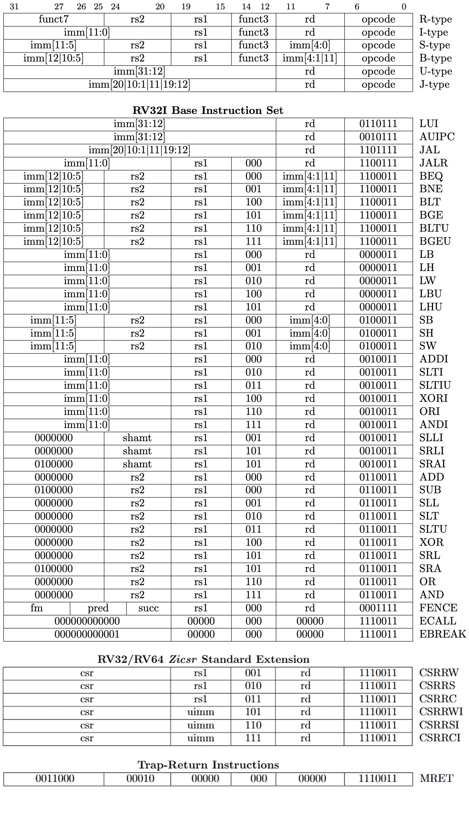
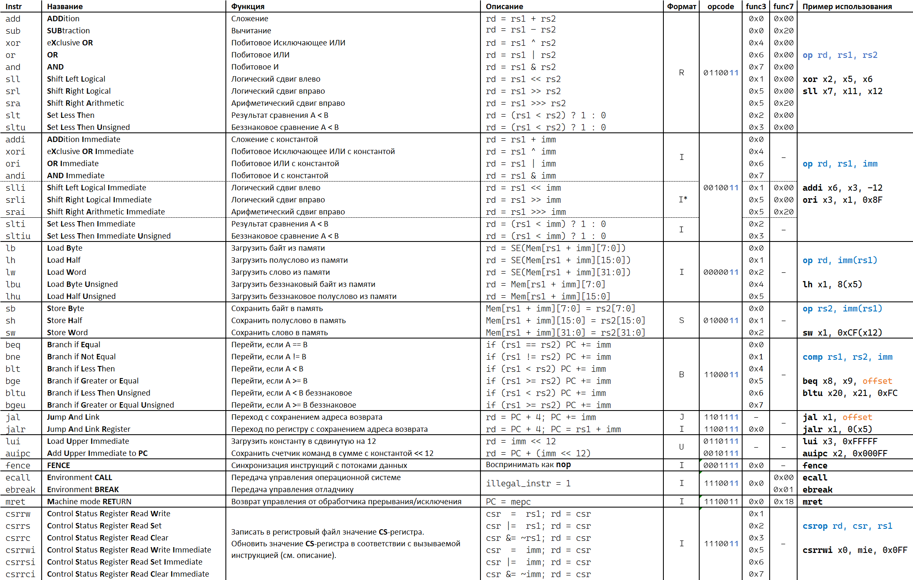

# Лабораторная работа 5 "Основной дешифратор команд"

Устройство управления – один из базовых блоков процессора, функцией которого является декодирование инструкций и выдача управляющих сигналов для всех блоков процессора.

## Цель

Описать на языке **SystemVerilog** блок основного дешифратора команд (модуль **Main Decoder**) для однотактного процессора с архитектурой **RISC-V**.

## Допуск к лабораторной работе

- Изучить форматы кодирования инструкций базового набора команд [`RV32I`](../../Other/rv32i.md)

## Ход работы

1. Изучить особенности архитектуры **RISC-V** ([#теория](#архитектура-risc-v-и-предлагаемая-микроархитектура))
2. Изучить конструкции **SystemVerilog**, с помощью которых будет описан дешифратор ([#инструменты](#инструменты))
3. Реализовать на языке **SystemVerilog** модуль основного дешифратора команд – **Main Decoder** ([#задание](#задание))
4. Верифицировать разработанное устройство с помощью предлагаемого **testbench** (в том же [#задании](#задание))

## Архитектура RISC-V и предлагаемая микроархитектура

### Набор инструкций **RISC-V** и способы их кодирования

Все инструкции архитектуры **RISC-V** можно условно разделить на три категории:

- Вычислительные инструкции (операции выполняются на АЛУ)
  - Использующие в качестве операндов два регистра
  - Использующие в качестве операндов регистр и непосредственный операнд из инструкции (константу)
- Инструкции для доступа к памяти
  - Загрузки из основной памяти в регистровый файл
  - Сохранения данных из регистрового файла в основную память
- Инструкции управления программой (управляют тем, как изменится счетчик команд `PC`)
  - Условные переходы
  - Безусловные переходы

В _Таблице 1_ приводится фрагмент из `спецификации RISC-V`. В верхней её части приводится 6 форматов кодирования инструкций: **R**, **I**, **S**, **B**, **U** и **J**, затем идут конкретные значения полей внутри инструкции. Под `rd` подразумевается 5-битный адрес регистра назначения (**r**egister **d**estination), `rs1` и `rs2` —5-битные адреса регистров источников (**r**egister **s**ource), `imm` — константа (immediate), расположение и порядок битов которой указывается в квадратных скобках. Обратите внимание, что в разных форматах кодирования константы имеют различную разрядность, а их биты упакованы по-разному. Для знаковых операций константу предварительно знаково расширяют до 32 бит. Для беззнаковых расширяют нулями до 32 бит.



_Таблица 1. Базовый набор инструкций из спецификации RISC-V[[1, стр. 130]](https://github.com/riscv/riscv-isa-manual/releases/download/Ratified-IMAFDQC/riscv-spec-20191213.pdf), Стандартное расширение Zicsr[[1, стр. 131]](https://github.com/riscv/riscv-isa-manual/releases/download/Ratified-IMAFDQC/riscv-spec-20191213.pdf), а также привилегированная инструкция mret[[2, стр. 138]](https://github.com/riscv/riscv-isa-manual/releases/download/Priv-v1.12/riscv-privileged-20211203.pdf)._

| Кодирование |                                              Описание                                                                                                         |
|-------------|---------------------------------------------------------------------------------------------------------------------------------------------------------------|
|    R-тип    | Арифметические и логические операции над двумя регистрами с записью результата в третий (регистр назначения может совпадать с одним из регистров-источников)  |
|    I-тип    | Инструкции с 12-битным непосредственным операндом                                                                                                             |
|    S-тип    | Инструкции записи в память (инструкции store)                                                                                                                       |
|    B-тип    | Инструкции ветвления                                                                                                                                          |
|    U-тип    | Инструкции с 20-битным «длинным» непосредственным операндом, сдвинутым влево на 12                                                                            |
|    J-тип    | Единственная инструкция jal, осуществляющая безусловный переход по адресу относительно текущего счетчика команд                                               |

_Таблица 2. Описание типов форматов кодирования инструкций ISA RISC-V._

### SYSTEM-инструкции

SYSTEM-инструкции используются для доступа к системным функциям и могут требовать привилегированный доступ. Данные инструкции могут быть разделены на два класса:

- Обращение к регистрам статуса и контроля (**CSR**)
- Все остальные инструкции (возможно из набора привилегированных инструкций)

Для будущей поддержки прерываний, нам потребуется декодировать инструкции обоих классов.

Обращение к регистрам статуса и контроля осуществляется шестью инструкциями стандартного расширения `Zicsr`. Каждая из этих инструкций (если у нее легальные поля) осуществляет запись в CS-регистры и регистровый файл.

Кроме того, для возврата управления основному потоку инструкций, нужна дополнительная `SYSTEM`-инструкция привилегированного набора команд `MRET`.

Единственное что нужно сделать при появлении этой инструкции — это сформировать единицу на одноименном выходе.

Перечисленные выше инструкции являются "дополнительными" — их намеренно их добавили сверх стандартного набора инструкций, чтобы обеспечить требуемый нашей системе функционал. Однако осталось ещё две SYSTEM-инструкции, которые мы должны уметь декодировать, поскольку они есть в стандартном наборе инструкций.

Инструкции `ECALL` и `EBREAK` должны вызывать исключение. Единственное исключение, которое будет поддерживаться нашей системой, это исключение через сигнал `illegal_instr_o`, поэтому в рамках данного цикла лабораторных работ вам предлагается выставлять `illegal_instr_o == 1`, когда приходят эти инструкции (что довольно легко описать, ведь получается что если SYSTEM-инструкция не является `MRET` либо инструкцией из набора `Zicsr`, то это либо нелегальная инструкция, либо `ECALL` / `EBREAK`, которые ведут себя точно так же как и нелегальная инструкция).

### MISC-MEM инструкция

В базовом наборе инструкций **RISC-V** к `MISC-MEM`-операции относится инструкция `FENCE`. В реализуемом процессорном ядре эта инструкция не должны приводить ни к каким изменениям. Инструкция `FENCE` в **RISC-V** необходима при работе с несколькими аппаратными потоками, или "хартами" (hart – «hardware thread»). В **RISC-V** используется расслабленная модель памяти (**relaxed memory model**): потоки «видят» все инструкции чтения и записи, которые исполняются другими потоками, однако видимый порядок этих инструкций может отличаться от реального. Инструкция `FENCE`, использованная между двумя инструкциями чтения и/или записи гарантирует, что остальные потоки увидят первую инструкцию перед второй. Реализация `FENCE` является опциональной в **RISC-V** и в данном случае в ней нет необходимости, так как в системе не предполагается наличия нескольких аппаратных потоков. Данная инструкция должна быть реализована как `NOP` (no operation).



_Таблица 3. Инструкции набора RV32I с приведением их типов, функционального описания и примеров использования._

Обратите внимание на операции `slli`, `srli` и `srai` (операции сдвига на константную величину). У этих инструкций немного измененный формат кодирования **I\***. Формат кодирования **I** предоставляет 12-битную константу. Сдвиг 32-битного числа более, чем на 31 не имеет смысла. Для кодирования числа 31 требуется всего 5 бит. Выходит, что из 12 бит константы используется только 5 бит для операции сдвига, а оставшиеся 7 бит – не используются. А, главное (какое совпадение!), эти 7 бит находятся ровно в том же месте, где у других инструкций находится поле `func7`. Поэтому, чтобы у инструкций `slli`, `srli` и `srai` использующих формат **I** не пропадала эта часть поля, к ней относятся как к полю `func7`.

Также обратите внимание на инструкции `ecall`, `ebreak` и `mret`. Все эти инструкции I-типа имеют поле func3, равное нулю. С точки зрения декодирования инструкции I-типа, это одна и та же инструкция с разными полями. Однако конкретно в данном случае (SYSTEM_OPCODE и `func3 == 0`) эти инструкции должны рассматриваться как совокупность всех 32-бит сразу (см. _Таблицу 1_).

### Предлагаемая микроархитектура процессора RISC-V

На _рис. 1_ приводится микроархитектура ядра процессора RISC-V. Регистр `PC` (Program Counter – счетчик команд) подключен к адресному входу памяти инструкций. Считываемая инструкция декодируется основным дешифратором, после чего он выставляет управляющие сигналы для всех блоков процессора (мультиплексоры, АЛУ, интерфейс взаимодействия с памятью).

Приведенная архитектура не является заданием для текущей лабораторной работы, лишь отражает то, как в дальнейшем будет подключаться и использоваться реализуемый в данной лабораторной основной дешифратор.


_Рисунок 1. Микроархитектура будущего процессорного ядра._

Предложенная микроархитектура процессора `CYBERcobra 3000 Pro 2.0` из прошлой лабораторной имеет схожую структуру, с некоторыми изменениями.

В первую очередь изменились входы и выходы процессора (помимо появления двух непонятных модулей):

- память инструкций вынесена наружу процессора, таким образом, у процессора появляются входы и выходы: `instr_addr_o` и `instr_i`;
- помимо прочего, у модуля появились сигналы интерфейса памяти данных:
  - `mem_addr_o` — адрес внешней памяти;
  - `mem_req_o` — запрос на обращение во внешнюю память;
  - `mem_size_o` — размер данных при обращении в память;
  - `mem_we_o` — сигнал разрешения записи во внешнюю память;
  - `mem_wd_o` — данные для записи во внешнюю память;
  - `mem_rd_i` — считанные из внешней памяти данные;
- еще у процессора появился вход `stall_i`, отключающий программный счетчик.

Так же добавились источники операндов АЛУ: программный счетчик, множество констант из инструкций и микроархитектурных констант. Выбор нужных операндов для АЛУ осуществляется с помощью двух мультиплексоров, управляемых сигналами декодера `a_sel_o` и `b_sel_o`.

Изменилось и число источников записи в регистровый файл: их стало 3: результат операции на АЛУ, данные, считанные с внешней памяти и данные из модуля регистров статуса и контроля. Выборка осуществляется сигналом декодера `wb_sel_o`.

### Интерфейс памяти

Интерфейс памяти использует несколько сигналов для взаимодействия с памятью: `mem_req_o` (этот выход должен быть выставлен в 1 каждый раз, когда необходимо обратиться к памяти – считать или записать), `mem_we_o` (выставляется в 1, если необходимо записать данные в память, и 0 – если считать из памяти) и `mem_size_o` (указывающий размер порции данных необходимых для передачи; возможные значения указаны в _Таблице 4_). Перечисленных сигналов достаточно для того, чтобы основная память понимала: обращаются ли к ней в данный момент, нужно ли записывать или считывать данные, и о какой порции данных идет речь.

|Название|Значение `mem_size_o`|          Пояснение           |
|--------|---------------------|------------------------------|
|LDST_B  |         3'd0        |Знаковое 8-битное значение    |
|LDST_H  |         3'd1        |Знаковое 16-битное значение   |
|LDST_W  |         3'd2        |32-битное значение            |
|LDST_BU |         3'd4        |Беззнаковое 8-битное значение |
|LDST_HU |         3'd5        |Беззнаковое 16-битное значение|

_Таблица 4. Значения сигнала `mem_size_o` при передаче различных порций данных._

### Main Decoder — Основной дешифратор команд RISC-V

Как говорилось ранее, дешифратор инструкций в процессоре служит для преобразования инструкции в набор управляющих сигналов, необходимых для ее исполнения.

Пример: для выполнения инструкции записи 32-бит данных из регистрового файла во внешнюю память `sw`, дешифратор должен:

- направить в АЛУ два операнда (базовый адрес и смещение) вместе с кодом операции АЛУ (сложения) для вычисления адреса:
  - `a_sel_o = 2'd0`;
  - `b_sel_o = 3'd1`;
  - `alu_op_o= ALU_ADD`;
- сформировать управляющие сигналы интерфейса памяти:
  - `mem_req_o = 1'b1`;
  - `mem_size_o= 3'd2`;
  - `mem_we_o  = 1'b1`.

Несмотря на то, что для записи во внешнюю память ключевыми сигналами будут описанные выше, это не означает, что остальные выходные сигналы декодера могут быть абы какими.

Поскольку операция `sw` не является операцией перехода, сигналы `jal_o`, `jalr_o` и `branch_o` должны быть равны нулю (иначе процессор совершит переход, а инструкция `lw` этого не подразумевает). Точно так же, поскольку во время записи во внешнюю память, в регистровый файл не должно быть ничего записано, сигналы `gpr_we_o` и `csr_we_o` также должны быть равны нулю.

А вот сигнал `wb_sel` может принять любое значение (поскольку сигнал разрешения записи в регистровый файл равен нулю, не важно, каким будет источник данных для записи в регистровый файл, т.к. в него все равно ничего не будет записано).

---

Управляющие сигналы на выходе декодера зависят от трех полей инструкции: `opcode`, `func3` и `func7`. Обратите внимание, что расположение этих полей одинаково для всех типов инструкций. Это сделано для удобства декодирования. При этом для некоторых инструкций поля `func3` и `func7` могут отсутствовать.

|Название сигнала|                                            Пояснение                                           |
|----------------|------------------------------------------------------------------------------------------------|
|fetched_instr_i |Инструкция для декодирования, считанная из памяти инструкций                                    |
|a_sel_o         |Управляющий сигнал мультиплексора для выбора первого операнда АЛУ                               |
|b_sel_o         |Управляющий сигнал мультиплексора для выбора второго операнда АЛУ                               |
|alu_op_o        |Операция АЛУ                                                                                    |
|csr_op_o        |Операция модуля CSR                                                                             |
|csr_we_o        |Разрешение на запись в CSR                                                                      |
|mem_req_o       |Запрос на доступ к памяти (часть интерфейса памяти)                                             |
|mem_we_o        |Сигнал разрешения записи в память, «write enable» (при равенстве нулю происходит чтение)        |
|mem_size_o      |Управляющий сигнал для выбора размера слова при чтении-записи в память (часть интерфейса памяти)|
|gpr_we_o        |Сигнал разрешения записи в регистровый файл                                                     |
|wb_sel_o        |Управляющий сигнал мультиплексора для выбора данных, записываемых в регистровый файл            |
|illegal_instr_o |Сигнал о некорректной инструкции (на схеме не отмечен)                                          |
|branch_o        |Сигнал об инструкции условного перехода                                                         |
|jal_o           |Сигнал об инструкции безусловного перехода jal                                                  |
|jalr_o          |Сигнал об инструкции безусловного перехода jalr                                                 |
|mret_o          |Сигнал об инструкции возврата из прерывания/исключения mret                                     |

_Таблица 5. Описание портов основного дешифратора._

Единственным входным сигналом этого модуля является `fetched_instr_i`.

В системе команд **RV32I** два младших бита поля opcode всегда равны `11`, таким образом декодер понимает, что будут исполняться именно 32-битные инструкции, а не 16-битные, например. **Main decoder** должен выдать единицу на выходе `illegal_instr_o` в случае:

- неравенства двух младших битов opcode значению `11`;
- некорректного значения `func3` или `func7` для данной операции;
- если значение `opcode` не совпадает ни с одним из известных и следовательно операция не определена.
- если это инструкция `ECALL` / `EBREAK`.

При реализации декодера его удобнее описывать разбив все инструкции на однотипные группы, как это сделано ниже. Представленные в _Таблице 6_ коды операций 5-битные потому, что 2 младших бита полноценного 7-битного кода операции должны всегда быть равны `11`. Если это не так, то вся инструкция уже запрещенная и не нуждается в дальнейшем декодировании.

|Операция|Opcode|                                       Описание операции                                               |          Краткая запись            |
|--------|------|-------------------------------------------------------------------------------------------------------|------------------------------------|
|OP      |01100 |Записать в `rd` результат вычисления АЛУ над `rs1` и `rs2`                                             |`rd = alu_op(rs1, rs2)`             |
|OP_IMM  |00100 |Записать в `rd` результат вычисления АЛУ над `rs1` и `imm`                                             |`rd = alu_op(rs1, imm)`             |
|LUI     |01101 |Записать в `rd` значение непосредственного операнда U-типа `imm_u`                                     |`rd = imm << 12`                    |
|LOAD    |00000 |Записать в `rd` данные из памяти по адресу `rs1+imm`                                                   |`rd = Mem[rs1 + imm]`               |
|STORE   |01000 |Записать в память по адресу `rs1+imm` данные из `rs2`                                                  |`Mem[rs1 + imm] = rs2`              |
|BRANCH  |11000 |Увеличить счетчик команд на значение `imm`, если верен результат сравнения `rs1` и `rs2`               |`if cmp_op(rs1, rs2) then PC += imm`|
|JAL     |11011 |Записать в `rd` следующий адрес счетчика команд, увеличить счетчик команд на значение `imm`            |`rd = PC + 4; PC += imm`            |
|JALR    |11001 |Записать в `rd` следующий адрес счетчика команд, в счетчик команд записать `rs1+imm`                   |`rd = PC + 4; PC = rs1+imm`         |
|AUIPC   |00101 |Записать в `rd` результат сложения непосредственного операнда U-типа `imm_u` и счетчика команд         |`rd = PC + (imm << 12)`             |
|MISC-MEM|00011 |Не производить операцию                                                                                | `-`                                |
|SYSTEM  |11100 |Записать в `rd` значение `csr`. Обновить значение `csr` с помощью `rs1`. (либо `mret`/`ecall`/`ebreak`)|`csr  = csr_op(rs1); rd = csr`      |

## Инструменты

В первую очередь язык описания аппаратуры **SystemVerilog** – это язык. С помощью этого языка человек объясняет либо синтезатору какое он хочет получить устройство, либо симулятору – как он хочет это устройство проверить. Синтезатор – это программа, которая создает из логических элементов цифровое устройство по описанию, предоставляемому человеком. Синтезатору внутри **Vivado** нужно объяснить, что ты от него хочешь. Например, чтобы спросить дорогу у испанца, придется делать это на испанском языке, иначе он ничем не сможет помочь. Если ты знаешь испанский, то это можно сделать еще и разными способами. В **SystemVerilog** точно также – одно и то же устройство можно описать разным кодом, но результат синтеза будет одним и тем же. Однако, часто два разных кода одинаковые по смыслу могут синтезироваться в разную аппаратуру, хотя функционально они будут идентичны, но могут отличаться, например, скоростью работы. Или одни и те же специальные языковые конструкции могут применяться для синтезирования разных цифровых элементов.

Основной дешифратор – это комбинационная схема. Это значит, что каждый раз подавая на вход одни и те же значения, вы будете получать на выходе один и тот же результат, потому что комбинационные схемы не содержат элементов памяти.

Можно по-разному описывать комбинационные схемы. Например — через конструкцию `assign`. Для основного дешифратора отлично подойдет конструкция `case`, которая превратится не в мультиплексор, а в комбинационную схему с оптимальными параметрами критического пути. В доверилоговую эпоху разработчикам пришлось бы строить гигантские таблицы истинности и какие-нибудь [карты Карно](https://ru.wikipedia.org/wiki/Карта_Карно), искать оптимальные схемы реализации. Сегодня эту задачу решает синтезатор, по описанию устройства сам находит наиболее эффективное решение.

Разница с реализацией мультиплексора в том, что в этом случае справа от знака равно всегда стоит константа. Получается это такой способ описать таблицу истинности. В такой код легко вносить правки и искать интересующие фрагменты.

Рассмотрим пример ниже. Внутри конструкции `always_comb`, перед конструкцией `case` указываются значения по-умолчанию. Благодаря этому пропадает необходимость указывать все сигналы внутри каждого обработчика `case`, достаточно указать только те, что имеют значение отличное от значения по-умолчанию. Представленный пример реализует комбинационную схему, которая при `cucumber == 4'b1100` будет выставлять сигнал `c == 1'b0`, то есть отличное, от значения по-умолчанию. Сигнал `a` никак не меняется, поэтому он не указан в соответствующем обработчике. Если сигнал `size == 1'b0`, то `b` будет равен 1, а `d` равен 0. Если сигнал `size == 1'b1`, то наоборот – `b` будет равен 0, а `d` равен 1.

```SystemVerilog


// ... какие-то еще дефайны

module tequila (
  input  logic [3:0] cucumber;
  input  logic       size;
  output logic       a, b, c, d;
);
  parameter logic [3:0] PICKLE  =  4'b1100;
  always_comb begin
    a = 1'b0;             // значения по-умолчанию
    b = 1'b0;             // обратите внимание, что в блоке
    c = 1'b1;             // always_comb используется оператор
    d = 1'b0;             // блокирующего присваивания
    case(cucumber)
      // ...                 какие-то еще комбинации
      PICKLE: begin       // если на cucumber значение PICKLE
        c = 1'b0;
        case (size)
          1'b0: b = 1'b1; // если на size значение 1'b0
          1'b1: d = 1'b1; // если на size значение 1'b1
        endcase
      end
      // ...                  какие-то еще обработчики
      default: begin      // так как описаны не все значения
        a = 1'b0;         // cucumber, то чтобы case не было
        b = 1'b0;         // защелки (latch) на выходе
        c = 1'b1;         // нужно обязательно добавлять
        d = 1'b0;         // default
      end
    endcase
  end

endmodule
```

## Задание

Необходимо реализовать на языке **SystemVerilog** модуль основного дешифратора команд однотактного процессора RISC-V в соответствии с предложенной микроархитектурой. Далее приводится прототип разрабатываемого модуля.

```SystemVerilog
module decoder_riscv (
  input  logic [31:0]  fetched_instr_i,
  output logic [1:0]   a_sel_o,
  output logic [2:0]   b_sel_o,
  output logic [4:0]   alu_op_o,
  output logic [2:0]   csr_op_o,
  output logic         csr_we_o,
  output logic         mem_req_o,
  output logic         mem_we_o,
  output logic [2:0]   mem_size_o,
  output logic         gpr_we_o,
  output logic [1:0]   wb_sel_o,
  output logic         illegal_instr_o,
  output logic         branch_o,
  output logic         jal_o,
  output logic         jalr_o,
  output logic         mret_o
);
  import riscv_pkg::*;

endmodule
```

В зависимости от стиля оформления, модуль может занимать больше сотни строк кода, но это не делает его реализацию сложной. По сути, дешифратор — это просто большой `case` с описанием того, в каком случае, какие сигналы и чему должны быть равны. Работа требует внимательности, немного усидчивости и понимания выполняемых действий. С огромной вероятностью в коде будут ошибки и их нужно будет исправлять. Ошибки — это нормально (не ошибается тот, кто ничего не делает), а исправление ошибок дает бесценный опыт разработки. Возможно, реализация этого модуля в какой-то момент покажется рутинной, но поверь, по окончании следующей лабораторной работы удовольствие от результата покажет, что оно того стоило.

## Порядок выполнения задания

1. Внимательно ознакомьтесь с выходными сигналами декодера и тем, за что они отвечают, а также типами команд. В случае возникновения вопросов, проконсультируйтесь с преподавателем.
2. Реализуйте модуль `decoder_riscv`. Для этого:
   1. В `Design Sources` проекта с предыдущих лаб, создайте `SystemVerilog`-файл `decoder_riscv.sv`.
   2. Опишите в нем модуль основного дешифратора с таким же именем и портами, как указано в [задании](#задание).
      1. Для удобства дальнейшего описания модуля, рекомендуется сперва создать сигналы `opcode`, `func3`, `func7` и присвоить им соответствующие биты входного сигнала инструкции.
      2. При описании модуля вы можете воспользоваться параметрами, объявленными **пакетах** `riscv_pkg`, `csr_pkg` и `alu_opcodes_pkg`, описанных в файлах [riscv_pkg.sv](riscv_pkg.sv), [csr_pkg.sv](csr_pkg.sv) и [alu_opcodes_pkg.sv](alu_opcodes_pkg.sv) соответственно.
      3. Модуль может быть описан множеством способов: каждый выходной сигнал может быть описан через собственную комбинационную логику в отдельном блоке `case`, однако проще всего будет описать все сигналы через вложенные `case` внутри одного блока `always_comb`.
      4. Внутри блока `always_comb` до начала блока `case` можно указать базовые значения для всех выходных сигналов. Это не то же самое, что вариант `default` в блоке `case`. Здесь вы можете описать состояния, которые будут использованы чаще всего, и в этом случае, присваивание сигналу будет выполняться только в том месте, где появится инструкция, требующая значение этого сигнала, отличное от базового.
      5. Далее вы можете описать базовый блок `case`, где будет определен тип операции по ее коду.
      6. Определив тип операции, вы сможете определить какая конкретно операция по полям `func3` и `func7` (если данный тип имеет такие поля).
      7. Не забывайте, что в случае, если на каком-то из этапов (определения типа, или определения конкретной операции) вам приходит какое-то неправильное поле, необходимо выставить сигнал `illegal_instr_o`.
      8. В случае некорректной инструкции, вы должны гарантировать, что не произойдет условный/безусловный переход, а во внешнюю память и регистровый файл ничего не запишется. Не важно, что будет выполняться на АЛУ, не важно какие данные будут выбраны на мультиплексоре источника записи. Важно чтобы не произошел сам факт записи в любое из устройств (подумайте какие значения для каких сигналов необходимо для этого выставить).
3. После описания модуля, его необходимо проверить с помощью тестового окружения.
   1. Тестовое окружение находится [`здесь`](tb_decoder_riscv.sv).
   2. Для запуска симуляции воспользуйтесь [`этой инструкцией`](../../Vivado%20Basics/Run%20Simulation.md).
   3. Перед запуском симуляции убедитесь, что выбран правильный модуль верхнего уровня.
   4. **Во время симуляции, вы должны прожать "Run All" и убедиться, что в логе есть сообщение о завершении теста!**
   5. Вполне возможно, что после первого запуска вы столкнетесь с сообщениями о множестве ошибок. Вам необходимо [исследовать](../../Vivado%20Basics/Debug%20manual.md) эти ошибки на временной диаграмме и исправить их в вашем модуле.
4. Данная лабораторная работа не предполагает проверки в ПЛИС

## Источники

1. [The RISC-V Instruction Set Manual Volume I: Unprivileged ISA](https://github.com/riscv/riscv-isa-manual/releases/download/Ratified-IMAFDQC/riscv-spec-20191213.pdf)
2. [The RISC-V Instruction Set Manual Volume II: Privileged Architecture](https://github.com/riscv/riscv-isa-manual/releases/download/Priv-v1.12/riscv-privileged-20211203.pdf)
