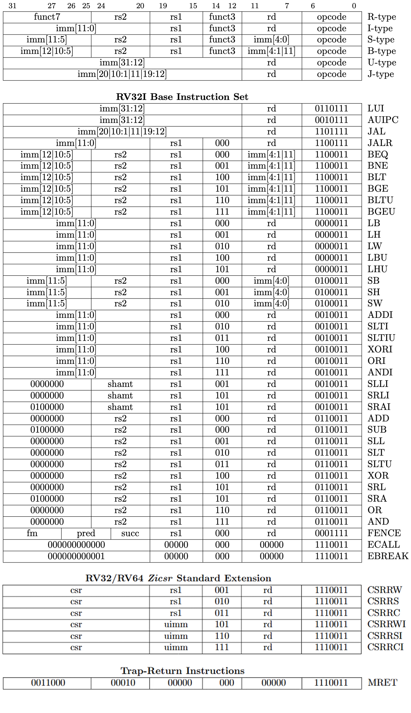
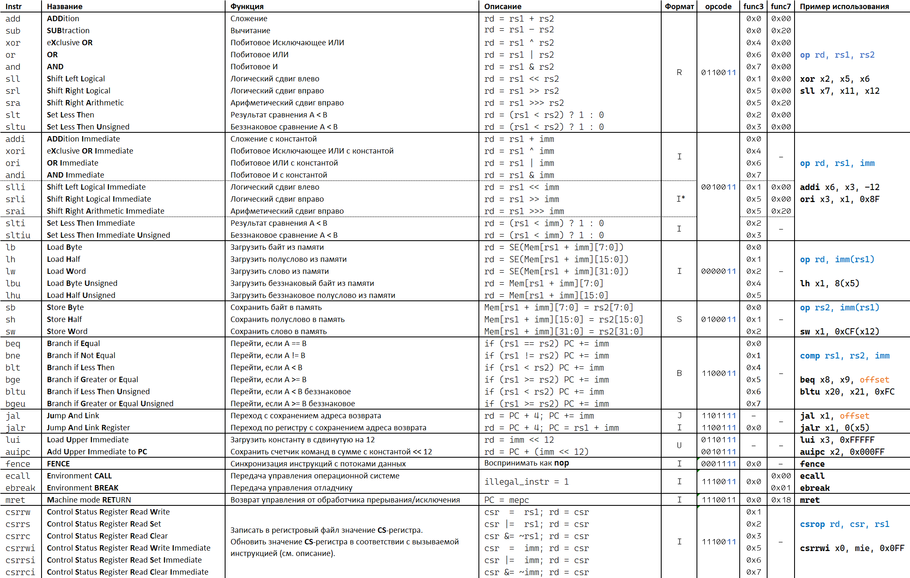

# Lab 5. Instruction Decoder

The control unit (CU) is one of the core blocks of a processor, responsible for decoding instructions and generating control signals for all processor blocks. In this course, the role of the CU (with some caveats) is played by the instruction decoder.

## Objective

Describe an instruction decoder block for a single-cycle **RISC-V** processor in **SystemVerilog**.

## Preparation Materials

- [Instruction encoding formats of the `RV32I` base instruction set](../../Other/rv32i.md).
- [Theory on control and status registers](../../Other/CSR.md).
- [Differences between blocking and non-blocking assignments](../../Basic%20Verilog%20structures/Assignments.md).

## Workflow

1. Study the microarchitecture of the processor core being implemented.
   1. Understand the logic for generating control signals for all instruction types.
2. Study the [instruction decoder signal descriptions](#Instruction-Decoder-Signal-Descriptions).
3. Study the [supported **RISC-V** instruction set and encoding schemes](#Supported-RISC-V-Instruction-Set-and-Encoding-Schemes).
4. Study the **SystemVerilog** constructs to be used for describing the decoder ([#tools](#Tools)).
5. Implement the instruction decoder in **SystemVerilog** ([#task](#Task)).
6. Verify correct operation using the verification environment.

## Proposed RISC-V Processor Microarchitecture

_Fig. 1_ shows the microarchitecture of the RISC-V processor core being implemented.

**The architecture shown is not the assignment for this lab — it merely illustrates how the instruction decoder implemented here will be connected and used later.**


_Figure 1. Microarchitecture of the future processor core._

The proposed microarchitecture is similar to the `CYBERcobra` processor microarchitecture from Lab 4, but with several changes.

First, the processor's inputs and outputs have changed:

- The instruction memory has been moved outside the processor, so the processor now has the `instr_addr_o` and `instr_i` ports;
- The processor also has data memory interface signals:
  - `mem_addr_o` — external memory address;
  - `mem_req_o` — request to access external memory;
  - `mem_size_o` — data size for memory access;
  - `mem_we_o` — write enable signal for external memory;
  - `mem_wd_o` — data to write to external memory;
  - `mem_rd_i` — data read from external memory.
  These signals are used when executing load/store instructions.
- The processor also has a `stall_i` input that halts the program counter update.

Additionally, two new modules have appeared: **Interrupt Controller** and **Control Status Registers**. These modules will provide interrupt support in the processor system.

ALU operand sources have also been added: the program counter, various constants from instructions, and microarchitectural constants — requiring these signals to be multiplexed.

The write-back sources to the register file have also changed, and now include:

- the result of an ALU operation;
- data read from external memory;
- data from the control and status registers module.

To control the expanded set of multiplexers, the data memory interface, and the new modules, a dedicated unit is needed — the Control Unit (CU). In this microarchitecture, the control unit logic is not separated into its own module; it is only highlighted in blue on the diagram. For the most part, the instruction decoder serves as the control unit in the proposed microarchitecture.

## Instruction Decoder Signal Descriptions

The list of instruction decoder ports and their descriptions is given in _Table 1_.

| Signal Name      | Description                                                                                        |
|------------------|----------------------------------------------------------------------------------------------------|
| fetched_instr_i  | Instruction to be decoded                                                                          |
| a_sel_o          | Multiplexer control signal for selecting the first ALU operand                                     |
| b_sel_o          | Multiplexer control signal for selecting the second ALU operand                                    |
| alu_op_o         | ALU operation                                                                                      |
| csr_op_o         | CSR module operation                                                                               |
| csr_we_o         | CSR write enable                                                                                   |
| mem_req_o        | Memory access request (part of the memory interface)                                               |
| mem_we_o         | Memory write enable signal (when zero, a read is performed)                                        |
| mem_size_o       | Control signal for selecting data transfer size during memory read/write (part of memory interface)|
| wb_sel_o         | Multiplexer control signal for selecting data to write back to the register file                   |
| gpr_we_o         | Register file write enable signal                                                                  |
| branch_o         | Signal indicating a conditional branch instruction                                                 |
| jal_o            | Signal indicating an unconditional jump instruction `jal`                                          |
| jalr_o           | Signal indicating an unconditional jump instruction `jalr`                                         |
| mret_o           | Signal indicating a return-from-trap instruction `mret`                                            |
| illegal_instr_o  | Signal indicating an illegal instruction                                                           |

_Table 1. Instruction decoder port descriptions._

This module has only one input: `fetched_instr_i` — the instruction currently being decoded. All other signals are module outputs, which can be grouped into several classes.

### Operation Code Signals

This class includes signals that tell an individual functional block which operation to perform. There are two such blocks: the **ALU** and the **Control and Status Registers** module. The ALU can perform one of 16 operations (introduced in Lab 2), and this signal is used to select which one. You are not yet familiar with the CSR module that appeared in the microarchitecture, but for now it is enough to understand that it can also perform one of several operations and requires a dedicated signal for that purpose.

The operation code signal class therefore includes:

- `alu_op_o`,
- `csr_op_o`.

For convenience, the possible values of these signals are defined as parameters in the `alu_opcodes_pkg` and `csr_pkg` packages respectively.

### Execute-Stage and Write-Back Multiplexer Control Signals

This class includes signals controlling the multiplexers located on the right side of the diagram:

- `a_sel_o`,
- `b_sel_o`,
- `wb_sel_o`.

The `a_sel_o` and `b_sel_o` signals determine the source of data for ALU operands `a_i` and `b_i` respectively. For example, if both operands should come from the register file, the value `0` must be applied to both multiplexer control inputs.

The `wb_sel_o` signal determines the write-back data source for the register file: either the result of an ALU operation, data read from data memory, or data from the control and status registers module.

### Memory Interface

Data memory is used to store and access information required for program execution. Although data memory and the register file both store data, their roles are different: the register file stores data that is being actively processed (within a few instructions), while data memory holds all other information that does not fit in the register file due to its limited size.

The instruction decoder will use the following signals to interact with the data memory subsystem:

- `mem_req_o` — this signal must be asserted to 1 whenever a memory access is required (read or write);
- `mem_we_o` — this signal must be asserted to 1 when writing to memory (0 for reads);
- `mem_size_o` — this signal specifies the data transfer size (possible values are listed in _Table 2_). For convenience, these values are defined as parameters in the `decoder_pkg` package.

| Parameter | `mem_size_o` Value | Description                   |
|-----------|--------------------|-------------------------------|
| LDST_B    | 3'd0               | Signed 8-bit value            |
| LDST_H    | 3'd1               | Signed 16-bit value           |
| LDST_W    | 3'd2               | 32-bit value                  |
| LDST_BU   | 3'd4               | Unsigned 8-bit value          |
| LDST_HU   | 3'd5               | Unsigned 16-bit value         |

_Table 2. Values of the `mem_size_o` signal for different data transfer sizes._

These signals are sufficient for the main memory to understand whether it is being accessed at a given moment, whether a read or write is required, and what size of data is being transferred.

### Write Enable Signals

This category includes two single-bit signals:

- `gpr_we_o` — register file write enable signal (General Purpose Registers, GPR);
- `csr_we_o` — write enable signal for the control and status registers module.

### Program Counter Control Signals

This category includes single-bit signals that indicate an instruction related to a program counter update is being executed:

- `branch_o` — signal indicating a conditional branch instruction;
- `jal_o`    — signal indicating an unconditional jump instruction `jal`;
- `jalr_o`   — signal indicating an unconditional jump instruction `jalr`;
- `mret_o`   — signal indicating a return-from-trap instruction `mret`.

### Illegal Instruction Signal

A signal that must be set to `1` when an instruction arrives that is not in the processor's supported instruction list.

This is not the only action the decoder must take in such a situation. Let us examine in detail what should happen when an illegal instruction arrives.

## Illegal Instruction Handling

There are many reasons why an unsupported instruction might reach the processor for execution, including:

- a compilation error: either a bug in the compiler itself or compilation with incorrect parameters;
- a hardware fault (e.g., a memory malfunction);
- a deliberately inserted unsupported instruction (e.g., to exploit a vulnerability);
- an instruction that is actually supported by the processor but requires a higher privilege level and therefore cannot be executed.

When an unsupported instruction arrives, the control unit must ensure system stability. In the simplest case, the instruction must be skipped while preserving the processor's so-called **architectural state** — that is, the values of all elements that characterize the current system state. These elements include the register file contents, main memory contents, CSR contents, etc. The program counter value is also part of the architectural state; however, in the context of skipping an instruction while preserving the architectural state, its value must be changed — otherwise the system would be stuck in an infinite loop (an unchanged counter would keep pointing to the same instruction that is not supposed to modify the architectural state).

In other words, when an illegal instruction arrives, the control unit (whose role is largely played by the decoder in our system) must ensure that nothing in the system changes except the program counter. The signals that affect the architectural state are:

- `mem_req_o`,
- `mem_we_o`,
- `gpr_we_o`,
- `csr_we_o`,
- `branch_o`,
- `jal_o`,
- `jalr_o`,
- `mret_o`.

That is, all write requests, memory accesses, and any program counter "jumps" must be disabled.

Let us now determine exactly which instructions our processor must support.

### Supported RISC-V Instruction Set and Encoding Schemes

All **RISC-V** architecture instructions can be broadly divided into three categories.

- Computational instructions (operations performed on the ALU with the result written to the register file). These are primarily instructions:
  - using two registers as operands;
  - using a register and an immediate operand from the instruction (a constant).
- Memory access instructions:
  - loading from main memory into the register file;
  - storing data from the register file to main memory.
- Control instructions:
  - Conditional branches
  - Unconditional jumps
  - System instructions
    - access to control and status registers;
    - system calls and return from interrupt handler.

_Table 3_ shows a fragment from the `RISC-V specification`. The upper portion lists 6 instruction encoding formats: **R**, **I**, **S**, **B**, **U**, and **J** (format descriptions are given in _Table 4_). Below that is a list of all instructions with specific field values corresponding to the encoding format of each instruction type.

`rd` denotes the 5-bit destination register address (**r**egister **d**estination), `rs1` and `rs2` are 5-bit source register addresses (**r**egister **s**ource), `imm` is an immediate operand (a constant encoded directly in the instruction), with bit positions and ordering indicated in square brackets. Note that immediate operands have different widths in different encoding formats, and their bits are arranged differently. Immediate operands of all types are interpreted as signed values and require sign extension [[1](https://github.com/riscv/riscv-isa-manual/releases/download/20240411/unpriv-isa-asciidoc.pdf), p. 23]. The exception is 5-bit immediate operands used in CSR instructions.



_Table 3. Base instruction set from the RISC-V specification [[1, p. 554]](https://github.com/riscv/riscv-isa-manual/releases/download/20240411/unpriv-isa-asciidoc.pdf), the standard Zicsr extension [[1, p. 556]](https://github.com/riscv/riscv-isa-manual/releases/download/20240411/unpriv-isa-asciidoc.pdf), and the privileged instruction mret [[2, p. 51]](https://github.com/riscv/riscv-isa-manual/releases/download/20240411/priv-isa-asciidoc.pdf)._

| Encoding | Description                                                                                                                                                    |
|----------|---------------------------------------------------------------------------------------------------------------------------------------------------------------|
| R-type   | Arithmetic and logical operations on two registers, with the result written to a third (the destination register may be the same as one of the source registers) |
| I-type   | Instructions with a 12-bit immediate operand                                                                                                                  |
| S-type   | Store instructions (write to memory)                                                                                                                          |
| B-type   | Branch instructions                                                                                                                                           |
| U-type   | Instructions with a 20-bit "long" immediate operand, shifted left by 12                                                                                       |
| J-type   | The single `jal` instruction, performing an unconditional jump relative to the current program counter                                                        |

_Table 4. RISC-V ISA instruction encoding format descriptions._

### RISC-V Instruction Decoding

As described in the preparation materials, instruction decoding begins with the `opcode` field (**op**eration **code**). This field identifies a group of instructions of the same type. The instruction is then further specified (for most encoding types) through the `func3` and `func7` fields (when present). Note that the positions of these fields are the same across all instruction types (see the upper portion of _Table 3_).

The `rs1`/`rs2`/`imm` and `rd` fields are not needed by the decoder and are used directly for register addressing and constant specification.

Some instructions have no variable fields (for example, the ECALL instruction in _Table 3_). Such instructions must be checked in their entirety (the full 32-bit value must match).

_Table 5_ lists all opcodes of the instructions we are implementing. The opcodes shown are 5 bits because the 2 least significant bits of the full 7-bit opcode must always be `11` for all instructions we are implementing. If this is not the case, the entire instruction is already illegal and requires no further decoding.

For convenience, the opcode values are defined as parameters in the `decoder_pkg` package.

| Parameter | Opcode | Operation Group Description                                                                                        | Short Notation                       |
|-----------|--------|--------------------------------------------------------------------------------------------------------------------|--------------------------------------|
| OP        | 01100  | Write the ALU result of `rs1` and `rs2` to `rd`                                                                    | `rd = alu_op(rs1, rs2)`              |
| OP_IMM    | 00100  | Write the ALU result of `rs1` and `imm` to `rd`                                                                    | `rd = alu_op(rs1, imm)`              |
| LUI       | 01101  | Write the U-type immediate operand `imm_u` to `rd`                                                                 | `rd = imm << 12`                     |
| LOAD      | 00000  | Write memory data at address `rs1+imm` to `rd`                                                                     | `rd = Mem[rs1 + imm]`                |
| STORE     | 01000  | Write `rs2` data to memory at address `rs1+imm`                                                                    | `Mem[rs1 + imm] = rs2`               |
| BRANCH    | 11000  | Increment the program counter by `imm` if the comparison of `rs1` and `rs2` is true                               | `if cmp_op(rs1, rs2) then PC += imm` |
| JAL       | 11011  | Write the next program counter value to `rd`, increment the program counter by `imm`                              | `rd = PC + 4; PC += imm`             |
| JALR      | 11001  | Write the next program counter value to `rd`, set the program counter to `rs1+imm`                                | `rd = PC + 4; PC = rs1+imm`          |
| AUIPC     | 00101  | Write the sum of the U-type immediate operand `imm_u` and the program counter to `rd`                             | `rd = PC + (imm << 12)`              |
| MISC-MEM  | 00011  | Perform no operation                                                                                               | `-`                                  |
| SYSTEM    | 11100  | Write the `csr` value to `rd`. Update `csr` using `rs1`. (or execute `mret`/`ecall`/`ebreak`)                    | `csr = csr_op(rs1); rd = csr`        |

_Table 5. Opcode descriptions._

#### SYSTEM Instructions

SYSTEM instructions are used to access system functions and may require privileged access. These instructions can be divided into two classes:

- Access to **Control and Status Registers** (**CSR**)
- All other instructions (possibly from the privileged instruction set)

To support interrupts in the future, we need to decode instructions of both classes.

Access to the control and status registers is performed using the six instructions of the standard `Zicsr` extension. Each of these instructions (if its fields are legal) performs a write to the CSR and to the register file (the `Control Status Registers` and `Register File` blocks in _Fig. 1_ respectively).

Additionally, to return control to the main instruction stream, an additional `SYSTEM` instruction from the privileged instruction set is needed: `MRET`.

The instructions listed above are "extensions" — they were added on top of the standard instruction set to provide the functionality required by our system. However, there are two more SYSTEM instructions that we must be able to decode, since they are part of the standard instruction set.

The `ECALL` and `EBREAK` instructions trigger an exception. Exceptions and interrupts will be covered in detail in Lab 10; for now, it is enough to know that in our processor system all exceptions will be implemented by asserting 1 on the `illegal_instr_o` signal.

#### MISC-MEM Instructions

In the **RISC-V** base instruction set, the `MISC-MEM` operations include `FENCE`, `FENCE.TSO`, and `PAUSE` (combined into a single `FENCE` instruction in Table 5). In the processor core being implemented, this instruction must not cause any state changes. The `FENCE` instruction in **RISC-V** is needed when working with multiple hardware threads, or "harts" (hart — "**har**dware **t**hread"). It helps synchronize data access between them. **RISC-V** uses a **relaxed memory model**, which allows threads to observe operations of other threads, but not necessarily in the order they appear in program code. A `FENCE` instruction placed between two read and/or write instructions guarantees that other threads will see the first instruction before the second. `FENCE` implementation is optional in **RISC-V**, and in our case it is not necessary since the system does not involve multiple hardware threads. This instruction must be implemented as a `NOP` (**n**o **op**eration).

_Table 6_ shows the instructions from Table 3 with their types, `opcode`, `func3`, `func7` field values, functional descriptions, and usage examples.



_Table 6. Extended description of RV32IZicsr instructions._

> [!IMPORTANT]
> Note the `slli`, `srli`, and `srai` instructions (constant-shift operations). These instructions use a slightly modified **I\*** encoding format. The **I** encoding format provides a 12-bit immediate. Shifting a 32-bit number by more than 31 makes no sense. Only 5 bits are needed to encode the value 31. Therefore, only 5 bits of the 12-bit immediate are used for the shift amount (denoted as the `shamt` field, short for **sh**ift **am**oun**t**), while the remaining 7 bits are unused. Crucially (what a coincidence!), these 7 bits occupy exactly the same position as the `func7` field in other instructions. Therefore, to avoid wasting this portion of the field in `slli`, `srli`, and `srai` — which use the **I** format — it is treated as the `func7` field. This is precisely why in Lab 2 we used only the 5 least significant bits of operand `B` — to discard the portion of the immediate that serves as `func7` in shift operations.

> [!IMPORTANT]
> Also note the `ecall`, `ebreak`, and `mret` instructions. All of these are I-type instructions with a `func3` field equal to zero. From a decoding standpoint, they appear to be the same instruction type with different `imm` values. However, in this specific case (SYSTEM_OPCODE and `func3 == 0`), these instructions must be treated as a full 32-bit match (see _Table 3_).

### Control Signal Generation

As discussed earlier, the instruction decoder in a processor is responsible for converting an instruction into the set of control signals required to execute it. For each instruction in _Table 3_, the decoder must assign a specific value to each of the outputs listed in _Table 1_.

Example: to execute the instruction that writes 32-bit data from the register file to external memory (the `sw` instruction), the decoder must direct two operands (a base address and an offset) to the ALU along with the ALU operation code (addition) to compute the write address. The base address comes from the register file, and the offset is the immediate operand of the S-type instruction. To compute the write address, the decoder must assert the following output values:

- `a_sel_o = 2'd0`,
- `b_sel_o = 3'd3`,
- `alu_op_o = ALU_ADD`.

(see _Figure 1_).

Additionally, for the memory write operation itself, the decoder must generate the memory interface control signals (memory access request, data transfer size, and write enable):

- `mem_req_o  = 1'b1`,
- `mem_size_o = LDST_W` (see _Table 2_),
- `mem_we_o   = 1'b1`.

Although the signals described above are the key ones for a memory write operation, this does not mean that the remaining decoder output signals can take arbitrary values.

Since the `sw` operation is not a jump instruction, the `jal_o`, `jalr_o`, `branch_o`, and `mret_o` signals must be zero (otherwise the processor would jump, which the `sw` instruction does not imply). Similarly, since nothing should be written to the register file or CSRs during a memory write, `gpr_we_o` and `csr_we_o` must also be zero.

In other words, it is critically important to track all output signals that affect the processor's architectural state and that are not explicitly involved in the current instruction.

The `wb_sel` signal, however, can take any value (since the register file write enable is zero, it does not matter what the write-back source is — nothing will be written to the register file regardless).

Of course, when implementing the instruction decoder module, it would be impractical to specify values for all 14 outputs for each of the 47 instructions, especially since many outputs have the same value for all instructions sharing the same opcode. It is most convenient to describe them grouped by opcode.

_Table 7_ lists the instruction decoder output signals and the instruction groups for which these outputs can take a non-zero value.

| Signal Name     | Description                                                                                        | Opcodes for Which a Non-Zero Value Is Possible (see Table 6) |
|-----------------|----------------------------------------------------------------------------------------------------|--------------------------------------------------------------|
| a_sel_o         | Multiplexer control signal for selecting the first ALU operand                                     | All except MISC_MEM and SYSTEM                               |
| b_sel_o         | Multiplexer control signal for selecting the second ALU operand                                    | All except MISC_MEM and SYSTEM                               |
| alu_op_o        | ALU operation                                                                                      | All except MISC_MEM and SYSTEM                               |
| csr_op_o        | CSR module operation                                                                               | SYSTEM only                                                  |
| csr_we_o        | CSR write enable                                                                                   | SYSTEM only                                                  |
| mem_req_o       | Memory access request (part of the memory interface)                                               | LOAD and STORE                                               |
| mem_we_o        | Memory write enable signal (when zero, a read is performed)                                        | STORE only                                                   |
| mem_size_o      | Control signal for selecting data transfer size (part of memory interface)                         | LOAD and STORE                                               |
| gpr_we_o        | Register file write enable signal                                                                  | All except STORE, BRANCH, MISC_MEM                           |
| wb_sel_o        | Multiplexer control signal for selecting write-back data                                           | All except STORE, BRANCH, MISC_MEM                           |
| illegal_instr_o | Signal indicating an illegal instruction                                                           | All except JAL, LUI, AUIPC                                   |
| branch_o        | Signal indicating a conditional branch instruction                                                 | BRANCH only                                                  |
| jal_o           | Signal indicating an unconditional jump instruction jal                                            | JAL only                                                     |
| jalr_o          | Signal indicating an unconditional jump instruction jalr                                           | JALR only                                                    |
| mret_o          | Signal indicating a return-from-trap instruction mret                                              | SYSTEM only                                                  |

_Table 7. Instruction decoder port descriptions._

The decoder must assert `illegal_instr_o` in the following cases:

- the two least significant bits of the opcode are not equal to `11`;
- the `opcode` field value does not match any known opcode, and therefore the operation is undefined;
- the `func3` or `func7` fields contain invalid values for the given opcode.

Furthermore, since the microarchitecture shown in _Fig. 1_ supports only one exception (via the `illegal_instr_o` signal), this signal must also be asserted in the case of:

- an `ECALL` / `EBREAK` instruction.

## Tools

**SystemVerilog** is a hardware description language. Using this language, a designer either tells a synthesizer what hardware to produce, or tells a simulator how to verify that hardware. A synthesizer is a program that builds a digital device from logic elements based on the description provided. The synthesizer inside **Vivado** needs to be told what is expected of it. For instance, to ask directions from a Spanish speaker you need to speak Spanish — otherwise they cannot help. And if you speak Spanish well, you can likely phrase the same question in multiple ways. **SystemVerilog** works the same way — the same device can be described by different code, but the synthesis result may be identical. However, two semantically equivalent descriptions can sometimes synthesize into different hardware that is functionally identical yet may differ in performance, for example. Similarly, the same language constructs can be used to synthesize different digital elements.

The decoder is a combinational circuit. This means that the same input values will always produce the same output values.

Combinational circuits can be described in various ways — for example, using the continuous assignment operator `assign`. The `case` construct works well for describing a decoder; it synthesizes not into a multiplexer but into a combinational circuit with optimal critical-path characteristics. In the pre-HDL era, designers had to construct enormous truth tables and [Karnaugh maps](https://en.wikipedia.org/wiki/Karnaugh_map) to find optimal implementations. Today, the synthesizer handles this task automatically — it finds the most efficient solution from the device description.

The difference from a multiplexer implementation is that here the right-hand side of every assignment is always a constant. This effectively becomes a way to describe a truth table. Such code is easy to edit and navigate.

Consider _Listing 1_. Inside the `always_comb` block, default values are specified before the `case` construct. This eliminates the need to specify all signals inside every `case` handler — only those that differ from the default value need to be listed. The example implements a combinational circuit that, when `control_signal == 4'b1100`, asserts `c = 1'b0` (a value different from its default). Signal `a` is not modified, so it does not appear in the corresponding handler. If `sub_signal == 1'b0`, then `b` equals 1 and `d` equals 0. If `sub_signal == 1'b1`, the reverse is true — `b` equals 0 and `d` equals 1.

```Verilog
module example (
  input  logic [3:0] control_signal,
  input  logic       sub_signal,
  output logic       a, b, c, d
);
  parameter logic [3:0] SOME_PARAM = 4'b1100;
  always_comb begin
    a = 1'b0;             // default values
    b = 1'b0;             // note that blocking assignment is used
    c = 1'b1;             // inside the always_comb block
    d = 1'b0;
    case(control_signal)
      // ...                 some other combinations
      SOME_PARAM: begin   // if control_signal equals SOME_PARAM
        c = 1'b0;
        case (sub_signal)
          1'b0: b = 1'b1; // if sub_signal is 1'b0
          1'b1: d = 1'b1; // if sub_signal is 1'b1
        endcase
      end
      // ...                 some other handlers
      default: begin      // since not all values of
        a = 1'b0;         // control_signal are listed, a default
        b = 1'b0;         // is required to prevent the case
        c = 1'b1;         // construct from inferring a latch
        d = 1'b0;
      end
    endcase
  end

endmodule
```

_Listing 1. Example decoder description._

Keep in mind that the default values specified at the beginning of the `always_comb` block can only be used this way with **blocking assignments** (which [should be](../../Basic%20Verilog%20structures/Assignments.md) used exclusively in combinational blocks).

Furthermore, the use of nested `case` blocks is only justified when implementing a decoder block (i.e., when all right-hand side values in assignments are constants, not other signals). When describing a multiplexer, nested `case` blocks may synthesize into a cascade of multiplexers, which will negatively affect the timing characteristics of the circuit.

## Assignment

Implement the instruction decoder module for a single-cycle RISC-V processor in **SystemVerilog**, following the proposed microarchitecture. The module prototype is given in _Listing 2_.

```Verilog
module decoder (
  input  logic [31:0]  fetched_instr_i,
  output logic [1:0]   a_sel_o,
  output logic [2:0]   b_sel_o,
  output logic [4:0]   alu_op_o,
  output logic [2:0]   csr_op_o,
  output logic         csr_we_o,
  output logic         mem_req_o,
  output logic         mem_we_o,
  output logic [2:0]   mem_size_o,
  output logic         gpr_we_o,
  output logic [1:0]   wb_sel_o,
  output logic         illegal_instr_o,
  output logic         branch_o,
  output logic         jal_o,
  output logic         jalr_o,
  output logic         mret_o
);
  import decoder_pkg::*;

endmodule
```

_Listing 2. Instruction decoder prototype._

Depending on coding style, the module may span over a hundred lines of code, but this does not make it difficult to implement. At its core, the decoder is simply a large `case` block describing which signals take which values under which conditions. The work requires attention, some patience, and a clear understanding of what is being done. There will almost certainly be bugs that need to be fixed. Bugs are normal — those who do nothing make no mistakes — and fixing them provides invaluable development experience. The implementation may feel tedious at times, but by the end of Lab 7, the satisfaction from the result will show that it was worth it.

## Steps

1. Carefully study the instruction decoder output signals and how they control the functional blocks of the processor core shown in _Fig. 1_, as well as the instruction types. If you have questions, consult the instructor.
2. Add the file [`alu_opcodes_pkg.sv`](alu_opcodes_pkg.sv) to the project's `Design Sources` (if it has not already been added during Lab 2), as well as the files [`csr_pkg.sv`](csr_pkg.sv) and [`decoder_pkg.sv`](decoder_pkg.sv). These files contain parameters that will be useful when describing the decoder.
3. Describe the instruction decoder module with the same name and ports as specified in the task.
   1. For convenience, it is recommended to first create `opcode`, `func3`, and `func7` signals and assign them the corresponding bits of the input instruction signal.
   2. The module can be described in many ways: each output signal can be described through its own combinational logic in a separate `case` block, but the simplest approach is to describe all signals using nested `case` blocks inside a single `always_comb` block.
   3. Inside the `always_comb` block, before the `case` block, you can specify default values for all output signals. This is not the same as the `default` branch in a `case` block. Here you can describe the states that will be most commonly used; a signal assignment then only needs to appear where an instruction requires a value different from the default.
   4. You can then describe the main `case` block, which determines the operation type from the opcode.
   5. Once the operation type is identified, you can determine the specific operation from the `func3` and `func7` fields (if present for that type).
   6. Remember that if at any stage (type identification or specific operation identification) a field value arrives that is not defined in the ISA, the `illegal_instr_o` signal must be asserted.
   7. In the case of an illegal instruction, you must guarantee that no conditional or unconditional jump occurs, and that nothing is written to external memory, the register file, or the CSRs. It does not matter what the ALU executes or what data is selected at the write-back multiplexer. What matters is that no write actually occurs to any of these units (consider which signal values are needed to ensure this).
4. Verify the module using the verification environment provided in the file [`lab_05.tb_decoder.sv`](lab_05.tb_decoder.sv). After the first run, you may encounter a large number of error messages. You must [investigate](../../Vivado%20Basics/05.%20Bug%20hunting.md) these errors on the waveform and fix them in your module.
   1. Before starting simulation, make sure the correct top-level module is selected in `Simulation Sources`.
5. This lab does not include verification on the FPGA board.

## References

1. [The RISC-V Instruction Set Manual Volume I: Unprivileged ISA](https://github.com/riscv/riscv-isa-manual/releases/download/20240411/unpriv-isa-asciidoc.pdf)
2. [The RISC-V Instruction Set Manual Volume II: Privileged Architecture](https://github.com/riscv/riscv-isa-manual/releases/download/20240411/priv-isa-asciidoc.pdf)
