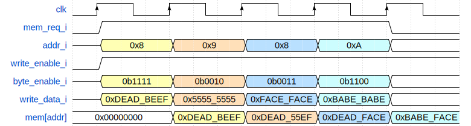

# Лабораторная работа 6 "Основная память"

Процессор CYBERcobra 2000 использовал в качестве основного хранилища данных регистровый файл, однако на практике 31-го регистра недостаточно для выполнения сложных программ. Для этих целей используется **основная память**, роль которой в нашей системе будет выполнять **память данных**.

## Цель

Описать память данных, с побайтовой адресацией.

## Материал для подготовки к лабораторной работе

Для успешного выполнения лабораторной работы, вам необходимо использовать навыки, полученные при написании [лабораторной работы №3](../03.%20Register%20file%20and%20memory/) "Регистровый файл и память инструкций";

## Теория

В задании по реализации памяти инструкций [лабораторной работы №3](../03.%20Register%20file%20and%20memory/) байтовая адресация была описана следующим образом:

> Байтовая адресация означает, что процессор способен обращаться к отдельным байтам в памяти (за каждым байтом памяти закреплен свой индивидуальный адрес).

Данное описание было дано не совсем корректным образом, чтобы в третьей лабораторной работе было более четкое понимание задания. В чем заключается некорректность? Процессор должен быть способен не только **обращаться** к отдельным байтам в памяти, но и **обновлять** в памяти любой отдельный байт, а также **считывать** отдельные байты.

Вопрос считывания отдельного байта будет решаться специальным модулем **загрузки и сохранения**. Памяти данных при этом будет достаточно возвращать всё слово, содержащее запрашиваемый байт как это уже было сделано памяти инструкций.

Нас интересует возможность памяти обновлять любой из байт в слове. Подобный функционал часто используется при реализации памяти и в системных интерфейсах, например AXI4 или APB. Для этого используется специальный сигнал, который называется `byte enable`. Разрядность этого сигнала равна числу байт в шине данных (в нашем случае разрядность `byte enable` составляет 4). Вы можете представить этот сигнал, как 4 провода, каждый из которых является сигналом разрешения записи для отдельной памяти с шириной данных в 1 байт.

Давайте разберемся как это будет работать. Допустим, мы хотим записать значение `0xA5` по адресу `0x6`. Поскольку мы работаем с байтовой адресацией, а ячейки памяти 32-битные — как и при реализации памяти инструкций, пришедший адрес необходимо будет разделить на 4 (см. _рис. 1_). В итоге мы получим указатель на первую 32-битную ячейку памяти (`6 / 4 = 1`). Однако, чтобы пришедшие данные были в итоге записаны не в нулевой байт первого слова (четвертый байт памяти), а во второй, мы будем использовать сигнал `byte enable`, второй бит которого будет равен `1`. Это значит, что лучше разделить запись в отдельные байты памяти и для каждого байта проверять отдельно соответствующий бит `byte enable`, независимо от остальных.


_Рисунок 1. Связь адреса байта с индексом слова в массиве ячеек памяти и сигналом byte enable._

Чтобы данные остальных байт не были испорчены, при описании памяти на SystemVerilog нужно разделить запись в отдельные байты. Для того, чтобы получить доступ к отдельным диапазонам бит ячейки памяти, после указания индекса ячейки необходимо указать диапазон бит, к которым вы хотите получить доступ. К примеру, чтобы получить доступ к битам с 5-го по 3-ий 18-ой ячейки памяти, необходимо использовать следующую запись:

```SystemVerilog
mem[18][5:3];
```

Учитывайте и то, что комбинации значений бит в сигнале `byte enable` могут быть любыми: `0000`, `0100`, `0110`, `1111` и т.п.

## Задание

Реализовать память данных с поддержкой обновления отдельных байт в выбранной ячейке памяти.

У данного модуля будет шесть входных/выходных сигналов:

- вход тактового синхроимпульса
- вход запроса на работу с памятью
- вход сигнала разрешения записи
- 32-битный вход адреса
- 32-битный вход данных записи
- 32-битный выход данных синхронного чтения

Прототип модуля следующий:

```SystemVerilog
module data_mem
import memory_pkg::DATA_MEM_SIZE_BYTES;
import memory_pkg::DATA_MEM_SIZE_WORDS;
(
  input  logic        clk_i,
  input  logic        mem_req_i,
  input  logic        write_enable_i,
  input  logic [ 3:0] byte_enable_i,
  input  logic [31:0] addr_i,
  input  logic [31:0] write_data_i,
  output logic [31:0] read_data_o,
  output logic        ready_o
);
```

Как и память инструкций, память данных будет состоять из 32-битных ячеек, количество которых определяется параметром. Как и в памяти инструкций, необходимо использовать только младшие биты адреса в количестве, равном логарифму по основанию 2 от количества ячеек памяти, начиная со второго бита (см. код памяти инструкций из [ЛР№3](../03.%20Register%20file%20and%20memory/#1-память-инструкций)).

Отличие от памяти инструкций будет заключаться в:

- синхронном порте на чтение;
- наличии порта на запись;
  - посредством этого порта на запись можно менять отдельные байты ячейки памяти.

Синхронный порт на чтение означает, что выдача данных по предоставленному адресу осуществляется не сразу же, а на следующий такт (см. _рис. 2_). Для этого, перед выходным сигналом ставится отдельный регистр. Таким образом, выдача данных с порта на чтение будет осуществляться не с помощью непрерывного присваивания, а посредством блока `always_ff` (см. практическую часть ЛР№3).

Также в памяти появилось три управляющих сигнала:

- `mem_req_i`,
- `write_enable_i`,
- `byte_enable_i`

и один статусный:

- `ready_o`.

Сигнал `mem_req_i` является сигналом запроса на работу с памятью. Без этого сигнала память не должна выполнять операции чтения/записи. Как сделать так, чтобы не происходило чтение без запроса? Например, не обновлять значение, считанное во время предыдущей операции чтения.

Сигнал `write_enable_i` является сигналом разрешения записи. Этот сигнал определяет, является ли пришедший запрос в память **запросом на запись**, либо же **запросом на чтение**.

Если `mem_req_i == 1` и `write_enable_i == 0`, то происходит запрос на чтение из памяти. В этом случае, необходимо записать в выходной регистр `read_data_o` значение из ячейки, на которую указывает `addr_i`. Во всех других случаях чтение из памяти не производится (`read_data_o` сохраняет предыдущее значение).


_Рисунок 2. Операции запросов на чтение._

Если `mem_req_i == 1` и `write_enable_i == 1`, то происходит запрос на запись в память. В этом случае, необходимо записать значение `write_data_i` в ячейку по, на которую указывает `addr_i`. Во всех других случаях (любой из сигналов `mem_req_i`, `write_enable_i` равен нулю), запись в память не производится. Запись необходимо производить только в те байты указанной ячейки, которым соответствуют биты сигнала `byte_enable_i`, равные 1.

На _рис. 3_ показан пример записей по различным адресам. Т.к. деление на 4 любого из приведенных на _рис. 3_ адресов дает результат 2, на рисунке показано только содержимое второй 32-битной ячейки памяти и то, как оно менялось в зависимости от комбинации сигналов `write_data_i` и `byte_enable_i`.



_Рисунок 3. Операции запросов на запись._

Выход `ready_o` в данном модуле должен всегда быть равен 1, поскольку данные всегда будут выдаваться на следующий такт. В реальности, обращение в память может занимать сотни тактов процессора, причем их число бывает недетерминированным (нельзя заранее предсказать сколько тактов займет очередной запрос в память). Именно поэтому стандартные интерфейсы обычно используют такие сигналы как `ready` или `valid`, позволяющие синхронизировать разные блоки системы. Сигнал `ready_o` в нашем интерфейсе используется сигнала о задержке в выдаче данных. В случае, если устройству нужно больше одного такта, чтобы выдать данные, он устанавливает на данный сигнал значение `0` до тех пор, пока данные не будут готовы.

## Порядок выполнения работы

1. Внимательно ознакомьтесь с заданием. В случае возникновения вопросов, проконсультируйтесь с преподавателем.
2. Реализуйте память данных. Для этого:
   1. В `Design Sources` проекта создайте `SystemVerilog`-файл `data_mem.sv`.
   2. Опишите в нем модуль памяти данных с таким же именем и портами, как указано в задании.
      1. Описание модуля будет схожим с описанием модуля памяти инструкций, однако порт чтения в этот раз будет **синхронным** (запись в него будет происходить в блоке `always_ff`). Количество ячеек памяти данных определяется параметром `DATA_MEM_SIZE_WORDS`, определенным в `memory_pkg`. Кроме того, необходимо будет описать логику записи данных в память.
      2. Запись в ячейки памяти описывается подобно записи данных в [регистры](../../Basic%20Verilog%20structures/Registers.md), только при этом, происходит доступ к конкретной ячейке памяти с помощью входа `addr_i`.
      3. Перед тем как обратиться к ячейке памяти, значение с `addr_i` необходимо преобразовать по аналогии с памятью инструкций.
      4. Обратите внимание что работа с памятью должна осуществляться только когда сигнал `mem_req_i == 1`. В противном случае запись не должна производиться, а на шине `read_data_o` должен оставаться результат предыдущего чтения.
      5. При этом запись должна вестись только в те байты выбранной ячейки памяти, которым соответствуют биты сигнала `byte_enable_i`, выставленные в `1`.
      6. У памяти есть дополнительный выход `ready_o`, который всегда равен единице.
   3. После описания модуля его необходимо проверить с помощью тестового окружения.
      1. Тестовое окружение находится [`здесь`](tb_data_mem.sv).
      2. Для запуска симуляции воспользуйтесь [`этой инструкцией`](../../Vivado%20Basics/Run%20Simulation.md).
      3. Перед запуском симуляции убедитесь, что в качестве top-level модуля выбран корректный (`tb_data_mem`).
      4. **По завершению симуляции убедитесь, что в логе есть сообщение о завершении теста!**
