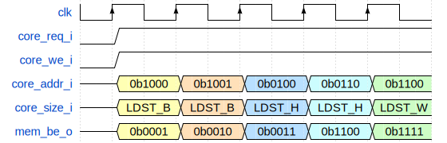
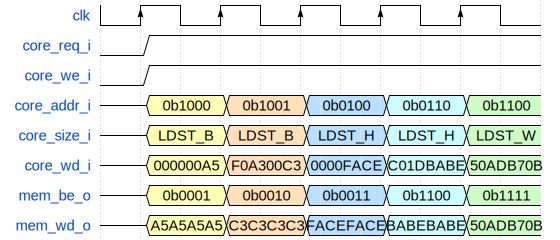
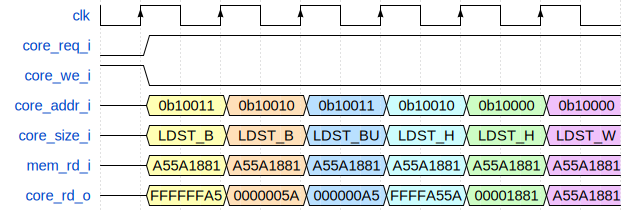
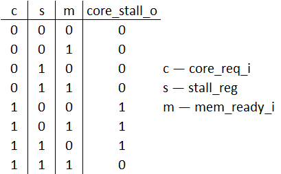

# Лабораторная работа 8 "Блок загрузки и сохранения"

Итогом шестой лабораторной работы стал практически завершенный процессор архитектуры RISC-V. Особенностью той реализации процессора было отсутствие поддержки инструкций `LB`, `LBU`, `SB`, `LH`, `LHU`, `SH`. Тому было две причины:

- подключенный к памяти данных сигнал `byte_enable_i` был аппаратно зафиксирован на значении `4'b1111`, но на самом деле этим сигналом должен кто-то управлять;
- необходимо подготовить считанные из памяти полуслова / байты для записи в регистровый файл.

Для этих целей используется специальный модуль — **Блок загрузки и сохранения** (**Load and Store Unit**, **LSU**).

## Цель

Разработка блока загрузки и сохранения для подключения к внешней памяти данных, поддерживающей запись в отдельные байты памяти.

---

## Ход работы

Изучить:

- Функции и задачи блока загрузки/сохранения
- Интерфейс процессора и блока загрузки/сохранения
- Интерфейс блока загрузки/сохранения и памяти

Реализовать и проверить модуль `riscv_lsu`.

---

## Теория

Модуль загрузки и сохранения (**Load/Store Unit** – **LSU**) служит для исполнения инструкций типа `LOAD` и `STORE`: является прослойкой между внешним устройством – памятью, и ядром процессора. **LSU** считывает содержимое из памяти данных или записывает в нее требуемые значения, преобразуя 8- и 16-битные данные в знаковые или беззнаковые 32-битные числа для регистров процессора. В процессорах с **RISC** архитектурой с помощью **LSU** осуществляется обмен данными между регистрами общего назначения и памятью данных.


_Рисунок 1. Место LSU в микроархитектуре RISC-процессора._

### Интерфейс процессора и блока загрузки/сохранения

На входной порт `core_addr_i` от процессора поступает адрес ячейки памяти, к которой будет произведено обращение. Намеренье процессора обратиться к памяти (и для чтения, и для записи) отражается выставлением сигнала `core_req_i` в единицу. Если процессор собирается записывать в память, то сигнал `core_we_i` выставляется в единицу, а сами данные, которые следует записать, поступают от него на вход `core_wd_i`. Если процессор собирается читать из памяти, то сигнал `core_we_i` находится в нуле, а считанные данные подаются для процессора на выход `core_rd_o`.

Инструкции `LOAD` и `STORE` в **RV32I** поддерживают обмен 8-битными, 16-битными или 32-битными значениями, однако в самом процессоре происходит работа только с 32-битными числами, поэтому загружаемые из памяти байты и послуслова необходимо предварительно расширить до 32-битного значения. Расширять значения можно либо знаковым битом, либо нулями — в зависимости от того как должно быть интерпретировано загружаемое число: как знаковое или беззнаковое. Во время записи данных в память, они не расширяются, поскольку в отличие от регистрового файла, основная память имеет возможность обновлять отдельные байты. Таким образом, различать знаковые и беззнаковые числа необходимо только на этапе загрузки, но не сохранения.

Для выбора разрядности и формата представления числа, на вход **LSU** подается сигнал `core_size_i`, принимающий следующие значения (для удобства использования, данные значения определены в виде параметров в пакете `decoder_pkg`):

| Параметр |Значение|           Пояснение           |
|----------|--------|-------------------------------|
|  LDST_B  |  3'd0  |Знаковое 8-битное значение     |
|  LDST_H  |  3'd1  |Знаковое 16-битное значение    |
|  LDST_W  |  3'd2  |32-битное значение             |
|  LDST_BU |  3'd4  |Беззнаковое 8-битное значение  |
|  LDST_HU |  3'd5  |Беззнаковое 16-битное значение |

Для операций типа `STORE` формат представления чисел не важен, для них `core_size_i` сможет принимать значение только от 0 до 2.

Выходной сигнал `core_stall_o` нужен для приостановки программного счетчика. Ранее логика этого сигнала временно находилась в модуле `riscv_unit` — теперь она займет свое законное место в модуле **LSU**.

### Интерфейс блока загрузки/сохранения и памяти

Память данных имеет 32-битную разрядность ячейки памяти и поддерживает побайтовую адресацию. Это значит, что существует возможность обновить любой байт пределах одного слова (4-байтовой ячейки памяти), не изменяя слова целиком. Для указания на обновляемые байты интерфейс к памяти предусматривает использование 4-битного сигнала `mem_be_o`, подаваемого вместе с адресом слова `mem_addr_o`. Позиции битов 4-битного сигнала соответствуют позициям байт в слове. Если конкретный бит `mem_be_o` равен 1, то соответствующий ему байт в памяти будет обновлен. Данные для записи подаются на выход `mem_wd_o`. На результат чтения из памяти состояние `mem_be_o` не влияет, так как чтение производится всегда по 32-бита.

После получения запроса на чтение/запись из ядра **LSU** перенаправляет запрос в память данных, взаимодействие осуществляется следующими сигналами:

- сигнал `mem_req_o` сообщает памяти о наличии запроса в память (напрямую подключен к `core_req_i`);
- сигнал `mem_we_o` сообщает памяти о типе этого запроса (напрямую подключен к `core_we_i`):
  - `mem_we_o` равен 1, если отправлен запрос на запись,
  - `mem_we_o` равен 0, если отправлен запрос на чтение;
- сигнал `mem_wd_o` содержит данные на запись в память. В зависимости от размера записи, данные этого сигнала будут отличаться от пришедшего сигнала `core_wd_i` и будут является результатом определенных преобразований.
- сигнал `mem_rd_i` содержит считанные из памяти данные. Перед тем, как вернуть считанные данные ядру через выходной сигнал `core_rd_o`, эти данные будет необходимо подготовить.
- сигнал `mem_ready_i` сообщает о готовности памяти завершить транзакцию на текущем такте. Этот сигнал используется для управления выходным сигналом `core_stall_o`.

<!-- |Команды| Byte Offset |              lsu_data_o                         |
|-------|-------------|-------------------------------------------------|
|  lb   |     00      | {{24{data_rd_i[7]}}, data_rd_i[7:0]}      |
|       |     01      | {{24{data_rd_i[15]}}, data_rd_i[15:8]}    |
|       |     10      | {{24{data_rd_i[23]}}, da-ta_rd_i[23:16]}  |
|       |     11      | {{24{data_rd_i[31]}}, da-ta_rd_i[31:24]}  |
|  lh   |     00      | {{16{data_rd_i[15]}}, da-ta_rd_i[15:0]}   |
|       |     10      | {{16{data_rd_i[31]}}, da-ta_rd_i[31:16]}  |
|  lw   |     00      | data_rd_i[31:0]                              |
|  lbu  |     00      | {24’b0, data_rd_i[7:0]}                      |
|       |     01      | {24’b0, data_rd_i[15:8]}                     |
|       |     10      | {24’b0, data_rd_i[23:16]}                    |
|       |     11      | {24’b0, data_rd_i[31:24]}                    |
|  lhu  |     00      | {16’b0, data_rd_i[15:0]}                     |
|       |     10      | {16’b0, data_rd_i[31:16]}                    | -->

<!-- |Команды| Byte Offset |      data_wd_o      |         data_be_o         |
|  sb   |      00     | { 4{lsu_data_i[7:0]} } |           0001            |
|       |      01     |                        |           0010            |
|       |      10     |                        |           0100            |
|       |      11     |                        |           1000            |
|  sh   |      00     | { 2{lsu_data_i[15:0]} }|           0011            |
|       |      10     |                        |           1100            |
|  sw   |      00     | lsu_data_i[31:0]       |           1111            | -->

---

## Практика

> Познай как описать выходные сигналы модуля — и ты познаешь как описать сам модуль. ©Джейсон Стейтем

Реализация любого модуля сводится к реализации логики, управляющей каждым отдельным выходным сигналом посредством входных сигналов. Разберем принцип работы каждого выходного сигнала:

### mem_req_o, mem_we_o, mem_addr_o

Все эти сигналы подключаются напрямую к соответствующим core-сигналам:

- `mem_req_o` к `core_req_i`;
- `mem_we_o` к `core_we_i`;
- `mem_addr_o` к `core_addr_i`.

### mem_be_o

Данный сигнал принимает ненулевые значения только по запросу на запись (`core_req_i == 1`, `core_we_i == 1`), во время которого происходит мультиплексирование сигнала `core_size_i`. Если `core_size_i` соответствует инструкции записи байта (`LDST_B`, 3'd0), то в сигнале `mem_be_o` бит с индексом равным значению двух младших бит адреса `core_addr_i` должен быть равен единице.

Допустим, пришел запрос на запись байта по адресу 18:

- `core_req_i == 1`,
- `core_we_i == 1`,
- `core_size_i == LDST_B`
- `core_addr_i == 32'b10010`

В данном случае, необходимо выставить единицу во втором (считая с нуля) бите сигнала `mem_be_o` (поскольку значение двух младших бит `core_addr_i` равно двум): `mem_be_o == 4'b0100`.

Если пришел запрос на запись полуслова (`core_size_i == LDST_H`), то в сигнале `mem_be_o` необходимо выставить в единицу либо два старших, либо два младших бита (в зависимости от `core_addr_i[1]`: если `core_addr_i[1] == 1`, то в двух старших битах, если `core_addr_i[1] == 0`, то в двух младших).

Если пришел запрос на запись слова (`core_size_i == LDST_W`), то в сигнале `mem_be_o` необходимо выставить в единицу все биты.



_Рисунок 2. Временна́я диаграмма запросов на запись со стороны ядра и сигнала mem\_be\_o._

### mem_wd_o

Сигнал `mem_wd_o` функционально связан с сигналом `mem_be_o`, т.к. они оба выполняют функцию записи конкретных байт в памяти. Допустим процессор хочет записать байт `0xA5` по адресу 18. Для этого он формирует сигналы:

- `core_req_i == 1`,
- `core_we_i == 1`,
- `core_size_i == LDST_B`
- `core_addr_i == 32'b10010`
- `core_wd_i == 32h0000_00A5`

Мы уже знаем, что `mem_be_o` должен быть при этом равен `4'b0100`. Однако если в память придут сигналы:

- `mem_be_o == 4'b0100`,
- `mem_wd_o == 32'h0000_00A5`

то по адресу 18 будет записано значение `0x00` (поскольку второй байт на шине `mem_wd_o` равен нулю).

Для того, чтобы по 18-ому адресу записалось значение `A5`, это значение должно оказаться во втором байте `mem_wd_o`. А в случае 17-го адреса, значение должно оказаться в первом байте и т.п.

Получается, что в случае записи байта, проще всего продублировать записываемый байт во все байты шины `mem_wd_o`, ведь в память запишется только тот, которому будет соответствовать бит `mem_be_o`, равный единице. Дублирование можно осуществить с помощью [конкатенации](../../Basic%20Verilog%20structures/Concatenation.md).

В случае записи полуслова (`core_size_i == LDST_H`) ситуация схожа, только теперь дублировать надо не 1 байт 4 раза, а полслова (16 младших бит шины `core_wd_i`) два раза.

В случае записи слова (`core_size_i == LDST_W`), сигнал `mem_wd_o` будет повторять сигнал `core_wd_i`.



_Рисунок 3. Временна́я диаграмма запросов на запись со стороны ядра и сигнала mem\_wd\_o._

### core_rd_o

Сигнал `core_rd_o` — это сигнал, который будет содержать данные для записи в регистровый файл процессора во время инструкций загрузки из памяти (`LW`, `LH`, `LHU`, `LB`, `LBU`).

Предположим, по адресам `16-19` лежит слово `32'hA55A_1881` (см. _рис. 4_). Чтение по любому из адресов 16, 17, 18, 19 вернет это слово на входном сигнале `mem_rd_i`. В случае инструкции `LB` (чтение байта, который интерпретируется как знаковое число, во время которого `core_size_i == LDST_B`) по адресу 19, в регистровый файл должно быть записано значение `32'hFFFF_FFA5`, поскольку по 19-ому адресу лежит байт `A5`, который затем будет знакорасширен. В случае той же самой инструкции, но по адресу 18, в регистровый файл будет записано значение `32'h0000_005A` (знакорасширенный байт `5A`, расположенный по 18ому адресу).

Получить нужный байт можно из входного сигнала `mem_rd_i`, но чтобы понять какие биты этого сигнала нас интересуют, необходимо посмотреть на входные сигналы `core_size_i` и `core_addr_i[1:0]`. `core_size_i` сообщит конкретный тип инструкции (сколько нужно взять байт из считанного слова), а `core_addr_i[1:0]` укажет номер начального байта, который нужно взять из `mem_rd_i`.

В случае инструкции `LH` будет все тоже самое, только знакорасширяться будет не байт, а полуслово.

А для инструкций `LBU` и `LHU` будет все тоже самое, только результат будет не знакорасширен, а дополнен нулями.

Для инструкций `LW` на выход `core_rd_o` пойдут данные `mem_rd_i` без изменений.



_Рисунок 4. Временна́я диаграмма запросов на чтение со стороны ядра и сигнала core\_rd\_o._

### core_stall_o

Сигнал `core_stall_o` запрещает менять значение программного счетчика на время обращения в память. Этот сигнал должен:

- стать равным единице в тот же такт, когда пришел сигнал `core_req_i`
- удерживать это значение до тех пор, пока не придет сигнал `mem_ready_i`, но не менее 1 такта (т.е. даже если сигнал `mem_ready_i` будет равен единице, `core_req_i` должен подняться хотя бы на 1 такт).

Для реализации подобного функционала вам потребуется вспомогательный регистр `stall_reg`, каждый такт записывающий значение выхода `core_stall_o` и таблица истинности для этого выхода, представленная на _рис. 5_.



_Рисунок 5. Таблица истинности выхода `core_stall_o`._

---

## Задание

Реализовать блок загрузки и сохранения со следующим прототипом:

```SystemVerilog
module riscv_lsu(
  input logic clk_i,
  input logic rst_i,

  // Интерфейс с ядром
  input  logic        core_req_i,
  input  logic        core_we_i,
  input  logic [ 2:0] core_size_i,
  input  logic [31:0] core_addr_i,
  input  logic [31:0] core_wd_i,
  output logic [31:0] core_rd_o,
  output logic        core_stall_o,

  // Интерфейс с памятью
  output logic        mem_req_o,
  output logic        mem_we_o,
  output logic [ 3:0] mem_be_o,
  output logic [31:0] mem_addr_o,
  output logic [31:0] mem_wd_o,
  input  logic [31:0] mem_rd_i,
  input  logic        mem_ready_i
);

```


_Рисунок 6. Структурная схема модуля `riscv_lsu`._

---

### Порядок выполнения задания

1. Внимательно ознакомьтесь с описанием функционального поведения выходов **LSU**. В случае возникновения вопросов, проконсультируйтесь с преподавателем.
2. Реализуйте модуль `riscv_lsu`. Для этого:
   1. В `Design Sources` проекта с предыдущих лаб, создайте `SystemVerilog`-файл `riscv_lsu.sv`.
   2. Опишите в нем модуль `riscv_lsu` с таким же именем и портами, как указано в [задании](#задание).
      1. При описании обратите внимание на то, что большая часть модуля является чисто комбинационной. В этом плане реализация модуля будет частично похожа на реализацию декодера.
         1. При описании мультиплексоров, управляемых сигналом core_size_i посредством конструкции `case`, не забывайте описать блок `default`, иначе вы получите защелку!
      2. Однако помимо комбинационной части, в модуле будет присутствовать и один регистр.
3. После описания модуля его необходимо проверить с помощью тестового окружения.
   1. Тестовое окружение находится [здесь](tb_lsu.sv).
   2. Для запуска симуляции воспользуйтесь [`этой инструкцией`](../../Vivado%20Basics/Run%20Simulation.md).
   3. Перед запуском симуляции убедитесь, что в качестве top-level модуля выбран корректный (`tb_lsu`).
   4. **По завершению симуляции убедитесь, что в логе есть сообщение о завершении теста!**
