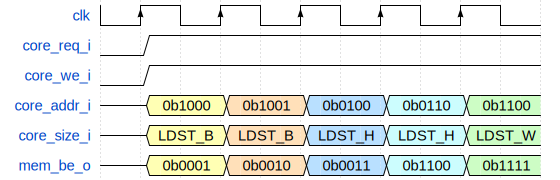
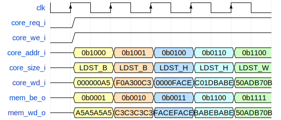
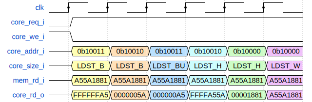
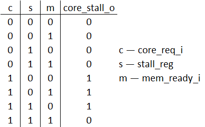

# Lab 8. Load/Store Unit

The result of the seventh lab was a nearly complete RISC-V processor. A notable limitation of that implementation was the lack of support for the `LB`, `LBU`, `SB`, `LH`, `LHU`, and `SH` instructions. There were two reasons for this:

- the `byte_enable_i` signal connected to the data memory was hardwired to `4'b1111`, but in reality this signal needs to be actively driven;
- halfwords and bytes read from memory must be prepared before being written to the register file.

A dedicated module is used for these purposes — the **Load/Store Unit** (**LSU**).

## Objective

Design a load/store unit for interfacing with external data memory that supports byte-granular write access.

---

## Workflow

Study:

- The functions and responsibilities of the load/store unit
- The interface between the processor core and the load/store unit
- The interface between the load/store unit and memory

Implement and verify the `lsu` module.

---

## Theory

The **Load/Store Unit** (**LSU**) is responsible for executing `LOAD` and `STORE` instructions. It acts as an intermediary between the external memory and the processor core. The **LSU** reads data from data memory or writes required values to it, converting 8- and 16-bit data into signed or unsigned 32-bit values for the processor registers. In **RISC** architecture processors, the **LSU** handles all data exchanges between general-purpose registers and data memory.


_Figure 1. The place of the LSU in the RISC processor microarchitecture._

### Processor Core and LSU Interface

The processor sends the address of the memory location to be accessed via the `core_addr_i` input port. The processor's intent to access memory (for either read or write) is indicated by asserting the `core_req_i` signal. If the processor intends to write to memory, the `core_we_i` signal is asserted and the data to be written is provided on the `core_wd_i` input. If the processor intends to read from memory, `core_we_i` is deasserted and the read data is presented on the `core_rd_o` output.

The `LOAD` and `STORE` instructions in **RV32I** support exchanges of 8-bit, 16-bit, or 32-bit values. However, the processor itself only operates on 32-bit numbers, so bytes and halfwords loaded from memory must first be extended to 32-bit values. Extension can be performed either by sign extension or by zero extension, depending on whether the loaded value is to be interpreted as signed or unsigned. During store operations, no extension is needed, since unlike the register file, main memory supports byte-level updates. Therefore, the distinction between signed and unsigned values is only relevant during load operations.

The `core_size_i` signal is provided to the **LSU** to select the data width and representation format. It takes the following values (defined as parameters in the `decoder_pkg` package for convenience):

| Parameter | Value  |           Description             |
|-----------|--------|-----------------------------------|
|  LDST_B   |  3'd0  | Signed 8-bit value                |
|  LDST_H   |  3'd1  | Signed 16-bit value               |
|  LDST_W   |  3'd2  | 32-bit value                      |
|  LDST_BU  |  3'd4  | Unsigned 8-bit value              |
|  LDST_HU  |  3'd5  | Unsigned 16-bit value             |

For `STORE` operations, the data representation format is irrelevant; for these instructions, `core_size_i` can only take values from 0 to 2.

The `core_stall_o` output signal is used to stall the program counter while a memory access is in progress. Previously, the logic for this signal was temporarily located in the `processor_system` module — it now takes its proper place inside the **LSU** module.

### LSU and Memory Interface

The data memory has 32-bit wide cells and supports byte-addressable access. This means it is possible to update any individual byte within a word (a 4-byte memory cell) without modifying the entire word. To indicate which bytes are to be updated, the memory interface uses the 4-bit `mem_be_o` (byte enable) signal, which is provided alongside the word address `mem_addr_o`. Each bit position in the 4-bit signal corresponds to the position of a byte within the word. If a specific bit of `mem_be_o` is 1, the corresponding byte in memory will be updated. Write data is provided on the `mem_wd_o` output. The state of `mem_be_o` does not affect read operations, as reads always return the full 32-bit word.

Upon receiving a read or write request from the core, the **LSU** forwards the request to data memory using the following signals:

- `mem_req_o` — notifies memory of an incoming request (directly connected to `core_req_i`);
- `mem_we_o` — indicates the type of request (directly connected to `core_we_i`):
  - `mem_we_o` equals 1 for a write request,
  - `mem_we_o` equals 0 for a read request;
- `mem_wd_o` — contains the data to be written to memory. Depending on the transfer size, the data on this signal may differ from the incoming `core_wd_i` signal and will be the result of certain transformations;
- `mem_rd_i` — contains the data read from memory. Before returning read data to the core via the `core_rd_o` output, this data must be prepared;
- `mem_ready_i` — indicates that memory is ready to complete the transaction on the current clock cycle. This signal is used to control the `core_stall_o` output.

<!-- |Command| Byte Offset |              lsu_data_o                         |
|-------|-------------|-------------------------------------------------|
|  lb   |     00      | {{24{data_rd_i[7]}}, data_rd_i[7:0]}      |
|       |     01      | {{24{data_rd_i[15]}}, data_rd_i[15:8]}    |
|       |     10      | {{24{data_rd_i[23]}}, da-ta_rd_i[23:16]}  |
|       |     11      | {{24{data_rd_i[31]}}, da-ta_rd_i[31:24]}  |
|  lh   |     00      | {{16{data_rd_i[15]}}, da-ta_rd_i[15:0]}   |
|       |     10      | {{16{data_rd_i[31]}}, da-ta_rd_i[31:16]}  |
|  lw   |     00      | data_rd_i[31:0]                              |
|  lbu  |     00      | {24'b0, data_rd_i[7:0]}                      |
|       |     01      | {24'b0, data_rd_i[15:8]}                     |
|       |     10      | {24'b0, data_rd_i[23:16]}                    |
|       |     11      | {24'b0, data_rd_i[31:24]}                    |
|  lhu  |     00      | {16'b0, data_rd_i[15:0]}                     |
|       |     10      | {16'b0, data_rd_i[31:16]}                    | -->

<!-- |Command| Byte Offset |      data_wd_o      |         data_be_o         |
|  sb   |      00     | { 4{lsu_data_i[7:0]} } |           0001            |
|       |      01     |                        |           0010            |
|       |      10     |                        |           0100            |
|       |      11     |                        |           1000            |
|  sh   |      00     | { 2{lsu_data_i[15:0]} }|           0011            |
|       |      10     |                        |           1100            |
|  sw   |      00     | lsu_data_i[31:0]       |           1111            | -->

---

## Practice

> Know how to describe the output signals of a module — and you will know how to describe the module itself. ©Jason Statham

Implementing any module comes down to implementing the logic that drives each individual output signal from the input signals. Let us examine the behavior of each output signal:

### mem_req_o, mem_we_o, mem_addr_o

All of these signals are directly connected to their corresponding core signals:

- `mem_req_o` to `core_req_i`;
- `mem_we_o` to `core_we_i`;
- `mem_addr_o` to `core_addr_i`.

### mem_be_o

This signal is the result of multiplexing controlled by the `core_size_i` signal. If `core_size_i` corresponds to a byte write instruction (`LDST_B`, 3'd0), then the bit of `mem_be_o` whose index equals the value of the two least significant bits of `core_addr_i` must be set to one.

For example, suppose a request arrives to write a byte at address 18:

- `core_req_i == 1`,
- `core_we_i == 1`,
- `core_size_i == LDST_B`
- `core_addr_i == 32'b10010`

In this case, bit 2 (counting from zero) of `mem_be_o` must be set to one (since the value of the two least significant bits of `core_addr_i` is two): `mem_be_o == 4'b0100`.

If a halfword write request arrives (`core_size_i == LDST_H`), then either the two most significant or the two least significant bits of `mem_be_o` must be set to one (depending on `core_addr_i[1]`: if `core_addr_i[1] == 1`, set the two most significant bits; if `core_addr_i[1] == 0`, set the two least significant bits).

If a word write request arrives (`core_size_i == LDST_W`), all bits of `mem_be_o` must be set to one.



_Figure 2. Waveform of core write requests and the mem\_be\_o signal._

### mem_wd_o

The `mem_wd_o` signal is functionally related to `mem_be_o`, as both serve the purpose of writing specific bytes to memory. Suppose the processor wants to write the byte `0xA5` to address 18. It generates the following signals:

- `core_req_i == 1`,
- `core_we_i == 1`,
- `core_size_i == LDST_B`
- `core_addr_i == 32'b10010`
- `core_wd_i == 32h0000_00A5`

We already know that `mem_be_o` must equal `4'b0100` in this case. However, if the following signals arrive at memory:

- `mem_be_o == 4'b0100`,
- `mem_wd_o == 32'h0000_00A5`

then the value `0x00` will be written to address 18 (because byte 2 on the `mem_wd_o` bus is zero).

For the value `A5` to be written at address 18, that value must appear in byte 2 of `mem_wd_o`. For address 17, it must appear in byte 1, and so on.

Therefore, for a byte write, the simplest approach is to replicate the byte being written into all byte lanes of the `mem_wd_o` bus. Only the byte corresponding to the asserted bit in `mem_be_o` will actually be written to memory. Replication can be achieved using [concatenation](../../Basic%20Verilog%20structures/Concatenation.md).

For a halfword write (`core_size_i == LDST_H`), the approach is similar, except that instead of replicating 1 byte 4 times, the halfword (the 16 least significant bits of `core_wd_i`) is replicated twice.

For a word write (`core_size_i == LDST_W`), `mem_wd_o` simply mirrors `core_wd_i`.



_Figure 3. Waveform of core write requests and the mem\_wd\_o signal._

### core_rd_o

The `core_rd_o` signal carries the data to be written to the processor's register file during load instructions (`LW`, `LH`, `LHU`, `LB`, `LBU`).

Suppose the word `32'hA55A_1881` is stored at addresses `16–19` (see _Fig. 4_). A read at any of addresses 16, 17, 18, or 19 will return this word on the `mem_rd_i` input signal. For the `LB` instruction (byte read interpreted as a signed number, where `core_size_i == LDST_B`) at address 19, the value `32'hFFFF_FFA5` must be written to the register file, since byte `A5` resides at address 19 and will be sign-extended. For the same instruction at address 18, the value `32'h0000_005A` will be written (the sign-extended byte `5A` located at address 18).

The required byte can be extracted from the `mem_rd_i` input signal, but to determine which bits of that signal are relevant, it is necessary to examine `core_size_i` and `core_addr_i[1:0]`. `core_size_i` indicates the data size (how many bytes to extract from the read word), and `core_addr_i[1:0]` identifies the starting byte position within `mem_rd_i`.

For the `LH` instruction, the process is the same, except that a halfword is sign-extended rather than a byte.

For the `LBU` and `LHU` instructions, the process is the same, except that the result is zero-extended rather than sign-extended.

For the `LW` instruction, `mem_rd_i` is passed to `core_rd_o` unchanged.



_Figure 4. Waveform of core read requests and the core\_rd\_o signal._

### core_stall_o

The `core_stall_o` signal prevents the program counter from advancing during a memory access. This signal must:

- be asserted in the same clock cycle that `core_req_i` arrives;
- remain asserted until `mem_ready_i` is received, but for no less than 1 clock cycle (i.e., even if `mem_ready_i` is already asserted, `core_stall_o` must be held high for at least 1 cycle).

To implement this behavior, you will need an auxiliary register `stall_reg` that captures the value of `core_stall_o` on every clock cycle, along with the truth table for this output shown in _Fig. 5_.



_Figure 5. Truth table for the `core_stall_o` output._

---

## Assignment

Implement the load/store unit with the following prototype:

```Verilog
module lsu(
  input logic clk_i,
  input logic rst_i,

  // Core interface
  input  logic        core_req_i,
  input  logic        core_we_i,
  input  logic [ 2:0] core_size_i,
  input  logic [31:0] core_addr_i,
  input  logic [31:0] core_wd_i,
  output logic [31:0] core_rd_o,
  output logic        core_stall_o,

  // Memory interface
  output logic        mem_req_o,
  output logic        mem_we_o,
  output logic [ 3:0] mem_be_o,
  output logic [31:0] mem_addr_o,
  output logic [31:0] mem_wd_o,
  input  logic [31:0] mem_rd_i,
  input  logic        mem_ready_i
);

```


_Figure 6. Functional block diagram of the `lsu` module._

---

### Steps

1. Carefully review the description of the functional behavior of each **LSU** output. If any questions arise, consult your instructor.
2. Implement the load/store unit module using the same name and ports as specified in the assignment.
   1. Note that the majority of the module is purely combinational logic. In this regard, the implementation will be partially similar to the decoder.
      1. When describing multiplexers controlled by `core_size_i` using a `case` statement, do not forget to include a `default` branch — otherwise you will infer a latch!
   2. In addition to the combinational logic, the module will also contain one register.
3. Verify the module using the testbench provided in [`lab_08.tb_lsu.sv`](lab_08.tb_lsu.sv). If error messages appear in the TCL console, [locate](../../Vivado%20Basics/05.%20Bug%20hunting.md) and fix them.
   1. Before running the simulation, make sure the correct top-level module is selected in `Simulation Sources`.
4. This lab does not require verification on an FPGA board.
