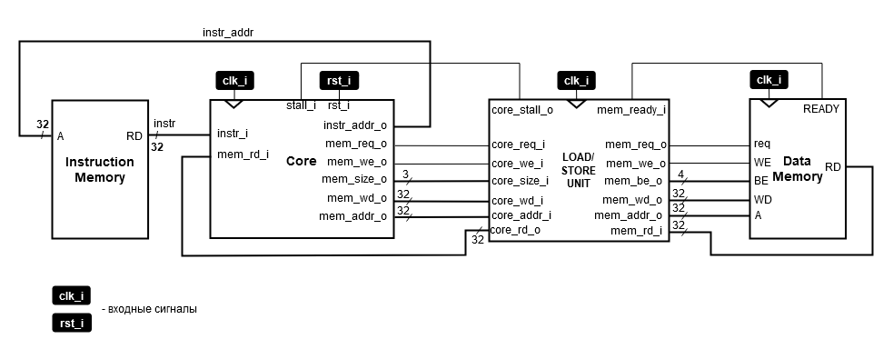

# Лабораторная работа 9 "Интеграция блока загрузки и сохранения"

После реализации блока загрузки и сохранения, его необходимо интегрировать в процессорную систему. Ниже представлена схема, иллюстрирующая интеграцию компонентов:

## Задание

Интегрировать модуль `riscv_lsu` в модуль `riscv_unit` c использованием внешней памяти (`ext_mem`) из лабораторной работы №7.

## Порядок выполнения работы

1. Интегрируйте модули `riscv_lsu` и `ext_mem` в модуль `riscv_unit`.
   1. Обратите внимание, что из модуля `riscv_unit` необходимо убрать логику сигнала `stall`, т.к. она была перемещена внутрь модуля `riscv_lsu`.
   2. Модуль `data_mem` из ЛР3 заменяется модулем `ext_mem` из ЛР7.
2. После интеграции модулей, проверьте процессорную систему с помощью программы из ЛР6.
   1. Обратите внимание на то, как теперь исполняются инструкции `sw`, `sh`, `sb`, `lw`, `lh`, `lb`, `lhu`, `lbu`.
