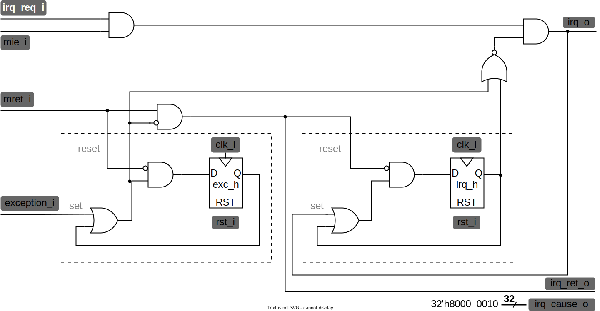

# Лабораторная работа №10 "Подсистема прерывания"

Данная лабораторная работа посвящена изучению систем прерывания в компьютерах и их использованию для обработки программных и аппаратных событий. В процессе работы вы познакомитесь с основными понятиями и принципами работы систем прерывания, а также со средствами программной обработки прерываний.

## Материалы для подготовки к лабораторной работе

- [Теоретический материал по регистрам контроля и статуса](../../Other/CSR.md).

## Цель

1. Описать модуль контроллера прерываний.
2. Описать модуль контроллера регистров статуса и контроля (**CSR**-контроллер).

## Ход выполнения

1. Изучение теории по прерываниям и исключениям в архитектуре RISC-V, включая работу с регистрами статуса и контроля (**CSR**) и механизмы реализации прерываний.
2. Реализация схемы обработки прерывания для устройства на основе RISC-V
3. Реализация схемы управления регистрами статуса и контроля.

## Теоретическая часть

### Прерывания/Исключения

С компьютером постоянно происходят события, на которые он должен реагировать, запуская соответствующие подпрограммы. Например, при движении мышки нужно перерисовать её курсор на новом месте или нужно среагировать на подключение флешки и т.п. Возможность запускать нужные подпрограммы в ответ на различные события, возникающие внутри или снаружи компьютера, существенно расширяют его возможности. События, требующие внимания процессора называются **прерываниями** (**interrupt**). Происходящие события формируют запрос на прерывание процессору.

С.А. Орлов в учебнике "Организация ЭВМ и систем" даёт следующее определение системе прерывания:

> **Система прерывания** – это совокупность аппаратных и программных средств, позволяющая вычислительной машине (при получении соответствующего запроса) на время прервать выполнение текущей программы, передать управление программе обслуживания поступившего запроса, а по завершении последней продолжить прерванную программу с того места, где она была прервана[1, стр. 133].

Прерывания делятся на **маски́руемые** — которые при желании можно игнорировать (на которые можно наложить [**битовую маску**](https://ru.wikipedia.org/wiki/Битовая_маска), отсюда ударение на второй слог), и **немаски́руемые** — которые игнорировать нельзя (например сбой генератора тактового синхроимпульса в микроконтроллерах семейства PIC24FJ512GU410[[2, стр. 130]](https://ww1.microchip.com/downloads/aemDocuments/documents/MCU16/ProductDocuments/DataSheets/PIC24FJ512GU410-Family-Data-Sheet-DS30010203D.pdf)). Прерывание похоже на незапланированный вызов функции, вследствие события в аппаратном обеспечении. Программа (функция), запускаемая в ответ на прерывание, называется **обработчиком прерывания**.

События могут быть не только аппаратными, но и программными – синхронными. Такие события называются **исключениями** (**exception**). Программа может столкнуться с состоянием ошибки, вызванным программным обеспечением, таким как неопределённая инструкция, неподдерживаемая данным процессором, в таком случаях говорят, что возникло исключение. К исключениям также относятся сброс, деление на ноль, переполнение и попытки считывания из несуществующей памяти.

Важно понимать, что ни прерывание, ни исключение не являются обязательно чем-то плохим. И то и другое — это всего лишь события. Например, с помощью исключений может осуществляться системные вызовы и передача управления отладчику программы.

Как и любой другой вызов функции, при возникновении прерывания или исключения необходимо сохранить адрес возврата, перейти к программе обработчика, выполнить свою работу, восстановить контекст (не оставить никаких следов работы обработчика прерывания) и вернуться к программе, которую прервали.

Благодаря исключениям можно реализовать имитацию наличия каких-то аппаратных блоков программными средствами. Например, при отсутствии аппаратного умножителя, можно написать программу обработчика исключения неподдерживаемой инструкции умножения, реализующую алгоритм умножения через сложение и сдвиг. Тогда, каждый раз, когда в программе будет попадаться инструкция умножения, будет возникать исключение, приводящее к запуску обработчика, перемножающего числа и размещающего результат в нужные ячейки памяти. После выполнения обработчика управление возвращается программе, которая даже не поймёт, что что-то произошло и умножитель «ненастоящий».

---

На протяжении многих лет, концепция понятия "прерывание" постоянно расширялась. Семейство процессоров 80x86 внесло ещё большую путаницу введя инструкцию `int` (программное прерывание). Многие производители используют такие термины как: **исключение** (_exception_), **ошибка** (_fault_), **отказ** (_abort_), **ловушка** (_trap_) и **прерывание** (_interrupt_), чтобы описать явление, которому посвящена данная лабораторная работа. К несчастью, не существует какого-то чёткого соглашения насчёт этих названий. Разные авторы по-разному приспосабливают эти термины для своего повествования[[3, стр. 995](https://flint.cs.yale.edu/cs422/doc/art-of-asm/pdf/CH17.PDF)].

Для того, чтобы постараться избежать путаницы, в данной лабораторной работе мы будем использовать три термина, которые введены в спецификации архитектуры RISC-V[[4, стр. 18](https://github.com/riscv/riscv-isa-manual/releases/download/20240411/unpriv-isa-asciidoc.pdf)], однако имейте в виду, что за пределами данного практикума и спецификации RISC-V в эти термины могут вкладывать другие смыслы.

Сперва озвучим выдержку из спецификации, а потом дадим этим терминам обывательские определения.

1. Под **исключением** будут подразумеваться нетипичные условия, произошедшие во время исполнения программы, связанные с инструкцией в текущем харте (_hart_, сокращение от **har**dware **t**hread — аппаратном потоке).
2. Под **прерыванием** будут подразумеваться внешние асинхронные события, которые могут стать причиной непредвиденной передачи управления внутри текущего харта.
3. Под **перехватом** (вариант глагольного использования слова _trap_, которое обычно переводят как "ловушка", что по мнению авторов совершенно не раскрывает сути этого понятия) будет подразумеваться передача управления **обработчику перехватов** (_trap handler_), вызванная либо прерыванием, либо исключением.

Иными словами, **прерываниями** мы будем называть исключительно аппаратные (внешние, асинхронные) события, которые могут привести к **перехвату** (передаче управления обработчику). Под **исключениями** мы будем подразумевать исключительно программные (являющиеся следствием какой-то инструкции, синхронные) события, которые могут привести к **перехвату**.

Соответственно **перехватом** будет называться обобщение этих двух терминов.

Прерывания и исключения — это события (причины). Перехват — это действие (следствие).

Та часть разрабатываемой процессорной системы, которая будет отвечать за обработку прерываний и исключений, будет называться традиционным именем "**Система прерывания**".

---

Современные процессоры, предусматривающие запуск операционной системы, обладают несколькими уровнями привилегий выполнения инструкций. Это значит, что существует специальный регистр, определяющий режим, в котором в данный момент находится вычислительная машина. Наличие определенного значения в этом регистре устанавливает соответствующие ограничения для выполняемой в данный момент программы. В архитектуре RISC-V выделяется 4 режима работы, в порядке убывания возможностей и увеличения ограничений:

1. **машинный** (machine mode), в котором можно всё;
2. **гипервизора** (hypervisor mode), который поддерживает виртуализацию машин, то есть эмуляцию нескольких машин (потенциально с несколькими операционными системами), работающих на одной физической машине;
3. **привилегированный** (supervisor mode), для операционных систем, с возможностью управления ресурсами;
4. **пользовательский** (user mode), для прикладных программ, использующих только те ресурсы, которые определила операционная система.


_Рисунок 1. Распределение привилегий по уровням абстракций программного обеспечения [[5](https://doi.org/10.1007/978-981-16-9113-3_33), стр.448], [[6](https://github.com/riscv/riscv-isa-manual/releases/download/20240411/priv-isa-asciidoc.pdf), стр. 8]._

Переключение между этими режимами происходит с помощью исключения, называемого **системный вызов**, и который происходит при выполнении специальной инструкции. Для RISC-V такой инструкцией является **ecall**. Это похоже на вызов подпрограммы, но при системном вызове изменяется режим работы и управление передаётся операционной системе, которая, по коду в инструкции вызова определяет, что от неё хотят. Например, операционная система может предоставить данные с диска, так как запускаемая программа не имеет никакого представления о том, на какой машине её запустили, или что используется какая-то конкретная файловая система.

Системы прерываний имеет ряд характеристик, которые варьируются в зависимости от их реализации. Все системы можно условно разбить на две категории: обзорные (прямые) и векторные.

В **обзорных системах прерывания** любой перехват приводит к запуску одного и того же обработчика. Внутри такого обработчика перехвата определяется причина его возникновения (как правило — это число в специальном регистре), и уже в зависимости от причины запускается нужная подпрограмма. Обзорные системы аппаратно проще векторных, но требуют больше рутины и времени на обработку. Именно такая система прерываний будет реализована в данной лабораторной работе.

В **векторных системах прерывания** разные события приводят к запуску на исполнение разных программ обработчиков. Адрес начала обработчика перехвата называется **вектором прерывания**. В векторных системах прерывания выделяется фрагмент памяти, в котором хранятся адреса переходов на начало каждого из обработчиков. Такой участок памяти называется **таблицей векторов прерываний** (**Interrupt Vector Table**, **IVT**).

В самом простом случае система прерывания позволяет обрабатывать только одно прерывание за раз (именно такую систему мы и будет делать в рамках данной лабораторной работы). Существуют реализации, позволяющие во время обработки прерывания «отвлекаться» на другие события. В таких системах используется система приоритетов, чтобы прерывание с более низким приоритетом не прерывало более приоритетное.

### Регистры Контроля и Статуса

В процессе создания декодера инструкций в [ЛР№5](../05.%20Main%20decoder/) вы уже реализовывали инструкции для работы с [регистрами контроля и статуса](../../Other/CSR.md). Теперь необходимо спроектировать блок управления этими регистрами.

Для реализации простейшей системы прерывания на процессоре с архитектурой RISC-V достаточно реализовать 5 регистров контроля и статуса, работающих в машинном (самом привилегированном) режиме.

| Адрес  | Уровень привилегий | Название | Описание                                           |
|--------|--------------------|----------|----------------------------------------------------|
| **Machine Trap Setup**                                                                      |
|0x304   | MRW                | mie      | Регистр маски перехватов.                          |
|0x305   | MRW                | mtvec    | Базовый адрес обработчика перехвата.               |
|0x340   | MRW                | mscratch | Адрес верхушки стека обработчика перехвата.        |
|0x341   | MRW                | mepc     | Регистр, хранящий адрес перехваченной инструкции.  |
|0x342   | MRW                | mcause   | Причина перехвата                                  |

_Таблица 1. Список регистров, подлежащих реализации в рамках лабораторной работы [[6](https://github.com/riscv/riscv-isa-manual/releases/download/Priv-v1.12/riscv-privileged-20211203.pdf), стр. 17]._

По адресу `0x304` должен располагаться регистр, позволяющий маскировать перехваты. Например, если на 5-ом входе системы прерывания генерируется прерывание, то процессор отреагирует на него только в том случае, если 5-ый бит регистра `mie` будет равен 1. Младшие 16 бит этого регистра спецификация RISC-V отводит под маскирование специальных системных прерываний [[6](https://github.com/riscv/riscv-isa-manual/releases/download/Priv-v1.12/riscv-privileged-20211203.pdf), стр. 36], которые не будут поддерживаться нашим процессором (подробней об этом будет в описании регистра mcause). Поэтому в нашей процессорной системе мы будем использовать только старшие 16 бит регистра `mie`, которые отведены для нужд конкретной платформы.

По адресу `0x305` должен располагаться регистр `mtvec`, который состоит из двух полей: BASE[31:2] и MODE. Поле BASE хранит старшие 30 бит базового адреса обработчика перехвата (поскольку этот адрес должен быть всегда равен четырём, младшие два бита считаются равными нулю). Поле MODE кодирует тип системы прерывания:

- `MODE == 2'd0` — система прерывания обзорная;
- `MODE == 2'd1` — система прерывания векторная.


_Рисунок 2. Разделение регистра `mtvec` на поля `BASE` и `MODE`[[6](https://github.com/riscv/riscv-isa-manual/releases/download/Priv-v1.12/riscv-privileged-20211203.pdf), стр. 34]_

В случае обзорной системы прерывания, любой перехват приводит к загрузке в PC значения базового адреса обработчика перехвата (`PC=BASE`). В векторной системе прерывания исключения обрабатываются таким же способом, как и в обзорной системе, а вот прерывания обрабатываются путём загрузки в PC суммы базового адреса и учетверённого значения причины прерывания (`PC=BASE+4*CAUSE`).

В рамках данной лабораторной работы мы будем реализовывать обзорную систему прерываний. Кроме того, поскольку у обзорной системы прерываний `MODE==0`, что совпадёт с тем, что два младших бита базового адреса обработчика перехвата должны быть равны нулю, при перехвате мы можем присваивать программному счётчику значение `mtvec` без каких-либо преобразований.

Так как обработчик перехвата будет использовать те же регистры, что и прерванная программа, перед использованием регистрового файла, данные из него необходимо сохранить, разместив их на специальном стеке — стеке прерываний. Адрес начала этого стека хранится в регистре `mscratch`, расположенного по адресу `0x340` и по сути является указателем на верхушку стека прерываний.

Регистр `mepc`, расположенный по адресу `0x341` сохраняет адрес инструкции, во время исполнения которой произошёл перехват [[6](https://github.com/riscv/riscv-isa-manual/releases/download/20240411/priv-isa-asciidoc.pdf), стр. 42]. Это очень важно понимать, при реализации **обработчика исключения** — если в нем не перезаписать этот регистр, по возврату из обработчика **процессор снова окажется на инструкции, которая вызвала исключение**.

То как кодируется причина перехвата в регистре `mcause`, расположенного по адресу `0x342` описано в спецификации привилегированной архитектуры[[6](https://github.com/riscv/riscv-isa-manual/releases/download/20240411/priv-isa-asciidoc.pdf), стр. 43]:


_Таблица 2. Кодирование причины перехвата в регистре `mcause`._

Нас интересуют части , выделенные цветом. В первую очередь то, как кодируется старший бит регистра `mcause` (выделено синим). Он зависит от типа причины перехвата (`1` в случае прерывания, `0` в случае исключения). Оставшиеся 31 бит регистра отводятся под коды различных причин. Поскольку мы создаём учебный процессор, который не будет использован в реальной жизни, он не будет поддерживать большую часть прерываний/исключений (таких как невыровненный доступ к памяти, таймеры и т.п.). В рамках данного курса мы должны поддерживать исключение по нелегальной инструкции (код 0x02, выделено красным) и должны уметь поддерживать прерывания периферийных устройств (под которые зарезервированы коды начиная с 16-го, именно поэтому мы будем использовать только старшие 16 бит регистра `mie`). В рамках данной лабораторной работы процессор будет поддерживать только один источник прерывания, поэтому для кодирования причины прерывания нам потребуется только первый код из диапазона _"Designated for platform use"_ (выделено зелёным). В случае, если вы захотите расширить количество источников прерываний, вы можете выполнить вспомогательную [лабораторную работу №12](../12.%20Daisy%20chain).

Таким образом: в случае если произошло исключение (в связи с нелегальной инструкцией), значение `mcause` должно быть `0x00000002`. Если произошло прерывание, значение `mcause` должно быть `0x80000010`.

При желании, процессор можно будет улучшить, добавив поддержку большего числа периферийных устройств. В этом случае потребуется только расширить контроллер прерываний.

Когда процессор включается, программа первым делом должна инициализировать регистры контроля и статуса, в частности:

- задать адрес вектора прерывания `mtvec`,
- задать адрес вершины стека прерываний `mscratch`,
- задать маску прерывания `mie`.

После чего уже можно переходить к исполнению основного потока инструкций. Обратите внимание, что маску прерываний следует задавать в последнюю очередь, т.к. в противном случае система может начать реагировать на прерывания, не имея в регистре `mtvec` корректного адреса вектора прерываний.

### Реализация прерываний в архитектуре RISC-V

Процессор RISC-V может работать в одном из нескольких режимов выполнения с различными уровнями привилегий. Машинный режим – это самый высокий уровень привилегий; программа, работающая в этом режиме, может получить доступ ко всем регистрам и ячейкам памяти. M-режим является единственным необходимым режимом привилегий и единственным режимом, используемым в процессорах без операционной системы, включая многие встраиваемые системы.

Обработчики прерываний/исключений используют для перехвата четыре специальных регистра управления и состояния (CSR): `mtvec`, `mcause`, `mepc` и `mscratch`. Регистр базового адреса вектора прерывания `mtvec`, содержит адрес кода обработчика прерывания. При перехвате процессор:

- записывает причину перехвата в `mcause`,
- сохраняет адрес перехваченной инструкции, в `mepc`,
- переходит к обработчику перехвата, загружая в `PC` адрес, предварительно настроенный в `mtvec`.

После перехода по адресу в `mtvec` обработчик считывает регистр `mcause`, чтобы проверить, что вызвало прерывание или исключение, и реагирует соответствующим образом (например, считывая пришедший с клавиатуры символ при аппаратном прерывании).

После выполнения программы-обработчика перехвата, возвращение в программу выполняется командой возврата `mret`, которая помещает в `PC` значение регистра `mepc`. Сохранение `PC` инструкции при прерывании в `mepc` аналогично использованию регистра `ra` для хранения обратного адреса во время инструкции `jal`. Поскольку обработчики перехватов могут использовать для своей работы регистровый файл, для хранения и восстановления значений его регистров им нужен отдельный стек, на который указывает `mscratch`.

Контроллер прерываний – это блок процессора, обеспечивающий взаимодействие с устройствами, запрашивающими прерывания, формирование кода причины прерывания для процессора, маскирование прерываний. В некоторых реализациях, контроллер прерываний может реагировать на прерывания в соответствии с приоритетом.

Периферийное устройство, которое может генерировать прерывание, подключается к контроллеру прерывания парой проводов: "запрос на прерывание" (`irq_req_i`) и "прерывание обслужено" (`irq_ret_o`). Предположим, к контроллеру прерываний подключили клавиатуру. Когда на ней нажимают клавишу, код этой клавиши попадает в буферный регистр с дополнительным управляющим битом, выставленным в единицу, который подключён к входу запроса на прерывание. Если прерывание не замаскировано (в нашем процессоре это означает, что нулевой бит регистра `mie` выставлен в 1), то контроллер прерывания сгенерирует код причины прерывания (в нашем случае — это константа `0x80000010`). Кроме этого, контроллер прерывания подаст сигнал `irq_o`, чтобы устройство управления процессора узнало, что произошло прерывание и разрешило обновить содержимое регистра причины `mcause`, сохранило адрес прерванной инструкции в `mepc` и загрузило в `PC` вектор прерывания `mtvec`.

Когда будет выполняться инструкция `mret`, устройство управления подаст сигнал контроллеру прерывания, чтобы тот, в свою очередь, направил его в виде сигнала «прерывание обслужено» для соответствующего устройства. После этого периферийное устройство обязано снять сигнал запроса прерывания хотя бы на один такт. В нашем примере сигнал «прерывание обслужено» может быть подключён непосредственно к сбросу буферного регистра клавиатуры.

## Структура разрабатываемых устройств

В рамках лабораторной работы необходимо реализовать поддержку обработки аппаратных прерываний. Для этого необходимо реализовать два модуля: блок управления регистрами контроля и статуса (**CSR-контроллер**) и контроллер прерываний **(Interrupt Controller)**.

Блок управления регистрами контроля и статуса позволяет добавить особые **архитектурные регистры**, которые будут использоваться нами при обработке прерываний и исключений.

Контроллер прерываний позволит обрабатывать входящие запросы на прерывания: маски́ровать их, выбирать один запрос из нескольких, а также игнорировать запросы во время обработки текущего прерывания.


_Рисунок 3. Место разрабатываемых блоков в структуре процессора._

Пока что вам нужно реализовать только блоки **irq controller** и **control status registers**, а не саму схему, приведённую выше.

### CSR-контроллер

Рассмотрим один из возможных вариантов организации блока **Control and Status Registers**. Основная работа по описанию схемы блока состоит в описании мультиплексора и демультиплексора. Мультиплексор подаёт на выход **read_data_o** значение регистра, который соответствует пришедшему адресу. В свою же очередь, демультиплексор маршрутизирует сигнал разрешения на запись **write_enable_i** (en) на тот же регистр.


_Рисунок 4. Структурная схема контроллера CS-регистров._

3-битный вход **opcode_i** определяет операцию, которая будет производиться над содержимым CSR по адресу **addr_i**.

Для реализации мультиплексора на языке описания аппаратуры SystemVerilog можно воспользоваться конструкцией `case` внутри блока **always_comb**. Для реализации демультиплексора также можно использовать `case`, только если при описании мультиплексора в зависимости от управляющего сигнала на один и тот же выход идут разные входы, то при описании демультиплексора все будет наоборот: в зависимости от управляющего сигнала, один и тот же вход будет идти на разные выходы (например, на разные биты многоразрядной шины `enable`).

Мультиплексоры, располагаемые на входах регистров `mepc` и `mcause` нужны, чтобы при возникновении сигнала прерывания сразу же разрешить обновить значение этих регистров значением `pc_i`, на котором произошёл перехват и кодом причины происходящего сейчас перехвата.

### Контроллер прерываний

Рассмотрим один из возможных способов реализации простейшего контроллера прерываний, представленного на _рис. 5_.



_Рисунок 5. Структурная схема контроллера прерываний._

Контроллер состоит из логики:

- обработки вложенных прерываний, частью которой являются регистры отслеживания обработки прерывания и исключения (`irq_h` и `exc_h` соответственно),
- установки и сброса этих регистров (которая вместе с этими регистрами заключена в прямоугольники, выделенные пунктиром),
- приоритета исключений над прерываниями,
- маскирования запросов на прерывание.

Регистры отслеживания обработки прерывания и исключения нужны для того, чтобы мы могли понимать, что в данный момент процессор уже выполняет обработку прерывания / исключения. В такие моменты (если любой из регистров `exc_h`/`irq_h` содержит значение `1`) все последующие запросы на прерывание игнорируются. За это отвечают вентили И и ИЛИ-НЕ в правом верхнем углу схемы.

Однако возможна ситуация возникновения исключения во время обработки прерывания — в этом случае, оба регистра будут хранить значение `1`. В момент возврата из обработчика, придёт сигнал `mret_i`, который в первую очередь сбросит регистр `exc_h` и только если тот равен нулю, сбросит регистр `irq_h`.

Исключение во время обработки исключения не поддерживается данной микроархитектурой и скорее всего приведёт к циклическому вызову обработчика исключения. Поэтому код обработчика исключений должен быть написан с особым вниманием.

Логика установки и сброса регистров `irq_h` и `exc_h` работает следующим образом:

- если сигнал, обозначенный в прямоугольнике как `reset` равен единице, в регистр будет записано значение `0`;
- если сигнал, обозначенный в прямоугольнике как `set` равен единице, в регистр будет записано значение `1`;
- в остальных случаях, регистр сохраняет своё значение.

Обратите внимание, что логика установки и сброса регистров даёт приоритет сбросу, хотя сигнал сброса никогда не придёт одновременно с сигналом установки (поскольку инструкция `mret` не генерирует исключение, сигнал `mret_i` никогда не придёт одновременно с сигналом `exception_i`, а логика приоритета исключений над прерываниями не даст сигналу `mret` распространиться до регистра `irq_h` одновременно с формированием сигнала `irq_o`).

Логика приоритета исключений над прерываниями заключается в том, что сигнал `exception_i` является частью логики обработки вложенных прерываний. Пройдя через два логических ИЛИ и последующий инвертор, этот сигнал обнулит запрос на прерывание на логическом И в правом верхнем углу.

Логика маскирования запросов на прерывания заключается в простейшем И между запросом на прерывания (`irq_req_i`) и сигналом разрешения прерывания (`mie_i`).

## Пример обработки перехвата

В _листинге 1_ приведён пример программы с обработчиком перехватов. Программа начинается с инициализации начальных значений регистров управления, указателя на верхушку стека и глобальную область данных, после чего уходит в бесконечный цикл ничего не делая, до тех пор, пока не произойдёт перехват.

Алгоритм работы обработчика перехвата (`trap handler`) выглядит следующим образом:

1. сохраняется содержимое регистрового файла на стек;
2. проверяется регистр причины чтобы запустить необходимую подпрограмму;
3. происходит вызов необходимой подпрограммы;
4. после возврата происходит восстановление содержимого регистрового файла;
5. затем происходит возврат управления прерванной программе.

Если бы система прерывания была векторной, то рутина со считыванием кода причины отсутствовала.

```asm
_start:
# Инициализируем начальные значения регистров
00: li x2, 0x00003FF0       # устанавливаем указатель на верхушку стека
04:                         # данная псевдоинструкция будет разбита на две
                            # инструкции: lui и addi

08: li x3, 0x00000000       # устанавливаем указатель на глобальные данные

0С: la x5, trap_handler     # псевдоинструкция la аналогично li загружает число,
10:                         # только в случае la — это число является адресом
                            # указанного места (адреса обработчика перехвата)
                            # данная псевдоинструкция будет разбита на две
                            # инструкции: lui и addi

14: csrw mtvec, x5          # устанавливаем вектор прерывания

18: li x5, 0x00001FFC       # готовим адрес верхушки стека прерывания
1С:                         # данная псевдоинструкция будет разбита на две
                            # инструкции: lui и addi

20: csrw mscratch, x5       # загружаем указатель на верхушку стека прерывания

24: li x5, 0x00010000       # подготавливаем маску прерывания единственного
                            # входа прерываний

28: csrw mie, x5            # загружаем маску в регистр маски

2С: li x5, 1                # начальное значение глобальной переменной
30: sw x5, 0(x3)            # загружаем переменную в память

34: li x6, 0                # начальное значение, чтобы в симуляции не было xxx
38: li x7, 0                # начальное значение, чтобы в симуляции не было xxx

# Вызов ecall исключительно из хулиганских соображений, поскольку в данной
# микроархитектурной реализации это приведет к появлению illegal_instr и
# последующей обработке исключения
3С: ecall

# Вызов функции main
main:
40: beq x0, x0, main        # бесконечный цикл, аналогичный while (1);

# ОБРАБОТЧИК ПЕРЕХВАТА
# Без стороннего вмешательства процессор никогда не перейдет к инструкциям ниже,
# однако в случае прерывания в программный счетчик будет загружен адрес первой
# нижележащей инструкции.

# Сохраняем используемые регистры на стек
trap_handler:
44: csrrw x5, mscratch, x5  # меняем местами mscratch и x5
48: addi x5, x5, -16        # поднимаем верхушку стека на 16 байт вверх
                            # (указатель на стек всегда должен быть выровнен
                            # границе в 16 байт)
4С: sw x6, 0(x5)            # сохраняем x6 на стек mscratch
50: sw x7, 4(x5)            # сохраняем x7 на стек mscratch

# Проверяем произошло ли прерывание
54: csrr x6, mcause         # x6 = mcause
58: li x7, 0x80000010       # загружаем в x7 код того, что произошло прерывание
5С:                         # данная псевдоинструкция будет разбита на две
                            # инструкции: lui и addi
60: bne x6, x7, exc_handler # если коды не совпадают, переходим к проверке
                            # на исключение
# Обработчик прерывания
64: lw x7, 0(x3)            # загружаем переменную из памяти
68: addi x7, x7, 3          # прибавляем к значению 3
6С: sw x7, 0(x3)            # возвращаем переменную в память
70: j done                  # идем возвращать регистры и на выход

exc_handler:                # Проверяем произошло ли исключение
74: li x7, 0x0000002        # загружаем в x7 код того, что произошло исключение
78: bne x6, x7, done        # если это не оно, то выходим

# Обработчик исключения
7С: csrr x6, mepc           # Узнаем значение PC (адреса инструкции,
                            # вызвавшей исключение)
80: lw x7, 0x0(x6)          # Загружаем эту инструкцию в регистр x7.
                            # В текущей микроархитектурной реализации это
                            # невозможно, т.к. память инструкций отделена от
                            # памяти данных и не участвует в выполнении
                            # операций load / store.
                            # Другой способ узнать об инструкции, приведшей
                            # к исключению — добавить поддержку статусного
                            # регистра mtval, в который при исключении
                            # может быть записана текущая инструкция.
                            # Теоретически мы могли бы после этого
                            # сделать что-то, в зависимости от этой инструкции.
                            # Например, если это операция умножения — вызвать
                            # подпрограмму умножения.

84: addi x6, x6, 4          # Увеличиваем значение PC на 4, чтобы после
                            # возврата не попасть на инструкцию, вызвавшую
                            # исключение.
88: csrw mepc, x6           # Записываем обновленное значение PC в регистр mepc
8С: j done                  # идем восстанавливать регистры со стека и на выход

# Возвращаем регистры на места и выходим
done:
90: lw x6, 0(x5)            # возвращаем x6 со стека
94: lw x7, 4(x5)            # возвращаем x7 со стека
98: addi x5, x5, 16         # опускаем верхушку стека обратно на 16 байт вниз
9С: csrrw x5, mscratch, x5  # меняем обратно местами x5 и mscratch
A0: mret                    # возвращаем управление программе (pc = mepc)
                            # что означает возврат в бесконечный цикл
```

## Задание

1. Описать на языке SystemVerilog модуль контроллера регистров статуса и контроля (**CSR**-контроллер) со следующим прототипом:

```Verilog
module csr_controller(

  input  logic        clk_i,
  input  logic        rst_i,
  input  logic        trap_i,

  input  logic [ 2:0] opcode_i,

  input  logic [11:0] addr_i,
  input  logic [31:0] pc_i,
  input  logic [31:0] mcause_i,
  input  logic [31:0] rs1_data_i,
  input  logic [31:0] imm_data_i,
  input  logic        write_enable_i,

  output logic [31:0] read_data_o,
  output logic [31:0] mie_o,
  output logic [31:0] mepc_o,
  output logic [31:0] mtvec_o
);

import csr_pkg::*;

endmodule
```

2. Описать на языке SystemVerilog модуль контроллера прерываний со следующим прототипом:

```Verilog
module interrupt_controller(
  input  logic        clk_i,
  input  logic        rst_i,
  input  logic        exception_i,
  input  logic        irq_req_i,
  input  logic        mie_i,
  input  logic        mret_i,

  output logic        irq_ret_o,
  output logic [31:0] irq_cause_o,
  output logic        irq_o
);

endmodule
```

## Порядок выполнения задания

1. Внимательно ознакомьтесь с описанием модуля `csr_controller` и его структурной схемой. В случае возникновения вопросов, проконсультируйтесь с преподавателем.
2. Добавьте в `Design Sources` проекта файл [сsr_pkg.sv](csr_pkg.sv). Данный файл содержит пакет с адресами регистров контроля и статуса, а также кодами команд для взаимодействия с ними.
3. Опишите модуль `csr_controller` с таким же именем и портами, как указано в задании.
4. Проверьте модуль с помощью верификационного окружения, представленного в файле [`lab_10.tb_csr.sv`](lab_10.tb_csr.sv). В случае, если в TCL-консоли появились сообщения об ошибках, вам необходимо [найти](../../Vivado%20Basics/05.%20Bug%20hunting.md) и исправить их.
   1. Перед запуском моделирования, убедитесь, что у вас выбран корректный модуль верхнего уровня в `Simulation Sources`.
5. Внимательно ознакомьтесь с описанием функционального поведения сигналов `interrupt_controller`, а также его структурной схемой. В случае возникновения вопросов, проконсультируйтесь с преподавателем.
6. Опишите модуль `interrupt_controller` с таким же именем и портами, как указано в задании.
7. Проверьте модуль с помощью верификационного окружения, представленного в файле [`lab_10.tb_irq.sv`](lab_10.tb_irq.sv). В случае, если в TCL-консоли появились сообщения об ошибках, вам необходимо [найти](../../Vivado%20Basics/05.%20Bug%20hunting.md) и исправить их.
   1. Перед запуском моделирования, убедитесь, что у вас выбран корректный модуль верхнего уровня в `Simulation Sources`.
8. Данная лабораторная работа не предполагает проверки в ПЛИС.

## Список использованной литературы

1. Орлов С.А. Организация ЭВМ и систем: Учебник для вузов. 4-е изд. дополненное и переработанное / С.А. Орлов. - Санкт-Петербург : Питер, 2021. - 688 с.
2. [PIC24FJ512GU410 Family Data Sheet](https://ww1.microchip.com/downloads/aemDocuments/documents/MCU16/ProductDocuments/DataSheets/PIC24FJ512GU410-Family-Data-Sheet-DS30010203D.pdf)
3. [The Art of Assembly Language](https://flint.cs.yale.edu/cs422/doc/art-of-asm/pdf/)
4. [The RISC-V Instruction Set Manual Volume I: Unprivileged ISA](https://github.com/riscv/riscv-isa-manual/releases/download/20240411/unpriv-isa-asciidoc.pdf)
5. [Pillai, V.P., Megalingam, R.K. (2022). System Partitioning with Virtualization for Federated and Distributed Machine Learning on Critical IoT Edge Systems. In: Saraswat, M., Sharma, H., Balachandran, K., Kim, J.H., Bansal, J.C. (eds) Congress on Intelligent Systems. Lecture Notes on Data Engineering and Communications Technologies, vol 111. Springer, Singapore.](https://doi.org/10.1007/978-981-16-9113-3_33)
6. [The RISC-V Instruction Set Manual Volume II: Privileged Architecture](https://github.com/riscv/riscv-isa-manual/releases/download/20240411/priv-isa-asciidoc.pdf)
