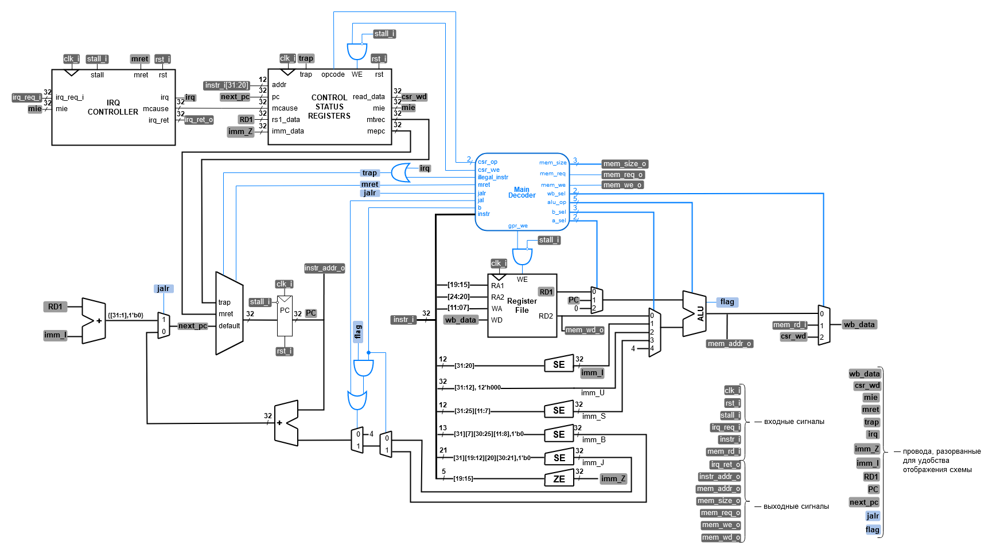

# Лабораторная работа 11 "Интеграция подсистемы прерываний"

После реализации подсистемы прерываний, её необходимо интегрировать в процессорную систему. Для этого необходимо обновить модуль `riscv_core` по приведенной ниже схеме:

Схема без выделения новых частей относительно старой версии модуля

## Задание

Интегрировать модули `csr_controller` и `irq_controller` в модуль `riscv_core`.

## Порядок выполнения работы

1. Интегрируйте модули `csr_controller` и `irq_controller` в модуль `riscv_core`.
   1. Обратите внимание, что что в модуле `riscv_core` появились новые входные и выходные сигналы: `irq_req_i` и `irq_ret_o`. Эти сигналы должны быть использованы при подключении `riscv_core` в модуле `riscv_unit`.
      1. Ко входу `irq_req_i` должен быть подключен провод `irq_req`, другой конец которого пока не будет ни к чему подключен (в следующей лабораторной это будет изменено).
      2. К выходу `irq_ret_o` необходимо подключить провод `irq_ret`, который также пока не будет использован.
2. После интеграции модулей, проверьте процессорную систему с помощью [программы](irq_program.txt), текст которой [был представлен](../10.%20Interrupt%20subsystem#пример-обработки-перехвата) в ЛР10 с помощью предоставленного [тестбенча](tb_irq_unit.sv).
