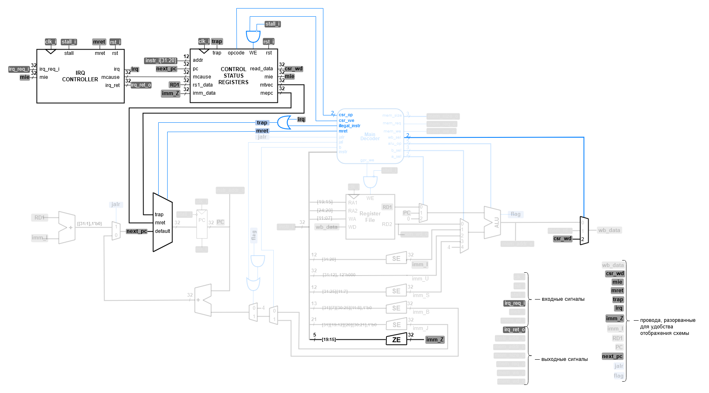

# Лабораторная работа 11 "Интеграция подсистемы прерываний"

После реализации подсистемы прерываний, её необходимо интегрировать в процессорную систему. Для этого необходимо обновить модуль `riscv_core` по приведенной ниже схеме:

Схема выделения новых частей относительно старой версии модуля

## Задание

Интегрировать модули `csr_controller` и `irq_controller` в модуль `riscv_core`.

## Порядок выполнения работы

1. Интегрируйте модули `csr_controller` и `irq_controller` в модуль `riscv_core`.
   1. Обратите внимание, что что в модуле `riscv_core` появились новые входные и выходные сигналы: `irq_req_i` и `irq_ret_o`. Эти сигналы должны быть использованы при подключении `riscv_core` в модуле `riscv_unit`.
      1. На вход `irq_req_i` пока что необходимо подать `32'd0` (в следующей лабораторной это будет изменено).
      2. При подключении сигнала `irq_ret_o` можно ничего не указывать (до следующей лабораторной к нему ничего не будет подключено).
   2. Большой мультиплексор на схеме, определяющий записываемое в `PC` значение является мультиплексором с приоритетами (в первую очередь проверяется сигнал `trap`, затем, если он равен нулю, проверяется сигнал `mret`, и только если оба предыдущих равны нулю выдается значение `default`). Такой мультиплексор лучше описать с помощью цепочки `if-else-if`.
2. После интеграции модулей, проверьте процессорную систему с помощью программы из ЛР10 с помощью предоставленного тестбенча.
