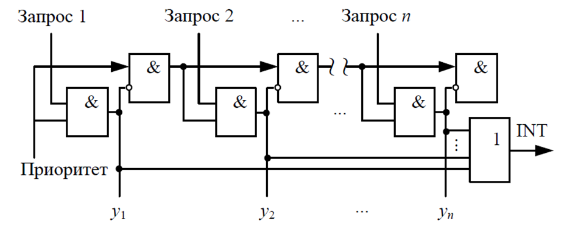

# Lab 12. Priority Interrupt Unit

In the basic version of the lab work, it is proposed to implement a processor system with a single interrupt source, which is sufficient for completing the labs. However, if you wish to improve the system and increase the number of peripheral devices, supporting only one interrupt source will create many complications. In this lab work, you need to implement a priority interrupt unit and integrate it into the interrupt controller, increasing the number of potential interrupt sources to 16.

## Goal

1. Develop a priority interrupt unit (PIU) built using a daisy chain scheme.
2. Integrate the PIU into the interrupt controller.

## Theory

If the processor system is expected to have more than one interrupt source, it is necessary to determine how to handle collisions — simultaneous interrupt requests from multiple sources. One way to solve this problem is to implement interrupt priorities. From a circuit design perspective, the simplest approach is to implement a scheme with a static, fixed priority. One such scheme is a daisy chain. An example of such a scheme can be seen in _Fig. 1_.



_Figure 1. Daisy chain block diagram._

This scheme consists of two arrays of AND gates. The first array (the top row of elements) generates a multi-bit signal (let's call it `ready`, shown in _Fig. 1_ as "_Priority_"), which is ANDed with the interrupt requests using the bottom row of AND gates, producing the multi-bit signal `y`. Note that the result of the AND operation on each element of the bottom array affects the AND result of the next element in the top array, and vice versa (`readyₙ₊₁` depends on `yₙ`, while `yₙ` depends on `readyₙ`). As soon as any bit of `y` becomes `1`, it immediately propagates as `0` through all subsequent bits of `ready`, zeroing them. Once zeroed, the `ready` bits zero the corresponding bits of `y` (zero bits in `ready` prevent interrupt generation for the corresponding bits of `y`).

The bottom array of AND gates can be described using a continuous assignment of the bitwise AND between `ready` and the interrupt request signal.

To describe the top row of AND gates, you will need to make a continuous assignment of `readyₙ & !yₙ` to the `n+1`-th bit of `ready`. The `generate for` construct is convenient for this, as it allows automating the creation of many identical structures.

Let's examine how this construct works. Suppose we want to create a bitwise assignment of a 5-bit signal `a` from a 5-bit signal `b`.

Indices used by the construct must be declared with the `genvar` keyword. Then, within the area bounded by the `generate`/`endgenerate` keywords, a loop of assignments is described (modules can also be instantiated inside such a loop):

```Verilog
logic [4:0] a;
logic [4:0] b;

// ...

genvar i;
generate
  for(i = 0; i < 5; i++) begin
    assign a[i] = b[i];
  end
endgenerate
```

_Listing 1. Example of using the generate construct._

Of course, in this example one could simply write a single continuous assignment `assign a = b;`, but for implementing the top row of AND gates, such a multi-bit continuous assignment would not synthesize the required circuit.

## Practice

Let's consider the interrupt controller implementation shown in _Fig. 2_.


_Figure 2. Block diagram of the priority interrupt unit._

In addition to ports `clk_i` and `rst_i`, the `daisy_chain` module will have 3 inputs and 3 outputs:

- `masked_irq_i` — 16-bit input for a masked interrupt request (i.e., the interrupt source has already been masked by the `mie` control and status register signal).
- `irq_ret_i` — signal indicating return of control to the main instruction flow (exit from the interrupt handler).
- `ready_i` — signal indicating the processor is ready to accept a trap (i.e., the processor is not currently inside a trap handler). This is bit zero of the `ready` signal in the daisy chain. While `ready_i` is zero, the daisy chain will not generate any interrupt signals.
- `irq_o` — signal indicating the start of interrupt processing.
- `irq_cause_o` — interrupt cause.
- `irq_ret_o` — signal indicating completion of interrupt request handling. It will correspond to `cause_o` at the moment the `mret_i` signal appears.

The internal signal `cause` is the signal `y` from _Fig. 1_. As explained above, this signal can contain only one set bit, which corresponds to the accepted interrupt request. Therefore, this result can be used as a signal to identify the interrupt cause. The OR reduction (OR of all bits) of this signal yields the final interrupt request.

However, as mentioned in [Lab #10](../10.%20Interrupt%20subsystem/), the RISC-V specification imposes certain requirements on the encoding of the `mcause` code for the interrupt cause. In particular, the most significant bit must be set to one, and the value of the remaining bits must be greater than 16. From a circuit design perspective, this is most easily implemented by concatenation: `{12'h800, cause, 4'b0000}` — in this case the most significant bit will be one, and if any bit of `cause` is one (which is the criterion for an interrupt occurring), the lower 31 bits of `mcause` will be greater than 16.

The register in _Fig. 2_ stores the value of the internal `cause` signal so that upon completion of the interrupt, a one is asserted on the corresponding bit of the `irq_ret_o` signal, notifying the device whose interrupt was being handled that processing has finished.

## Assignment

- Implement the `daisy_chain` module.
- Integrate `daisy_chain` into the `interrupt_controller` module according to the scheme shown in _Fig. 3_.
- Reflect the changes to the `interrupt_controller` signal prototype in the `processor_core` and `processor_system` modules.


_Figure 3. Block diagram of the priority interrupt unit._

> [!IMPORTANT]
> Note that the bit width of signals `irq_req_i`, `mie_i`, and `irq_ret_o` has changed. These are now 16-bit signals. The signal that previously went to the `irq_ret_o` output now goes to the `irq_ret_i` input of the `daisy_chain` module. The generation of the interrupt cause code `irq_cause_o` has been moved into the `daisy_chain` module.

### Steps

1. Implement the `daisy_chain` module.
   1. When forming the top array of AND gates from _Fig. 2_, you need to generate 16 continuous assignments using a `generate for` block.
   2. The bottom array of AND gates can be formed using a single continuous assignment via the bitwise AND operation.
2. Verify the `daisy_chain` module using the verification environment provided in the file [`lab_12.tb_daisy_chain`](lab_12.tb_daisy_chain.sv). If error messages appear in the TCL console, you need to [find](../../Vivado%20Basics/05.%20Bug%20hunting.md) and fix them.
   1. Before running the simulation, make sure the correct top-level module is selected in `Simulation Sources`.
3. Integrate the `daisy_chain` module into the `interrupt_controller` module according to the scheme shown in _Fig. 3_.
   1. Make sure to update the bit width of signals `irq_req_i`, `mie_i`, and `irq_ret_o` in the `interrupt_controller` module.
   2. Also update the bit width of signals `irq_req_i` and `irq_ret_o` in the `processor_core` and `processor_system` modules.
   3. Additionally, you now need to use the upper 16 bits of the `mie` signal instead of a single bit when connecting the `interrupt_controller` module inside `processor_core`.
4. Verify using the testbench from Lab #11 that nothing was broken during integration.
