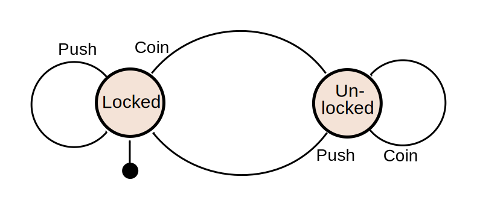
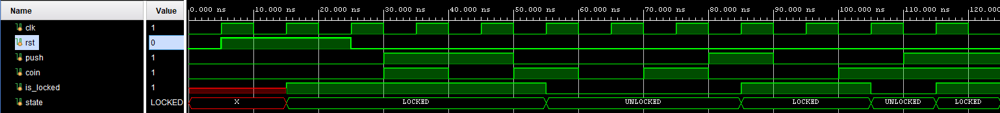

# Lab 15. Programmer

To release a microcontroller "into the wild" — that is, to use it independently of all this additional equipment and outside laboratory conditions — a mechanism for replacing the executable program must be provided.

## Objective

Implementation of a programmer — a part of the microcontroller that enables receiving an executable program from devices external to the system.

## Workflow

1. Learn about programmers and bootloaders ([#theory](#Theory))
2. Study finite-state machines and their implementation approaches ([#practice](#Practice))
3. Describe the rewritable instruction memory ([#instruction memory](#Rewritable-Instruction-Memory))
4. Describe and verify the programmer module ([#programmer](#Programmer))
5. Integrate the programmer into the processor system and verify it ([#integration](#Integrating-the-Programmer-into-processor_system))
6. Verify the system operation on an FPGA using the provided memory initialization script ([#verification](#Program-Loading-Example))

## Theory

Until now, the program executed by the processor was loaded into instruction memory via the `$readmemh` magic call. However, real microcontrollers do not have such capabilities. A program from the outside world reaches them through a so-called **programmer** — a device that writes the program into the microcontroller's memory. The programmer writes data to non-volatile memory (ROM). For the program to transfer from ROM to instruction memory (RAM), after the microcontroller starts, a **bootloader** executes first — a small program embedded in the microcontroller's memory at the time of manufacture. The bootloader is responsible for initial initialization of various registers and preparing the microcontroller to execute the main program, including transferring it from ROM to instruction memory.

Over time, several bootloader stages emerged: the **first stage bootloader** (**fsbl**) runs first, followed by a **second stage bootloader** (the program commonly known as **u-boot** often serves this role). Such a bootloader hierarchy may be required, for example, when loading an operating system (which is stored in a file system). The code for working with the file system may simply not fit in the first stage bootloader. In that case, the sole purpose of the first stage bootloader is to load the second stage bootloader, which in turn is capable of interacting with the file system and loading the operating system.

In addition, the second stage bootloader code can be modified, since it is programmed together with the main program. The first stage bootloader, however, cannot always be modified.

In this lab we will simplify the program transfer process slightly: instead of writing to ROM, the programmer will write directly to instruction memory, bypassing the bootloader.

## Practice

### Finite-State Machines (FSM)

The programmer will be implemented as a module with a [finite-state machine](https://en.wikipedia.org/wiki/Finite-state_machine). A finite-state machine consists of:

- a memory element (the so-called **state register**);
- logic that drives changes to the **state register** value (state transition logic) depending on the current state and input signals;
- logic responsible for the FSM outputs.

Finite-state machines are typically described as directed state transition graphs, where graph vertices are the FSM states and edges (arcs) are the conditions for transitioning from one state to another.

A turnstile is the simplest example of a finite-state machine. When a valid token is inserted into the turnstile's slot, it unlocks the rotating arm. After an attempt to push through the arm, it locks again until the next token.

In other words, the turnstile has:

- two states
  - locked (`locked`)
  - unlocked (`unlocked`)
- two inputs (events)
  - token accepted (`coin`)
  - attempt to push the arm (`push`)
- one output
  - arm lock

A single-bit register is sufficient to represent the two states. A clock signal and a reset signal are also required to interact with the register.

Let us describe this FSM as a state transition graph:



_Figure 1. State transition graph of the turnstile FSM [[1]](https://en.wikipedia.org/wiki/Finite-state_machine)._

The filled circle with an arrow pointing to the `Locked` vertex represents the reset signal. In other words, on reset the turnstile always transitions to the locked state.

As we can see, inserting another token while in the unlocked state keeps the state unchanged (but the turnstile does not remember that two tokens were inserted, and will lock again after the first pass). Attempting to push through the arm while in the locked state keeps the FSM in the locked state.

It is also necessary to define transition priority: first the arm push attempt is checked, and only if no such attempt occurred is the token insertion checked. This priority could also be indicated on the graph by annotating the edges to show that the transition to the unlocked state is only possible when the `push` signal is absent.

### Implementing Finite-State Machines in SystemVerilog

Looking at the components of a finite-state machine, you may have wondered: how does an FSM differ from sequential logic, since they are composed of the same elements? The answer is: not at all. Finite-state machines are a mathematical abstraction over the sequential logic function [[2]](https://www.allaboutcircuits.com/textbook/digital/chpt-11/finite-state-machines/). In other words, a finite-state machine is simply a different way of representing sequential logic — and you already know how to implement sequential logic.

To implement the state register of an FSM, it is convenient to use a special **SystemVerilog** type called `enum` (**enumeration**).

Enumerations allow declaring a unified set of named constants. The declared names can then be used in place of the enumerated values they correspond to, which improves code readability. Unless specified otherwise, the first name is assigned the value `0`, and each subsequent name increments by `1` relative to the previous value.

```Verilog
module turnstile_fsm(
  input  logic clk,
  input  logic rst,
  input  logic push,
  input  logic coin,
  output logic is_locked
);

  enum logic {LOCKED=1, UNLOCKED=0} state;

  assign is_locked = state == LOCKED;

  always_ff @(posedge clk) begin
    if(rst) begin
      state <= LOCKED;
    end
    else begin
      if(push) begin
        state <= LOCKED;
      end
      else if (coin) begin
        state <= UNLOCKED;
      end
      else begin
        state <= state;
      end
    end
  end
endmodule
```

_Listing 1. Example implementation of a turnstile FSM._

Furthermore, with appropriate tool support, enum object values can be displayed on a waveform using their named labels:



_Figure 2. Displaying `enum` object values on a waveform._

A separate combinational signal fed directly to the state register input (commonly called `next_state`) is often used when describing the state register. The turnstile FSM above is too simple to demonstrate the advantages of this approach. Suppose that on the transition from the `locked` state to the `unlocked` state we want a green light to flash on and immediately off. Without the `next_state` signal, such a module could be described as:

```Verilog
module turnstile_fsm(
  input  logic clk,
  input  logic rst,
  input  logic push,
  input  logic coin,
  output logic is_locked,
  output logic green_light
);

  enum logic {LOCKED=1, UNLOCKED=0} state;

  assign is_locked = state == LOCKED;

  // (!push) && coin — condition for transitioning to UNLOCKED state
  assign green_light = (state == LOCKED) && (!push) && coin;

  always_ff @(posedge clk) begin
    if(rst) begin
      state <= LOCKED;
    end
    else begin
      if(push) begin
        state <= LOCKED;
      end
      else if (coin) begin
        state <= UNLOCKED;
      end
      else begin
        state <= state;
      end
    end
  end
endmodule
```

_Listing 2. Example implementation of an extended turnstile FSM._

Using the `next_state` signal, the FSM could be rewritten as follows:

```Verilog
module turnstile_fsm(
  input  logic clk,
  input  logic rst,
  input  logic push,
  input  logic coin,
  output logic is_locked,
  output logic green_light
);

  enum logic {LOCKED=1, UNLOCKED=0} state, next_state;

  assign is_locked = state == LOCKED;

  assign green_light = (state == LOCKED) && (next_state == UNLOCKED);

  always_ff @(posedge clk) begin
    if(rst) begin
      state <= LOCKED;
    end
    else begin
      state <= next_state;
    end
  end

  always_comb begin
    if(push) begin
      next_state = LOCKED;
    end
    else if (coin) begin
      next_state = UNLOCKED;
    end
    else begin
      next_state = state;
    end
  end
endmodule
```

_Listing 3. Example implementation of an extended turnstile FSM using the next\_state signal._

At first glance this may seem more complex. First, an additional signal appeared. Second, an extra `always` block was added. However, imagine for a moment that the transition conditions are something more complex than a 1-bit input signal. And that those conditions govern not just one output signal but many output signals as well as internal memory elements beyond the state register. In that case, the `next_state` signal avoids duplicating many conditions.

It is important to note that `enum` objects can only be assigned enumerated constants or objects of the same type. In other words, `state` can be assigned `LOCKED`/`UNLOCKED` or `next_state`, but cannot be assigned, for example, `1'b0`.

## Assignment

To complete this lab, you must:

- describe the rewritable instruction memory;
- describe the programmer module;
- replace the instruction memory in `processor_system` with the new one and integrate the programmer.

### Rewritable Instruction Memory

Since the instruction memory previously only supported read operations and not write operations, the programmer will be unable to write the program received from the outside world into it. Therefore, a write port must be added to the instruction memory. To distinguish this implementation of the instruction memory from the previous one, this module will be named `rw_instr_mem`:

```Verilog
module rw_instr_mem
import memory_pkg::INSTR_MEM_SIZE_BYTES;
import memory_pkg::INSTR_MEM_SIZE_WORDS;
(
  input  logic        clk_i,
  input  logic [31:0] read_addr_i,
  output logic [31:0] read_data_o,

  input  logic [31:0] write_addr_i,
  input  logic [31:0] write_data_i,
  input  logic        write_enable_i
);

  logic [31:0] ROM [INSTR_MEM_SIZE_WORDS];

  assign read_data_o = ROM[read_addr_i[$clog2(INSTR_MEM_SIZE_BYTES)-1:2]];

  always_ff @(posedge clk_i) begin
    if(write_enable_i) begin
      ROM[write_addr_i[$clog2(INSTR_MEM_SIZE_BYTES)-1:2]] <= write_data_i;
    end
  end

endmodule
```

_Listing 4. The rw\_instr\_mem module._

### Programmer

You need to implement a programmer module that uses `uart` on one "side" as the interface for exchanging data with the outside world, and on the other side uses interfaces for writing the received data to instruction memory and data memory.

#### Module Description

The module is based on a finite-state machine with the following state transition graph:


_Figure 3. State transition graph of the programmer._

This FSM implements the following algorithm:

1. Receive a command ("write the next block" / "programming complete"). This command is the write address of the next block; if the address equals `0xFFFFFFFF`, it means the "programming complete" command.
   1. Upon receiving the "programming complete" command, the module finishes its operation by de-asserting the processor reset signal.
   2. Upon receiving the "write the next block" command, proceed to step 2.
2. The module sends a message indicating it is ready to receive the size of the next block.
3. The size of the next block is transmitted.
4. The module acknowledges receipt of the block size and echoes its value.
5. The next block is transmitted and written starting at the address received in step 1.
6. After receiving the number of bytes of the next block specified in step 3, the module reports that writing is complete and returns to waiting for the next command in step 1.

The following conditions are indicated on the FSM transition graph:

- `send_fin   = (  msg_counter == 0) && !tx_busy` — condition for the module to finish transmitting a message via `uart_tx`;
- `size_fin   = ( size_counter == 0) && !rx_busy` — condition for the module to finish receiving the size of the upcoming block;
- `flash_fin  = (flash_counter == 0) && !rx_busy` — condition for the module to finish receiving the block of data to be written;
- `next_round = (flash_addr    !='1) && !rx_busy` — condition for writing a data block via the system bus.

Below is the module prototype with partially implemented logic:

```Verilog
module bluster
(
  input   logic clk_i,
  input   logic rst_i,

  input   logic rx_i,
  output  logic tx_o,

  output logic [ 31:0] instr_addr_o,
  output logic [ 31:0] instr_wdata_o,
  output logic         instr_we_o,

  output logic [ 31:0] data_addr_o,
  output logic [ 31:0] data_wdata_o,
  output logic         data_we_o,

  output logic core_reset_o
);

import memory_pkg::INSTR_MEM_SIZE_BYTES;
import bluster_pkg::INIT_MSG_SIZE;
import bluster_pkg::FLASH_MSG_SIZE;
import bluster_pkg::ACK_MSG_SIZE;

enum logic [2:0] {
  RCV_NEXT_COMMAND,
  INIT_MSG,
  RCV_SIZE,
  SIZE_ACK,
  FLASH,
  FLASH_ACK,
  FINISH}
state, next_state;

logic rx_busy, rx_valid, tx_busy, tx_valid;
logic [7:0] rx_data, tx_data;

logic [5:0] msg_counter;
logic [31:0] size_counter, flash_counter;
logic [3:0] [7:0] flash_size, flash_addr;

logic send_fin, size_fin, flash_fin, next_round;

assign send_fin   = (msg_counter    ==  0)  && !tx_busy;
assign size_fin   = (size_counter   ==  0)  && !rx_busy;
assign flash_fin  = (flash_counter  ==  0)  && !rx_busy;
assign next_round = (flash_addr     != '1)  && !rx_busy;

logic [7:0] [7:0] flash_size_ascii, flash_addr_ascii;
// The generate block allows creating module structures in a loop or conditionally.
// In this case, a pattern was found in the continuous assignments that allows
// describing groups of four assignments in a more general form as a loop.
// Important: this loop only automates the description of assignments and will
// be unrolled into four groups of four continuous assignments during synthesis.
genvar i;
generate
  for(i=0; i < 4; i=i+1) begin
    // This logic converts flash_size and flash_addr signals,
    // which are raw binary numbers, into ASCII characters [1]

    // Each byte of flash_size and flash_addr is split into two nibbles.
    // A nibble is 4 bits. Each nibble can represent a hexadecimal digit.
    // If a nibble is less than 10 (4'ha), it is represented by digits 0-9.
    // To get its ASCII code, add 8'h30 (ASCII code of '0').
    // If a nibble is greater than or equal to 10, it is represented by letters a-f.
    // To get its ASCII code, add 8'h57
    // (which is the ASCII code of 'a' = 8'h61, minus 10).
    assign flash_size_ascii[i*2]    = flash_size[i][3:0] < 4'ha ? flash_size[i][3:0] + 8'h30 :
                                                                  flash_size[i][3:0] + 8'h57;
    assign flash_size_ascii[i*2+1]  = flash_size[i][7:4] < 4'ha ? flash_size[i][7:4] + 8'h30 :
                                                                  flash_size[i][7:4] + 8'h57;

    assign flash_addr_ascii[i*2]    = flash_addr[i][3:0] < 4'ha ? flash_addr[i][3:0] + 8'h30 :
                                                                  flash_addr[i][3:0] + 8'h57;
    assign flash_addr_ascii[i*2+1]  = flash_addr[i][7:4] < 4'ha ? flash_addr[i][7:4] + 8'h30 :
                                                                  flash_addr[i][7:4] + 8'h57;
  end
endgenerate

logic [INIT_MSG_SIZE-1:0][7:0] init_msg;
// ASCII code of the string "ready for flash starting from 0xflash_addr\n"
assign init_msg = { 8'h72, 8'h65, 8'h61, 8'h64, 8'h79, 8'h20, 8'h66, 8'h6F,
                    8'h72, 8'h20, 8'h66, 8'h6C, 8'h61, 8'h73, 8'h68, 8'h20,
                    8'h73, 8'h74, 8'h61, 8'h72, 8'h74, 8'h69, 8'h6E, 8'h67,
                    8'h20, 8'h66, 8'h72, 8'h6F, 8'h6D, 8'h20, 8'h30, 8'h78,
                    flash_addr_ascii, 8'h0a};

logic [FLASH_MSG_SIZE-1:0][7:0] flash_msg;
// ASCII code of the string: "finished write 0xflash_size bytes starting from 0xflash_addr\n"
assign flash_msg = {8'h66, 8'h69, 8'h6E, 8'h69, 8'h73, 8'h68, 8'h65, 8'h64,
                    8'h20, 8'h77, 8'h72, 8'h69, 8'h74, 8'h65, 8'h20, 8'h30,
                    8'h78,      flash_size_ascii,      8'h20, 8'h62, 8'h79,
                    8'h74, 8'h65, 8'h73, 8'h20, 8'h73, 8'h74, 8'h61, 8'h72,
                    8'h74, 8'h69, 8'h6E, 8'h67, 8'h20, 8'h66, 8'h72, 8'h6F,
                    8'h6D, 8'h20, 8'h30, 8'h78,     flash_addr_ascii,
                    8'h0a};

uart_rx rx(
  .clk_i      (clk_i      ),
  .rst_i      (rst_i      ),
  .rx_i       (rx_i       ),
  .busy_o     (rx_busy    ),
  .baudrate_i (17'd115200 ),
  .parity_en_i(1'b1       ),
  .stopbit_i  (2'b1       ),
  .rx_data_o  (rx_data    ),
  .rx_valid_o (rx_valid   )
);

uart_tx tx(
  .clk_i      (clk_i      ),
  .rst_i      (rst_i      ),
  .tx_o       (tx_o       ),
  .busy_o     (tx_busy    ),
  .baudrate_i (17'd115200 ),
  .parity_en_i(1'b1       ),
  .stopbit_i  (2'b1       ),
  .tx_data_i  (tx_data    ),
  .tx_valid_i (tx_valid   )
);

endmodule
```

_Listing 5. The pre-implemented portion of the programmer._

The following are already declared:

- `enum` signals `state` and `next_state`;
- signals `send_fin`, `size_fin`, `flash_fin`, `next_round`, used as state transition conditions;
- counters `msg_counter`, `size_counter`, `flash_counter`, required to implement the transition conditions;
- signals required for connecting the `uart_rx` and `uart_tx` modules:
  - `rx_busy`,
  - `rx_valid`,
  - `tx_busy`,
  - `tx_valid`,
  - `rx_data`,
  - `tx_data`;
- the `uart_rx` and `uart_tx` module instances;
- signals `init_msg` and `flash_msg`, storing the ASCII codes of the programmer's response messages, along with the logic and signals required to implement those responses:
  - `flash_size`,
  - `flash_addr`,
  - `flash_size_ascii`,
  - `flash_addr_ascii`.

#### Programmer Module Implementation

To implement this module, all signals declared above must be implemented, except for:

- `rx_busy`, `rx_valid`, `rx_data`, `tx_busy` (since they are already connected to the outputs of the `uart_rx` and `uart_tx` modules),
- `send_fin`, `size_fin`, `flash_fin`, `next_round`, `flash_size_ascii`, `flash_addr_ascii`, `init_msg`, `flash_msg` (since they are already implemented in the logic shown above).

The following programmer module outputs must also be implemented:

- `instr_addr_o`;
- `instr_wdata_o`;
- `instr_we_o`;
- `data_addr_o`;
- `data_wdata_o`;
- `data_we_o`;
- `core_reset_o`.

##### FSM Implementation

To implement the `state` and `next_state` signals, use the state transition graph shown in _Fig. 3_. If none of the transition conditions are satisfied, the FSM must remain in the current state.

To support the transition logic, counters `size_counter`, `flash_counter`, and `msg_counter` must be implemented.

`size_counter` must reset to `4` and hold that value in all states except `RCV_SIZE` and `RCV_NEXT_COMMAND`. In those two states the counter must decrement whenever `rx_valid` is asserted.

`flash_counter` must reset to `flash_size` and hold that value in all states except `FLASH`. In that state the counter must decrement whenever `rx_valid` is asserted.

`msg_counter` must reset to `INIT_MSG_SIZE-1` (the parameters `INIT_MSG_SIZE`, `FLASH_MSG_SIZE`, and `ACK_MSG_SIZE` are declared in _Listing 5_).

`msg_counter` must be initialized as follows:

- in the `FLASH` state it must take the value `FLASH_MSG_SIZE-1`,
- in the `RCV_SIZE` state it must take the value `ACK_MSG_SIZE-1`,
- in the `RCV_NEXT_COMMAND` state it must take the value `INIT_MSG_SIZE-1`.

In the `INIT_MSG`, `SIZE_ACK`, and `FLASH_ACK` states, `msg_counter` must decrement whenever `tx_valid` is asserted.

In all other situations `msg_counter` must retain its current value.

##### Implementing Signals Connected to uart_tx

The `tx_valid` signal must be asserted only when `tx_busy` is de-asserted and the FSM is in one of the following states:

- `INIT_MSG`,
- `SIZE_ACK`,
- `FLASH_ACK`

In other words, `tx_valid` is asserted when the FSM is in a state responsible for transmitting messages from the programmer, but the programmer is not currently sending the next byte of the message.

The `tx_data` signal must carry the next byte of one of the transmitted messages:

- in the `INIT_MSG` state the next byte of the `init_msg` message is transmitted,
- in the `SIZE_ACK` state the next byte of the `flash_size` message is transmitted,
- in the `FLASH_ACK` state the next byte of the `flash_msg` message is transmitted.

In all other states it equals zero. The `msg_counter` counter is used to track which byte to send.

##### Implementing Instruction Memory and Data Memory Interfaces

Why does the programmer need two interfaces? The processor system uses two buses: the instruction bus and the data bus. To avoid overcomplicating the system logic with additional multiplexing, the programmer will implement two separate interfaces as well. It is necessary to distinguish when instruction memory is being programmed from when data memory is being programmed. Since both memories have independent address spaces, the addresses used for programming may be indistinguishable. However, we faced this same problem in Lab #14 when describing the linker script. At that time, the decision was made to assign the data section a deliberately large load address. This same solution fits naturally into the programmer's logic: if we use deliberately large load addresses when programming the system, we can determine the purpose of the current data block from its value — if the write address of the block is greater than or equal to the size of the instruction memory in bytes, the block is not intended for instruction memory and will be sent to the data memory interface; otherwise, it goes to the instruction memory interface.

Instruction memory signals (registers `instr_addr_o`, `instr_wdata_o`, `instr_we_o`):

- on reset — reset to zero;
- in the `FLASH` state when `rx_valid` is received, if the value of `flash_addr` is **less than** the instruction memory size in bytes:
  - `instr_wdata_o` takes the value `{instr_wdata_o[23:0], rx_data}` (the newly received byte is shifted in from the right),
  - `instr_we_o` is set to `(flash_counter[1:0] == 2'b01)`,
  - `instr_addr_o` is set to `flash_addr + flash_counter - 1`;
- in all other situations `instr_wdata_o` and `instr_addr_o` retain their values, and `instr_we_o` is reset to zero.

Data memory signals (`data_addr_o`, `data_wdata_o`, `data_we_o`):

- on reset — reset to zero;
- in the `FLASH` state when `rx_valid` is received, if the value of `flash_addr` is **greater than or equal to** the instruction memory size in bytes:
  - `data_wdata_o` takes the value `{data_wdata_o[23:0], rx_data}` (the newly received byte is shifted in from the right),
  - `data_we_o` is set to `(flash_counter[1:0] == 2'b01)`,
  - `data_addr_o` is set to `flash_addr + flash_counter - 1`;
- in all other situations `data_wdata_o` and `data_addr_o` retain their values, and `data_we_o` is reset to zero.

##### Implementing the Remaining Logic

The `flash_size` register works as follows:

- on reset — reset to 0;
- in the `RCV_SIZE` state when `rx_valid` is asserted, it takes the value `{flash_size[2:0], rx_data}` (shifted one byte to the left, with the newly received byte placed in the vacated position);
- in all other situations it retains its current value.

The `flash_addr` register nearly mirrors the behavior of `flash_size`:

- on reset — reset to 0;
- in the `RCV_NEXT_COMMAND` state when `rx_valid` is asserted, it takes the value `{flash_addr[2:0], rx_data}` (shifted one byte to the left, with the newly received byte placed in the vacated position);
- in all other situations it retains its current value.

The `core_reset_o` signal is asserted when the FSM state is not `FINISH`.

> Since the above is essentially a complete description of the programmer's behavior in plain language, the **task effectively reduces to translating** the programmer description **from English into SystemVerilog**.

### Integrating the Programmer into processor_system


_Figure 4. Integration of the programmer into `processor_system`._

First, replace the instruction memory and add the new module. Then connect the programmer to the instruction memory and multiplex the programmer's data memory interface output with the LSU data memory interface. Replace the processor reset signal with the `core_reset_o` output.

If the `uart_tx` peripheral was used, its `tx_o` output must be multiplexed with the programmer's `tx_o` output in the same way as was done for the data memory interface signals.

### Program Loading Example

To verify the programmer in practice, prepare a compiled program as was done in Lab #14 (or use the ready-made `.mem` files from your Lab #13 variant). However, unlike Lab #14, do not delete the first line from the data memory initialization file — the load address will now be used during the loading process.

Connect the debug board to the computer's serial port (for the Nexys A7 board it is sufficient to simply connect the board with a USB cable, as was done throughout the labs for FPGA programming). You will need to find the COM port to which the debug board is connected. On Windows, the required COM port can be found through Device Manager, which can be opened from the Start menu. In that window, find the "Ports (COM & LPT)" section, expand it, and then connect the debug board via USB (if not already connected). A new device will appear in the list, with the COM port number shown in parentheses.

After connecting the debug board to the computer's serial port and configuring the FPGA with your project, initialize the memory using the provided script. An example of running the script is shown in Listing 6.

```bash
# Example script usage. Optional arguments are listed first
# (data memory initialization and various VGA controller memory regions),
# followed by the required arguments: the file for instruction memory
# initialization and the COM port.
$ python flash.py --help
usage: flash.py [-h] [-d DATA] [-c COLOR] [-s SYMBOLS] [-t TIFF] instr comport

positional arguments:
  instr                 File for instr mem initialization
  comport               COM-port name

optional arguments:
  -h, --help            show this help message and exit
  -d DATA, --data DATA  File for data mem initialization
  -c COLOR, --color COLOR
                        File for color mem initialization
  -s SYMBOLS, --symbols SYMBOLS
                        File for symbols mem initialization
  -t TIFF, --tiff TIFF  File for tiff mem initialization

python3 flash.py -d /path/to/data.mem -c /path/to/col_map.mem \
        -s /path/to/char_map.mem -t /path/to/tiff_map.mem /path/to/program COM
```

_Listing 6. Example of using the memory initialization script._

### Steps

1. Describe the `rw_instr_mem` module using the code presented in _Listing 4_.
2. Add the [`bluster_pkg`](bluster_pkg.sv) package, which contains parameter declarations and helper tasks used by the module and the testbench.
3. Describe the `bluster` module using the code presented in _Listing 5_. Complete the description of this module.
   1. Implement the FSM using signals `state`, `next_state`, `send_fin`, `size_fin`, `flash_fin`, `next_round`.
   2. [Implement](#FSM-Implementation) the counter logic for `size_counter`, `flash_counter`, `msg_counter`.
   3. [Implement](#Implementing-Signals-Connected-to-uart_tx) the logic for signals `tx_valid`, `tx_data`.
   4. [Implement](#Implementing-Instruction-Memory-and-Data-Memory-Interfaces) the instruction memory and data memory interfaces.
   5. [Implement](#Implementing-the-Remaining-Logic) the logic for the remaining signals.
4. Verify the module using the testbench provided in [`lab_15.tb_bluster.sv`](lab_15.tb_bluster.sv). If error messages appear in the TCL console, [find](../../Vivado%20Basics/05.%20Bug%20hunting.md) and fix them.
   1. Before running the simulation, make sure the correct top-level module is selected in `Simulation Sources`.
   2. The testbench requires the [`peripheral_pkg`](../13.%20Peripheral%20units/peripheral_pkg.sv) package from Lab #13, as well as the files [`lab_15_char.mem`](lab_15_char.mem), [`lab_15_data.mem`](lab_15_data.mem), and [`lab_15_instr.mem`](lab_15_instr.mem) from the [mem_files](mem_files) folder.
5. Integrate the programmer into the `processor_system` module.
   1. In the `processor_system` module, replace the instruction memory with the `rw_instr_mem` module.
   2. Add an instance of the programmer module to `processor_system`.
      1. The instruction memory interface connects to the write port of `rw_instr_mem`.
      2. The data memory interface is multiplexed with the `LSU` data memory interface.
      3. Replace the `processor_core` reset signal with the `core_reset_o` signal.
      4. If the `uart_tx` peripheral is present, its `tx_o` output must be multiplexed with the programmer's `tx_o` output in the same way as the data memory interface was multiplexed.
6. Verify the processor system after integrating the programmer using the testbench provided in [`lab_15.tb_processor_system.sv`](lab_15.tb_processor_system.sv).
   1. This testbench must be updated for your variant. Find the lines containing the helper call `program_region` whose first arguments are `"YOUR_INSTR_MEM_FILE"` and `"YOUR_DATA_MEM_FILE"`. Update these lines with the names of the files used to initialize your instruction memory and data memory in Lab #13. If you did not initialize the data memory, you may delete or comment out the corresponding call. You may add as many calls as needed.
   2. The `.mem` files you use to initialize your memory require an update. You must specify the memory cell address at which initialization should begin. This is done by adding a line of the form `@hex_address` at the beginning of the file. Example: `@FA000000`. The line must begin with the `@` character, and the address must be in hexadecimal. For instruction memory, the zero address is required, so use `@00000000`. For data memory, use an address that exceeds the instruction memory size but does not fall within the address space of other peripherals (the most significant byte of the address must be zero). Since the system uses byte addressing, the cell address will be 4 times smaller than the address the processor would use. This means that if you wanted to initialize the VGA controller memory, you would need to use `@01C00000` instead of `@07000000` (`01C00000 * 4 = 07000000`). Therefore, the optimal initialization address for data memory is `@00200000`, since the cell at address `00200000` corresponds to address `00800000` — this address does not overlap with the address space of other peripherals and is guaranteed to be larger than any possible instruction memory size. Examples of start address usage can be found in the files [`lab_15_char.mem`](lab_15_char.mem), [`lab_15_data.mem`](lab_15_data.mem), and [`lab_15_instr.mem`](lab_15_instr.mem) in the [mem_files](mem_files) folder.
   3. The testbench will wait for memory initialization to complete, after which it will apply the same test stimuli as the testbench from Lab #13. Therefore, if you used the same initialization files, the system behavior after initialization should not differ from the simulation behavior in Lab #13.
   4. Before running the simulation, make sure the correct top-level module is selected in `Simulation Sources`.
7. Proceed to the next step only after you have fully verified that the system works correctly during simulation (confirmed that correct data was written to instruction and data memories, and that the processor then began handling interrupts from the input device). Bitstream generation will take a significant amount of time, and the outcome will simply be "worked / didn't work" with no additional information, so without a solid simulation foundation you will not get far.
8. Add the constraints file ([nexys_a7_100t.xdc](../13.%20Peripheral%20units/nexys_a7_100t.xdc)) to the project if it has not been added yet, or replace its contents with the data from the file provided in Lab #13.
9. Verify the operation of your processor system on the FPGA debug board.
   1. Use the [flash.py](flash.py) script to initialize the processor system memory.
   2. Before initialization, connect the debug board to the computer's serial port and find the port number (see [Program Loading Example](#Program-Loading-Example)).
   3. The file format for memory initialization via the script is the same as the format used in the [testbench](lab_15_tb_bluster.sv). This means the first line of all files must be a line containing the memory cell address at which initialization should begin (see step 6.2).
10. In the current implementation, memory can only be initialized once since the last reset, which may be inconvenient when debugging programs. Think about how the programmer's FSM could be modified to allow an unlimited number of memory initializations without resetting the entire system.

## References

1. [Finite-state machine](https://en.wikipedia.org/wiki/Finite-state_machine).
2. [All about circuits — Finite State Machines](https://www.allaboutcircuits.com/textbook/digital/chpt-11/finite-state-machines/)
