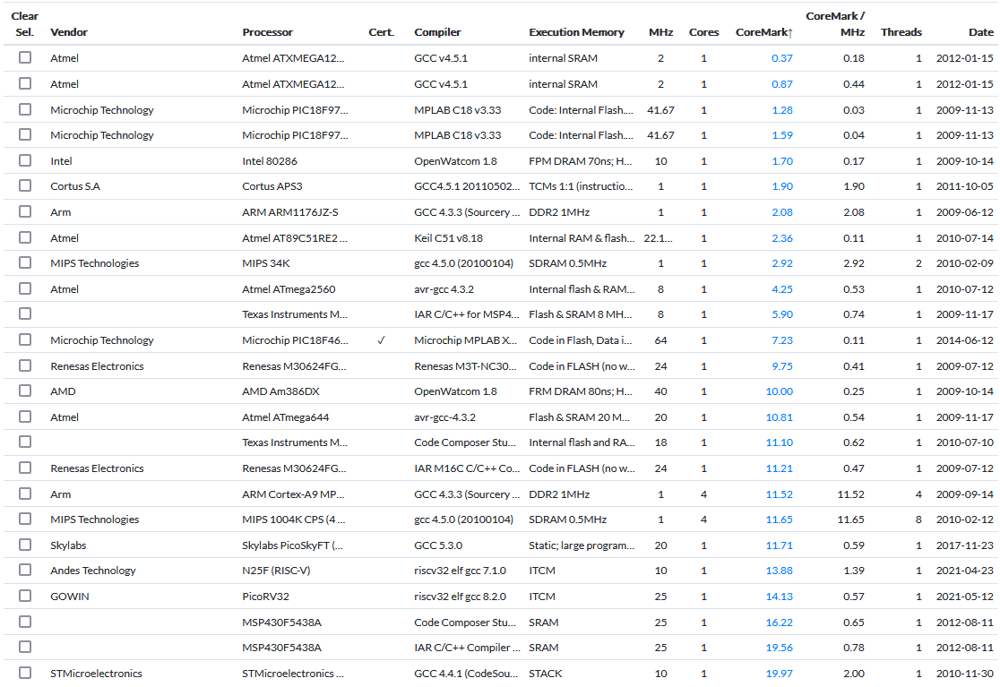

# Лабораторная работа № 16 "Оценка производительности"

## Материал для подготовки к лабораторной работе

Данная лабораторная работа будет полностью опираться на навыки, полученные в ходе выполнения лабораторных работ:

13. [Периферийные устройства](../13.%20Peripheral%20units/)
14. [Программирование](../14.%20Programming/)
15. [Программатор](../15.%20Programming%20device/)

## Цель

Дать количественную оценку, характеризующую производительность реализованной вычислительной системы. На текущий момент мы создали процессорную систему, которая способна взаимодействовать с внешним миром посредством периферийных устройств ввода-вывода и программатора, по сути являющуюся компьютером. Однако встает вопрос, какое место данная система занимает в ряду уже существующих вычислительных систем.

<!-- Ближе ли она по производительности к [разностной машине Бэббиджа](https://ru.wikipedia.org/wiki/Разностная_машина_Чарльза_Бэббиджа) или же к [Frontier](https://ru.wikipedia.org/wiki/Frontier_(суперкомпьютер)) (первому в мире [экзафлопсному компьютеру](https://ru.wikipedia.org/wiki/Exascale_computing)). Получится ли на ней запустить Doom или Skyrim? Всего этого мы не узнаем наверняка до тех пор, пока не произведем оценку производительности. -->

Для оценки производительности необходимо модифицировать существующую процессорную систему, а после собрать и запустить специализированное ПО, отвечающее за измерение производительности (будет использована программа Coremark).

## Теория

[Coremark](https://www.eembc.org/coremark/faq.php) — это набор синтетических тестов (специальных программ) для измерения производительности процессорной системы. В данный набор входят такие тесты, как работа со связными списками, матричные вычисления, обработка конечных автоматов и подсчет контрольной суммы. Результат выражается в одном числе, которое можно использовать для сравнения с результатами других процессорных систем.

Для подсчета производительности, coremark опирается на функцию, возвращающую текущее время, поэтому для оценки производительности нам потребуется вспомогательное периферийное устройство: таймер.

Для вывода результатов тестирования, необходимо описать способ, которым coremark сможет выводить очередной символ сообщения — для этого мы будем использовать контроллер UART из ЛР&nbsp;№&nbsp;13.

Кроме того, скомпилированная без оптимизаций программа будет занимать чуть более 32&nbsp;KiB, поэтому нам потребуется изменить размер памяти инструкций.

Таким образом, для того чтобы запустить данную программу, нам необходимо выполнить как аппаратные изменения процессорной системы (добавить таймер и (если отсутствует) контроллер UART), так и программные изменения самого coremark (для этого в нем предусмотрены специальные платформозависимые файлы, в которых объявлены функции, реализацию которых нам необходимо выполнить).

Говорят, что лучшей проверкой процессора на наличие ошибок является попытка запустить на нем ядро Linux. Наша процессорная система на это в принципе не рассчитана (поскольку для запуска Linux нужна поддержка нескольких дополнительных расширений), поэтому coremark можно по праву считать "бюджетным" аналогом проверки процессора на прочность.

## Задание

1. Реализовать модуль-контроллер "таймер".
2. Подключить этот модуль к системной шине.
   1. В случае, если до этого в ЛР&nbsp;№&nbsp;13 вашим устройством вывода было не UART TX, вам необходимо подключить к системной шине готовый модуль [uart_tx_sb_ctrl](../Made-up%20modules/lab_13.uart_tx_sb_ctrl.sv).
3. Добавить реализацию платформозависимых функций программы coremark.
4. Скомпилировать программу.
5. Изменить размер памяти инструкций.
6. Запустить моделирование.
7. Сравнить результаты измерения производительности с результатами существующих процессорных системам.

### Таймер

Разберемся с тем, как будет работать наш таймер. По сути, это просто системный счётчик (не путайте с программным счётчиком), непрерывно считающий такты с момента последнего сброса. Системным он называется потому, что работает на системной тактовой частоте. Значения частот, на которых работают процессорные системы сопоставимы с 32-битными значениями, поэтому системный счётчик должен быть 64-битным. Для измерения времени мы будем засекать значение счётчика на момент начала отсчета и значение счётчика в конце отсчёта. Зная тактовую частоту и разность между значениями счётчика мы с легкостью сможем вычислить прошедшее время. При этом нужно обеспечить счётчик такой разрядностью, чтобы он точно не смог переполниться.

Поскольку мы уже назвали данный модуль "таймером", чтобы тот не был слишком простым, давайте добавим ему функциональности: пускай это будет устройство, способное генерировать прерывание через заданное число тактов. Таким образом, процессорная система сможет засекать время без постоянного опроса счётчика. Для работы coremark эта функциональность не нужна — если ее реализация окажется слишком сложной для вас, просто создайте системный счётчик, инкрементирующийся каждый такт, с доступом на чтение по адресу `32'h0`.

Было бы удобно, чтобы мы могли управлять тем, каким образом данный модуль будет генерировать такое прерывание: однократно, заданное число раз, или же бесконечно, пока тот не остановят.

Таким образом, мы сформировали адресное пространство контроллера, представленное в _таблице 1_.

|Адрес|Режим доступа|Допустимые значения|                 Функциональное назначение                                             |
|-----|-------------|-------------------|---------------------------------------------------------------------------------------|
|0x00 | R           | [0:2³²-1]         | Значение младших 32 бит системного счётчика, доступное только для чтения              |
|0x04 | R           | [0:2³²-1]         | Значение старших 32 бит системного счётчика, доступное только для чтения              |
|0x08 | RW          | [0:2³²-1]         | Указание младших 32 бит задержки, спустя которую таймер будет генерировать прерывание |
|0x0c | RW          | [0:2³²-1]         | Указание старших 32 бит задержки, спустя которую таймер будет генерировать прерывание |
|0x10 | RW          | [0:2]             | Указание режима генерации прерываний (выключен, заданное число раз, бесконечно)       |
|0x14 | RW          | [0:2³²-1]         | Указание количества повторений генерации прерываний                                   |
|0x24 | W           |  1                | Программный сброс                                                                     |

_Таблица 1. Адресное пространство контроллера таймера._

Прототип модуля представлен в _листинге 1_.

```Verilog
module timer_sb_ctrl(
/*
    Часть интерфейса модуля, отвечающая за подключение к системной шине
*/
  input  logic        clk_i,
  input  logic        rst_i,
  input  logic        req_i,
  input  logic        write_enable_i,
  input  logic [31:0] addr_i,
  input  logic [31:0] write_data_i,
  output logic [31:0] read_data_o,
  output logic        ready_o,
/*
    Часть интерфейса модуля, отвечающая за отправку запросов на прерывание
    процессорного ядра
*/
  output logic        interrupt_request_o
);
```

_Листинг 1. Прототип контроллера таймера._

Обратите внимание, что у модуля нет сигнала `interrupt_return_i`. Модуль будет генерировать прерывания ровно на 1 такт. Если процессор в этот момент не будет готов обработать прерывания (обрабатывая в этот момент какой-либо другой перехват) — запрос будет сразу же пропущен и таймер начнет отсчитывать следующий.

Для работы данного контроллера потребуются следующие сигналы:

```Verilog
logic [63:0] system_counter;
logic [63:0] delay;
enum logic [1:0] {OFF, NTIMES, FOREVER} mode, next_mode;
logic [31:0] repeat_counter;
logic [63:0] system_counter_at_start;
```

- `system_counter` — регистр, ассоциированный с адресами `0x00` (младшие 32 бита) и `0x04` (старшие 32 бита), системный счётчик. Задача регистра заключается в ежетактном увеличении на единицу.
- `delay` — регистр, ассоциированный с адресами `0x08` (младшие 32 бита) и `0x0c` (старшие 32 бита). Число тактов, спустя которое таймер (когда тот будет включен) сгенерирует прерывание. Данный регистр изменяется только сбросом, либо запросом на запись.
- `mode` — регистр, ассоциированный с адресом `0x10`. Режим работы таймера:
  - `OFF` — отключен (не генерирует прерывания)
  - `NTIMES` — включен до тех пор, пока не сгенерирует N прерываний (значение N хранится в регистре `repeat_counter` и обновляется после каждого сгенерированного прерывания). После генерации N прерываний, переходит в режим `OFF`.
  - `FOREVER` — бесконечная генерация прерываний. Не отключится, пока режим работы прерываний не будет изменен.
- `next_mode` — комбинационный сигнал, который подается на вход записи в регистр `mode` (аналог `next_state` из ЛР&nbsp;№&nbsp;15). Данный сигнал меняется только запросами на запись по адресу `0x10` или в случае, если `repeat_counter == 0` в режиме `NTIMES`. Поскольку этому сигналу можно присваивать только сигналы того же типа (`mode`/`next_mode`), либо константы из перечисления, запросы на запись можно реализовать через блок `case` (где перебираются 3 возможных значения `write_data_i`).
- `repeat_counter` — регистр, ассоциированный с адресом `0x14`. Количество повторений для режима `NTIMES`. Уменьшается в момент генерации прерывания в этом режиме в случае, если еще не равен нулю.
- `system_counter_at_start` — неархитектурный регистр, хранящий значение системного счётчика на момент начала отсчета таймера. Обновляется при генерации прерывания (если это не последнее прерывание в режиме `NTIMES`) и при запросе на запись в регистр `mode` значения не `OFF`.

Выходной сигнал interrupt_request_o должен быть равен единице, если текущий режим работы не `OFF`, а сумма `system_counter_at_start` и `delay` равна `system_counter`.

Для подключения данного таймера к системной шине, мы воспользуемся первым свободным базовым адресом, оставшимся после ЛР&nbsp;№&nbsp;13: `0x08`. Таким образом, для обращения к системному счётчику, процессор будет использовать адрес `0x08000000` для обращения к регистру `delay` `0x08000008` и т.п.

### Настройка Coremark

В первую очередь, необходимо скачать исходный код данной программы, размещенный по адресу: [https://github.com/eembc/coremark](https://github.com/eembc/coremark). На случай возможных несовместимых изменений в будущем, все дальнейшие ссылки будут даваться на слепок репозитория, который был на момент коммита `d5fad6b`.

После этого, чтобы добавить поддержку нашей процессорной системы потребуется:

1. Реализовать функцию, измеряющую время
2. Реализовать функцию, выводящую очередной символ сообщения с результатами
3. Реализовать функцию, выполняющую первичную настройку периферии перед тестом
4. Выполнить мелкую подстройку, такую как количество итераций в тесте и указание аргументов, с которыми будет скомпилирована программа.

Все файлы, содержимое которых мы будем менять расположены в папке [barebones](https://github.com/eembc/coremark/tree/d5fad6bd094899101a4e5fd53af7298160ced6ab/barebones).

#### 1. Реализация функции, измеряющей время

Не мы первые придумали измерять время путем отсчета системных тактов, поэтому вся логика по измерению времени уже реализована в coremark. От нас требуется только реализовать функцию, которая возвращает текущее значение системного счётчика.

Данной функцией является `barebones_clock`, расположенная в файле [`core_portme.c`](https://github.com/eembc/coremark/blob/d5fad6bd094899101a4e5fd53af7298160ced6ab/barebones/core_portme.c). В данный момент, в реализации функции описан вызов ошибки (поскольку реализации как таковой нет). Мы должны **заменить** реализацию функции кодом, приведённым в _листинге 2_.

```C
barebones_clock()
{
    volatile ee_u32 *ptr = (ee_u32*)0x08000000;
    ee_u32 tim = *ptr;
    return tim;
}
```

_Листинг 2. Код функции `barebones_clock`._

После ЛР&nbsp;№&nbsp;14 вы уже должны представлять, что здесь происходит. Мы создали указатель с абсолютным адресом `0x08000000` — адресом системного счётчика. Разыменование данного указателя вернет текущее значение системного счётчика, что и должно быть результатом вызова этой функции. Поскольку тест закончится менее чем за секунду, не обязательно загружать значение старших 32 бит (они будут не равны нулю только спустя 2³² тактов / 10⁶ тактов/с ≈ 429 c).

Для того, чтобы корректно преобразовать тики системного счётчика во время, используется функция [`time_in_secs`](https://github.com/eembc/coremark/blob/d5fad6bd094899101a4e5fd53af7298160ced6ab/barebones/core_portme.c#L117), которая уже реализована, но для работы которой нужно определить макрос `CLOCKS_PER_SEC`, характеризующий тактовую частоту, на которой работает процессор. Давайте определим данный макрос сразу над макросом [`EE_TICKS_PER_SEC`](https://github.com/eembc/coremark/blob/d5fad6bd094899101a4e5fd53af7298160ced6ab/barebones/core_portme.c#L62):

```C
#define CLOCKS_PER_SEC             10000000
```

На этом наша задача по измерению времени завершена. Остальные правки будут не сложнее этих.

#### 2. Реализация вывода очередного символа сообщения

Для вывода очередного символа во встраиваемых системах используется (какое совпадение!) функция [`uart_send_char`](https://github.com/eembc/coremark/blob/d5fad6bd094899101a4e5fd53af7298160ced6ab/barebones/ee_printf.c#L663), расположенная в файле [`ee_printf.c`](https://github.com/eembc/coremark/blob/d5fad6bd094899101a4e5fd53af7298160ced6ab/barebones/ee_printf.c).

В реализации данной функции вам уже предлагают алгоритм, по которому та должна работать. Необходимо:

1. дождаться готовности UART к отправке;
2. передать отправляемый символ;
3. дождаться готовности UART к отправке (завершения передачи).

Давайте так и реализуем эту функцию:

```C
uart_send_char(char c)
{
    volatile ee_u8 *uart_ptr = (ee_u8 *)0x06000000;
    while(*(uart_ptr+0x08));
    *uart_ptr = c;
    while(*(uart_ptr+0x08));
}
```

_Листинг 3. Код функции `uart_send_char`._

`0x06000000` — базовый адрес контроллера UART TX из ЛР&nbsp;№&nbsp;13 (и адрес передаваемых этим контроллером данных).
`0x08` — смещение до адреса регистра `busy` в адресном пространстве этого контроллера.

#### 3. Реализация функции первичной настройки

Это функция [`portable_init`](https://github.com/eembc/coremark/blob/d5fad6bd094899101a4e5fd53af7298160ced6ab/barebones/core_portme.c#L130), расположена в уже известном ранее файле `core_portme.c`. Данная функция выполняет необходимые нам настройки перед началом теста. Для нас главное — настроить нужным образом контроллер UART.
Допустим мы хотим, чтобы данные передавались на скорости `115200`, c одним стоповым битом и контролем бита четности. В этом случае, мы должны добавить в начало функции следующий код:

```C
portable_init(core_portable *p, int *argc, char *argv[])
{
    volatile ee_u32 *uart_tx_ptr = (ee_u32 *)0x06000000;
    *(uart_tx_ptr + 3) = 115200;
    *(uart_tx_ptr + 4) = 1;
    *(uart_tx_ptr + 5) = 1;

    //...
}
```

_Листинг 4. Код функции `uart_send_char`._

#### 4. Дополнительные настройки

Для тонких настроек используется заголовочный файл [`core_portme.h`](https://github.com/eembc/coremark/blob/d5fad6bd094899101a4e5fd53af7298160ced6ab/barebones/core_portme.h), куда также требуется внести несколько изменений. Нам необходимо:

1. Объявить в начале файла макрос `ITERATIONS`, влияющий на количество прогонов теста. Нам достаточно выставить значение 1.
2. Обновить значение макроса `COMPILER_FLAGS`, заменив его значение `FLAGS_STR` на`"-march=rv32i_zicsr -mabi=ilp32"`, именно с этими аргументами мы будем собирать программу. Это опциональная настройка, которая позволит вывести флаги компиляции в итоговом сообщении.
3. Добавить подключение заголовочного файла `#include <stddef.h>`.

### Компиляция

Для компиляции программы, вам потребуются предоставленные файлы [Makefile](Makefile) и [linker_script.ld](linker_script.ld), а также файл [startup.S](../14.%20Programming/startup.S) из ЛР&nbsp;№&nbsp;14. Эти файлы необходимо скопировать с заменой в корень папки с программой.

`Makefile` написан из расчёта, что кросс-компилятор расположен по пути `C:/riscv_cc/`. В случае, если это не так, измените первую строчку данного файла в соответствии с расположением кросс-компилятора.

Для запуска компиляции, необходимо выполнить следующую команду, находясь в корне программы coremark:

```bash
make
```

В случае, если на вашем рабочем компьютере не установлена утилита `make`, то вы можете скомпилировать программу вручную, выполнив последовательность команд, приведённую в _листинге 5_.

```bash
export CC_BASE=/c/riscv_cc/bin/riscv-none-elf
export CC="$CC_BASE"-gcc
export OBJ_DUMP="$CC_BASE"-objdump
export OBJ_COPY="$CC_BASE"-objcopy
export SIZE="$CC_BASE"-size
export CC_FLAGS="-march=rv32i_zicsr -mabi=ilp32 -I./ -I./barebones"
export LD_FLAGS="-Wl,--gc-sections -nostartfiles -T linker_script.ld"
export OC_FLAGS="-O verilog --verilog-data-width=4"

$CC -c $CC_FLAGS -o core_main.o       core_main.c
$CC -c $CC_FLAGS -o startup.o         startup.S
$CC -c $CC_FLAGS -o core_list_join.o  core_list_join.c
$CC -c $CC_FLAGS -o core_matrix.o     core_matrix.c
$CC -c $CC_FLAGS -o core_state.o      core_state.c
$CC -c $CC_FLAGS -o core_util.o       core_util.c
$CC -c $CC_FLAGS -o core_portme.o     barebones/core_portme.c
$CC -c $CC_FLAGS -o cvt.o             barebones/cvt.c
$CC -c $CC_FLAGS -o ee_printf.o       barebones/ee_printf.c
$CC $CC_FLAGS $LD_FLAGS *.o       -o coremark.elf

$OBJ_DUMP -D coremark.elf > coremark_disasm.S

$OBJ_COPY $OC_FLAGS -j .data -j .bss coremark.elf coremark_data.mem
$OBJ_COPY $OC_FLAGS -j .text coremark.elf coremark_instr.mem

$SIZE coremark.elf
```

_Листинг 5. Последовательность команд для компиляции coremark._

В случае успешной компиляции, вам будет выведено сообщение об итоговом размере секций инструкций и данных:

```text
   text    data     bss     dec     hex filename
  34324    2268     100   36692    8f54 coremark.elf
```

### Изменение размера памяти инструкций

Как видите, размер секции инструкций превышает 32&nbsp;KiB на 1556 байт (32768—34000). Поэтому на время оценки моделирования, нам придется увеличить размер памяти инструкций до 64&nbsp;KiB, изменив значение параметра `INSTR_MEM_SIZE_BYTES` в пакете `memory_pkg` до значения `32'h10000`. Размер памяти данных также необходимо увеличить, изменив значение параметра `DATA_MEM_SIZE_BYTES` до `32'h4000`.

Обратите внимание, что увеличение размера памяти в 16 раз приведет к значительному увеличению времени синтеза устройства, поэтому данное изменение мы производим исключительно на время поведенческого моделирования.

### Запуск моделирования

Программирование 34&nbsp;KiB по UART займет ощутимое время, поэтому вам предлагается проинициализировать память инструкций и данных "по-старинке" через системные функции `$readmemh`.

Если все было сделано без ошибок, то примерно через `300ms` после снятия сигнала сброса с ядра процессора выход `tx_o` начнет быстро менять свое значение, сигнализируя о выводе результатов программы, которые отобразятся в `tcl console` примерно еще через `55ms` в виде _листинга 6_ (вывод сообщения будет завершен приблизительно на `355ms` времени моделирования).

```text
2K performance run parameters for coremark.
CoreMark Size    : 666
Total ticks      : 2574834
Total time (secs): <скрыто до получения результатов моделирования>
Iterations/Sec   : <скрыто до получения результатов моделирования>
ERROR! Must execute for at least 10 secs for a valid result!
Iterations       : 1
Compiler version : GCC13.2.0
Compiler flags   : -march=rv32i_zicsr -mabi=ilp32
Memory location  : STACK
seedcrc          : 0x29f4
[0]crclist       : 0x7704
[0]crcmatrix     : 0x1fd7
[0]crcstate      : 0x8e3a
[0]crcfinal      : 0x7704
Errors detected
```

_Листинг 6. Лог вывода результатов coremark. Значения "Total time (secs)" и "Iterations/Sec" скрыты до получения результатов моделирования._

## Порядок выполнения задания

1. [Опишите](#таймер) таймер в виде модуля `timer_sb_ctrl`.
2. Проверьте модуль с помощью верификационного окружения, описанного в файле [lab_16.tb_timer.sv](lab_16.tb_timer.sv).
3. Интегрируйте модуль `timer_sb_ctrl` в процессорную систему.
   1. Ко входу `rst_i` модуля подключите сигнал `core_reset_o` программатора. Таким образом, системный счётчик начнет работать только когда память системы будет проинициализирована.
   2. Сигнал прерывания этого модуля подключать не обязательно, т.к. coremark будет осуществлять чтение путем опроса системного счётчика, а не по прерыванию.
4. В случае, если до этого в ЛР&nbsp;№&nbsp;13 вашим устройством вывода было не UART TX, вам необходимо подключить к системной шине готовый модуль [uart_tx_sb_ctrl](../Made-up%20modules/lab_13.uart_tx_sb_ctrl.sv).
5. Получите исходный код программы coremark. Для этого можно либо склонировать [репозиторий](https://github.com/eembc/coremark/tree/d5fad6bd094899101a4e5fd53af7298160ced6ab), либо скачать его в виде архива.
6. Добавьте реализацию платформозависимых функций программы coremark. Для этого в папке `barebones` необходимо:
   1. в файле `core_portme.c`:
      1. [реализовать](#1-реализация-функции-измеряющей-время) функцию `barebones_clock`, возвращающую текущее значение системного счётчика;
      2. объявить макрос `CLOCKS_PER_SEC`, характеризующий тактовую частоту процессора;
      3. [реализовать](#3-реализация-функции-первичной-настройки) функцию `portable_init`, выполняющую первичную инициализацию периферийных устройств до начала теста;
   2. в файле `ee_printf.c` [реализовать](#2-реализация-вывода-очередного-символа-сообщения) функцию `uart_send_char`, отвечающую за отправку очередного символа сообщения о результате.
7. Добавьте с заменой  в корень программы файлы [Makefile](Makefile), [linker_script.ld](linker_script.ld) и [startup.S](../14.%20Programming/startup.S).
8. Скомпилируйте программу вызовом `make`.
   1. Если кросскомпилятор расположен не в директории `C:/riscv_cc`, перед вызовом `make` вам необходимо соответствующим образом отредактировать первую строчку в `Makefile`.
   2. В случае отсутствия на компьютере утилиты `make`, вы можете самостоятельно скомпилировать программу вызовом команд, представленных в параграфе ["Компиляция"](#компиляция).
9. Временно измените размер памяти инструкций до 64&nbsp;KiB, а памяти данных до 16&nbsp;KiB, изменив значение параметров `INSTR_MEM_SIZE_BYTES` и `DATA_MEM_SIZE_BYTES` в пакете `memory_pkg` на `32'h10_000` и `32'h4_000` соответственно.
10. Проинициализируйте память инструкций и память данных файлами `coremark_instr.mem` и `coremark_data.mem`, полученными в ходе компиляции программы.
    1. Память можно проинициализировать двумя путями: с помощью вызова системной функции `$readmemh`, либо же с помощью программатора. Однако имейте в виду, что инициализация памятей с помощью программатора будет достаточно долго моделироваться в виду большого объема программы.
    2. В случае, если инициализация будет осуществляться посредством `$readmemh`, не забудьте удалить первую строчку со стартовым адресом из файла, инициализирующего память данных.
    3. В случае, если инициализация будет осуществляться с помощью программатора, используйте вспомогательные вызовы `program_region` из пакета `bluster_pkg`, как это было сделано в `lab_15_tb_system`.
    4. В исходном виде тестбенч описан под инициализацию памяти посредством `$readmemh`.
11. Выполните моделирование системы с помощью модуля [lab_16.tb_coremark.sv](lab_16.tb_coremark.sv).
    1. Результаты теста будут выведены приблизительно на `355ms` времени моделирования.

## Оценка производительности

<details>
  <summary>Прочти меня после успешного завершения моделирования </summary>

Итак, вы получили сообщение, представленное в _листинге 7_.

```text
2K performance run parameters for coremark.
CoreMark Size    : 666
Total ticks      : 2901822
Total time (secs): 0.290182
Iterations/Sec   : 3.446111
ERROR! Must execute for at least 10 secs for a valid result!
Iterations       : 1
Compiler version : GCC13.2.0
Compiler flags   : -march=rv32i_zicsr -mabi=ilp32
Memory location  : STACK
seedcrc          : 0xe9f5
[0]crclist       : 0xe714
[0]crcmatrix     : 0x1fd7
[0]crcstate      : 0x8e3a
[0]crcfinal      : 0xe714
Errors detected
```

_Листинг 7. Лог вывода результатов coremark._

Не обращайте внимание на строки "ERROR! Must execute for at least 10 secs for a valid result!" и "Errors detected". Программа считает, что для корректных результатов, необходимо крутить ее по кругу в течении минимум 10 секунд, однако по большей части это требование необходимо для более достоверного результата у систем с кэшем/предсказателями переходов и прочими блоками, которые могут изменить количество тактов на прохождение между итерациями. Наш однотактный процессор будет вести себя одинаково на каждом круге, поэтому нет смысла в дополнительном времени моделирования. Тем не менее, если вы захотите получить результаты, не содержащих сообщения об ошибках, измените число итераций в файле `core_portme.h` до 45.

Нас интересует строка:

```text
Iterations/Sec   : 3.446111
```

Это и есть так называемый "кормарк" — метрика данной программы. Результат нашего процессора: ~3.45 кормарка.

Обычно, для сравнения между собой нескольких реализаций микроархитектур, более достоверной считается величина "кормарк / МГц", т.е. число кормарков, поделённое на тактовую частоту процессора, поскольку время прохождения теста напрямую зависит от тактовой частоты. Это значит, что чип с менее удачной микроархитектурной реализацией может выиграть по кормарку просто потому, что он был выпущен по лучшей технологии, позволяющей запустить его на больших частотах. Кормарк/МГц нормализует результаты, позволяя сравнивать микроархитектурные решения, не заботясь о том, на какой частоте был получен результат.

Более того, при сравнении с другими результатами, необходимо учитывать флаги оптимизации, которые использовались при компиляции программы, поскольку они также влияют на результат. Например, если собрать coremark с уровнем оптимизаций `-O1`, результат нашей системы скакнёт до 11.23 кормарков, что всего лишь является следствием того, что программа стала меньше обращаться к памяти после оптимизаций. Именно поэтому результаты coremark указываются вместе с опциями, с которыми тот был собран.

Мы не будем уходить в дебри темных паттернов маркетинга и вместо этого будет оценивать производительность в лоб: сколько кормарков в секунду смог прогнать наш процессор без каких-либо оптимизаций в сравнении с представленными результатами других систем вне зависимости от их оптимизаций.

Таблица опубликованных результатов находится по адресу: [https://www.eembc.org/coremark/scores.php](https://www.eembc.org/coremark/scores.php). Нам необходимо отсортировать эту таблицу по столбцу `CoreMark`, кликнув по нему.

Мы получим следующий расклад:



На что мы можем обратить внимание? Ну, во-первых, мы видим, что соседний с нашим микроконтроллер по кормарку — это `ATmega2560` с результатом `4.25` кормарка. Т.е. наш процессор по производительности схож с микроконтроллерами Arduino.

Есть ли здесь еще что-нибудь интересное? Посмотрим в верх таблицы, мы можем увидеть производителя Intel с их микропроцессором [Intel 80286](https://ru.wikipedia.org/wiki/Intel_80286). Как написано на вики, данный микропроцессор был в 3-6 раз производительней [Intel 8086](https://ru.wikipedia.org/wiki/Intel_8086), который соперничал по производительности с процессором [Zilog Z80](https://en.wikipedia.org/wiki/Zilog_Z80), который устанавливался в домашний компьютер [TRS-80](https://en.wikipedia.org/wiki/TRS-80).

А знаете, с чем был сопоставим по производительности компьютер TRS-80? С бортовым компьютером [Apollo Guidance Computer](https://en.wikipedia.org/wiki/Apollo_Guidance_Computer), который проводил вычисления и контролировал движение, навигацию, управлял командным и лунным модулями в ходе полётов по программе Аполлон.

Иными словами, мы разработали процессор, который приблизительно в 6-12 раз производительнее компьютера, управлявшего полётом космического корабля, который доставил человека на Луну!

Можно ли как-то улучшить наш результат? Безусловно. Мы можем улучшить его примерно на 5% изменив буквально одну строчку. Дело в том, что для простоты реализации, мы генерировали сигнал `stall` для каждой операции обращения в память. Однако приостанавливать работу процессора было необходимо только для операций чтения из памяти. Если не генерировать сигнал `stall` для операций типа `store`, мы уменьшим время, необходимое на исполнение бенчмарка. Попробуйте сделать это сами.

Добавление умножителей, конвейеризация и множество других потенциальных улучшений увеличат производительность в разы.

Но это, как говорится, уже другая история.

</details>
