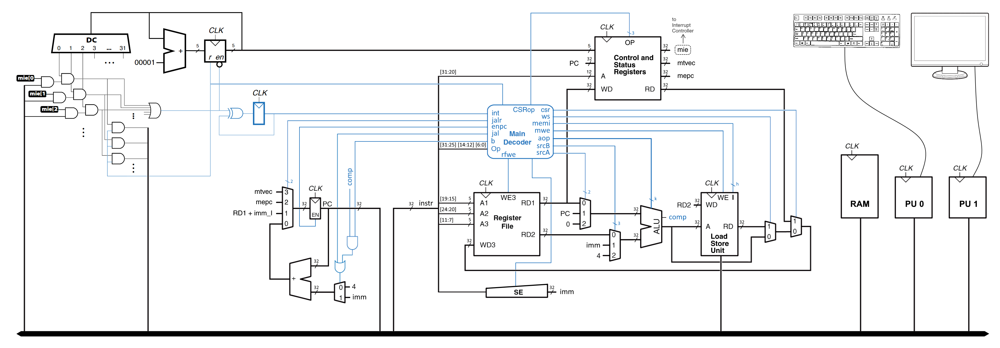
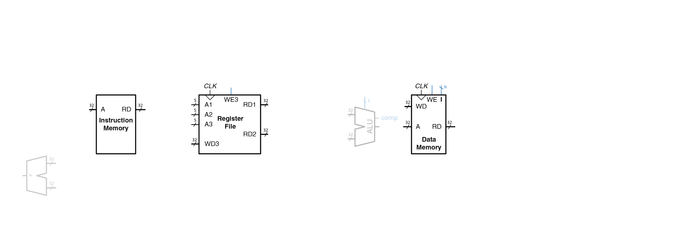
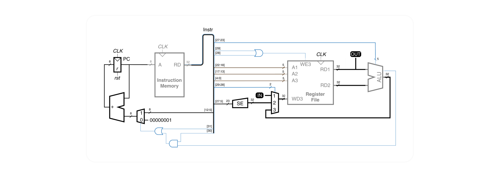
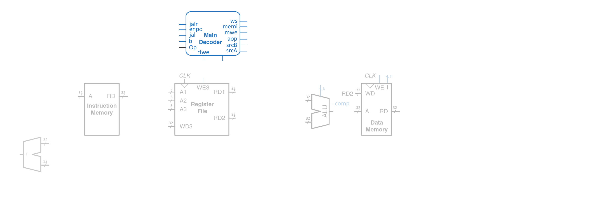
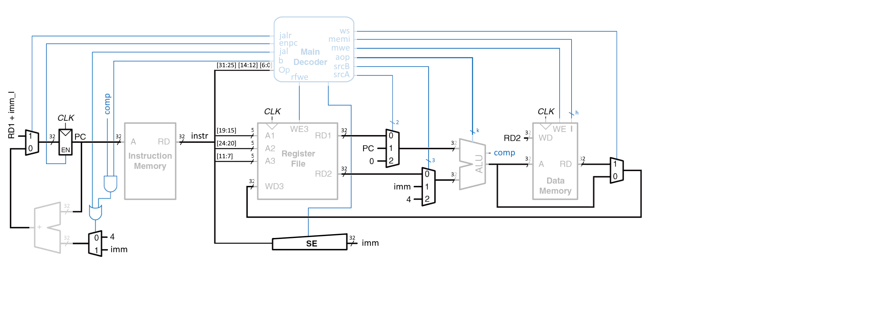
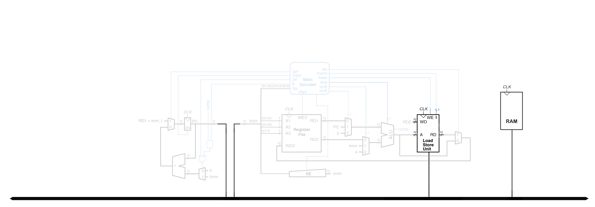
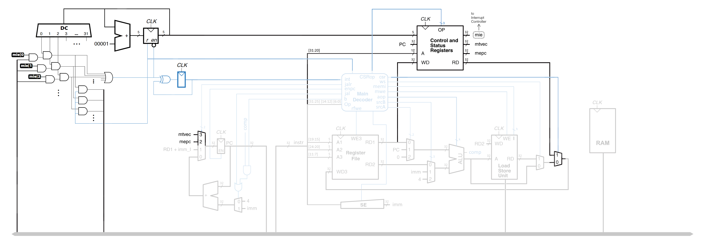
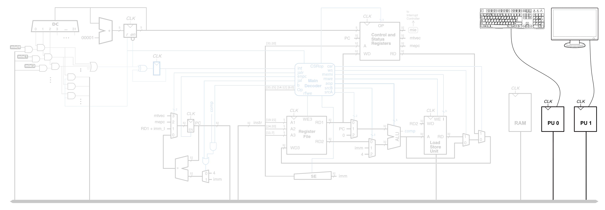
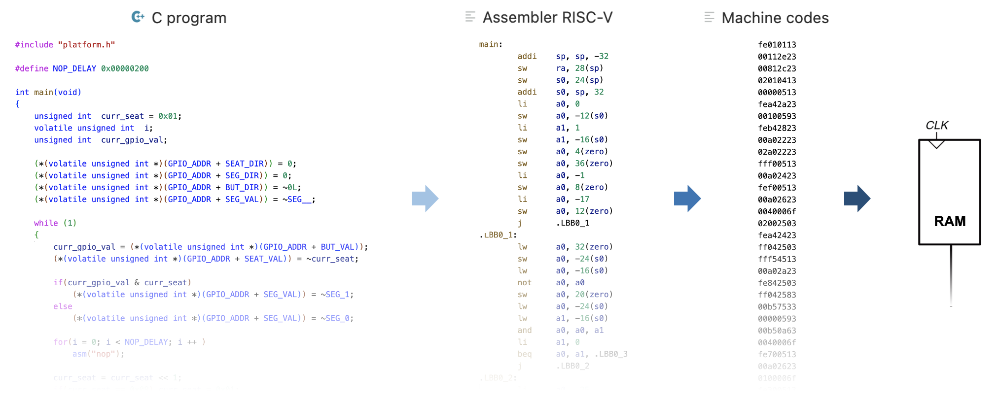

# Курс лабораторных работ

## Содержание
- [Курс лабораторных работ](#курс-лабораторных-работ)
  - [Содержание](#содержание)
  - [Полезное](#полезное)
  - [Порядок выполнения лабораторных работ для групп](#порядок-выполнения-лабораторных-работ-для-групп)
    - [ИБ, ИКТ, КТ, РТ](#иб-икт-кт-рт)
    - [ПИН, ПМ](#пин-пм)
    - [ИВТ](#ивт)
  - [Обзор лабораторных работ](#обзор-лабораторных-работ)
  - [1. Сумматор. Verilog HDL (Adder)](#1-сумматор-verilog-hdl-adder)
  - [2. Арифметико-логическое устройство (ALU)](#2-арифметико-логическое-устройство-alu)
  - [3. Регистровый файл и память (RF)](#3-регистровый-файл-и-память-rf)
  - [4. Простейшее программируемое устройство (PPD)](#4-простейшее-программируемое-устройство-ppd)
  - [5. Основной дешифратор команд (MD)](#5-основной-дешифратор-команд-md)
  - [6. Тракт данных (DP)](#6-тракт-данных-dp)
  - [7. Блог загрузки и сохранения данных (LSU)](#7-блог-загрузки-и-сохранения-данных-lsu)
  - [8. Подсистема прерывания (IC)](#8-подсистема-прерывания-ic)
  - [9. Периферийные устройства (PU)](#9-периферийные-устройства-pu)
  - [10. Программирование на языке высокого уровня](#10-программирование-на-языке-высокого-уровня)

## Полезное

- [Как установить Vivado](../Vivado%20Basics/Install%20Vivado.md)
- [Создание базового проекта с прошивкой ПЛИС в Vivado](../Vivado%20Basics/Vivado%20trainer.md)
- [Что такое язык описания аппаратуры HDL](../Introduction/What%20is%20HDL.md)
- [Как работает ПЛИС](../Introduction/How%20FPGA%20works.md)
- [Синтакс языка Verilog](../Basic%20Verilog%20structures/Verilog%20syntax.md)
- [Базовые конструкции Verilog](../Basic%20Verilog%20structures/)
- [Тестовое окружение](../Basic%20Verilog%20structures/Testbench.md)

## Порядок выполнения лабораторных работ для групп

### ИБ, ИКТ, КТ, РТ

1. Сумматор ([01. Adder](01.%20Adder))
2. АЛУ ([02. Arithmetic-logic unit](02.%20Arithmetic-logic%20unit))
3. Регистровый файл и внешняя память ([03. Register file and memory](03.%20Register%20file%20and%20memory))
4. Простейшее программируемое устройство ([04. Primitive programmable device](04.%20Primitive%20programmable%20device))

### ПИН, ПМ

1. Сумматор ([01. Adder](01.%20Adder))
2. АЛУ ([02. Arithmetic-logic unit](02.%20Arithmetic-logic%20unit))
3. Регистровый файл и внешняя память ([03. Register file and memory](03.%20Register%20file%20and%20memory))
4. Простейшее программируемое устройство ([04. Primitive programmable device](04.%20Primitive%20programmable%20device))
5. Основной дешифратор ([05. Main decoder](05.%20Main%20decoder))
6. Тракт данных ([06. Datapath](06.%20Datapath))
7. Периферийные устройства ([09. Peripheral units](09.%20Peripheral%20units))
8. Программирование ([10. Programming](10.%20Programming))

### ИВТ

1. АЛУ ([02. Arithmetic-logic unit](02.%20Arithmetic-logic%20unit))
2. 
   1. Память ([03. Register file and memory](03.%20Register%20file%20and%20memory)),
   2. Простейшее программируемое устройство ([04. Primitive programmable device](04.%20Primitive%20programmable%20device))
3. Основной дешифратор ([05. Main decoder](05.%20Main%20decoder))
4. Тракт данных ([06. Datapath](06.%20Datapath))
5. Модуль загрузки и сохранения (07. Load-store unit)
6. Контроллер прерываний ()
7. Периферийные устройства ([09. Peripheral units](09.%20Peripheral%20units))
8. Программирование ([10. Programming](10.%20Programming))

## Обзор лабораторных работ

Курс *Архитектур процессорных систем* включает в себя цикл из 10 лабораторных работ, в течение которых используя язык описания аппаратуры **Verilog HDL** на основе **FPGA** (ПЛИС, программируемая логическая интегральная схема), с нуля, последовательно, создается система, под управлением процессора с архитектурой **RISC-V**, управляющего периферийными устройствами и программируемого на языке высокого уровня **C++**.

Создаваемая система на ПЛИС состоит из: процессора, памяти, контроллера прерываний и контроллеров периферийных устройств.

Выполнение лабораторных работ это последовательный процесс в результате которого будет освоен ряд различных инструментов и средств. В общих словах это:

**Verilog HDL** - язык описания аппаратуры, благодаря которому схемы не рисуются, а описываются с помощью текста (кода).

**Testbench** - тестовые окружения, которые представляют собой несинтезируемые (то есть не существующие в реальном физическом мире) блоки, созданные на языке Verilog HDL для автоматического тестирования разрабатываемых устройств и проверки их корректной работоспособности.

**FPGA** - программируемая логическая интегральная схема (ПЛИС), изменяя внутреннюю конфигурацию которой можно создать любые цифровые устройства (в рамках предоставляемых ресурсов).

**Vivado** - система автоматизированного проектирования, которая превращает Verilog-код в конфигурацию и прошивает ей ПЛИС на отладочной плате. 

**Архитектура RISC-V** - открытая и свободная система команд и процессорная архитектура на основе концепции RISC для микропроцессоров и микроконтроллеров.

**Язык ассемблера RISC-V** - список основных команд и особенности их использования и написания программ.

**Ассемблер RISC-V** - программа, которая превращает код, написанный на языке ассемблера RISC-V в машинные инструкции для процессора с архитектурой RISC-V.

Далее приводится краткое описание и цель каждой отдельной лабораторной работы.

## 1. Сумматор. Verilog HDL (Adder)

На первой лабораторной работе изучаются базовые конструкции языка описания аппаратуры Verilog HDL, с помощью которого разрабатывается цифровой сумматор из примитивных логических вентилей, который, в последствии, конфигурируется в ПЛИС и его работа проверяется на отладочном стенде.

## 2. Арифметико-логическое устройство (ALU)

На второй лабораторной изучаются новые конструкции языка Verilog HDL, на основе которых разрабатывается блок арифметико-логического устройства (АЛУ). АЛУ - это устройство, на входы которого подаются операнды, над которыми нужно выполнить некоторую операцию (сложение, вычитание и тому подобное) и код операции, которую нужно выполнить, а на выходе появляется результат этой операции. Проще говоря АЛУ - это "калькулятор" процессора.

Для проверки правильной работоспособности АЛУ в конце лабораторной работы, на языке Verilog HDL, пишется testbench (тестовое окружение), которое автоматически проверяет корректность его реализации.

## 3. Регистровый файл и память (RF)

На третьей лабораторной разрабатываются элементы памяти для будущего процессора: память команд, память данных и регистровый файл. В памяти команд будет храниться программа, которую будет выполнять процессор. В памяти данных хранятся данные, которые будут обрабатываться процессором. Регистровый файл - это маленькая память, тоже с данными, которые могут быть поданы непосредственно на АЛУ. Особенность RISC-архитектур в том, что данные перед обработкой необходимо перенести из памяти данных в регистровый файл, только после этого к ним можно применять различные операции.

## 4. Простейшее программируемое устройство (PPD)

Эта работа – небольшое отступление от реализации процессора с архитектурой RISC-V и нужна для более глубокого понимания принципов работы и организации программируемых устройств. В рамках четвертой лабораторной работы из реализованных блоков собирается примитивное программируемое устройство, для которого пишется программа в машинных кодах.

## 5. Основной дешифратор команд (MD)

Пятая лабораторная посвящена разработке устройства управления – основному дешифратору команд. Функция основного дешифратора - получать на вход коды выполняемых операций и преобразовывать их в управляющие сигналы для всех блоков процессора (АЛУ, память, регистровый файл, мультиплексоры). Работа требует внимательности в реализации, а ее результат проверяется заранее подготовленными автоматическими тестами.

## 6. Тракт данных (DP)

Разработанные блоки объединяются, образуя тракт данных, управляемый основным дешифратором команд. Результатом шестой лабораторной работы является однотактный процессор, с архитектурой RISC-V, поддерживающий стандартный набор целочисленных инструкций RV32I. В качестве проверки на процессоре запускаются программы, заранее написанные на языке ассемблера RISC-V. Сравнивается результат полученный на симуляторе и на разработанном процессоре.

## 7. Блог загрузки и сохранения данных (LSU)

В современных компьютерах память является отдельным от процессора устройством. В пятой работе память программ и память данных выносится за пределы процессора, объединяются в одну общую память и подключается через общую шину. В процессоре для этого появляется блок Load/Store Unit.

## 8. Подсистема прерывания (IC)

Одной из основных функций процессоров является возможность реагировать на внешние события (дернуть мышку, нажать кнопку и т.п.), автоматически запуская, при их возникновении, соответствующие программы. В шестой работе создается и подключается подсистема прерывания, к которой относятся контроллер прерываний с циклическим опросом и блок регистров статуса и управления.

## 9. Периферийные устройства (PU)

На седьмой работе создаются и подключаются к общей шине и подсистеме прерывания контроллеры периферийных устройств, такие как контроллер клавиатуры и VGA-контроллер.

## 10. Программирование на языке высокого уровня

В рамках восьмой работы настраивается компилятор GCC для RISC-V и для разработанной системы пишется программное обеспечение на языке программирования C++.
