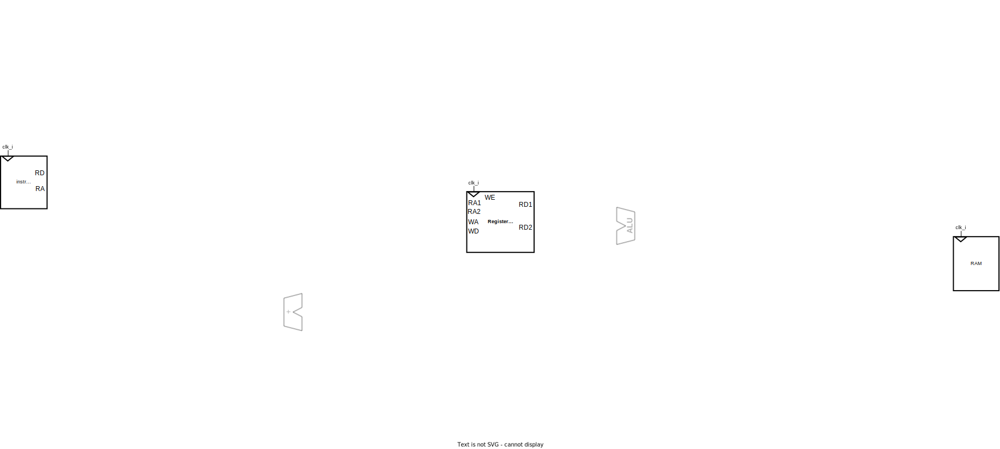

# Курс лабораторных работ

## Содержание

- [Курс лабораторных работ](#курс-лабораторных-работ)
  - [Содержание](#содержание)
  - [Полезное](#полезное)
  - [Порядок выполнения лабораторных работ для групп](#порядок-выполнения-лабораторных-работ-для-групп)
    - [ИБ, ИКТ, КТ, РТ](#иб-икт-кт-рт)
    - [ПИН, ПМ](#пин-пм)
    - [ИВТ](#ивт)
  - [Обзор лабораторных работ](#обзор-лабораторных-работ)
  - [1. Сумматор. SystemVerilog (Adder)](#1-сумматор-systemverilog-adder)
  - [2. Арифметико-логическое устройство (ALU)](#2-арифметико-логическое-устройство-alu)
  - [3. Регистровый файл и внешняя память (RF)](#3-регистровый-файл-и-внешняя-память-rf)
  - [4. Простейшее программируемое устройство (PPD)](#4-простейшее-программируемое-устройство-ppd)
  - [5. Основной дешифратор команд (MD)](#5-основной-дешифратор-команд-md)
  - [6. Основная память](#6-основная-память)
  - [7. Тракт данных (DP)](#7-тракт-данных-dp)
  - [8. Блог загрузки и сохранения данных (LSU)](#8-блог-загрузки-и-сохранения-данных-lsu)
  - [9 Интеграция LSU](#9-интеграция-lsu)
  - [10. Подсистема прерывания (IC)](#10-подсистема-прерывания-ic)
  - [11. Интеграция подсистемы прерывания](#11-интеграция-подсистемы-прерывания)
  - [12. Увеличение количества источников прерываний с помощью дейзи-цепочки](#12-увеличение-количества-источников-прерываний-с-помощью-дейзи-цепочки)
  - [13. Периферийные устройства (PU)](#13-периферийные-устройства-pu)
  - [14. Программирование на языке высокого уровня](#14-программирование-на-языке-высокого-уровня)
  - [15. Программатор](#15-программатор)
  - [16. Оценка производительности](#16-оценка-производительности)

## Полезное

- [Студенческий сервер](../Other/Students%20server.md)
- [Создание базового проекта с прошивкой ПЛИС в Vivado](../Vivado%20Basics/Vivado%20trainer.md)
- [Базовые конструкции Verilog](../Basic%20Verilog%20structures/)
- [Список типичных ошибок в Vivado и SystemVerilog](../Other/FAQ.md)
- [Тестовое окружение](../Basic%20Verilog%20structures/Testbench.md)
- [Готовые модули](Made-up%20modules)

## Порядок выполнения лабораторных работ для групп

### ИБ, ИКТ, КТ, РТ

1. Сумматор ([01. Adder](01.%20Adder))
2. АЛУ ([02. Arithmetic-logic unit](02.%20Arithmetic-logic%20unit))
3. Регистровый файл и внешняя память ([03. Register file and memory](03.%20Register%20file%20and%20memory))
4. Простейшее программируемое устройство ([04. Primitive programmable device](04.%20Primitive%20programmable%20device))

### ПИН, ПМ

1. Сумматор ([01. Adder](01.%20Adder))
2. АЛУ ([02. Arithmetic-logic unit](02.%20Arithmetic-logic%20unit))
3. Регистровый файл и внешняя память ([03. Register file and memory](03.%20Register%20file%20and%20memory))
4. Простейшее программируемое устройство ([04. Primitive programmable device](04.%20Primitive%20programmable%20device))
5. Основной дешифратор ([05. Main decoder](05.%20Main%20decoder))
6.
   1. Тракт данных ([07. Datapath](07.%20Datapath))
   2. Интеграция блока загрузки и сохранения ([09. LSU Integration](09.%20LSU%20Integration))
   3. Интеграция подсистемы прерываний ([11. Interrupt Integration](11.%20Interrupt%20integration))
7. Периферийные устройства ([13. Peripheral units](13.%20Peripheral%20units))
8. Программирование ([14. Programming](14.%20Programming))

### ИВТ

1. АЛУ ([02. Arithmetic-logic unit](02.%20Arithmetic-logic%20unit))
2.
   1. Память ([03. Register file and memory](03.%20Register%20file%20and%20memory)),
   2. Простейшее программируемое устройство ([04. Primitive programmable device](04.%20Primitive%20programmable%20device))
3. Основной дешифратор ([05. Main decoder](05.%20Main%20decoder))
4. Тракт данных ([07. Datapath](07.%20Datapath))
5.
   1. Модуль загрузки и сохранения ([08. Load-store unit](08.%20Load-store%20unit))
   2. Интеграция блока загрузки и сохранения ([09. LSU Integration](09.%20LSU%20Integration))
6.
   1. Контроллер прерываний ([10. Interrupt subsystem](10.%20Interrupt%20subsystem))
   2. Интеграция подсистемы прерываний ([11. Interrupt Integration](11.%20Interrupt%20integration))
7. Периферийные устройства ([13. Peripheral units](13.%20Peripheral%20units))
8. Программирование ([14. Programming](14.%20Programming))

## Обзор лабораторных работ

Курс *Архитектур процессорных систем* включает в себя цикл из 16 лабораторных работ (10 основных + 6 вспомогательных), в течение которых используя язык описания аппаратуры **SystemVerilog** на основе **FPGA** (ПЛИС, программируемая логическая интегральная схема), с нуля, последовательно, создается система, под управлением процессора с архитектурой **RISC-V**, управляющего периферийными устройствами и программируемого на языке высокого уровня **C++**.  На этой системе можно даже запустить простенькие игры, к примеру змейку:

https://github.com/MPSU/APS/assets/17159587/4daac01f-dc9a-4ec8-8d3f-c5dc1ef97119

Создаваемая система на ПЛИС состоит из: процессора, памяти, контроллера прерываний и контроллеров периферийных устройств.

Выполнение лабораторных работ это последовательный процесс в результате которого будет освоен ряд различных инструментов и средств. В общих словах это:

**SystemVerilog** - язык описания аппаратуры, благодаря которому схемы не рисуются, а описываются с помощью текста (кода).

**Testbench** - тестовые окружения, которые представляют собой несинтезируемые (то есть не существующие в реальном физическом мире) блоки, созданные на языке SystemVerilog для автоматического тестирования разрабатываемых устройств и проверки их корректной работоспособности.

**FPGA** - программируемая логическая интегральная схема (ПЛИС), изменяя внутреннюю конфигурацию которой можно создать любые цифровые устройства (в рамках предоставляемых ресурсов).

**Vivado** - система автоматизированного проектирования, которая превращает SystemVerilog-код в конфигурацию и прошивает ей ПЛИС на отладочной плате.

**Архитектура RISC-V** - открытая и свободная система команд и процессорная архитектура на основе концепции RISC для микропроцессоров и микроконтроллеров.

**Язык ассемблера RISC-V** - список основных команд и особенности их использования и написания программ.

**Ассемблер RISC-V** - программа, которая превращает код, написанный на языке ассемблера RISC-V в машинные инструкции для процессора с архитектурой RISC-V.

Далее приводится краткое описание и цель каждой отдельной лабораторной работы.

## 1. Сумматор. SystemVerilog (Adder)

На первой лабораторной работе изучаются базовые конструкции языка описания аппаратуры SystemVerilog, с помощью которого разрабатывается цифровой сумматор из примитивных логических вентилей, который, в последствии, конфигурируется в ПЛИС и его работа проверяется на отладочном стенде.

## 2. Арифметико-логическое устройство (ALU)

На второй лабораторной изучаются новые конструкции языка SystemVerilog, на основе которых разрабатывается блок арифметико-логического устройства (АЛУ). АЛУ — это устройство, на входы которого подаются операнды, над которыми нужно выполнить некоторую операцию (сложение, вычитание и тому подобное) и код операции, которую нужно выполнить, а на выходе появляется результат этой операции. Проще говоря АЛУ - это "калькулятор" процессора.

## 3. Регистровый файл и внешняя память (RF)

На третьей лабораторной разрабатываются элементы памяти для будущего процессора: память команд, память данных и регистровый файл. В памяти команд будет храниться программа, которую будет выполнять процессор. В памяти данных хранятся данные, которые будут обрабатываться процессором. Регистровый файл — это маленькая память, тоже с данными, которые могут быть поданы непосредственно на АЛУ. Особенность RISC-архитектур в том, что данные перед обработкой необходимо перенести из памяти данных в регистровый файл, только после этого к ним можно применять различные операции.

## 4. Простейшее программируемое устройство (PPD)

Эта работа – небольшое отступление от реализации процессора с архитектурой RISC-V и нужна для более глубокого понимания принципов работы и организации программируемых устройств. В рамках четвертой лабораторной работы из реализованных блоков собирается примитивное программируемое устройство, для которого пишется программа в машинных кодах.

## 5. Основной дешифратор команд (MD)

Пятая лабораторная посвящена разработке устройства управления – основному дешифратору команд. Функция основного дешифратора — получать на вход коды выполняемых операций и преобразовывать их в управляющие сигналы для всех блоков процессора (АЛУ, память, регистровый файл, мультиплексоры). Работа требует внимательности в реализации, а ее результат проверяется заранее подготовленными автоматическими тестами.

## 6. Основная память

Недостатком реализации процессора из предыдущей лабораторной работы была его неспособность выполнять операции `LB`, `LBU`, `SB`, `LH`, `LHU`, `SH`. Отчасти это связано с ограничением реализованной ранее памяти (в этой памяти не было возможности обновить отдельный байт в ячейке памяти).

Данная вспомогательная лабораторная работа позволяет реализовать память без этого ограничения.

## 7. Тракт данных (DP)

Разработанные блоки объединяются, образуя тракт данных, управляемый основным дешифратором команд. Результатом шестой лабораторной работы является однотактный процессор, с архитектурой RISC-V, поддерживающий стандартный набор целочисленных инструкций RV32I. В качестве проверки на процессоре запускаются программы, заранее написанные на языке ассемблера RISC-V. Сравнивается результат полученный на симуляторе и на разработанном процессоре.

## 8. Блог загрузки и сохранения данных (LSU)

Для корректного исполнения инструкций `LB`, `LBU`, `SB`, `LH`, `LHU`, `SH` мало использовать память с побайтовой записью. Необходимо также уметь управлять этой памятью, определенным образом подготавливать данные как для записи в память данный, так и для записи в регистровый файл, а также следить за тем, чтобы за время работы с памятью, программа процессора не начала исполняться дальше. Все эти задачи возлагаются на специальный модуль, который называется **Блок загрузки и сохранения** (**Load and Store Unit**, **LSU**)

## 9 Интеграция LSU

Вспомогательная лабораторная работа по интеграции реализованного ранее блока загрузки и сохранения, а также новой памяти данных в модуль `riscv_unit`.

## 10. Подсистема прерывания (IC)

Одной из основных функций процессоров является возможность реагировать на внешние события (дернуть мышку, нажать кнопку и т.п.), автоматически запуская, при их возникновении, соответствующие программы. В данной лабораторной создается и подсистема прерывания, к которой относятся контроллер прерываний с циклическим опросом и блок регистров статуса и управления.

## 11. Интеграция подсистемы прерывания

Вспомогательная лабораторная работа по интеграции реализованной ранее подсистемы прерывания.

## 12. Увеличение количества источников прерываний с помощью дейзи-цепочки

В базовом варианте лабораторных работ вам было предложено реализовать процессорную систему с одним источником прерываний. Этого достаточно для выполнения лабораторных работ, однако, в случае если вы захотите увеличить количество периферийных устройств, поддержка только одного источника прерываний станет источником проблем. В данной лабораторной работе вы реализуете блок приоритетных прерываний и интегрируете его в контроллер прерываний, увеличив число источников прерываний до 16.

## 13. Периферийные устройства (PU)

В данной лабораторной создаются и подключаются к общей шине и подсистеме прерывания контроллеры периферийных устройств: переключатели, светодиоды, клавиатура, семисегментные дисплеи а также контроллер uart.

## 14. Программирование на языке высокого уровня

В рамках данной лабораторной настраивается компилятор GCC для RISC-V и для разработанной системы пишется программное обеспечение на языке программирования C++.

## 15. Программатор

До этого момента, исполняемая процессором программа попадала в память инструкций через магический вызов `$readmemh`. Однако реальные микроконтроллеры не обладают такими возможностями. Программа из внешнего мира попадает в них посредством так называемого **программатора** — устройства, обеспечивающего запись программы в память микроконтроллера. Программатор записывает данные в постоянное запоминающее устройство (ПЗУ). Для того, чтобы программа попала из ПЗУ в память инструкций, после запуска контроллера сперва начинает исполняться **загрузчик** (**bootloader**) — небольшая программа, вшитая в память микроконтроллера на этапе изготовления, которая отвечает за первичную инициализацию и подготовку микроконтроллера к выполнению основной программы (включая её перенос из ПЗУ в память инструкций).

В рамках данной лабораторной работы мы немного упростим процесс передачи программы: вместо записи в ПЗУ, программатор будет записывать её сразу в память инструкций, минуя загрузчик.

## 16. Оценка производительности

На текущий момент мы создали процессорную систему, которая способна взаимодействовать с внешним миром посредством периферийных устройств ввода-вывода и программатора. Однако сложно понять, какое место данная система занимает в ряду уже существующих вычислительных систем.

Для оценки производительности мы модифицируем процессорную систему, соберем и запустим специализированное ПО, отвечающее за измерение производительности (мы будем использовать программу Coremark). Получив результаты, сравним наш процессор, с существующими.
