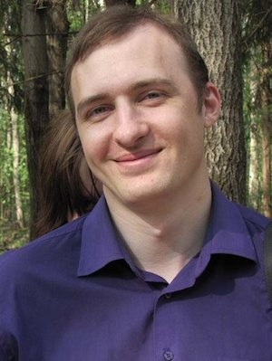
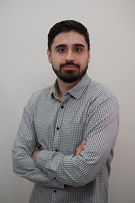
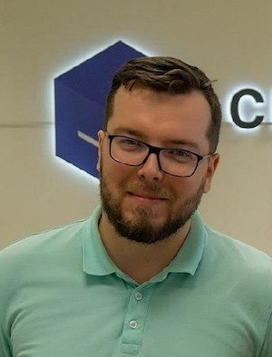
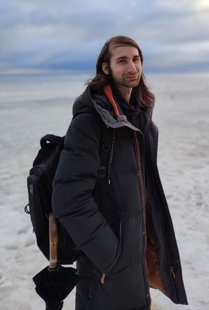
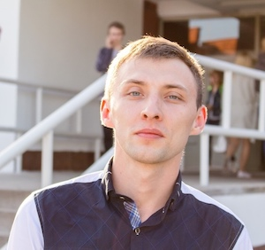
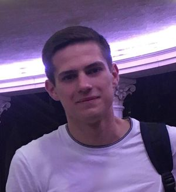
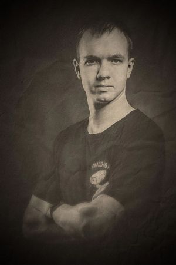
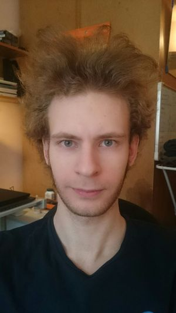
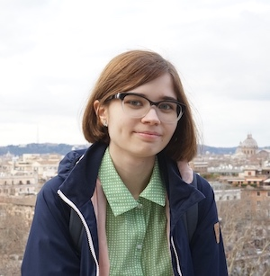
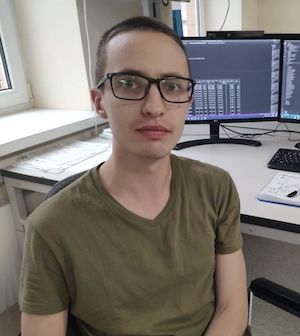

# Преподаватели АПС 2022

## Распределение по группам

|   Группа   |        Расписание лаб         |                    Лектор                   |              Преподаватель                  |
|------------|-------------------------------|---------------------------------------------|---------------------------------------------|
| **ИБ-31**  |Пн. 14:00–16:50 — Числитель-I  |[Силантьев](#Силантьев-Александр-Михайлович) |[Силантьев](#Силантьев-Александр-Михайлович) |
| **ИВТ-31** |Вт. 14:00-16:50 — Знаменатель  |[Орлов](#Орлов-Александр-Николаевич)         |[Солодовников](#Солодовников-Андрей-Павлович)|
| **ИВТ-32** |                               |[Орлов](#Орлов-Александр-Николаевич)         |                                             |
| **ИВТ-33** |Чт. 12:30-15:20 — Числитель    |[Орлов](#Орлов-Александр-Николаевич)         |[Орлов](#Орлов-Александр-Николаевич)|
| **ИКТ-31** |Чт. 15:30-18:20 — Знаменатель-I|[Силантьев](#Силантьев-Александр-Михайлович) |[Примаков](#Примаков-Евгений-Владимирович)   |
| **ИКТ-32** |Вт. 15:30-18:20 — Знаменатель-I|[Силантьев](#Силантьев-Александр-Михайлович) |[Примаков](#Примаков-Евгений-Владимирович)   |
| **ИКТ-33** |                               |[Силантьев](#Силантьев-Александр-Михайлович) |                                             |
| **КТ-31**  |Пн. 09:00–11:50 — Знаменатель  |[Силантьев](#Силантьев-Александр-Михайлович) |[Солодовников](#Солодовников-Андрей-Павлович)|
| **ПИН-35** |Пн. 14:30-17:40 — Знаменатель  |[Орлов](#Орлов-Александр-Николаевич)         |[Солодовников](#Солодовников-Андрей-Павлович)|
| **ПИН-36** |Пн. 14:30-17:40 — Знаменатель  |[Орлов](#Орлов-Александр-Николаевич)         |[Солодовников](#Солодовников-Андрей-Павлович)|
| **ПМ-31**  |Пн. 15:30–18:20 — Знаменатель  |[Орлов](#Орлов-Александр-Николаевич)         |[Силантьев](#Силантьев-Александр-Михайлович) |
| **ПМ-32**  |Пн. 12:00–15:20 — Числитель-II |[Орлов](#Орлов-Александр-Николаевич)         |[Силантьев](#Силантьев-Александр-Михайлович) |
| **ПМ-32**  |Пт. 15:30–18:20 — Знаменатель-I|[Орлов](#Орлов-Александр-Николаевич)         |[Силантьев](#Силантьев-Александр-Михайлович) |
| **РТ-31**  |Ср.12:00–15:20 — Знаменатель   |[Силантьев](#Силантьев-Александр-Михайлович) |[Чусов](#Чусов-Сергей-Андреевич)             |
| **РТ-32**  |Вт. 14:00–16:50 — Числитель    |[Силантьев](#Силантьев-Александр-Михайлович) |[Чусов](#Чусов-Сергей-Андреевич)             |

## Преподаватели

### Орлов Александр Николаевич

Старший преподаватель, инженер-электроник в НИИ ВСиСУ

---

### Примаков Евгений Владимирович

Преподаватель, инженер-электроник в НИИ ВСиСУ

***telegram***: [`@Konfusion`](https://t.me/Konfusion)

***Консультации***:

| День      |    Неделя    |   Время   | Аудитория |
|-----------|------------  |-----------|-----------|
|Понедельник| Знаменатель  |15:30-18:20|   4338    |

### Силантьев Александр Михайлович

Старший преподаватель Института МПСУ, инженер-электроник в НИИ ВСиСУ, руководитель группы

***telegram***: [`@sam_sil`](http://t.me/sam_sil)

***Консультации***: пока не определено

---

### Солодовников Андрей Павлович

Аспирант НИУ МИЭТ, инженер-электроник в НИИ ВСиСУ

***telegram***: [`@HepoH`](http://t.me/HepoH)

***Консультации***:

| День      |    Неделя    |   Время   | Аудитория | Примечание    |
|-----------|------------  |-----------|-----------|---------------|
|Понедельник| Числитель    |17:00-18:20|   3240    | Должники      |
|Вторник    | Числитель    |17:00-18:20|   4338    | Текущие группы|

---

### Хисамов Василь Тагирович

---

Старший преподаватель Института МПСУ, инженер-электроник в НИИ ВСиСУ

***telegram***: [`@PascalVT`](http://t.me/PascalVT)

***e-mail***: Xisamoffvasil[*собака*]mail.ru

***Консультации***: пока не определено

### Чусов Сергей Андреевич

Аспирант НИУ МИЭТ, инженер-электроник в НИИ ВСиСУ

***telegram***: [`@srg_chs`](http://t.me/srg_chs)

---
<!-- ###

## Ассистенты

 Замтарадзе Артём Раульевич

Магистрант ИВТ (IoT), инженер в НПК ТЦ,

***telegram***: [`@gad_dam`](http://t.me/gad_dam)

Почта: artyomzamtaradze[*собака*]yandex.ru -->

---
<!--
### Демидов Александр Александрович

Магистрант ИВТ

***telegram***: [`@AlexBee4`](http://t.me/AlexBee4)

---

### Демичев Сергей Сергеевич

Магистрант ИВТ

***telegram***: [`@darthajFox`](http://t.me/darthajFox)

--- -->

<!-- ### Рыжкова Дарья Васильевна

Магистр НИУ МИЭТ, инженер-электроник в НИИ ВСиСУ

***telegram***: [`@frarrr`](http://t.me/frarrr)

--- -->

<!-- ### Барков Евгений Сергеевич

Магистр НИУ МИЭТ, инженер-электроник в НИИ ВСиСУ

***telegram***: [`@barkove`](http://t.me/barkove)

--- -->
