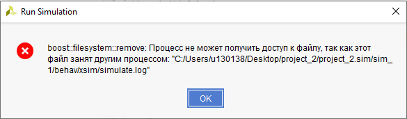
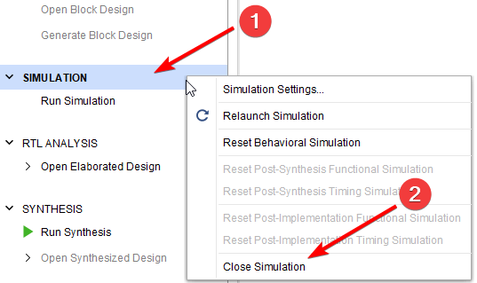
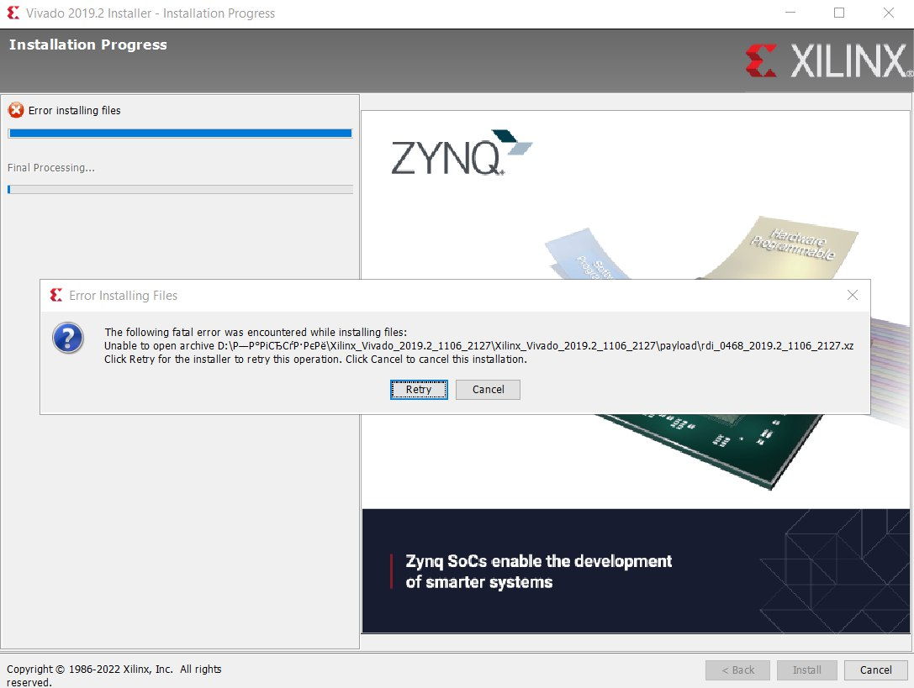

# Список типичных ошибок при работе с Vivado и SystemVerilog

## Содержание

- [Список типичных ошибок при работе с Vivado и SystemVerilog](#список-типичных-ошибок-при-работе-с-vivado-и-systemverilog)
  - [Содержание](#содержание)
  - [Ошибки связанные с САПР Vivado](#ошибки-связанные-с-сапр-vivado)
    - [Не запускается симуляция FATAL\_ERROR PrivateChannel Error creating client socket](#не-запускается-симуляция-fatal_error-privatechannel-error-creating-client-socket)
    - [Не запускается симуляция boost filesystem remove Процесс не может получить доступ к файлу](#не-запускается-симуляция-boost-filesystem-remove-процесс-не-может-получить-доступ-к-файлу)
    - [Вылетает Vivado при попытке открыть схему](#вылетает-vivado-при-попытке-открыть-схему)
    - [Не устанавливается Vivado Unable to open archive](#не-устанавливается-vivado-unable-to-open-archive)
  - [Ошибки синтаксиса языка SystemVerilog](#ошибки-синтаксиса-языка-systemverilog)
    - [имя сигнала is not a type](#имя-сигнала-is-not-a-type)
    - [cannot find port on this module](#cannot-find-port-on-this-module)


## Ошибки связанные с САПР Vivado

### Не запускается симуляция FATAL_ERROR PrivateChannel Error creating client socket

**Причина:** ошибка [связана с проблемами Win Sockets](https://support.xilinx.com/s/question/0D52E00006iI37SSAS/isim-124-m81d-fatal-error-privatechannel-error-creating-client-socket?language=en_US), из-за которых симуляция не может быть запущена на сетевых дисках.  
**Способ воспроизведения ошибки:** создать проект на сетевом диске.  
**Решение:** скорее всего, вы создали проект на диске `H:/`. Создайте проект на локальном диске (например, на рабочем столе диске `C:/`)  

---

### Не запускается симуляция boost filesystem remove Процесс не может получить доступ к файлу

<details>

<summary>Скриншот ошибки:</summary>



</details>

**Причина:** вы запустили симуляцию с другим `top level`-модулем, не закрыв предыдущую симуляцию.  
Скорее всего, после создания тестбенча, вы слишком быстро запустили первую симуляцию. Из-за этого, Vivado не успел обновить иерархию модулей и сделать тестбенч `top-level`-модулем. На запущенной симуляции все сигналы находились в Z и X состояниях, после чего вы попробовали запустить ее снова. К моменту повторного запуска иерархия модулей обновилась, сменился `top-level`, что и привело к ошибке.  
**Способ воспроизведения ошибки:** запустить симуляцию, создать новый файл симуляции, сделать его `top-level`-модулем, запустить симуляцию.  
**Решение:** закройте предыдущую симуляцию (правой кнопкой мыши по кнопки SIMULATION -> Close Simulation) затем запустите новую.

<details>

<summary>Иллюстрация закрытия симуляции:</summary>



</details>

---

### Вылетает Vivado при попытке открыть схему

**Причина:** кириллические символы (русские буквы) в пути рабочей папки Vivado. Скорее всего, причина в кириллице в имени пользователя (**НЕ В ПУТИ УСТАНОВКИ VIVADO**).  
**Способ воспроизведения ошибки:** (см. решение, только для воспроизведение необходимо сделать обратно, дать папке имя с кириллицей)  
**Решение:** чтобы не создавать нового пользователя без кириллицы в имени, проще назначить Vivado новую рабочую папку.  
Для этого:

1. Создайте в корне диска `C:/` какую-нибудь папку (например Vivado_temp).
2. Откройте свойства ярлыка Vivado (правой кнопкой мыши по ярлыку -> свойства)
2.1 Если у вас нет ярлыка Vivado на рабочем столе, вместо этого вы запускаете его из меню пуск, кликните в меню пуск правой кнопкой мыши по значку Vivado -> открыть расположение файла. Если там будет ярлык выполните пункт 2, если там будет исполняемый файл — создайте ярлык для этого файла (правой кнопкой мыши по файлу -> создать ярлык) и выполните пункт 2.
3. В поле "Рабочая папка", укажите путь до созданной вами директории (в примере пункта 1 этот путь будет: `C:/Vivado_temp`). Нажмите "ОК".

---

### Не устанавливается Vivado Unable to open archive

<details>

<summary>Иллюстрация:</summary>



</details>

**Причина:** скорее всего, проблема в том, что файлы установки (**НЕ ПУТЬ УСТАНОВКИ VIVADO**) расположены по пути с кириллическими символами (например, в какой-то личной папке "Загрузки").  
**Решение:** переместите файлы установки в директорию, не содержащую кириллицу в пути.

---

## Ошибки синтаксиса языка SystemVerilog

<!-- ### concurrent assignment to a non-net is not permitted

Запрещено выполнять непрерывное присваивание (`assign`) к объектам, не являющимися цепями. Скорее всего, вы пытались выполнить `assign b = a;`, где `b` является регистром.

```SystemVerilog
module alu(input a, input b,
  input  logic [3:0] alu_op,
  output logic flag,
  output logic result
);

assign flag = alu_op[3] ? (a > b) : 1'b0; // ошибка
endmodule
```

--- -->

<!-- ### procedural assignment to a non-register test is not permitted left-hand side should be reg

Запрещено использовать процедурное присваивание (присваивание в блоке `always` или `initial`) объектам, не являющимися регистрами. Скорее всего, вы пытались выполнить `b = a;` или `b <= a;` блоке `always`/`initial`, где `b` является проводом.

```SystemVerilog
module adder(input a, input b, output c);
always @(*) begin
  c = a ^ b;  // ошибка, процедурное присваивание
              // к проводам запрещено
end
endmodule
```

--- -->

### имя сигнала is not a type

Скорее всего, компилятор не распознал присваивание, поскольку оно было записано с ошибками. Вне блоков `always` и `initial` можно выполнять только непрерывное присваивание (через `assign`).

```SystemVerilog
module half_adder(input logic a, input logic b, output logic c);
c = a ^ b;  // ошибка, для непрерывного присваивания
            // необходимо ключевое слово assign
endmodule
```

---

### cannot find port on this module

Имя порта, указанного при подключении модуля (после точки) не соответствует ни одному имени сигналов подключаемого модуля

Пример

```SystemVerilog
module half_adder(input logic a, input logic b, output logic c);
  assign c = a ^ b;
endmodule

module testbench();
logic A, B, C;

adder DUT(
  .A(A),  // <- здесь будет ошибка,
          // т.к. в модуле half_adder нет порта 'A'
  .b(B),
  .c(C)
);
endmodule
```
