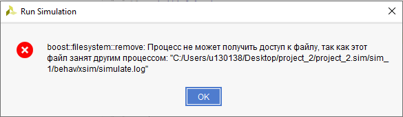
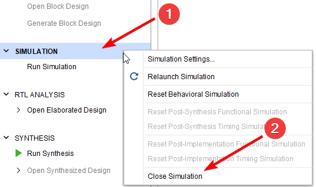
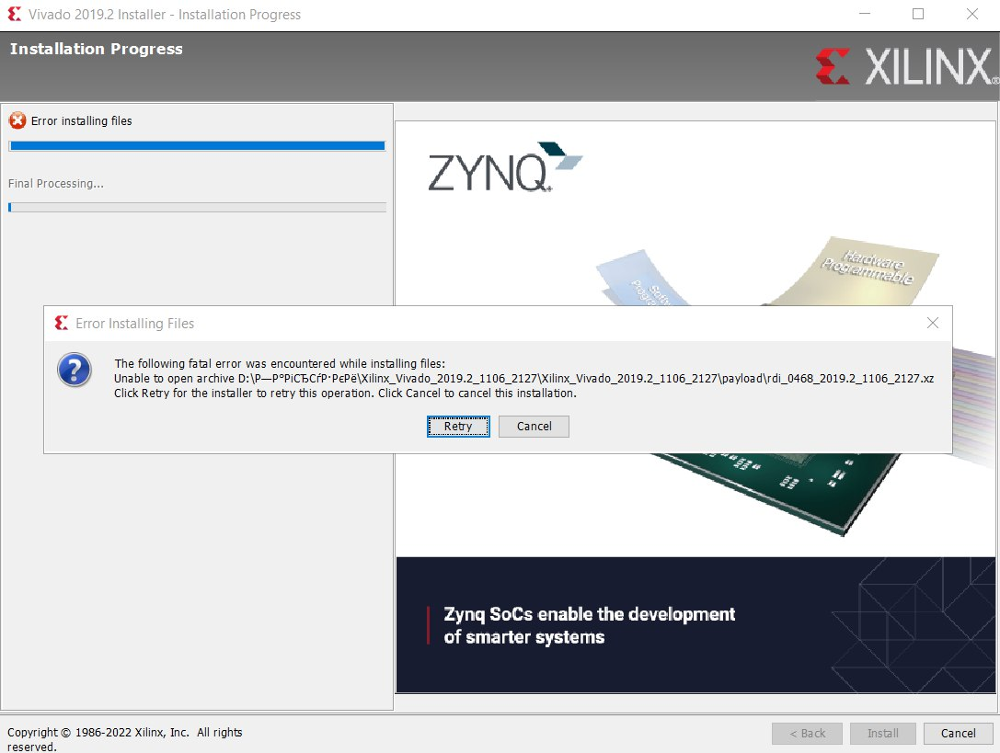

# Common Errors When Working with Vivado and SystemVerilog

## Table of Contents

- [Common Errors When Working with Vivado and SystemVerilog](#common-errors-when-working-with-vivado-and-systemverilog)
  - [Table of Contents](#table-of-contents)
  - [Errors Related to the Vivado EDA Tool](#errors-related-to-the-vivado-eda-tool)
    - [Simulation fails to start: FATAL\_ERROR PrivateChannel Error creating client socket](#simulation-fails-to-start-fatal_error-privatechannel-error-creating-client-socket)
    - [Simulation fails to start: boost filesystem remove The process cannot access the file](#simulation-fails-to-start-boost-filesystem-remove-the-process-cannot-access-the-file)
    - [Vivado crashes when trying to open a schematic](#vivado-crashes-when-trying-to-open-a-schematic)
    - [Vivado installation fails: Unable to open archive](#vivado-installation-fails-unable-to-open-archive)
  - [SystemVerilog Syntax Errors](#systemverilog-syntax-errors)
    - [signal name is not a type](#signal-name-is-not-a-type)
    - [cannot find port on this module](#cannot-find-port-on-this-module)


## Errors Related to the Vivado EDA Tool

### Simulation fails to start: FATAL_ERROR PrivateChannel Error creating client socket

**Cause:** The error is [related to issues with Windows Sockets](https://support.xilinx.com/s/question/0D52E00006iI37SSAS/isim-124-m81d-fatal-error-privatechannel-error-creating-client-socket?language=en_US), which prevent the simulation from being launched on network drives.  
**How to reproduce:** Create a project on a network drive.  
**Solution:** You most likely created the project on the `H:/` drive. Create the project on a local drive (for example, on the `C:/` drive or the Desktop).

---

### Simulation fails to start: boost filesystem remove The process cannot access the file

<details>

<summary>Error screenshot:</summary>



</details>

**Cause:** You launched the simulation with a different top-level module without closing the previous simulation.  
Most likely, after creating the testbench, you started the first simulation too quickly. As a result, Vivado did not have time to update the module hierarchy and set the testbench as the top-level module. In the running simulation all signals were in Z and X states, after which you tried to restart it. By the time of the restart, the module hierarchy had updated and the top-level module had changed, which caused the error.  
**How to reproduce:** Launch a simulation, create a new simulation file, set it as the top-level module, and launch the simulation again.  
**Solution:** Close the previous simulation (right-click on the SIMULATION button → Close Simulation), then start a new one.

<details>

<summary>Illustration of closing the simulation:</summary>



</details>

---

### Vivado crashes when trying to open a schematic

**Cause:** Cyrillic characters (Russian letters) in the Vivado working directory path. The most likely cause is Cyrillic characters in the username (**NOT IN THE VIVADO INSTALLATION PATH**).  
**How to reproduce:** (See the solution — to reproduce the issue, do the reverse and give the folder a name containing Cyrillic characters.)  
**Solution:** Rather than creating a new user without Cyrillic characters in the name, it is easier to assign Vivado a new working directory.  
To do this:

1. Create a folder in the root of the `C:/` drive (for example, `Vivado_temp`).
2. Open the properties of the Vivado shortcut (right-click on the shortcut → Properties).  
   2.1 If you do not have a Vivado shortcut on the Desktop and instead launch it from the Start menu, right-click the Vivado icon in the Start menu → Open file location. If a shortcut is shown there, perform step 2. If the executable file is shown there, create a shortcut for it (right-click the file → Create shortcut) and then perform step 2.
3. In the **Start in** field, enter the path to the directory you created (in the example from step 1 this path would be: `C:/Vivado_temp`). Click **OK**.

---

### Vivado installation fails: Unable to open archive

<details>

<summary>Illustration:</summary>



</details>

**Cause:** The problem is most likely that the installation files (**NOT THE VIVADO INSTALLATION PATH**) are located at a path containing Cyrillic characters (for example, in a personal "Downloads" folder with a Cyrillic name).  
**Solution:** Move the installation files to a directory whose path contains no Cyrillic characters.

---

## SystemVerilog Syntax Errors

### signal name is not a type

The compiler most likely failed to recognize the assignment because it was written incorrectly. Outside `always` and `initial` blocks, only continuous assignments (using `assign`) are permitted.

```SystemVerilog
module half_adder(input logic a, input logic b, output logic c);
c = a ^ b;  // error: the keyword assign is required
            // for a continuous assignment
endmodule
```

---

### cannot find port on this module

The port name specified when instantiating the module (after the dot) does not match any signal name in the instantiated module.

Example:

```SystemVerilog
module half_adder(input logic a, input logic b, output logic c);
  assign c = a ^ b;
endmodule

module testbench();
logic A, B, C;

adder DUT(
  .A(A),  // <- error here,
          // because module half_adder has no port named 'A'
  .b(B),
  .c(C)
);
endmodule
```
