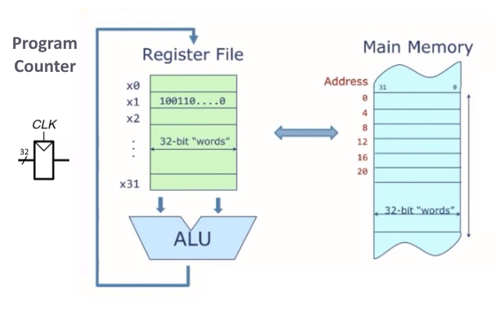
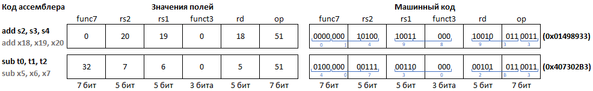
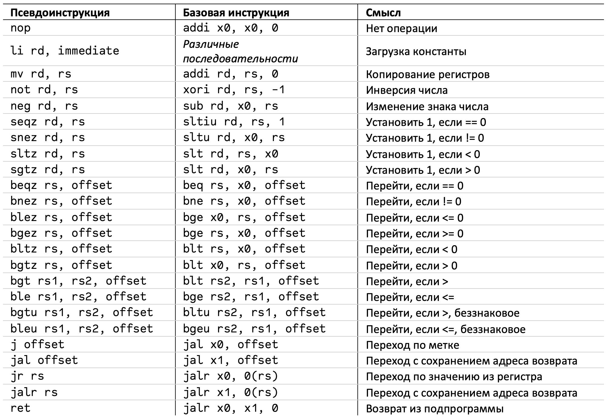
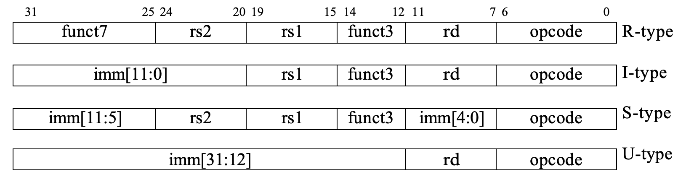
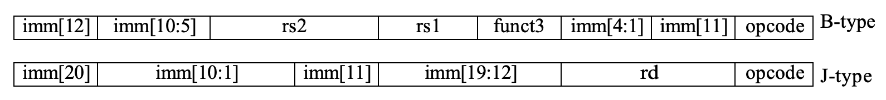
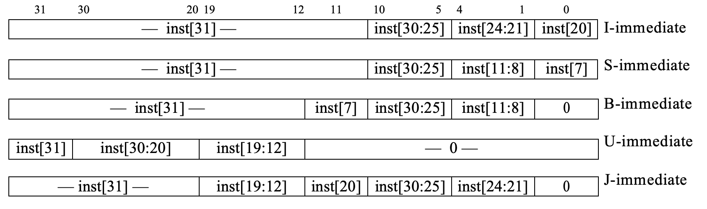
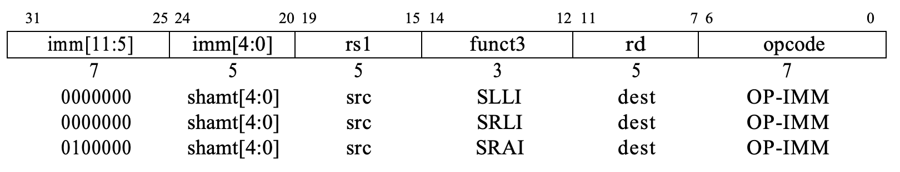
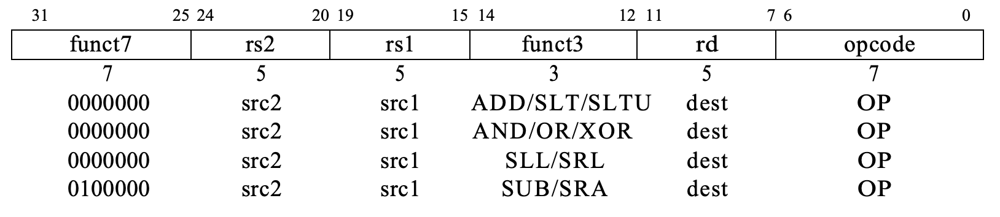
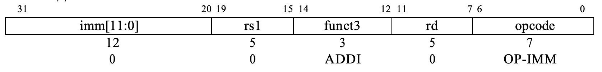

# RV32I - Стандартный набор целочисленных инструкций RISC-V

Разделы статьи:

- [Краткая справка по RISC-V и RV32I](#краткая-справка-по-risc-v-и-rv32i)
- [RV32I](#rv32i)
- [Псевдоинструкции](#псевдоинструкции)
- [Переведенные фрагменты спецификации RISC-V](#переведенные-фрагменты-спецификации-risc-v)

## Краткая справка по RISC-V и RV32I

RISC-V — открытая и свободная система набора команд (ISA) на основе концепции RISC. Чтобы понять архитектуру любого компьютера, нужно в первую очередь выучить его язык, понять, что он умеет делать. Слова в языке компьютера называются «инструкциями», или «командами», а словарный запас компьютера – «системой команд»[1, стр. 355].

В архитектуре RISC-V имеется обязательный для реализации минимальный список команд – набор инструкций **I** (Integer). В этот набор входят различные логические и арифметические операции с целыми числами, работа с памятью, и команды управления. Этого достаточно для обеспечения поддержки компиляторов, ассемблеров, компоновщиков и операционных систем (с дополнительными привилегированными инструкциями). Плюс, таким образом обеспечивается удобный "скелет" ISA и программного инструментария, вокруг которого могут быть построены более специализированные ISA процессоров путем добавления дополнительных инструкций.

Строго говоря RISC-V — это семейство родственных ISA, из которых в настоящее время существует четыре базовые ISA. Каждый базовый целочисленный набор инструкций характеризуется `шириной целочисленных регистров` и соответствующим `размером адресного пространства`, а также `количеством целочисленных регистров`. Существует два основных базовых целочисленных варианта, `RV32I` и `RV64I`, которые, соответственно, обеспечивают 32- или 64-битное адресное пространство и соответствующие размеры регистров регистрового файла. На основе базового набора инструкций `RV32I` существует вариант подмножества `RV32E`, который был добавлен для поддержки небольших микроконтроллеров и имеет вдвое меньшее количество целочисленных регистров – 16, вместо 32. Разрабатывается вариант `RV128I` базового целочисленного набора инструкций, поддерживающий плоское 128-битное адресное пространство. Также, стоит подчеркнуть, что размеры регистров и адресного пространства, во всех перечисленных стандартных наборах инструкций, не влияют на размер инструкций – во всех случаях они кодируются 32-битными числами. То есть, и для `RV32I`, и для `RV64I` одна инструкция будет кодироваться 32 битами. Базовые целочисленные наборы команд используют представление знаковых целых чисел в дополнительном коде.

В рамках дисциплины АПС затрагивается только `RV32I`, то есть стандартный набор целочисленных инструкций, предусматривающий в процессоре регистровый файл из 32-х 32-битных регистров, и использующий 32-битное адресное пространство памяти.

Кроме обязательного подмножества целочисленных инструкций, RISC-V предусматривает несколько стандартных опциональных расширений. Вот некоторые из них:

- **M** — Целочисленное умножение и деление (Integer Multiplication and Division)
- **A** — Атомарные операции (Atomic Instructions), инструкции для атомарного чтения-изменения-записи в память для межпроцессорной синхронизации
- **F** — Стандартное расширение для арифметических операций с плавающей точкой одинарной точности (Single-Precision Floating-Point) добавляет регистры с плавающей точкой, инструкции вычислений с одинарной точностью, а также инструкции загрузки и сохранения в регистровый файл для чисел с плавающей точкой
- **D** — Стандартное расширение с плавающей точкой двойной точности (Double-Precision Floating-Point) расширяет регистры с плавающей точкой до 64 бит и добавляет инструкции вычислений с двойной точностью, загрузку и сохранение
- **C** — Набор сжатых инструкций (Compressed Instructions), позволяющий кодировать инструкции 16-битными словами, что позволяет уплотнить программный код (если одну и ту же программу можно писать 16-битными словами вместо 32-битных, значит её размер сократится в 2 раза). Разумеется, у такого уплотнения есть своя цена, иначе инструкции просто кодировали бы 16-ю битами вместо 32. У сжатых инструкций меньший диапазон адресов и констант.
- **Zicsr** — Инструкции для работы с контрольными и статусными регистрами (Control and Status Register (CSR) Instructions). Используется, например, при работе с прерываниями/исключениями и виртуальной памятью
- **Zifencei** — Инструкции синхронизации потоков команд и данных (Instruction-Fetch Fence)

Поддерживаемые процессором команды отражаются в названии набора инструкций. Например, `RV64IMC` это архитектура RISC-V с 64-битными регистрами и 64-битным адресным пространством, поддерживающая кроме стандартных целочисленных операций умножение и деление **M**, и может выполнять сжатые инструкции **C**.

Одной из целей проекта RISC-V является его использование в качестве стабильного объекта для разработки программного обеспечения. Для этого ее разработчики определили комбинацию базового ISA (`RV32I` или `RV64I`) и некоторых стандартных расширений (**IMAFD + Zicsr + Zifencei**) как "general-purpose" ISA (набор инструкций общего назначения), а для комбинации расширений набора команд **IMAFDZicsrZifencei** стали использовать аббревиатуру **G**. То есть `RV32G` это тоже самое, что и `RV32IMAFDZicsrZifencei`.

> Чтобы устройство управления понимало, когда оно имеет дело с набором сжатых команд **C**, то есть с 16-битными инструкциями, а когда с другими наборами команд, то есть с инструкциями длиной 32 бита, каждая 32-битная инструкция в младших битах имеет `11`. Если в двух младших битах что-то отличное от `11`, значит это 16-битная инструкция!

На рисунке ниже показана видимая пользователю структура для основного подмножества команд для целочисленных вычислений `RV32I`. Она содержит `регистровый файл`, состоящий из 31 регистра общего назначения **x1** – **x31**, каждый из которых может содержать целочисленное значение, и регистра **x0**, жестко привязанного к константе 0. В случае `RV32`, регистры **xN**, и вообще все регистры, имеют длину в 32 бита. Также есть `АЛУ`, выполняющее операции над данными в регистровом файле (концепция RISC - load&store), и `память` с побайтовой адресацией и шириной адреса 32 бита.

Также существует еще один дополнительный видимый пользователю регистр: счетчик команд – `pc` (program counter), который содержит адрес текущей инструкции. `pc` изменяется либо автоматически, указывая на следующую инструкцию, либо в результате использования инструкций управления (операции условного и безусловного переходов).



RISC-V является load&store архитектурой (все операции с числами выполняются над данными только в регистровом файле), поэтому глядя на рисунок выше можно легко заключить, что функционально все инструкции сводятся к трём типам:

- Операции на АЛУ над числами в регистровом файле
- Операции обмена данными между регистровым файлом и памятью
- Манипуляции с `pc` (другими словами – управление программой)

Как было сказано ранее, память имеет 32-битную шину адреса и имеет побайтовую адресацию. Это значит, что каждый из 2<sup>32</sup> байт памяти имеет свой уникальный адрес, по которому к нему можно обратиться, чтобы считать из него или записать в него новую информацию. Однако, инструкции кодируются 32-битными числами, а один байт это всего 8 бит, значит одна инструкция занимает сразу 4 адреса в памяти. Подразумевается, что из такой памяти можно читать одновременно из нескольких последовательных адресов, то есть устройство управления процессора сообщает памяти начальный адрес требуемой ячейки, и количество ячеек (одну, две или четыре), которые нужно прочитать или записать.

Одна ячейка называется `байт` - 8 бит. Две последовательные 8-битные ячейки называются `полуслово` - 16 бит. Четыре последовательные 8-битные ячейки называются `словом` - 32 бита. Например, если процессор собирается выполнить инструкцию, которая занимает четыре байта по адресам `0x00000007 – 0x00000004`, то он обращается к памяти, сообщая, что "нужны 4 байта начиная с адреса 0x00000004", взамен процессор получает 32-битное число – инструкцию, которая была слеплена из байт, хранящихся в памяти по адресам: 4, 5, 6 и 7, для данного примера. К памяти также можно обратиться за полусловом или за байтом. Предполагается реализация выровненного доступа к памяти, то есть адреса слов и полуслов должны быть кратны 4 и 2, соответственно.

Аппаратное обеспечение компьютера «понимает» только нули и единицы, поэтому инструкции закодированы двоичными числами в формате, который называется машинным языком.

Инструкция компьютера кодирует в себе операцию, которую нужно исполнить, и данные, которые ей для этого потребуются. Такими данными могут быть адреса операндов и результата, различные константы.

В архитектуре RISC-V каждая несжатая инструкция представлена 32-разрядным словом. Микропроцессоры – это цифровые системы, которые читают и выполняют команды машинного языка. Для людей чтение и разработка компьютерных программ на машинном языке представляются нудным и утомительным делом, поэтому мы предпочитаем представлять инструкции в символическом формате, который называется языком ассемблера[1, стр. 356]. Ассемблер позволяет выполнить взаимооднозначный переход от машинного кода к тестовому и обратно.

## RV32I

В таблице ниже приводятся 40 команд стандартного набора целочисленных инструкций `RV32I`: мнемоники языка ассемблера, функции, описания, форматы кодирования и значения соответствующих полей при кодировании. В RISC-V предусмотрено несколько форматов кодирования инструкций (следующий рисунок, еще ниже), то есть договоренность какая информация в каком месте 32-битной инструкции хранится и как она представлена. У всех операций есть поле `opcode` (operation code - код операции), в котором закодировано "что нужно сделать". По полю `opcode` устройство управления понимает, что требуется сделать процессору и каким именно способом закодирована инструкция (**R**, **I**, **S**, **B**, **U** или **J**). В 32-битных инструкциях два младших бита всегда равны `11`.

Почти все инструкции имеют поле `Func3`, и некоторые – поле `Func7`. Их названия определены их разрядностью: 3 и 7 бит, соответственно. В этих полях, если они есть у инструкции, закодировано уточнение операции. Например, код операции 0010011 указывает на то, что будет выполняться некоторая операция на АЛУ между значением из регистрового файла и константой. Поле `Func3` уточняет операцию, для данного примера, если оно будет равно 0x0, то АЛУ выполнит операцию сложения между значением из регистра и константой из инструкции. Если `Func3` равно 0x6, то будет выполнена операция "логическое ИЛИ".


Обратите внимание на операции `slli`, `srli` и `srai` (операции сдвига на константную величину). У этих инструкций немного измененный формат кодирования **I\***. Формат кодирования **I** предоставляет 12-битную константу. Сдвиг 32-битного числа более, чем на 31 не имеет смысла. Для кодирования числа 31 требуется всего 5 бит. Выходит, что из 12 бит константы используется только 5 бит для операции сдвига, а оставшиеся 7 бит – не используются. А, главное (какое совпадение!), эти 7 бит находятся ровно в том же месте, где у других инструкций находится поле `Func7`. Поэтому, чтобы у инструкций `slli`, `srli` и `srai` использующих формат **I** не пропадала эта часть поля, к ней относятся как к полю `Func7`.

На рисунке ниже приводится фрагмент из [`оригинальной спецификации RISC-V`](https://github.com/riscv/riscv-isa-manual/releases/download/Ratified-IMAFDQC/riscv-spec-20191213.pdf). Сверху приводятся 6 форматов кодирования инструкций: **R**, **I**, **S**, **B**, **U** и **J**, а ниже приводятся конкретные значения полей внутри инструкции. Под `rd` подразумевается 5-битный адрес регистра назначения, `rs1` и `rs2` - 5-битные адреса регистров источников, `imm` — константа, расположение и порядок битов которой указывается в квадратных скобках. Обратите внимание, что в разных форматах кодирования константы имеют различную разрядность, а их биты упакованы по-разному. Для знаковых операций константу предварительно знаково расширяют до 32 бит. Для беззнаковых расширяют нулями до 32 бит.


Ниже, для наглядности, приводится пример кодирования пары инструкций из книги Харриса и Харриса "Цифровая схемотехника и архитектура компьютера" в машинный код[1, стр. 368].



Примечание: `s2`, `s3`, `s4`, `t0`, `t1`, `t2` — это синонимы регистров `x18`,`x19`,`x20`,`x5`,`x6`,`x7` соответственно. Введены **соглашением о вызовах** (calling convention) для того, чтобы стандартизировать функциональное назначение регистров. Подробнее об этом будет в лабораторной работе по программированию.

## Псевдоинструкции

В архитектуре RISC-V размер команд и сложность аппаратного обеспечения минимизированы путем использования лишь небольшого количества команд. Тем не менее RISC-V определяет псевдокоманды, которые на самом деле не являются частью набора команд, но часто используются программистами и компиляторами. При преобразовании в машинный код псевдокоманды транслируются в одну или несколько команд RISC-V[1, стр. 410]. Например, псевдокоманда безусловного перехода `j`, преобразуется в инструкцию безусловного перехода с возвратом `jal` с регистром `x0` в качестве регистра-назначения, то есть адрес возврата не сохраняется.



## Переведенные фрагменты спецификации RISC-V

Далее приводится переведенный фрагмент второй главы [`оригинальной спецификации RISC-V`](https://github.com/riscv/riscv-isa-manual/releases/download/Ratified-IMAFDQC/riscv-spec-20191213.pdf).

### Основные типы команд

В основе ISA лежит четыре основных типа команд (R/I/S/U), которые изображены на рисунке ниже.  Все они имеют фиксированную длину в 32 бита и должны быть выровнены в памяти по четырехбайтовой границе. Если адрес перехода (в случае безусловного перехода, либо успешного условного перехода) не выровнен, генерируется исключение о невыровненном адресе инструкции. Исключение не генерируется в случае невыполненного условного перехода.



Для упрощения декодирования, архитектура команд RISC-V сохраняет положение адресов регистров-источников (`rs1` и `rs2`) и регистра назначения (`rd`) между всеми типами инструкций.

За исключением 5-битных непосредственных операндов, используемых в командах CSR, все непосредственные операнды (`imm`) проходят знаковое расширение. Для уменьшения сложности оборудования, константа размещается в свободные (от полей `func3`/`func7`/`rs1`/`rd`) биты инструкции, начиная от левого края. В частности, благодаря этому ускоряется схема знакового расширения, поскольку знаковый бит всех непосредственных операндов всегда находится в 31-ом бите инструкции.

### Способы кодирования непосредственных операндов

Существует еще формата кодирования констант в инструкции (**B**/**J**-типа),  представленные на рисунке ниже.

Единственное различие между форматами **S** и **B** заключается в том, что в формате **B**, 12-битная константа используется для кодирования кратных двум смещений адреса при ветвлении (примечание: кратность двум обеспечивается сдвигом числа на 1 влево). Вместо того, чтобы сдвигать непосредственный операнд относительно всех бит инструкции на 1 влево, средние биты (`imm[10:1]`) и знаковый бит остаются в прежних местах, а оставшийся младший бит константы формата **S** (`inst[7]`) кодирует `imm[11]` бит константы в формате **B**.

Аналогично, единственное различие между форматами **U** и **J** состоит в том, что в формате **U** 20-разрядная константа сдвигается влево на 12 бит, в то время как в формате **J** — на 1. Расположение бит в непосредственных значениях формата **U** и **J** выбирались таким образом, чтобы максимально увеличить перекрытие с другими форматами и между собой.



На рисунке ниже показаны непосредственные значения (константы), создаваемые каждым из основных форматов команд, также они помечены, чтобы показать, какой бит команды (`inst[y]`) какому биту непосредственного значения соответствует.



> Знаковое расширение — одна из самых важных операций над непосредственными значениями (особенно в `RV64I`). Поэтому в RISC-V знаковый бит всех непосредственных значений всегда содержится в 31-м бите инструкции. Это позволяет выполнять знаковое расширение параллельно с декодированием команды.
>
> Несмотря на то, что более сложные микроархитектурные реализации имеющие отдельные сумматоры для вычисления адресов условных и безусловных переходов, могут не получить выигрыш от одинакового расположения битов непосредственных значений во всех типах команд, прежде всего мы хотели снизить аппаратные затраты для простейших реализаций.
>
> Меняя местами биты в кодировке непосредственных значений инструкций **B** и **J**-типа вместо использования динамических мультиплексоров для умножения константы на 2, мы уменьшили разветвленность сигнала команды и затраты на мультиплексирование примерно в 2 раза. Скремблированное кодирование непосредственных значений добавит незначительную задержку при статической компиляции. Для динамической генерации инструкций есть небольшие дополнительные издержки, однако для наиболее частых коротких ветвлений вперед предусмотрено простое кодирование непосредственных значений.

### Команды для целочисленных вычислений

Большинство инструкций целочисленных вычислений работают с 32-битными значениями, хранящимся в регистровом файле. Такие команды либо кодируются как операции `константа-регистр`, используя формат **I**-типа, либо как операции `регистр-регистр`, используя формат **R**-типа. В обоих случаях результат сохраняется в регистр `rd` . Ни одна инструкция целочисленных вычислений не вызывает арифметических исключений.

> Мы стали добавлять поддержку специального набора команд для проверок на переполнение целочисленных арифметических операций в основной набор команд, поскольку многие проверки на переполнение могут быть достаточно дешево реализованы в RISC-V с использованием инструкций ветвления. Проверка на переполнение для беззнакового сложения требует только одной дополнительной команды перехода после сложения:
>
> ```asm
> add t0, t1, t2
> bltu t0, t1, overflow
> ```
>
> Для знакового сложения, если известен знак одного операнда, проверка на переполнение требует только одного ветвления после сложения:
>
> ```asm
> addi t0, t1, +imm;
> blt t0, t1, overflow.
> ```
>
> Этот метод в общем случае подходит при сложении с непосредственным операндом. В остальных случаях при знаковом сложении требуются три дополнительные команды после сложения, использующих утверждение, что сумма должна быть меньше, чем один из операндов, тогда и только тогда, когда другой операнд отрицателен.
>
> ```asm
> add t0, t1, t2
> slti t3, t2, 0
> slt t4, t0, t1
> bne  t3,  t4, overflow
> ```
>
> В RV64 проверки 32-разрядных знаковых сложений могут быть дополнительно оптимизированы путем сравнения результатов выполнения команд ADD и ADDW для каждого из операндов.

### Команда типа константа-регистр


`ADDI` суммирует знакорасширенную 12-битную константу с регистром `rs1`. Арифметическое переполнение игнорируется, и результатом являются младшие 32 бита результата. Команда `ADDI rd, rs1, 0` используется для реализации ассемблерной псевдоинструкции `MV rd, rs1`.

`SLTI` (установить, если меньше чем константа) помещает значение 1 в регистр `rd`, если регистр `rs1` меньше, чем расширенное непосредственное значение, когда оба значения обрабатываются как знаковые числа, иначе в `rd` записывается 0. `SLTIU` аналогична, но сравнивает значения как беззнаковые числа (то есть непосредственное значение сначала расширяется до 32 бит, а затем обрабатывается как число без знака). Обратите внимание, что команда `SLTIU rd, rs1, 1` устанавливает `rd` в 1, если `rs1` равен нулю, в противном случае `rd` устанавливается в 0 (псевдоинструкция ассемблера `SEQZ rd, rs`).

Примечание: у студентов часто возникает вопрос: зачем вообще нужны инструкции вида `SLT`, если есть инструкции вида `BLT`? Например, они могут использоваться для вычисления сложных условий переходов. Один из примеров таких условий вы видели выше, в примере обработке результата сложения на переполнение. Кроме того, не смотря на ограниченность этих инструкций (все они проверяют только на **строго меньше**), мы можем добиться операции **строго больше** поменяв операнды местами, а если результат обоих операций даст `0` — значит операнды равны. Поскольку идея RISC архитектуры в том, чтобы переложить организацию всех этих ухищрений на компилятор, этих инструкций оказывается достаточно.

`ANDI`, `ORI`, `XORI` — это логические операции, которые выполняют побитовое И, ИЛИ и исключающее ИЛИ над регистром `rs1` и непосредственным 12-битным значением с знаковым расширением и помещают результат в `rd`. Обратите внимание, что команда `XORI rd, rs, -1` выполняет побитовую логическую инверсию значения регистра `rs1` (псевдоинструкция `NOT rd, rs`).



Сдвиги на константу кодируются как разновидность формата команд **I**-типа. Операнд, который должен быть сдвинут, находится в `rs1`, а величина сдвига кодируется в младших 5 битах поля непосредственного значения. Тип сдвига вправо определяется 30-ым битом. `SLLI` - логический сдвиг влево (нули задвигаются в младшие биты); `SRLI` - логический сдвиг вправо (нули задвигаются в старшие биты); `SRAI` - арифметический сдвиг вправо (исходный знаковый бит задвигается в старшие биты).


`LUI` (загрузка старшей части непосредственного значения) используется для получения 32-битных констант и использует формат **U**-типа. `LUI` помещает непосредственное значение **U**-типа в старшие 20 бит регистра назначения `rd`, заполняя младшие 12 бит нулями.
`AUIPC` (прибавить старшую часть непосредственного значения к `pc`) используется для построения адресов относительно `pc`, и использует формат **U**-типа. `AUIPC` формирует 32-битное смещение из 20-битного непосредственного значения **U**-типа, заполняя младшие 12 битов нулями, прибавляет это смещение к значению `pc`, а затем размещает результат в регистре `rd`.

> Команда `AUIPC` поддерживает последовательности из двух команд для получения произвольных смещений `pc` как для передачи потока управления, так и для доступа к данным. Комбинация `AUIPC` и 12-битного непосредственного значения в `JALR` может передавать управление на любой 32-битный адрес `pc`, в то время как `AUIPC` сложенное с 12-битным непосредственным значением смещения в обычных командах загрузки или сохранения позволяет получить доступ к любому 32-битному адресу данных относительно `pc`.
>Текущее значение `pc` можно получить, установив непосредственное значение **U**-типа в 0. Несмотря на то, что команда `JAL+4` также позволяет получить значение `pc`, она может вызывать остановки конвейера в более простых микроархитектурах или засорять структуры буфера предсказания переходов (BTB) в более сложных микроархитектурах.

### Команды типа регистр-регистр

В `RV32I` определено несколько арифметических операций **R**-типа. Все операции берут исходные операнды из регистров `rs1` и `rs2` и записывают результат в регистр `rd`. Полями `funct7` и `funct3` задается тип операции.



`ADD` и `SUB` выполняют сложение и вычитание соответственно. Переполнения игнорируются, и младшие 32 бита результатов записываются в место назначения. `SLT` и `SLTU` выполняют знаковое и беззнаковое сравнения соответственно, записывая 1 в `rd`, если `rs1 < rs2`, или 0 в противном случае. Обратите внимание, что команда `SLTU rd, x0, rs2` устанавливает `rd` в 1, если `rs2` не равно нулю, иначе устанавливает `rd` в ноль (псевдоинструкция ассемблера `SNEZ rd, rs`). `AND`, `OR` и `XOR` выполняют побитовые логические операции.

`SLL`, `SRL` и `SRA` выполняют соответственно логический сдвиг влево, логический сдвиг вправо и арифметический сдвиг вправо значения в регистре `rs1` на величину сдвига, содержащуюся в младших 5 битах регистра `rs2`.

### Команда NOP



Инструкция `NOP` не изменяет **архитектурное состояние** процессора, за исключением увеличения `pc` и опциональных счетчиков производительности. `NOP` кодируется как `ADDI x0, x0, 0`.

> Команды `NOP` могут быть использованы для выравнивания сегментов кода по микроархитектурно значимым границам адресов или для резервирования места для модификаций встраиваемого кода. Хотя существует множество возможных способов кодирования `NOP`, мы использовали каноническое кодирование `NOP`, чтобы обеспечить возможность микроархитектурной оптимизации, а также для более читаемого вывода при дизассемблировании.

## Список использованной литературы

1. Д.М. Харрис, С.Л. Харрис / Цифровая схемотехника и архитектура компьютера / пер. с англ. Imagination Technologies / М.: ДМК Пресс, 2018.
