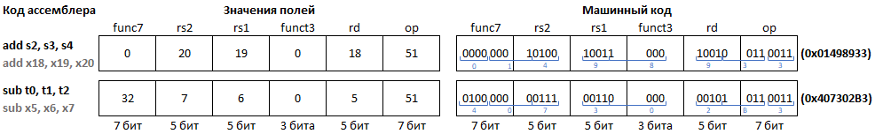
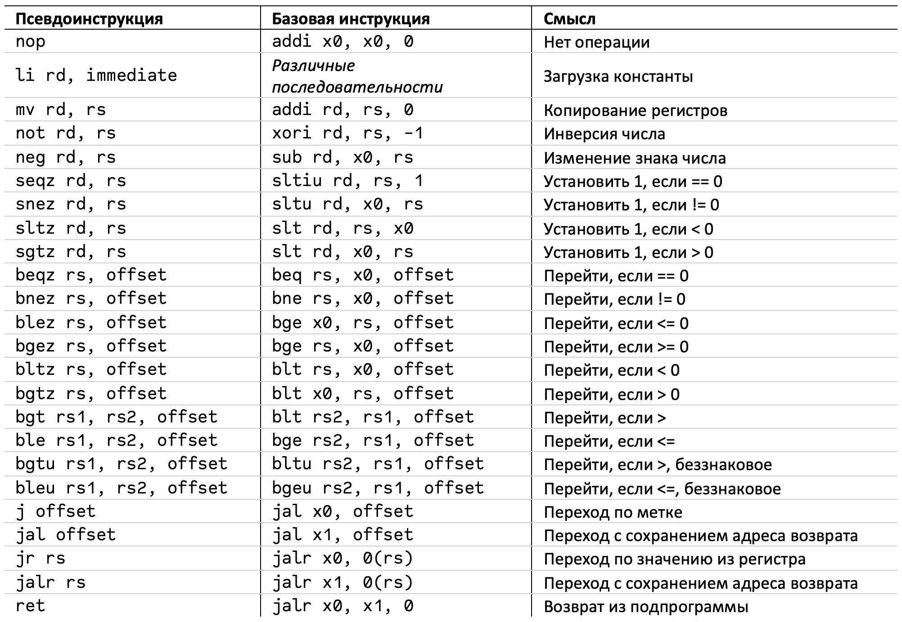
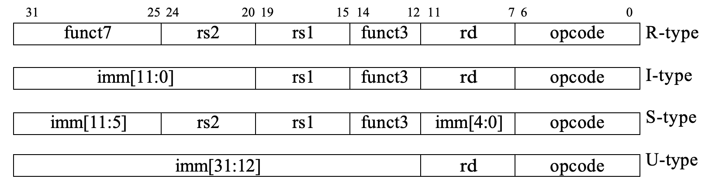
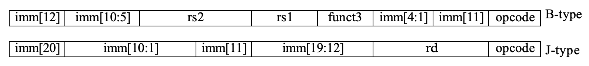
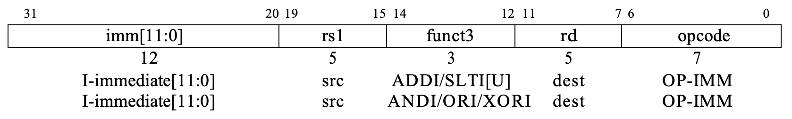
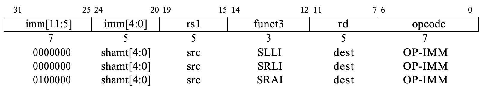
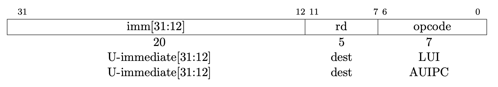
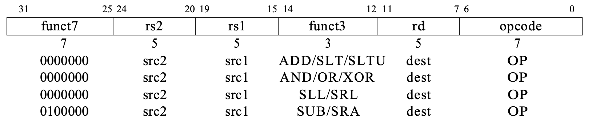
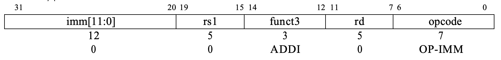

# RV32I — Standard Integer Instruction Set of RISC-V

Sections:

- [Brief Overview of RISC-V and RV32I](#brief-overview-of-risc-v-and-rv32i)
- [RV32I](#rv32i)
- [Pseudo-instructions](#pseudo-instructions)
- [Base Instruction Formats](#base-instruction-formats)

> Most of this document is, to varying degrees, a translation of the RISC-V specification[[1]](https://github.com/riscv/riscv-isa-manual/releases/download/20240411/unpriv-isa-asciidoc.pdf), distributed under the [CC-BY-4.0](https://creativecommons.org/licenses/by/4.0/) license.

## Brief Overview of RISC-V and RV32I

RISC-V is an open and free Instruction Set Architecture (ISA) based on the concept of a Reduced Instruction Set Computer (RISC). To understand the architecture of any computer, one must first learn its language — understand what it is capable of doing. The words in a computer's language are called "instructions" or "commands", and the computer's vocabulary is called the "instruction set"[[2, p. 360](https://reader.lanbook.com/book/241166?lms=3ec5abac958be145faed85c101d197fb)].

The RISC-V architecture includes a mandatory minimum set of instructions — the **I** (Integer) instruction set. This set covers various integer arithmetic and logical operations, memory access, and control instructions. It is sufficient to support compilers, assemblers, linkers, and operating systems (provided that the required privileged instructions are also implemented). Furthermore, it provides a convenient "skeleton" ISA and software toolchain around which more specialized processor ISAs can be built by adding additional instructions.

Strictly speaking, RISC-V is a family of related ISAs, of which four base ISAs currently exist. Each base integer instruction set is characterized by the `width of integer registers` and the corresponding `address space size`, as well as the `number of integer registers`. There are two primary base integer variants, `RV32I` and `RV64I`, which provide 32-bit or 64-bit address spaces and correspondingly sized register file entries. Based on `RV32I`, there is a subset variant `RV32E`, added to support small microcontrollers, with half the number of integer registers — 16 instead of 32. A variant `RV128I` of the base integer instruction set is under development, supporting a flat 128-bit address space. It is also worth noting that register widths and address space sizes in all listed standard instruction sets do not affect instruction size — in all cases instructions are encoded as 32-bit words. That is, both `RV32I` and `RV64I` encode each instruction in 32 bits. The base integer instruction sets use two's complement representation for signed integers.

In addition to the mandatory integer instruction subset, RISC-V defines several standard optional extensions. Some of them are:

- **M** — Integer Multiplication and Division
- **A** — Atomic Instructions: instructions for atomic read-modify-write memory operations for inter-processor synchronization
- **F**, **D** — Extensions for single- and double-precision floating-point arithmetic, respectively. They add a separate floating-point register file (with 32/64-bit cell widths) and instructions for working with those numbers.
- **C** — Compressed Instructions: allows encoding instructions as 16-bit words, reducing code size (if the same program can be written with 16-bit words instead of 32-bit ones, its size is halved). Of course, this compaction comes at a cost — otherwise instructions would simply be encoded in 16 bits instead of 32. Compressed instructions have a smaller range of addresses and immediates.
- **Zicsr** — Control and Status Register (CSR) Instructions. Used, for example, when working with interrupts/exceptions and virtual memory.
- **Zifencei** — Instruction-Fetch Fence instructions

The instructions supported by a processor are reflected in the instruction set name. For example, `RV64IMC` is a RISC-V architecture with 64-bit registers and a 64-bit address space, supporting standard integer operations plus integer multiplication and division **M**, and the ability to execute compressed instructions **C**.

One of the goals of the RISC-V project is to serve as a stable target for software development. To this end, its designers defined the combination of a base ISA (`RV32I` or `RV64I`) and certain standard extensions (**IMAFD + Zicsr + Zifencei**) as a "general-purpose" ISA, and adopted the abbreviation **G** for the extension combination **IMAFDZicsrZifencei**. That is, `RV32G` is equivalent to `RV32IMAFDZicsrZifencei`.

> For the control unit to distinguish when it is dealing with the compressed instruction set **C** (i.e., 16-bit instructions) versus other instruction sets (i.e., 32-bit instructions), every 32-bit instruction has `11` in its two least significant bits. If the two least significant bits are anything other than `11`, it is a 16-bit instruction!

Within the APS course, the base ISA `RV32I` and the CSR extension `Zicsr` are studied, providing support for the interrupt subsystem.

_Fig. 1_ shows the user-visible state for the base integer subset `RV32I` and the `Zicsr` extension. This state includes a `register file` consisting of 31 general-purpose registers **x1** — **x31**, each of which can hold an integer value, and register **x0** hardwired to the constant 0. In `RV32`, registers **xN** and all other registers are 32 bits wide. The state also includes an `ALU` performing operations on register file data, `memory` with byte-addressable access and a 32-bit address bus, and a block of 32-bit control and status registers with a 12-bit address width.

There is also one additional user-visible register: the program counter — `PC` (Program Counter), which holds the address of the current instruction. The `PC` is updated either automatically to point to the next instruction, or as a result of control-flow instructions (conditional and unconditional branches).


_Figure 1. Main components of the RISC-V architecture._

Since RISC-V is a `Load & Store` architecture, all arithmetic and logical operations are performed only on data in the register file. If data from main memory needs to be processed, it must first be loaded into the register file (Load) and, after processing, stored back to main memory (Store).

From _Figure 1_, it is easy to conclude that all instructions functionally fall into three categories:

- ALU operations on data in the register file or control and status registers;
- data exchange operations between the register file and memory;
- manipulations of `pc` (i.e., program control flow) or the system (via control and status registers).

As mentioned earlier, memory has a 32-bit address bus and is byte-addressable. This means that each of the 2<sup>32</sup> bytes in memory has its own unique address, which can be used to read from or write to it. Since instructions are encoded as 32-bit words and one byte is only 8 bits, a single instruction occupies 4 consecutive byte addresses in memory. It is assumed that multiple consecutive addresses can be read at once — the processor's control unit tells the memory the starting address of the required cell and the number of cells (one, two, or four) to read or write.

A single 8-bit memory cell is called a `byte`. Two consecutive 8-bit cells are called a `halfword` — 16 bits. Four consecutive 8-bit cells are called a `word` — 32 bits. If the processor is going to execute an instruction that occupies four bytes at addresses `0x00000007 — 0x00000004`, it accesses memory by requesting "4 bytes starting at address `0x00000004`", and in response receives a 32-bit number — the instruction assembled from bytes stored at addresses 4, 5, 6, and 7 in this example. Memory can also be accessed for a halfword or a byte. Aligned memory access is assumed, meaning word and halfword addresses must always be multiples of 4 and 2, respectively.

Computer hardware "understands" only zeros and ones, so instructions are encoded as binary numbers in a format called machine language.

A computer instruction encodes the operation to be performed and the data required to perform it. Such data may include operand and result addresses, as well as various constants.

In the RISC-V architecture, each uncompressed instruction is represented as a 32-bit word. Microprocessors are digital systems that read and execute machine language instructions. Reading and writing computer programs in machine language is tedious and error-prone for humans, so instructions are preferably represented in a symbolic format called assembly language[[2, p. 360](https://reader.lanbook.com/book/241166?lms=3ec5abac958be145faed85c101d197fb)]. An assembler enables a one-to-one translation between machine code and text and back.

## RV32I

_Table 1_ lists the 47 instructions of the standard `RV32I` integer instruction set: assembly mnemonics, functions, descriptions, encoding formats, and the values of the corresponding fields during encoding. RISC-V defines several instruction encoding formats (_Fig. 3_). An encoding format is an agreement about what information is stored at which position within a 32-bit instruction and how it is represented. Every operation has an `opcode` (operation code) field that encodes "what needs to be done". Based on the `opcode` field, the control unit determines what the processor must do and which encoding format is used (**R**, **I**, **S**, **B**, **U**, or **J**). In 32-bit instructions, the two least significant bits are always `11` (16-bit instructions from the compressed instruction set are an exception).

Almost all instructions have a `funct3` field, and some have a `funct7` field (depending on the encoding format and certain exceptions). Their names reflect their bit widths: 3 and 7 bits, respectively. These fields, when present, encode a refinement of the operation. For example, opcode `0010011` indicates that some ALU operation will be performed between a register file value and a constant. The `funct3` field specifies the exact operation: if it equals 0x0, the ALU performs addition between the register value and the instruction constant; if `funct3` equals 0x6, a bitwise OR operation is performed.


_Table 1. RV32I instruction set with types, functional descriptions, and usage examples._

> [!IMPORTANT]
> Note the `slli`, `srli`, and `srai` instructions (constant-shift operations). These instructions use a slightly modified **I\*** encoding format. The **I** encoding format provides a 12-bit immediate. Shifting a 32-bit number by more than 31 is meaningless. Encoding the number 31 requires only 5 bits. This means that of the 12 immediate bits, only 5 are used for the shift amount, and the remaining 7 bits are unused. And, crucially (what a coincidence!), these 7 bits are located in exactly the same position as the `funct7` field of other instructions. Therefore, to avoid wasting this part of the field for `slli`, `srli`, and `srai` — which use the **I** format — those bits are treated as the `funct7` field.

Table 2 is a fragment of the original RISC-V specification[[1, p. 554](https://github.com/riscv/riscv-isa-manual/releases/download/20240411/unpriv-isa-asciidoc.pdf)]. The top part shows the 6 instruction encoding formats: **R**, **I**, **S**, **B**, **U**, and **J**, and the lower part shows the specific field values within each instruction. `rd` denotes the 5-bit destination register address, `rs1` and `rs2` are 5-bit source register addresses, and `imm` is an immediate value whose bit positions and order are indicated in square brackets. Note that in different encoding formats, immediates have different widths and their bits are packed differently.


_Table 2. RV32I base instruction set._

_Fig. 2_ shows, for illustration, an example of encoding a pair of instructions from Harris & Harris "Digital Design and Computer Architecture: RISC-V Edition" into machine code[[2, p. 401](https://reader.lanbook.com/book/241166?lms=0477e9ee9acd7b9544b3ad74ba7e4dc5)].



_Figure 2. Example of binary encoding of RISC-V instructions._

Note: `s2`, `s3`, `s4`, `t0`, `t1`, `t2` are aliases for registers `x18`, `x19`, `x20`, `x5`, `x6`, `x7`, respectively. These aliases are defined by the **calling convention** to standardize the functional purpose of registers. More details will be covered in the programming lab.

## Pseudo-instructions

In the RISC-V architecture, instruction count and hardware complexity are minimized by using a small number of instructions. Nevertheless, RISC-V defines pseudo-instructions, which are not actually part of the instruction set but are commonly used by programmers and compilers. When translated to machine code, pseudo-instructions are converted into one or more RISC-V instructions[[2, p. 399](https://reader.lanbook.com/book/241166?lms=7329d34bdab9c539e3ec7a571ee68929)]. For example, the unconditional jump pseudo-instruction `j` is translated into the jump-and-link instruction `jal` with register `x0` as the destination, meaning the return address is not saved.



_Table 3. List of RISC-V pseudo-instructions._

## Base Instruction Formats

The ISA is built on four base instruction formats (R/I/S/U), shown in _Fig. 3_. All of them have a fixed length of 32 bits and must be aligned in memory on a four-byte boundary. If a branch target address (in the case of an unconditional branch or a taken conditional branch) is not aligned, an instruction address misaligned exception is generated. No exception is generated for a not-taken conditional branch.



_Figure 3. RISC-V instruction encoding formats._

To simplify decoding, the RISC-V instruction encoding keeps the positions of the source register addresses (`rs1` and `rs2`) and the destination register address (`rd`) consistent across all instruction formats.

With the exception of the 5-bit immediates used in CSR instructions, all immediate operands (`imm`) are sign-extended. To reduce hardware complexity, the immediate is placed in the bits of the instruction that are not occupied by `funct3`/`funct7`/`rs1`/`rd` fields, starting from the most significant bit. In particular, this speeds up the sign-extension logic, since the sign bit of all immediates is always located at bit 31 of the instruction.

### Immediate Encoding Variants

There are two additional immediate encoding formats (**B**/**J**-type), shown in _Fig. 4_.

The only difference between the **S** and **B** formats is that in the **B** format, the 12-bit immediate encodes branch address offsets that are multiples of two (note: the factor-of-two alignment is achieved by shifting the value left by 1). Instead of shifting the immediate relative to all instruction bits by 1 to the left, the middle bits (`imm[10:1]`) and the sign bit remain in their original positions, and the remaining least significant bit of the **S**-format immediate (`inst[7]`) encodes the `imm[11]` bit of the **B**-format immediate.

Similarly, the only difference between the **U** and **J** formats is that in the **U** format, the 20-bit immediate is shifted left by 12 bits, whereas in the **J** format it is shifted left by 1. The bit positions of the **U** and **J** immediates were chosen to maximize overlap with other formats and with each other.



_Figure 4. Immediate encoding in B- and J-type instructions._

_Fig. 5_ shows the immediate values (constants) produced by each base instruction format, annotated to indicate which instruction bit (`inst[y]`) corresponds to which bit of the immediate value.


_Figure 5. Illustration of shared bit positions in immediate encoding across instruction types._

> Sign extension is one of the most critical operations on immediates (especially in `RV64I`). Therefore, in RISC-V the sign bit of all immediates is always located at bit 31 of the instruction. This allows sign extension to be performed in parallel with instruction decoding.
>
> Although more complex microarchitectural implementations with separate adders for branch and jump address calculation may not benefit from having immediate bits placed identically across instruction types, the primary goal was to reduce hardware cost for the simplest implementations.
>
> By rearranging bits in the immediates of **B**- and **J**-type instructions instead of using dynamic multiplexers to multiply the constant by 2, the instruction signal fanout and multiplexing overhead were reduced by approximately a factor of two. The scrambled immediate encoding adds negligible delay during static compilation. For dynamic instruction generation, there is a small additional overhead, but simple encoding of immediates is provided for the most common short forward branches.

### Integer Computational Instructions

Most integer computational instructions operate on 32-bit values held in the register file. These instructions are either encoded as `immediate-register` operations using the **I**-type format, or as `register-register` operations using the **R**-type format. In both cases, the result is written to register `rd`. None of the integer computational instructions cause arithmetic exceptions.

> We did not add support for a special set of instructions for detecting overflow in integer arithmetic operations in the base instruction set, since many overflow checks can be implemented quite cheaply in RISC-V using branch instructions. Overflow detection for unsigned addition requires only one additional branch instruction after the addition:
>
> ```asm
> add t0, t1, t2
> bltu t0, t1, overflow
> ```
>
> For signed addition, if the sign of one operand is known, overflow checking requires only one branch after the addition:
>
> ```asm
> addi t0, t1, + imm
> blt t0, t1, overflow
> ```
>
> This approach is generally applicable when adding an immediate operand. In the general case of signed addition, three additional instructions are needed after the add, using the assertion that the sum must be less than one of the operands if and only if the other operand is negative.
>
> ```asm
> add t0, t1, t2
> slti t3, t2, 0
> slt t4, t0, t1
> bne  t3,  t4, overflow
> ```
>
> In RV64, checks for 32-bit signed addition overflow can be further optimized by comparing the results of the ADD and ADDW instructions for each operand.

### Immediate-Register Instructions



`ADDI` adds a sign-extended 12-bit immediate to register `rs1`. Arithmetic overflow is ignored, and the result is the lower 32 bits of the sum. The instruction `ADDI rd, rs1, 0` is used to implement the assembly pseudo-instruction `MV rd, rs1`.

`SLTI` (Set Less Than Immediate) writes 1 to register `rd` if register `rs1` is less than the sign-extended immediate, treating both values as signed numbers; otherwise, 0 is written to `rd`. `SLTIU` is similar but compares values as unsigned numbers (i.e., the immediate is first sign-extended to 32 bits and then treated as an unsigned number). Note that `SLTIU rd, rs1, 1` sets `rd` to 1 if `rs1` equals zero, otherwise `rd` is set to 0 (assembly pseudo-instruction `SEQZ rd, rs`).

Note: students often ask why instructions like `SLT` are needed if there are instructions like `BLT`. For example, they can be used to evaluate complex branch conditions. One such example was shown above in the overflow detection example. Additionally, despite their apparent limitation (all of them check only for **strictly less than**), the **strictly greater than** condition can be achieved by swapping the operands, and if both operations return `0` — the operands are equal. Since the idea of a RISC architecture is to delegate the organization of all such tricks to the compiler, these instructions are sufficient.

`ANDI`, `ORI`, `XORI` are logical operations that perform bitwise AND, OR, and XOR between register `rs1` and a sign-extended 12-bit immediate, placing the result in `rd`. Note that `XORI rd, rs, -1` performs a bitwise logical inversion of register `rs1` (pseudo-instruction `NOT rd, rs`).



Shifts by a constant are encoded as a specialization of the **I**-type instruction format. The operand to be shifted is in `rs1`, and the shift amount is encoded in the lower 5 bits of the immediate field. The type of right shift is determined by bit 30. `SLLI` — logical shift left (zeros are shifted into the low-order bits); `SRLI` — logical shift right (zeros are shifted into the high-order bits); `SRAI` — arithmetic shift right (the original sign bit is shifted into the high-order bits).



`LUI` (Load Upper Immediate) is used to build 32-bit constants and uses the **U**-type format. `LUI` places the **U**-type immediate into the upper 20 bits of destination register `rd`, filling the lower 12 bits with zeros.

`AUIPC` (Add Upper Immediate to PC) is used to build PC-relative addresses and uses the **U**-type format. `AUIPC` forms a 32-bit offset from the 20-bit **U**-type immediate, fills the lower 12 bits with zeros, adds this offset to the value of `pc`, and places the result in register `rd`.

> The `AUIPC` instruction supports two-instruction sequences for obtaining arbitrary PC-relative offsets for both control-flow transfers and data accesses. The combination of `AUIPC` and the 12-bit immediate in `JALR` can transfer control to any 32-bit PC address, while `AUIPC` added to the 12-bit offset immediate in ordinary load or store instructions allows access to any 32-bit data address relative to `pc`.
> The current value of `pc` can be obtained by setting the **U**-type immediate to 0. Although `JAL+4` also allows obtaining the `pc` value, it may cause pipeline stalls in simpler microarchitectures or pollute branch prediction buffer (BTB) structures in more complex ones.

### Register-Register Instructions

`RV32I` defines several **R**-type arithmetic operations. All operations take source operands from registers `rs1` and `rs2` and write the result to register `rd`. The operation type is specified by the `funct7` and `funct3` fields.



`ADD` and `SUB` perform addition and subtraction, respectively. Overflows are ignored, and the lower 32 bits of the results are written to the destination. `SLT` and `SLTU` perform signed and unsigned comparisons, respectively, writing 1 to `rd` if `rs1 < rs2`, or 0 otherwise. Note that `SLTU rd, x0, rs2` sets `rd` to 1 if `rs2` is non-zero, otherwise sets `rd` to zero (assembly pseudo-instruction `SNEZ rd, rs`). `AND`, `OR`, and `XOR` perform bitwise logical operations.

`SLL`, `SRL`, and `SRA` perform logical left shift, logical right shift, and arithmetic right shift, respectively, on the value in register `rs1` by the shift amount contained in the lower 5 bits of register `rs2`.

### NOP Instruction



The `NOP` instruction does not change any **architectural state** of the processor, except for advancing `pc` and optional performance counters. `NOP` is encoded as `ADDI x0, x0, 0`.

> `NOP` instructions can be used to align code segments to microarchitecturally significant address boundaries or to reserve space for modifications to inline code. Although there are many possible encodings of `NOP`, the canonical `NOP` encoding is used to enable microarchitectural optimizations and to produce more readable disassembly output.

## References

1. [The RISC-V Instruction Set Manual Volume I: Unprivileged ISA, Document Version 20240411, Editors Andrew Waterman and Krste Asanović, RISC-V Foundation, April 2024](https://github.com/riscv/riscv-isa-manual/releases/download/20240411/unpriv-isa-asciidoc.pdf);
2. [D.M. Harris, S.L. Harris / Digital Design and Computer Architecture: RISC-V Edition / M.: DMK Press, 2021](https://e.lanbook.com/book/241166).
