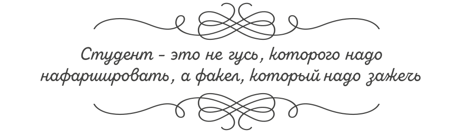

# Путеводитель АПС

- [Путеводитель АПС](#путеводитель-апс)
  - [Как работать с репозиторием](#как-работать-с-репозиторием)
  - [Мотивация](#мотивация)
  - [Место АПС в Computer Science](#место-апс-в-computer-science)
  - [Как пользоваться репозиторием](#как-пользоваться-репозиторием)
  - [История курса и разработчики](#история-курса-и-разработчики)

Привет, студент!

Это путеводитель по дисциплине «Архитектуры процессорных систем». Здесь ты найдёшь ссылки на всю информацию генерируемую в данном курсе:

- [Видеозаписи](https://www.youtube.com/c/%D0%90%D0%9F%D0%A1%D0%9F%D0%BE%D0%BF%D0%BE%D0%B2), [презентации](https://github.com/MPSU/APS-lect-presentations) и [конспекты](Lectures) лекций с прошлых лет.
- методички по лабораторным работам ([Labs](Labs/))
- дополнительные материалы и литературу ([Other/Further readings.md](Other/Further%20readings.md))
- полезные интернет-ресурсы ([Other/Extras.md](Other/Extras.md))
- информацию о преподавателях, их расписание и контакты ([Other/Educators.md](Other/Educators.md))
- страницу с анонимной обратной связью ([Google Forms](https://docs.google.com/forms/d/e/1FAIpQLSdoLdMCnFOv-RS_E4ztVjVzPqy-pqcCcaD7JNx6F4r8Kd_8iw/viewform?usp=sharing)).

Имея доступ к этой странице ты имеешь доступ ко всему курсу АПС.

По всем замечаниям/пожеланиям/предложениям, а также в случае, если нашел ошибку в материалах репозитория, или если что-то из изложенных материалов непонятно обращайся в на страницу [проблем](https://github.com/MPSU/APS/issues) или [обсуждений](https://github.com/MPSU/APS/discussions). Помни, что в первую очередь репозиторий создан именно для студентов, поэтому не стесняйся предлагать улучшения.

## Как работать с репозиторием

Данный репозиторий рассчитан на широкий охват аудитории по уровню их подготовки на момент начала этой дисциплины, поэтому для кого-то некоторые материалы окажутся избыточными, а для кого-то — крайне необходимыми.

Вне зависимости от вашего уровня подготовки, работу с этим курсом рекомендуется начать с прочтения документов из папки [Introduction](Introduction).

Далее можно приступать к лабораторным работам (расположенным в папке [Labs](Labs/)). Перед каждым лабораторным занятием вам рекомендуется ознакомиться с методичкой, они очень подробные и их чтение требует какого-то времени. Время отведенное на лабораторное занятие рекомендуется использовать по-максимуму, для этого лучше прочитать методичку заранее.

Кроме того, важно отметить, что в начале каждой методички размещен раздел "Допуск", где перечислены все материалы, которые студент должен успешно **освоить** перед выполнением этой лабораторной работы, со ссылками на документы в папке [Basic Verilog Structures](Basic%20Verilog%20structures/). Данная папка ориентирована в первую очередь на студентов, не работавших ранее с Verilog/SystemVerilog, однако даже если вы работали с этими языками, вам рекомендуется перейти в данные документы и проверить свои знания в разделе "Проверь себя".

Лабораторные занятия будут проходить с использованием САПР Xilinx Vivado. Это очень сложный профессиональный инструмент, на изучение которого могут уйти годы. Во время данного курса лабораторных работ нет времени на эти годы, поэтому для вас собрана основная информация по взаимодействию с САПР в папке [Vivado Basics](Vivado%20Basics/).

В ходе выполнения лабораторных работ вы наверняка столкнетесь как с ошибками связанными с работой Vivado, так и с ошибками описания на языке SystemVerilog. В первую очередь, рекомендуется ознакомиться с текстом ошибки. В случае ошибок, связанных с языком SystemVerilog, чаще всего там содержится вся необходимая информация по её устранению. В случае, если текст непонятен, рекомендуется ознакомиться со [списком типичных ошибок](Other/FAQ.md).

## Мотивация

Целью курса "Архитектуры процессорных систем" является изучение устройства и способов организации процессоров, и систем под их управлением.

Под словом Архитектура понимается некоторый способ организации. Процессор – это программно-управляемое устройство для обработки информации. Проще говоря, это устройство, управлять поведением которого можно с помощью программ (последовательности команд/действий). Система – это комбинация взаимодействующих элементов, организованных для достижения поставленных целей. Таким образом, дисциплина "Архитектуры процессорных систем" посвящена способам организации и построения систем под управлением устройств управляемых программами. Большое внимание в курсе уделяется открытой, и очень популярной в настоящее время, процессорной архитектуре RISC-V.

Дисциплина реализуется Институтом МПСУ на базе НИУ МИЭТ сразу для 7 различных направлений подготовки, которые имеют разные названия и количество теоретического и практического материалов. Несмотря на это масштаб покрытия у них одинаковый, а суть предмета изучения общая - организация компьютеров. Отличаются лишь глубина погружения и акценты.

Для успешного погружения в дисциплину важно понимать зачем эта дисциплина нужна именно тебе, будучи студентом:

 Информационной безопасности 

Нет никаких сомнений в том, что люди, разрабатывающие системы безопасностей для автомобилей, хорошо знают, как эти автомобили устроены и работают. Очевидно, что пожарную безопасность невозможно организовать не понимая, как горят материалы или, к примеру, в чем особенность помещений, которые будут защищаться. Также невозможно организовать стойкую информационную безопасность без понимания принципов работы устройств, которые эту информацию получают, обрабатывают и передают. Чтобы специалисту по информационной безопасности обеспечивать соблюдение правил обмена и обработки информации в информационных системах, очевидно, что нужно понимать как эти системы работают.

Преступники в сфере информационных технологий знают как они устроены и работают, потому что в результате своих действий они их не "ломают" (как принято говорить), а заставляют работать так, как нужно им, а не владельцам этих систем. Ну, а если чтобы найти преступника нужно думать, как преступник, то хорошему безопаснику остается только одно – разобраться как компьютеры работают, изучив курс АПС.

 Информатики и вычислительной техники 

30–40 лет назад, когда персональные компьютеры были ещё в новинку, а интернета как такового не было, пионеры вычислительной техники предсказывали, что в будущем электронные чипы станут настолько дешёвыми, что они будут повсюду — в домах, в транспорте, даже в человеческом теле. Для того времени эта идея казалась фантастической, даже абсурдной. Персональные компьютеры тогда были очень дороги и в большинстве своём даже не подключались к интернету. Мысль о том, что миллиарды крохотных чипов когда-нибудь будут во всем и станут дешевле семечек, казалась нелепой. Сегодня эти мысли уже не кажутся фантастическими. В последнее десятилетие почти всегда, какой-нибудь компьютер или компьютеры находятся на расстоянии вытянутой руки от человека. Билетик в метро – тоже компьютер, который спроектировал, возможно, выпускник ИВТ.

Если ты выпускник направления Информатика и Вычислительная Техника, то скорее всего, в будущем, ты будешь разрабатывать электронику, компьютеры – цифровые автоматические устройства, которые, как правило, управляются процессорами и ПЛИС. Типичное современное электронное устройство – это набор датчиков физических величин, которые посылают свои измерения в процессор, который обрабатывает полученную информацию согласно заданной программе. Понимать, как это работает также разумно, как и терапевту знать из каких органов состоит человек, несмотря на то, что он не хирург и внутрь не полезет. Выпускник ИВТ, понимающий устройство компьютера будет способен разрабатывать более эффективные решения: более быстрые, точные, энергоэффективные.

Логика такая: "Чтобы разрабатывать электронику, я должен понимать из чего она делается", "Современными электронными устройствами управляют процессоры" ⟹ "Чтобы разрабатывать электронику, я должен разбираться в процессорах".

 Инфокоммуникационных технологий и систем связи

Помимо своей очевидности существует множество подтверждений того, что уровень развития цивилизации связан с развитием связи. Разработка новейших систем связи и их внедрение еще очень долго будет одной из самых актуальных задач развития человечества. Мы сталкиваемся с постоянной потребностью обеспечивать связь нужных адресатов и делать это быстро и безопасно. Достигается это благодаря современным программно-аппаратным решениям, которые постоянно развиваются и совершенствуются. По сути, сетевые инженеры разрабатывают специализированные компьютеры, задачей которых является обмен информацией между некоторыми входными и выходными узлами по заданным правилам. Все это требует понимания работы программируемых устройств, которые и лежат в основе сетевых узлов.

Существует множество разнообразных сетевых процессоров и решений, реализуемых в программируемых логических интегральных схемах (ПЛИС). Для успешного участия в разработке современных сетевых решений необходимо не только знание методов передачи данных, алгоритмов кодирования и тому подобного, но и понимание принципов функционирования строительных блоков, из которых создаются сетевые системы. Глубина таких знаний позволяют увеличивать скорость передачи данных и улучшать безопасность.

Знания в области разработки компьютеров являются важным инструментом в создании информационно-коммуникационных систем связи.

 Конструирования и технологии электронных средств

Не так давно, когда персональные компьютеры только начали завоевывать мир, и интернет еще не был доступен для всех, многие представители конструкторской и технологической индустрии предсказывали будущее, в котором электроника будет всюду: в наших домах, транспорте и даже в наших собственных телах. Это казалось невероятным и даже фантастическим сценарием для тех времен, когда персональные компьютеры были дорогими и не имели доступа к сети Интернет.

Сегодня эти идеи уже не кажутся фантастическими. В последние десятилетия мы постоянно окружены электроникой и множеством вычислительных систем, часть из которых появляется благодаря выпускникам Конструирования и технологии электронных средств. Возьмем, к примеру, роботов. Современные роботы – это высокотехнологичные электронные системы, спроектированные для выполнения различных задач. Они оснащены датчиками и процессорами, которые позволяют им воспринимать окружающую среду и принимать решения в реальном времени. Выпускник направления "Конструирование и Технология электронных средств" будет иметь уникальную возможность создавать и улучшать такие устройства, делая их более эффективными и функциональными.

Суть заключается в том, что для успешной карьеры в области конструирования и технологии электронных средств, необходимо обладать глубоким пониманием электронных систем. Это включает в себя знание принципов работы процессоров, сенсоров и других ключевых компонентов. Выпускники этой специальности будут способны создавать современные электронные устройства и внедрять их в самые разные области. Знание основ организации процессорных систем является мощным и необходимым инструментом в достижении цели создания передовых электронных систем.

 Программной инженерии 

Не понимать как устроен и работает компьютер современному программисту, все равно что гонщику Формулы-1 не знать, как работает и устроена его машина. Это просто немыслимо! Такое возможно, но скорее исключение из правил. Конечно же кузнец знает, как устроен его инструмент, ведь тогда он может его более эффективно использовать. Понимает его слабые стороны и знает как хитро применить его на практике. Только в этом случае кузнец ценен.

Современные языки программирования дают возможность значительно оторваться от реального железа. Не редко в этом есть практический смысл, но далеко не всегда. Большинство современных компьютеров автономны (на батарейном питании), а значит, что эффективность их работы есть продолжительность их работы. Понимание нюансов может значительно сэкономить энергию. А порой надо выбрать железо для сервера, а порой понять почему очевидно быстрый код работает медленно. Часто приходится разбираться в новых технологиях, фреймворках, языках, сервисах, библиотеках, но все это дается легко только в том случае, если есть устойчивая база, отвечающая на вопрос - "как это работает и почему именно так?". Во всем перечисленном поможет знание АПС.

"Разобраться в работе компьютера" не значит "делать(разрабатывать) компьютер". Врачи знают как устроен человек, чтобы лечить его, а не разрабатывать его. Гонщики знают свой автомобиль, чтобы совершенствовать его и использовать по-полной. Также и программисту необходимо понимание работы компьютера не для того, чтобы разрабатывать процессоры, а для более эффективного и разумного его использования.

 Прикладной математики 

Практически все современные приложения математики так или иначе связаны с компьютерами: большие данные, искусственный интеллект, робототехника, финансы и так далее. Математика давно вышла за рамки тетрадных листов, сегодня алгоритмы – это мысли процессоров.

Математические приложения, какими бы они ни были (моделирование, автоматизация, расчеты или что-то другое), требуют инструмента их решения – компьютера. Понимание устройства и работы основного инструмента дает явные преимущества перед тем, у кого этого понимания нет. Порой надо выбрать железо для системы, решающей некоторую задачу, порой – понять почему очевидно быстрый код работает медленно. Часто приходится разбираться в новых технологиях, фреймворках, языках, сервисах, библиотеках, но все это дается легко только в том случае, если есть устойчивая база, отвечающая на вопрос - "как это работает и почему именно так?". Во всем перечисленном поможет знание АПС.

"Разобраться в работе компьютера" не значит "делать(разрабатывать) компьютер". Врачи знают как устроен человек, чтобы лечить его, а не разрабатывать его. Гонщики знают свой автомобиль, чтобы совершенствовать его и использовать по-полной. Также и выпускнику прикладной математики необходимо понимание работы компьютера не для того, чтобы разрабатывать процессоры, а для более эффективного и разумного его использования в своих приложениях.

 Радиотехники 

Использование радиоволн сегодня помогает в решении огромного круга задач, связанных с передачей информации/энергии на расстояние, локацией, позиционированием, изучением свойств объектов отражения и многим другим на что только фантазии хватит. На практике радиоволны оказываются удивительно полезными, и для того, чтобы управлять ими и извлекать из них максимум, используются антенны. Эти устройства могут быть довольно сложными, и за ними должны стоять профессионалы, способные их создать. Управляют антеннами, контролируют их и получают с них информацию специальные устройства, которые, в конечном итоге, преобразуют радиосигналы в электрические цифровые, или наоборот.

Современные микросхемы СВЧ (сверхвысоких частот), которые используются в антенных устройствах, часто являются программируемыми. Это означает, что они либо содержат в себе процессор, либо спроектированы для взаимодействия с процессорами. Чтобы раскрыть потенциал этих микросхем, вам нужно знать, как работают процессоры. Понимание их функций также пригодится в области радиотехники, особенно если вам нужно управлять сигналами в строгие временные рамки.

Радиотехника — это не только работа с радиосигналами, но и их обработка. Иногда нужно обрабатывать сигналы очень быстро. В таких случаях важно знать, какой вычислитель выбрать, чтобы обеспечить точность обработки в установленные временные рамки и при этом не превысить требования по энергопотреблению. Без понимания АПС вы не сможете решать такие задачи. Ведь приходится выбирать из множества устройств, включая микроконтроллеры и процессоры цифровой обработки сигналов с различными характеристиками, ПЛИС. А как это сделать, если даже не понимаешь, что это такое.

По сути, радиотехник – это специалист, который может не только посчитать антенну, но и создать ее, а также разработать систему управления, сбора и обработки данных с использованием знаний АПС.

Радиотехника связана с радиосигналами, а радиосигналы всегда связаны с процессорами в современной аппаратуре. И если вы хотите быть в центре этой захватывающей области, изучение АПС — важный шаг на этом пути.

## Место АПС в Computer Science

В оригинальном видео [Map of Computer Science](https://www.youtube.com/watch?v=SzJ46YA_RaA) Доминик Уоллиман предлагает, безусловно неполную, но удобную для представления обширной области знаний, карту компьютерных наук. Ниже, на этой карте, отмечена зона, которую покрывает предлагаемый курс лекций и лабораторных работ.

Эта `COMPUTER ENGINEERING` дисциплина главным образом уделяет внимание компьютерным архитектурам, и всем взаимосвязанным вопросам в этом контексте: производительность, компиляторы, операционные системы, виртуальные машины, параллельные вычисления, ПЛИС. Такая дисциплина является важным связующим звеном между теоретическими компьютерными науками и ее приложениями, представленными в нижней части карты. Компьютерная инженерия – неотъемлемая часть в реализации современных приложений. АПС закладывает необходимую инженерную базу, наборы понятий и концепций в отношении цифровых технологий и устройств.

Жёлтым выделена область Computer Science, покрываемая дисциплиной у групп ИБ, ИКТ, КТ, РТ.

Жёлтым + зелёным выделена область Computer Science, покрываемая дисциплиной у групп ИВТ, ПИН, ПМ.

## Как пользоваться репозиторием

В корне репозитория находятся следующие элементы (символом ‘/’ на конце обозначены папки):

- `.github/`
- `.pic/`
- Basic Verilog structures/
- Introduction/
- Labs/
- `Lectures/`
- Other/
- Vivado Basics/
- `.gitmodules`
- `ERRATA`
- `LICENSE`
- `README.md`

Серым цветом обозначены элементы, которые не потребуются в ходе выполнения лабораторных работ.

В папках Introduction, Basic Verilog structures и Vivado Basics описаны разделы 1, 3 и 4 данной книги. Папка Other, среди прочего, содержит информацию, формирующую раздел 5 данной книги.

Рассмотрим структуру папки Labs:

01. Adder/
02. Arithmetic-logic unit/
03. Register file and memory/
04. Primitive programmable device/
05. Main decoder/
06. Main memory/
07. Datapath/
08. Load-store unit/
09. LSU Integration/
10. Interrupt subsystem/
11. Interrupt integration/
12. Daisy chain/
13. Peripheral units/
14. Programming/
15. Programming device/
16. Coremark/  
Made-up modules/  
Readme.md

Здесь находятся методические материалы ко всем 16 лабораторным работам, разложенные по соответствующим им папкам.

Практически в каждой такой папке находится файл формата _lab_xx.tb_xxx.sv_ — это файл с верификационным окружением для данной лабораторной работы. Такой файл необходимо добавлять в _Simulation Sources_ проекта (подробней в разделе _Vivado Basics_).

Кроме того, в папке лабораторной работы могут находиться _xxx_pkg.sv_ и _xxx.mem_ файлы, содержащие соответственно параметры и данные, которыми необходимо проинициализировать память устройства. Такие файлы будет необходимо добавлять в _Design Sources_ проекта.

Ещё в большинстве папок будет находиться папка _board files_. Такая папка содержит модуль верхнего уровня (если требуется), описание способов взаимодействия с ним, а также файлы ограничений (_constraints_) под отладочную плату _Nexys A7_.

Помимо прочего, в папке `Made-up modules/` находятся готовые модули для некоторых лабораторных работ. В случае, если по какой-то причине вы не смогли выполнить лабораторную работу, вы можете продолжить работу над курсом, использовав готовый модуль из этой папки.

## История курса и разработчики

Дисциплины связанные с организацией вычислительной техники читаются в МИЭТ с самого его основания. Текущий курс эволюционировал из "Микропроцессорных средств и систем" (МПСиС) читаемый факультету МПиТК (Микроприборов и технической кибернетики) сначала [Савченко Юрием Васильевичем](https://miet.ru/person/10551), а после – [Переверзевым Алексеем Леонидовичем](https://miet.ru/person/49309). С 2014 по 2022 годы дисциплина проводилась и значительно модернизировалась [Поповым Михаилом Геннадиевичем](https://www.bsc.es/popov-mikhail) совместно с коллективом сотрудников и студентов Института МПСУ. С 2022 года группам ИБ, ИКТ, КТ и РТ курс читает [Силантьев Александр Михайлович](https://miet.ru/person/64030), а группам ИВТ, ПИН, ПМ – [Орлов Александр Николаевич](https://miet.ru/person/53686), разработка методических материалов перешла в руки [Солодовникова Андрея Павловича](https://miet.ru/person/141139).

В 2019-2023 годах была значительно переработана, осовременена и дополнена теоретическая часть курса. Тогда же разработаны и полностью обновлены лабораторные работы с переходом на использование архитектуры RISC-V, введены новые способы оценки полученных знаний. Все материалы курса, включая [видеозаписи лекций](https://www.youtube.com/c/АПСПопов), были выложены в свободный доступ.

Основное влияние на структуру и содержание курса в современном виде оказали: оригинальные лекции МПСиС для МПиТК, курс Вычислительных структур 6.004, читаемый в MIT, Харрис и Харрис "Цифровая схемотехника и архитектура компьютера", Орлов и Цилькер "Организация ЭВМ и систем".

Авторами курса в его текущем виде являются: Попов Михаил Геннадиевич и Солодовников Андрей Павлович.

С подготовкой курса и репозитория помогали студенты и сотрудники института МПСУ (бывшие и нынешние): <!--- В алфавитном порядке -->

|     Фамилия, Имя, Отчество                                  |                                                           Вклад в курс                                                                                                                                   |
|-------------------------------------------------------------|----------------------------------------------------------------------------------------------------------------------------------------------------------------------------------------------------------|
| Барков Евгений Сергеевич                                    | Профессиональные консультации по деталям языка SystemVerilog, спецификации RISC-V и RTL-разработки, тематике синтеза и констрейнов.                                                                      |
| Булавин Никита Сергеевич                                    | Отработка материалов, подготовка тестбенчей и модулей верхнего уровня для плат Nexys A7 для лабораторных работ.                                                                                          |
| Козин Алексей Александрович                                 | Отработка материалов, подготовка обфусцированных модулей для лабораторных работ.                                                                                                                         |
| Коршунов Андрей Владимирович                                | Профессиональные консультации по темам проектирования и синтеза цифровых схем                                                                                                                            |
| [Кулешов Владислав Константинович](https://t.me/SaintLiver) | Вычитка и исправление ошибок в методических материалах, сбор обратной связи от студентов.                                                                                                                |
| Орлов Александр Николаевич                                  | Профессиональные консультации по деталям языка SystemVerilog, спецификации RISC-V и RTL-разработки, примерами программ иллюстрирующим особенности архитектуры.                                           |
| Примаков Евгений Владимирович                               | Профессиональные консультации по деталям языка SystemVerilog, спецификации RISC-V и RTL-разработки и вопросам микроархитектуры.                                                                          |
| [Протасова Екатерина Андреевна](https://t.me/Katkus_s)      | Подготовка индивидуальных заданий и допусков к лабораторным работам, вычитка и отработка материалов, а также сбор обратной связи от студентов.                                                                            |
| Русановский Богдан Витальевич                               | Перенос лабораторной работы по прерываниям из PDF в Markdown, подготовка иллюстраций.                                                                                                                    |
| Рыжкова Дарья Васильевна                                    | Подготовка тестбенчей для лабораторных работ.                                                                                                                                                            |
| Силантьев Александр Михайлович                              | Профессиональные консультации по деталям языка SystemVerilog, спецификации RISC-V и RTL-разработки, вопросам микроархитектуры, тематике синтеза и констрейнов, особенностям компиляции и профилирования. |
| Стрелков Даниил Владимирович                                | Отработка материалов, подготовка тестбенчей для лабораторных работ и иллюстраций структуры курса.                                                                                                        |
| [Терновой Николай Эдуардович](https://t.me/cpu_design)      | Профессиональные консультации по деталям языка SystemVerilog, спецификации RISC-V и RTL-разработки, вычитка материалов, сбор обратной связи от студентов.                                                |
| Харламов Александр Александрович                            | Отработка материалов, проектирование вспомогательных модулей для лабораторных работ.                                                                                                                     |
| [Хисамов Василь Тагирович](https://t.me/PascalVT)           | Вычитка материалов, сбор обратной связи от студентов.                                                                                                                                                    |
| Чусов Сергей Андреевич                                      | Вычитка материалов, сбор обратной связи от студентов.                                                                                                                                                    |

Кроме того, в написании конспектов лекций принимали участие студенты различных институтов университета МИЭТ, а часть иллюстраций была нарисована выпускницей МИЭТ Краснюк Екатериной Александровной.

