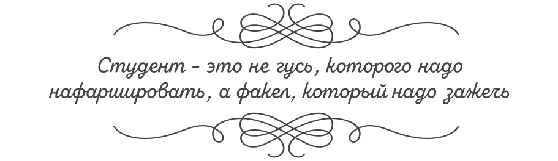

# APS Guide



**English translations is in "Work in Progress" status.**

- [APS Guide](#APS-Guide)
  - [How to use the repository](#How-to-use-the-repository)
  - [Motivation](#Motivation)
  - [APS in Computer Science](#APS-in-Computer-Science)
  - [Course history and contributors](#Course-history-and-contributors)
  - [](https://ozon.ru/t/63aAzUd)

Hello, student!

This is a guide to the course "Architectures of Processor Systems". Here you will find links to all the information generated within this course:

- [Video recordings](https://www.youtube.com/c/%D0%90%D0%9F%D0%A1%D0%9F%D0%BE%D0%BF%D0%BE%D0%B2), [slides](https://github.com/MPSU/APS-lect-presentations), and [lecture notes](Lectures) from previous years.
- Lab manuals ([Labs](Labs/))
- Additional materials and references ([Other/Further readings.md](Other/Further%20readings.md))
- Anonymous feedback form ([Google Forms](https://docs.google.com/forms/d/e/1FAIpQLSdoLdMCnFOv-RS_E4ztVjVzPqy-pqcCcaD7JNx6F4r8Kd_8iw/viewform?usp=sharing)).

Having access to this page means you have access to the entire APS course.

For any comments, suggestions, or corrections — or if you find an error in the repository materials, or if anything in the presented content is unclear — please visit the [Issues](https://github.com/MPSU/APS/issues) or [Discussions](https://github.com/MPSU/APS/discussions) pages. Remember that the repository is created primarily for students, so do not hesitate to propose improvements.

## How to use the repository

This repository is designed for a wide range of students with varying levels of preparation at the time they begin this course. As a result, some materials may be redundant for some students while being essential for others.

Regardless of your level of preparation, it is recommended to start by reading the documents in the [Introduction](Introduction) folder.

You can then proceed to the lab assignments (located in the [Labs](Labs/) folder). Before each lab session, it is recommended that you read the corresponding manual in advance — the manuals are very detailed and require some time to read. Make the most of the time allocated for lab sessions; reading the manual beforehand is the best way to do so.

It is also important to note that most lab manuals begin with a section titled "Materials for lab preparation," which lists all materials the student must successfully **master** before performing the lab, along with links to documents in the [Basic Verilog Structures](Basic%20Verilog%20structures/) folder. This folder is primarily intended for students who have not previously worked with Verilog/SystemVerilog; however, even if you have experience with these languages, it is recommended that you review these documents and test your knowledge in the "Check yourself" section.

Lab sessions will be conducted using the Xilinx Vivado EDA tool. This is a highly complex professional tool that can take years to master. This course does not have years to spare, so the essential information for working with the tool has been compiled in the [Vivado Basics](Vivado%20Basics/) folder.

During the lab assignments, you will likely encounter errors related both to Vivado and to SystemVerilog descriptions. In either case, the first step is always to read the error message carefully. For SystemVerilog-related errors, the message usually contains all the information needed to resolve the issue. If the message is unclear, consult the [list of common errors](Other/FAQ.md).

The structure of the Labs folder is as follows:

```
01. Adder/
02. Arithmetic-logic unit/  
...  
16. Coremark/  
Made-up modules/  
Readme.md
```

This folder contains the lab manuals for all 16 lab assignments, organized into their respective subfolders.

Almost every subfolder contains a file named `lab_xx.tb_xxx.sv` — this is the verification environment (testbench) for the corresponding lab. This file must be added to the _Simulation Sources_ of the project (see _Vivado Basics_ for details).

In addition, a lab folder may contain `xxx_pkg.sv` and `xxx.mem` files, which hold parameters and data used to initialize the device memory, respectively. These files must be added to the _Design Sources_ of the project.

Most folders also contain a `board files` subfolder. This subfolder includes the top-level module (if required), a description of how to interact with it, and constraint files for the _Nexys A7_ development board.

Furthermore, the `Made-up modules/` folder contains pre-built modules for certain lab assignments. If for any reason you were unable to complete a particular lab, you can continue working through the course using the ready-made module from this folder.

## Motivation

The goal of this course is to study the structure and organization of processors and the systems they control.

The word "Architecture" refers to a particular way of organizing something. A processor is a programmable device for information processing — in simple terms, a device whose behavior can be controlled through programs (sequences of commands/actions). A system is a combination of interacting elements organized to achieve defined goals. Thus, the course "Architectures of Processor Systems" is dedicated to the ways of organizing and building systems controlled by programmable devices. Significant attention in the course is given to the open and currently highly popular RISC-V processor architecture.

The course is delivered by the MPSU Institute at MIET for 7 different degree programs, which differ in name and in the amount of theoretical and practical content. Despite this, the scope of coverage is the same across all programs, and the core subject matter is the same — the organization of computers. The differences lie only in the depth of study and the emphasis.

For a successful engagement with this course, it is important to understand why this discipline is relevant to you as a student:

<details>
<summary> Information Security </summary>
There is no doubt that people who develop security systems for automobiles have a thorough understanding of how those automobiles are built and work. It is obvious that fire safety cannot be organized without understanding how materials burn or, for example, what makes a given type of building unique. Similarly, robust information security cannot be achieved without understanding the principles of operation of the devices that receive, process, and transmit that information. For an information security specialist to enforce the rules of information exchange and processing in information systems, they clearly need to understand how those systems work.

Criminals in the field of information technology know how these systems are structured and operate, because through their actions they do not "break" them (as is commonly said), but rather make them work the way the criminals want, rather than the way the owners intend. And if catching a criminal requires thinking like one, then a good security professional has only one option — to understand how computers work by studying the APS course.
</details>

<details>
<summary> Computer Science and Engineering </summary>
30–40 years ago, when personal computers were still a novelty and the internet as we know it did not exist, pioneers of computing predicted that in the future electronic chips would become so cheap that they would be everywhere — in our homes, in transportation, even in the human body. At the time, this idea seemed fantastical, even absurd. Personal computers were very expensive and in most cases were not even connected to the internet. The notion that billions of tiny chips would one day be embedded in everything and cost less than a handful of sunflower seeds seemed ridiculous. Today, these thoughts no longer seem fantastical. In the past decade, some kind of computer has almost always been within arm's reach. A metro ticket is also a computer — one that may have been designed by a graduate of the Computer Science and Engineering program.

If you are graduating from the Computer Science and Engineering program, then most likely you will be developing electronics and computers in the future — digital automated devices that are typically controlled by processors and FPGAs. A typical modern electronic device is a set of physical sensors that send measurements to a processor, which processes the received information according to a given program. Understanding how this works is just as reasonable as a general practitioner knowing what organs the human body is made of, even though they are not a surgeon and will not be operating on anyone. A graduate of Computer Science and Engineering who understands the inner workings of a computer will be able to design more effective solutions: faster, more precise, and more energy-efficient.

The logic is: "To develop electronics, I must understand what it is made of," and "Modern electronic devices are controlled by processors," therefore "To develop electronics, I must understand processors."
</details>

<details>
<summary> Infocommunication Technologies and Communication Systems </summary>
Beyond its obvious importance, there are many indications that the level of civilizational development is tied to the advancement of communications. The development and deployment of cutting-edge communication systems will remain one of the most pressing challenges for humanity for a long time to come. We continuously face the need to connect the right parties quickly and securely. This is achieved through modern hardware-software solutions that are constantly evolving and improving. In essence, network engineers design specialized computers whose purpose is to exchange information between certain input and output nodes according to defined rules. All of this requires an understanding of how programmable devices work — the very devices that form the foundation of network nodes.

There are many diverse network processors and solutions implemented in field-programmable gate arrays (FPGAs). To successfully participate in the development of modern networking solutions, it is necessary not only to know data transmission methods and coding algorithms, but also to understand the principles of operation of the building blocks from which network systems are constructed. The depth of such knowledge enables increases in data transfer rates and improvements in security.

Knowledge in the field of computer design is an important tool for creating infocommunication systems.
</details>

<details>
<summary> Electronic Systems Design and Technology </summary>
Not long ago, when personal computers were just beginning to conquer the world and the internet was not yet accessible to everyone, many representatives of the design and technology industries predicted a future in which electronics would be everywhere: in our homes, transportation, and even in our own bodies. This seemed like an incredible, even fantastical scenario for a time when personal computers were expensive and had no internet access.

Today these ideas no longer seem fantastical. In recent decades we have been constantly surrounded by electronics and numerous computing systems, some of which exist thanks to graduates of the Electronic Systems Design and Technology program. Take robots, for example. Modern robots are high-tech electronic systems designed to perform a variety of tasks. They are equipped with sensors and processors that allow them to perceive their environment and make decisions in real time. A graduate of "Electronic Systems Design and Technology" will have the unique opportunity to create and improve such devices, making them more efficient and functional.

The point is that for a successful career in the field of electronic systems design and technology, a deep understanding of electronic systems is required. This includes knowledge of how processors, sensors, and other key components work. Graduates of this program will be able to create modern electronic devices and introduce them into a wide variety of fields. Knowledge of the fundamentals of processor system organization is a powerful and necessary tool for achieving the goal of creating advanced electronic systems.
</details>

<details>
<summary> Software Engineering </summary>
For a modern software developer not to understand how a computer is built and works is like a Formula 1 driver not knowing how his car works. It is simply unthinkable! It is possible, but more of an exception than the rule. Of course a blacksmith knows how his tool is made — because then he can use it more effectively, understand its weaknesses, and know how to apply it cleverly in practice. Only then is the blacksmith truly valuable.

Modern programming languages allow one to distance oneself significantly from the actual hardware. Often there is a practical reason for this, but not always. The majority of modern computers are battery-powered, which means that the efficiency of their operation directly translates to how long they operate. Understanding the nuances can save significant amounts of energy. Sometimes one needs to select hardware for a server; sometimes one needs to understand why apparently fast code runs slowly. Frequently one must get to grips with new technologies, frameworks, languages, services, and libraries — but all of this comes easily only when there is a solid foundation that answers the question "how does this work, and why does it work this way?" Knowledge of APS helps with all of this.

"Understanding how a computer works" does not mean "building (designing) a computer." Doctors know how the human body is structured in order to treat it, not to design it. Racing drivers know their car in order to refine it and use it to the fullest. In the same way, a software developer needs to understand how a computer works not in order to design processors, but to use the computer more effectively and intelligently.
</details>

<details>
<summary> Applied Mathematics </summary>
Virtually all modern applications of mathematics are connected in one way or another to computers: big data, artificial intelligence, robotics, finance, and so on. Mathematics has long outgrown notebook pages — today, algorithms are the thoughts of processors.

Mathematical applications, whatever they may be (simulation, automation, computation, or something else), require a tool to solve them — a computer. Understanding the structure and operation of one's primary tool provides clear advantages over those who lack that understanding. Sometimes one needs to select hardware for a system solving a particular problem; sometimes one needs to understand why apparently fast code runs slowly. Frequently one must get to grips with new technologies, frameworks, languages, services, and libraries — but all of this comes easily only when there is a solid foundation that answers the question "how does this work, and why does it work this way?" Knowledge of APS helps with all of this.

"Understanding how a computer works" does not mean "building (designing) a computer." Doctors know how the human body is structured in order to treat it, not to design it. Racing drivers know their car in order to refine it and use it to the fullest. In the same way, a graduate of applied mathematics needs to understand how a computer works not in order to design processors, but to use the computer more effectively and intelligently in their own applications.
</details>

<details>
<summary> Radio Engineering </summary>
The use of radio waves today helps solve a vast range of tasks related to transmitting information and energy over distances, location, positioning, studying the properties of reflecting objects, and much more — whatever one can imagine. In practice, radio waves prove to be remarkably useful, and to control them and extract maximum value from them, antennas are used. These devices can be quite complex, and behind them must stand professionals who are capable of designing them. Antennas are controlled, monitored, and read by specialized devices that ultimately convert radio signals into electrical digital signals, or vice versa.

Modern microwave (SHF) integrated circuits used in antenna systems are often programmable. This means they either contain a processor or are designed to interface with processors. To unlock the potential of these chips, you need to know how processors work. Understanding their functions will also be useful in the field of radio engineering, especially when you need to control signals within strict timing constraints.

Radio engineering is not just about working with radio signals — it is also about processing them. Sometimes signals must be processed very quickly. In such cases, it is important to know which computing platform to choose in order to ensure processing accuracy within the required time constraints while not exceeding power consumption requirements. Without an understanding of APS, you cannot solve such problems. After all, one must choose from among many devices, including microcontrollers, digital signal processors with various characteristics, and FPGAs. And how can you make that choice if you do not even understand what these things are?

In essence, a radio engineer is a specialist who can not only design an antenna but also build it, and develop a control, data acquisition, and processing system using knowledge of APS.

Radio engineering is connected to radio signals, and radio signals are always connected to processors in modern equipment. And if you want to be at the forefront of this exciting field, studying APS is an important step on that path.
</details>

## APS in Computer Science

In the original video [Map of Computer Science](https://www.youtube.com/watch?v=SzJ46YA_RaA), Dominic Walliman presents an admittedly incomplete but convenient map of computer science for representing this vast field of knowledge. Below, the area covered by this lecture and lab course is marked on that map.

This `COMPUTER ENGINEERING` discipline primarily focuses on computer architectures and all the interconnected topics in that context: performance, compilers, operating systems, virtual machines, parallel computing, and FPGAs. Such a discipline serves as an important link between theoretical computer science and its applications shown in the lower part of the map. Computer engineering is an indispensable part of realizing modern applications. APS lays the necessary engineering foundation, providing a set of concepts and ideas related to digital technologies and devices.


Yellow highlights the area of Computer Science covered by the course for the IB, IKT, KT, and RT degree programs.

Yellow + green highlights the area of Computer Science covered by the course for the IVT, PIN, and PM degree programs.

## Course history and contributors

Disciplines related to computer organization have been taught at MIET since its founding. The current course evolved from "Microprocessor Tools and Systems" (MPSiS), which was taught to the MPiTK (Microdevices and Technical Cybernetics) faculty — first by [Yuri Vasilyevich Savchenko](https://miet.ru/person/10551), and later by [Alexei Leonidovich Pereverzev](https://miet.ru/person/49309). From 2014 to 2022, the course was taught and significantly modernized by [Mikhail Gennadyevich Popov](https://www.bsc.es/popov-mikhail), together with a team of staff and students from the MPSU Institute. Since 2022, the course for the IB, IKT, KT, and RT groups has been taught by [Alexander Mikhailovich Silantyev](https://miet.ru/person/64030), and for the IVT, PIN, and PM groups — by [Alexander Nikolaevich Orlov](https://miet.ru/person/53686); development of the educational materials has passed to [Andrei Pavlovich Solodovnikov](https://miet.ru/person/141139).

In 2019–2023, the theoretical part of the course was significantly revised, modernized, and expanded. During the same period, the lab assignments were fully redesigned and updated with a transition to the RISC-V architecture, and new methods of knowledge assessment were introduced. All course materials, including [lecture video recordings](https://www.youtube.com/c/АПСПопов), were made publicly available.

The main influences on the structure and content of the course in its current form were: the original MPSiS lectures for MPiTK, the 6.004 Computation Structures course taught at MIT, Harris & Harris "Digital Design and Computer Architecture," and Orlov & Tsilker "Computer Organization and Systems."

The authors of the course in its current form are: Mikhail Gennadyevich Popov and Andrei Pavlovich Solodovnikov.

The following students and staff of the MPSU Institute (past and present) contributed to the preparation of the course and the repository: <!--- In alphabetical order -->

| Full Name | Contribution to the course |
|---|---|
| Barkov Evgeny Sergeevich | Professional consultations on SystemVerilog language details, the RISC-V specification and RTL development, synthesis and constraints topics. |
| Bulavin Nikita Sergeevich | Material validation, preparation of testbenches and top-level modules for Nexys A7 boards for the lab assignments. |
| Kozin Alexei Alexandrovich | Material validation, preparation of obfuscated modules for the lab assignments. |
| Korshunov Andrei Vladimirovich | Professional consultations on digital circuit design and synthesis topics. |
| [Kuleshov Vladislav Konstantinovich](https://t.me/SaintLiver) | Proofreading and correction of errors in educational materials, collection of student feedback. |
| Orlov Alexander Nikolaevich | Professional consultations on SystemVerilog language details, the RISC-V specification and RTL development, with examples of programs illustrating architectural features. |
| Primakov Evgeny Vladimirovich | Professional consultations on SystemVerilog language details, the RISC-V specification and RTL development, and microarchitecture topics. |
| [Protasova Ekaterina Andreevna](https://t.me/Katkus_s) | Preparation of individual assignments and lab admission tasks, proofreading and validation of materials, and collection of student feedback. |
| Rusanovsky Bogdan Vitalyevich | Migration of the interrupt lab assignment from PDF to Markdown, preparation of illustrations. |
| Ryzhkova Darya Vasilyevna | Preparation of testbenches for the lab assignments. |
| Silantyev Alexander Mikhailovich | Professional consultations on SystemVerilog language details, the RISC-V specification and RTL development, microarchitecture topics, synthesis and constraints, compilation and profiling specifics. |
| Strelkov Daniil Vladimirovich | Material validation, preparation of testbenches for the lab assignments and course structure illustrations. |
| [Ternovoy Nikolai Eduardovich](https://t.me/cpu_design) | Professional consultations on SystemVerilog language details, the RISC-V specification and RTL development, proofreading of materials, collection of student feedback. |
| Kharlamov Alexander Alexandrovich | Material validation, design of auxiliary modules for the lab assignments. |
| [Khisamov Vasil Tagirovich](https://t.me/PascalVT) | Proofreading of materials, collection of student feedback. |
| Chusov Sergei Andreevich | Proofreading of materials, collection of student feedback. |

In addition, students from various institutes of MIET university participated in writing the lecture notes, and some illustrations were drawn by MIET alumna Ekaterina Alexandrovna Krasnyuk.


